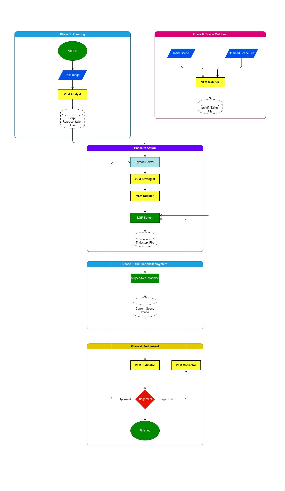

# VLM-LGP: Vision-Language Logic-Geometric Programming

VLM-LGP is a closed-loop robotic manipulation framework that integrates Vision-Language Models (VLM) with Logic-Geometric Programming (LGP). The system utilizes high-level semantic reasoning to drive low-level geometric motion planning.

## 🧠 System Logic


## ⚖️ LGP Solver Optimizations
The solver is an optimized fork of the [rai](https://github.com/MarcToussaint/rai) library. We have refined existing core functions and **introduced additional functions** to better adapt the solver to our specific experiments and satisfy the practical requirements of **real-machine hardware deployment**.

## 🚀 Quick Start (Solver Setup)

### 1. Environment
```bash
git clone https://github.com/LeslieLinXinxiang/VLM-LGP.git
cd VLM-LGP
conda create -n vlgp python=3.10
conda activate vlgp
pip install -r requirements.txt
```

### 2. System Dependencies
```bash
sudo apt-get install -y build-essential g++ cmake git wget zip liblapack-dev libf2c2-dev libqhull-dev libeigen3-dev libjsoncpp-dev libyaml-cpp-dev libhdf5-dev libx11-dev libglu1-mesa-dev libglfw3-dev libglew-dev freeglut3-dev libglm-dev libfreetype-dev libpng-dev libassimp-dev
```

### 3. Build Solver (rai)
```bash
cd rai/_make
./install.sh libann && ./install.sh libccd && ./install.sh fcl && ./install.sh physx
cd ..
make -j$(nproc)
```

### 4. Build Executable
```bash
cd ../bin
make
```

### 5. Path Setup
Add to `~/.bashrc`:
```bash
export PYTHONPATH=$HOME/VLM-LGP/rai/lib:$PYTHONPATH
export LD_LIBRARY_PATH=$HOME/VLM-LGP/rai/lib:$LD_LIBRARY_PATH
```

---

## 🤖 Simulation & ROS 2

VLM-LGP uses **MuJoCo** and **ROS 2** for high-fidelity simulation.

### Integration Setup
To use our simulation suite, we recommend symlinking the simulation folder into your ROS 2 workspace:

1. **Prerequisite**: Install [mujoco_ros2_control](https://github.com/moveit/mujoco_ros2_control).
2. **Workspace Setup**:
   ```bash
   cd ~/ros2_ws/src
   ln -s ~/VLM-LGP/simulation .
   cd ..
   colcon build --symlink-install
   ```

### Running the Simulation
To launch the Panda MuJoCo simulation environment:
```bash
source ~/ros2_ws/install/setup.bash
ros2 launch interactive_marker interactive_marker.launch.py
```

---

## ✅ Verification
Run the solver bridge test to verify the LGP-to-ROS2 pipeline:
```bash
python3 test_bridge.py
```

## Documentation
- Solver Core: [rai/README.md](rai/README.md)
- Simulation Framework: [mujoco_ros2_control](https://github.com/moveit/mujoco_ros2_control)