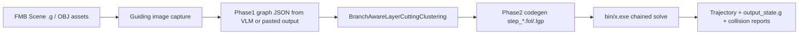

# FMB Logic Report: End-to-End Flow, Bottlenecks, Hard-Coding, and Pending Decisions (2026-04-08)

## 0. Scope and Purpose
This report summarizes the current FMB branch logic in VLM-LGP from input to output, highlights blockers and risk points observed during recent runs, and enumerates implementation differences from the mainline path. It also formalizes two open decisions:
1) whether to introduce manipulability/reachability into this FMB path now,
2) whether current hard-coding (especially pick/place frame decoupling) is acceptable for the current stage.

---

## 1. Current FMB End-to-End Mainline Flow

### 1.1 Practical entry points used in experiments
- Primary planar solve entry:
  - `scripts/run_planar_assembly.py`
  - Solver call shape: `bin/x.exe <phase2_codegen_dir> <scene.g>`
- FMB image/input preparation tools:
  - `test/fmb_guiding_input/tune_camera_pose.py`
  - `test/fmb_guiding_input/render_guiding_images.py`
- FMB output-to-codegen validation tools:
  - Online VLM chain: `test/fmb_output_test/test_phase1_to_codegen.py`
  - Offline pasted-VLM chain: `test/fmb_output_test/test_paste_vlm_output_to_codegen.py`

### 1.2 Logical flow (current implementation)

### 1.3 Stage-by-stage details
1. Scene and geometry definition (FMB-specific)
- Active test scene is typically under `test/planar_exp/planar_scene.g`.
- Recent modeling pattern for key parts:
  - proxy body (`ssBox`) for high-level frame control,
  - mesh child frame for geometry/contact fidelity,
  - explicit handle frame for grasp targeting.

2. Input image generation for target cognition
- `tune_camera_pose.py` provides interactive camera pose extraction.
- `render_guiding_images.py` renders scene to ordered image sets with local camera intrinsics overrides.

3. Phase1 graph generation
- Online path: Qwen output parsed into JSON in `test_phase1_to_codegen.py`.
- Offline path: pasted text cleaned via `clean_vlm_json_output`, then parsed into phase1 JSON.

4. Deterministic strategy decomposition
- Current FMB test scripts call `BranchAwareLayerCuttingClustering` (deterministic).
- This bypasses stochastic strategy generation and keeps repeatability high for debugging.

5. Phase2 code generation
- `core/phase2_codegen.py` generates step files (`step_*.fol`, `step_*.lgp`) and maps IDs through inventory binding when available.

6. Solver execution and diagnostics
- `run_planar_assembly.py` sends the whole codegen directory to solver in one chained run.
- Runtime emits motif-level solve logs and active collision reports.

---

## 2. Output Artifacts and Where They Land
- Test-chain outputs:
  - `test/fmb_output_test/outputs/<timestamp_case>/phase1_graph.json`
  - `.../phase2_prompt1_output.json`
  - `.../phase2_prompt2_output.json`
  - `.../phase2_codegen/step_*.fol|*.lgp`
- Planar execution outputs:
  - `test/planar_exp/phase2_codegen/*.fol|*.lgp`
  - solver logs in terminal + `active_collision_history/report_*.json`
  - final scene snapshots such as `output_state.g` (depending on solver path)

---

## 3. Bottleneck and Stuck-Point Analysis

### 3.1 Historical primary blocker: frame semantics coupling
Observed issue:
- Direct OBJ COM shifting did not give stable, monotonic placement correction.
- In some runs, the practical placement response appeared opposite to expected COM adjustment direction.

Root cause pattern:
- geometric center, collision geometry, and manipulation target frame were tightly coupled.
- small geometry edits caused non-intuitive motion constraints in pick/place.

### 3.2 Mitigation that worked
- Introduced frame decoupling pattern:
  - control proxy (`ssBox`) for object logical frame,
  - mesh child for contact geometry,
  - handle frame for grasp target.
- Result: pick and place can be tuned at frame level without repeatedly recentering OBJ.

### 3.3 Remaining risk points
- Placement objective constraints in `manipTools.cpp` can still become stiff under certain obstacle sets/time windows.
- Explicit collision pair behavior depends on filter configuration and action path; behavior can shift between sparse and dense collision control modes.
- Scene naming conventions influence obstacle exclusion logic in some action functions.

---

## 4. Hard-Coding Inventory (Current FMB Path)

### 4.1 Geometry and frame hard-coding
- Absolute mesh paths in planar scenes, for example:
  - `/home/leslie/Projects/VLM_LGP/assets/fmb/assembly1_parts/...`
- Manually tuned frame offsets for handles and proxy-mesh relation in `planar_scene.g`.
- Proxy dimensions (`ssBox`) used as control-level simplification, not exact CAD dimensions.

### 4.2 Script-level hard-coding
- `scripts/run_planar_assembly.py` hard-codes:
  - solver binary path,
  - `RUN_DIR` default,
  - scene default path.
- `test/fmb_output_test` scripts hard-code output roots and prompt path defaults.
- Guiding-image scripts include default camera constants and default output directories.

### 4.3 Policy hard-coding
- Deterministic clustering selection in FMB test scripts (`BranchAwareLayerCuttingClustering`) instead of flexible algorithm routing.
- Current FMB workflow emphasizes fixed practical chain for rapid iteration over generalized runtime configurability.

---

## 5. Differences vs Mainline Pipeline

### 5.1 Mainline canonical path
- `driver.py` orchestrates Phase0 -> Phase1 -> Phase2 and solver loop.
- Phase0 is deterministic/rule-based in current architecture (VLM disabled for Phase0 semantics).
- Phase2 is graph-gated deterministic strategy path with compatibility contracts.

### 5.2 FMB branch operational differences
1. Test-first tooling path
- FMB often enters through dedicated test scripts rather than full `driver.py` orchestration.

2. Input modality
- FMB heavily uses curated guiding images and manual camera tuning loops.

3. Scene modeling pattern
- Active use of proxy+mesh+handle decoupling in planar scenes for stable manipulation tuning.

4. Configuration style
- More explicit path constants and manual tuning knobs than mainline generalized abstractions.

5. Validation focus
- Current FMB iteration prioritizes chain closure and solvability in planar scenarios over full-stack abstraction cleanliness.

---

## 6. Decision Block A: Introduce Reachability and Manipulability Now?

### Option A1: Introduce now (recommended for quality gate)
Pros:
- early pruning of kinematically poor actions,
- better robustness under geometry/frame tuning drift,
- improved explainability for failure triage.
Cons:
- integration complexity and additional runtime cost,
- introduces another decision layer while FMB template is still stabilizing.

### Option A2: Defer to next milestone
Pros:
- keep current momentum on scene/frame standardization,
- lower immediate complexity.
Cons:
- repeated dead-end solves remain possible,
- less principled prioritization for ambiguous pick candidates.

Recommendation:
- Use a staged adoption:
  1) add reachability as a hard pre-check (binary gate),
  2) add manipulability as tie-break scoring only.
This keeps risk controlled while adding measurable planning value.

---

## 7. Decision Block B: Is Current Hard-Coding Acceptable?

### Short answer
- Yes for current experimental stage, if explicitly classified as "transitional engineering".
- No as a long-term production baseline without parameterization and schema cleanup.

### Acceptance criteria for current stage
- reproducible solve success in target planar set,
- stable output contracts for downstream scripts,
- no silent divergence between proxy frame and mesh collision behavior.

### Required hardening before promoting to mainline
1. Convert absolute paths to configurable roots.
2. Formalize proxy/mesh/handle schema as reusable scene macro/pattern.
3. Consolidate clustering and prompt selection switches into config.
4. Add validation checks for frame consistency (proxy-mesh offset sanity).

---

## 8. Actionable Optimization Plan (Next Iteration)
1. Add a small "FMB profile" config layer (paths, clustering mode, scene presets).
2. Add automated checks for:
   - handle existence and orientation,
   - proxy-mesh offset bounds,
   - required logical tags (`is_object`, `is_box`, `is_place`).
3. Integrate reachability hard gate into the FMB test chain.
4. Add manipulability ranking as optional secondary scoring.
5. Keep the proxy+mesh+handle pattern, but document it as a temporary bridge pattern with explicit migration criteria.

---

## 9. Final Assessment
The current FMB branch has reached a meaningful operational milestone: decoupling pick/place control frames from raw OBJ center solved the most disruptive tuning instability and enabled successful experiments. The branch is now suitable for structured hardening. The next decision should prioritize a low-risk reachability gate and controlled de-hardcoding of paths/config while preserving the decoupled frame pattern that proved effective.
