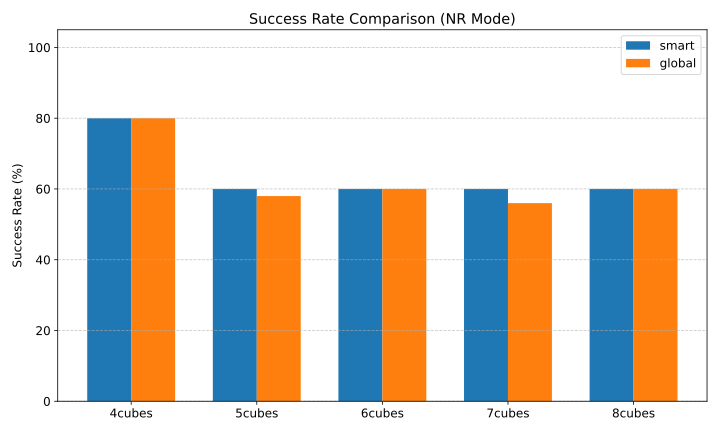
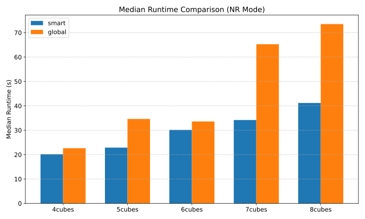
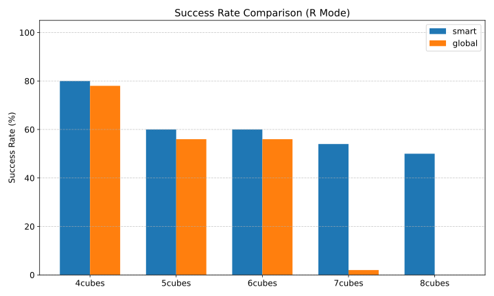
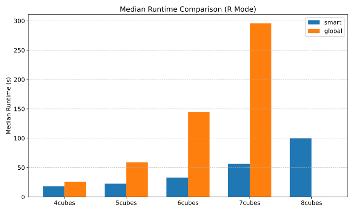

# LGP Detailed Failure Analysis & Performance Plots

## 1. Performance Visualization
### Non-Reachable (NR) Mode
Comparison of success rates and solving times for scenarios without reachability constraints.

### Reachable (R) Mode
Comparison of performance in complex scenarios with reachability/collision constraints.

## 2. Failure List (Detailed Summary)
This table lists all failed trials with their attributed failure reason and the last few lines of the solver log.

| Mag | Mode | Policy | Scenario | Trial | Reason | Log Snippet |
| :--- | :--- | :--- | :--- | :--- | :--- | :--- |
| 4cubes | nr | `global` | s05 | trial_01 | **Path Error (cd_file)** | <pre style='font-size: 8px'>>>> [System] Collision policy: follow_lgp STACK9 /lib/x86_64-linux-gnu/libc.so.6(__libc_start_main STACK8 /lib/x86_64-linux-gnu/libc.so.6(+0x2a1ca) [0x72722a82a1ca] STACK7 /home/leslie/Projects/VLM_LGP/bin/x.exe(+0x867a) [0x59656c18c67a] STACK6 rai::Configuration::addFile(char const*, char const*) STACK5 rai::Configuration::addDict(rai::Graph const&) STACK4 rai::Frame::read(rai::Graph const&) STACK3 rai::Shape::read(rai::Frame&) STACK2 rai::Frame::setMeshFile(rai::String, double) STACK1 rai::FileToken::cd_file() STACK0 rai::LogToken::~LogToken() == ERROR:util.cpp:cd_file:1078(-2) couldn't change to directory '/home/leslie/Projects/VLM_LGP/generated/scene/generated' from '/home/leslie/Projects/VLM_LGP/generated/scene' terminate called after throwing an instance of 'std::runtime_error'   what():  util.cpp:cd_file:1078(-2) couldn't change to directory '/home/leslie/Projects/VLM_LGP/generated/scene/generated' from '/home/leslie/Projects/VLM_LGP/generated/scene'</pre> |
| 4cubes | nr | `global` | s05 | trial_02 | **Path Error (cd_file)** | <pre style='font-size: 8px'>>>> [System] Collision policy: follow_lgp STACK9 /lib/x86_64-linux-gnu/libc.so.6(__libc_start_main STACK8 /lib/x86_64-linux-gnu/libc.so.6(+0x2a1ca) [0x78ca2d02a1ca] STACK7 /home/leslie/Projects/VLM_LGP/bin/x.exe(+0x867a) [0x56c1d492667a] STACK6 rai::Configuration::addFile(char const*, char const*) STACK5 rai::Configuration::addDict(rai::Graph const&) STACK4 rai::Frame::read(rai::Graph const&) STACK3 rai::Shape::read(rai::Frame&) STACK2 rai::Frame::setMeshFile(rai::String, double) STACK1 rai::FileToken::cd_file() STACK0 rai::LogToken::~LogToken() == ERROR:util.cpp:cd_file:1078(-2) couldn't change to directory '/home/leslie/Projects/VLM_LGP/generated/scene/generated' from '/home/leslie/Projects/VLM_LGP/generated/scene' terminate called after throwing an instance of 'std::runtime_error'   what():  util.cpp:cd_file:1078(-2) couldn't change to directory '/home/leslie/Projects/VLM_LGP/generated/scene/generated' from '/home/leslie/Projects/VLM_LGP/generated/scene'</pre> |
| 4cubes | nr | `global` | s05 | trial_03 | **Path Error (cd_file)** | <pre style='font-size: 8px'>>>> [System] Collision policy: follow_lgp STACK9 /lib/x86_64-linux-gnu/libc.so.6(__libc_start_main STACK8 /lib/x86_64-linux-gnu/libc.so.6(+0x2a1ca) [0x75a33402a1ca] STACK7 /home/leslie/Projects/VLM_LGP/bin/x.exe(+0x867a) [0x5d868984a67a] STACK6 rai::Configuration::addFile(char const*, char const*) STACK5 rai::Configuration::addDict(rai::Graph const&) STACK4 rai::Frame::read(rai::Graph const&) STACK3 rai::Shape::read(rai::Frame&) STACK2 rai::Frame::setMeshFile(rai::String, double) STACK1 rai::FileToken::cd_file() STACK0 rai::LogToken::~LogToken() == ERROR:util.cpp:cd_file:1078(-2) couldn't change to directory '/home/leslie/Projects/VLM_LGP/generated/scene/generated' from '/home/leslie/Projects/VLM_LGP/generated/scene' terminate called after throwing an instance of 'std::runtime_error'   what():  util.cpp:cd_file:1078(-2) couldn't change to directory '/home/leslie/Projects/VLM_LGP/generated/scene/generated' from '/home/leslie/Projects/VLM_LGP/generated/scene'</pre> |
| 4cubes | nr | `global` | s05 | trial_04 | **Path Error (cd_file)** | <pre style='font-size: 8px'>>>> [System] Collision policy: follow_lgp STACK9 /lib/x86_64-linux-gnu/libc.so.6(__libc_start_main STACK8 /lib/x86_64-linux-gnu/libc.so.6(+0x2a1ca) [0x78a88922a1ca] STACK7 /home/leslie/Projects/VLM_LGP/bin/x.exe(+0x867a) [0x593740c0c67a] STACK6 rai::Configuration::addFile(char const*, char const*) STACK5 rai::Configuration::addDict(rai::Graph const&) STACK4 rai::Frame::read(rai::Graph const&) STACK3 rai::Shape::read(rai::Frame&) STACK2 rai::Frame::setMeshFile(rai::String, double) STACK1 rai::FileToken::cd_file() STACK0 rai::LogToken::~LogToken() == ERROR:util.cpp:cd_file:1078(-2) couldn't change to directory '/home/leslie/Projects/VLM_LGP/generated/scene/generated' from '/home/leslie/Projects/VLM_LGP/generated/scene' terminate called after throwing an instance of 'std::runtime_error'   what():  util.cpp:cd_file:1078(-2) couldn't change to directory '/home/leslie/Projects/VLM_LGP/generated/scene/generated' from '/home/leslie/Projects/VLM_LGP/generated/scene'</pre> |
| 4cubes | nr | `global` | s05 | trial_05 | **Path Error (cd_file)** | <pre style='font-size: 8px'>>>> [System] Collision policy: follow_lgp STACK9 /lib/x86_64-linux-gnu/libc.so.6(__libc_start_main STACK8 /lib/x86_64-linux-gnu/libc.so.6(+0x2a1ca) [0x767f03e2a1ca] STACK7 /home/leslie/Projects/VLM_LGP/bin/x.exe(+0x867a) [0x607c26e3467a] STACK6 rai::Configuration::addFile(char const*, char const*) STACK5 rai::Configuration::addDict(rai::Graph const&) STACK4 rai::Frame::read(rai::Graph const&) STACK3 rai::Shape::read(rai::Frame&) STACK2 rai::Frame::setMeshFile(rai::String, double) STACK1 rai::FileToken::cd_file() STACK0 rai::LogToken::~LogToken() == ERROR:util.cpp:cd_file:1078(-2) couldn't change to directory '/home/leslie/Projects/VLM_LGP/generated/scene/generated' from '/home/leslie/Projects/VLM_LGP/generated/scene' terminate called after throwing an instance of 'std::runtime_error'   what():  util.cpp:cd_file:1078(-2) couldn't change to directory '/home/leslie/Projects/VLM_LGP/generated/scene/generated' from '/home/leslie/Projects/VLM_LGP/generated/scene'</pre> |
| 4cubes | nr | `global` | s05 | trial_06 | **Path Error (cd_file)** | <pre style='font-size: 8px'>>>> [System] Collision policy: follow_lgp STACK9 /lib/x86_64-linux-gnu/libc.so.6(__libc_start_main STACK8 /lib/x86_64-linux-gnu/libc.so.6(+0x2a1ca) [0x7fc1bca2a1ca] STACK7 /home/leslie/Projects/VLM_LGP/bin/x.exe(+0x867a) [0x59f8af6e167a] STACK6 rai::Configuration::addFile(char const*, char const*) STACK5 rai::Configuration::addDict(rai::Graph const&) STACK4 rai::Frame::read(rai::Graph const&) STACK3 rai::Shape::read(rai::Frame&) STACK2 rai::Frame::setMeshFile(rai::String, double) STACK1 rai::FileToken::cd_file() STACK0 rai::LogToken::~LogToken() == ERROR:util.cpp:cd_file:1078(-2) couldn't change to directory '/home/leslie/Projects/VLM_LGP/generated/scene/generated' from '/home/leslie/Projects/VLM_LGP/generated/scene' terminate called after throwing an instance of 'std::runtime_error'   what():  util.cpp:cd_file:1078(-2) couldn't change to directory '/home/leslie/Projects/VLM_LGP/generated/scene/generated' from '/home/leslie/Projects/VLM_LGP/generated/scene'</pre> |
| 4cubes | nr | `global` | s05 | trial_07 | **Path Error (cd_file)** | <pre style='font-size: 8px'>>>> [System] Collision policy: follow_lgp STACK9 /lib/x86_64-linux-gnu/libc.so.6(__libc_start_main STACK8 /lib/x86_64-linux-gnu/libc.so.6(+0x2a1ca) [0x7b70b2a2a1ca] STACK7 /home/leslie/Projects/VLM_LGP/bin/x.exe(+0x867a) [0x5a74d60d367a] STACK6 rai::Configuration::addFile(char const*, char const*) STACK5 rai::Configuration::addDict(rai::Graph const&) STACK4 rai::Frame::read(rai::Graph const&) STACK3 rai::Shape::read(rai::Frame&) STACK2 rai::Frame::setMeshFile(rai::String, double) STACK1 rai::FileToken::cd_file() STACK0 rai::LogToken::~LogToken() == ERROR:util.cpp:cd_file:1078(-2) couldn't change to directory '/home/leslie/Projects/VLM_LGP/generated/scene/generated' from '/home/leslie/Projects/VLM_LGP/generated/scene' terminate called after throwing an instance of 'std::runtime_error'   what():  util.cpp:cd_file:1078(-2) couldn't change to directory '/home/leslie/Projects/VLM_LGP/generated/scene/generated' from '/home/leslie/Projects/VLM_LGP/generated/scene'</pre> |
| 4cubes | nr | `global` | s05 | trial_08 | **Path Error (cd_file)** | <pre style='font-size: 8px'>>>> [System] Collision policy: follow_lgp STACK9 /lib/x86_64-linux-gnu/libc.so.6(__libc_start_main STACK8 /lib/x86_64-linux-gnu/libc.so.6(+0x2a1ca) [0x7ea17ca2a1ca] STACK7 /home/leslie/Projects/VLM_LGP/bin/x.exe(+0x867a) [0x58e8a2e4d67a] STACK6 rai::Configuration::addFile(char const*, char const*) STACK5 rai::Configuration::addDict(rai::Graph const&) STACK4 rai::Frame::read(rai::Graph const&) STACK3 rai::Shape::read(rai::Frame&) STACK2 rai::Frame::setMeshFile(rai::String, double) STACK1 rai::FileToken::cd_file() STACK0 rai::LogToken::~LogToken() == ERROR:util.cpp:cd_file:1078(-2) couldn't change to directory '/home/leslie/Projects/VLM_LGP/generated/scene/generated' from '/home/leslie/Projects/VLM_LGP/generated/scene' terminate called after throwing an instance of 'std::runtime_error'   what():  util.cpp:cd_file:1078(-2) couldn't change to directory '/home/leslie/Projects/VLM_LGP/generated/scene/generated' from '/home/leslie/Projects/VLM_LGP/generated/scene'</pre> |
| 4cubes | nr | `global` | s05 | trial_09 | **Path Error (cd_file)** | <pre style='font-size: 8px'>>>> [System] Collision policy: follow_lgp STACK9 /lib/x86_64-linux-gnu/libc.so.6(__libc_start_main STACK8 /lib/x86_64-linux-gnu/libc.so.6(+0x2a1ca) [0x7f811f02a1ca] STACK7 /home/leslie/Projects/VLM_LGP/bin/x.exe(+0x867a) [0x61b7ec1da67a] STACK6 rai::Configuration::addFile(char const*, char const*) STACK5 rai::Configuration::addDict(rai::Graph const&) STACK4 rai::Frame::read(rai::Graph const&) STACK3 rai::Shape::read(rai::Frame&) STACK2 rai::Frame::setMeshFile(rai::String, double) STACK1 rai::FileToken::cd_file() STACK0 rai::LogToken::~LogToken() == ERROR:util.cpp:cd_file:1078(-2) couldn't change to directory '/home/leslie/Projects/VLM_LGP/generated/scene/generated' from '/home/leslie/Projects/VLM_LGP/generated/scene' terminate called after throwing an instance of 'std::runtime_error'   what():  util.cpp:cd_file:1078(-2) couldn't change to directory '/home/leslie/Projects/VLM_LGP/generated/scene/generated' from '/home/leslie/Projects/VLM_LGP/generated/scene'</pre> |
| 4cubes | nr | `global` | s05 | trial_10 | **Path Error (cd_file)** | <pre style='font-size: 8px'>>>> [System] Collision policy: follow_lgp STACK9 /lib/x86_64-linux-gnu/libc.so.6(__libc_start_main STACK8 /lib/x86_64-linux-gnu/libc.so.6(+0x2a1ca) [0x700015c2a1ca] STACK7 /home/leslie/Projects/VLM_LGP/bin/x.exe(+0x867a) [0x5eeabb1c167a] STACK6 rai::Configuration::addFile(char const*, char const*) STACK5 rai::Configuration::addDict(rai::Graph const&) STACK4 rai::Frame::read(rai::Graph const&) STACK3 rai::Shape::read(rai::Frame&) STACK2 rai::Frame::setMeshFile(rai::String, double) STACK1 rai::FileToken::cd_file() STACK0 rai::LogToken::~LogToken() == ERROR:util.cpp:cd_file:1078(-2) couldn't change to directory '/home/leslie/Projects/VLM_LGP/generated/scene/generated' from '/home/leslie/Projects/VLM_LGP/generated/scene' terminate called after throwing an instance of 'std::runtime_error'   what():  util.cpp:cd_file:1078(-2) couldn't change to directory '/home/leslie/Projects/VLM_LGP/generated/scene/generated' from '/home/leslie/Projects/VLM_LGP/generated/scene'</pre> |
| 4cubes | nr | `smart` | s05 | trial_01 | **Path Error (cd_file)** | <pre style='font-size: 8px'>>>> [System] Collision policy: active_runtime STACK9 /lib/x86_64-linux-gnu/libc.so.6(__libc_start_main STACK8 /lib/x86_64-linux-gnu/libc.so.6(+0x2a1ca) [0x77f279e2a1ca] STACK7 /home/leslie/Projects/VLM_LGP/bin/x.exe(+0x867a) [0x63320025867a] STACK6 rai::Configuration::addFile(char const*, char const*) STACK5 rai::Configuration::addDict(rai::Graph const&) STACK4 rai::Frame::read(rai::Graph const&) STACK3 rai::Shape::read(rai::Frame&) STACK2 rai::Frame::setMeshFile(rai::String, double) STACK1 rai::FileToken::cd_file() STACK0 rai::LogToken::~LogToken() == ERROR:util.cpp:cd_file:1078(-2) couldn't change to directory '/home/leslie/Projects/VLM_LGP/generated/scene/generated' from '/home/leslie/Projects/VLM_LGP/generated/scene' terminate called after throwing an instance of 'std::runtime_error'   what():  util.cpp:cd_file:1078(-2) couldn't change to directory '/home/leslie/Projects/VLM_LGP/generated/scene/generated' from '/home/leslie/Projects/VLM_LGP/generated/scene'</pre> |
| 4cubes | nr | `smart` | s05 | trial_02 | **Path Error (cd_file)** | <pre style='font-size: 8px'>>>> [System] Collision policy: active_runtime STACK9 /lib/x86_64-linux-gnu/libc.so.6(__libc_start_main STACK8 /lib/x86_64-linux-gnu/libc.so.6(+0x2a1ca) [0x7d3620c2a1ca] STACK7 /home/leslie/Projects/VLM_LGP/bin/x.exe(+0x867a) [0x564fa986567a] STACK6 rai::Configuration::addFile(char const*, char const*) STACK5 rai::Configuration::addDict(rai::Graph const&) STACK4 rai::Frame::read(rai::Graph const&) STACK3 rai::Shape::read(rai::Frame&) STACK2 rai::Frame::setMeshFile(rai::String, double) STACK1 rai::FileToken::cd_file() STACK0 rai::LogToken::~LogToken() == ERROR:util.cpp:cd_file:1078(-2) couldn't change to directory '/home/leslie/Projects/VLM_LGP/generated/scene/generated' from '/home/leslie/Projects/VLM_LGP/generated/scene' terminate called after throwing an instance of 'std::runtime_error'   what():  util.cpp:cd_file:1078(-2) couldn't change to directory '/home/leslie/Projects/VLM_LGP/generated/scene/generated' from '/home/leslie/Projects/VLM_LGP/generated/scene'</pre> |
| 4cubes | nr | `smart` | s05 | trial_03 | **Path Error (cd_file)** | <pre style='font-size: 8px'>>>> [System] Collision policy: active_runtime STACK9 /lib/x86_64-linux-gnu/libc.so.6(__libc_start_main STACK8 /lib/x86_64-linux-gnu/libc.so.6(+0x2a1ca) [0x7fd83c62a1ca] STACK7 /home/leslie/Projects/VLM_LGP/bin/x.exe(+0x867a) [0x601bbf78b67a] STACK6 rai::Configuration::addFile(char const*, char const*) STACK5 rai::Configuration::addDict(rai::Graph const&) STACK4 rai::Frame::read(rai::Graph const&) STACK3 rai::Shape::read(rai::Frame&) STACK2 rai::Frame::setMeshFile(rai::String, double) STACK1 rai::FileToken::cd_file() STACK0 rai::LogToken::~LogToken() == ERROR:util.cpp:cd_file:1078(-2) couldn't change to directory '/home/leslie/Projects/VLM_LGP/generated/scene/generated' from '/home/leslie/Projects/VLM_LGP/generated/scene' terminate called after throwing an instance of 'std::runtime_error'   what():  util.cpp:cd_file:1078(-2) couldn't change to directory '/home/leslie/Projects/VLM_LGP/generated/scene/generated' from '/home/leslie/Projects/VLM_LGP/generated/scene'</pre> |
| 4cubes | nr | `smart` | s05 | trial_04 | **Path Error (cd_file)** | <pre style='font-size: 8px'>>>> [System] Collision policy: active_runtime STACK9 /lib/x86_64-linux-gnu/libc.so.6(__libc_start_main STACK8 /lib/x86_64-linux-gnu/libc.so.6(+0x2a1ca) [0x7fd33002a1ca] STACK7 /home/leslie/Projects/VLM_LGP/bin/x.exe(+0x867a) [0x5f17c3b6567a] STACK6 rai::Configuration::addFile(char const*, char const*) STACK5 rai::Configuration::addDict(rai::Graph const&) STACK4 rai::Frame::read(rai::Graph const&) STACK3 rai::Shape::read(rai::Frame&) STACK2 rai::Frame::setMeshFile(rai::String, double) STACK1 rai::FileToken::cd_file() STACK0 rai::LogToken::~LogToken() == ERROR:util.cpp:cd_file:1078(-2) couldn't change to directory '/home/leslie/Projects/VLM_LGP/generated/scene/generated' from '/home/leslie/Projects/VLM_LGP/generated/scene' terminate called after throwing an instance of 'std::runtime_error'   what():  util.cpp:cd_file:1078(-2) couldn't change to directory '/home/leslie/Projects/VLM_LGP/generated/scene/generated' from '/home/leslie/Projects/VLM_LGP/generated/scene'</pre> |
| 4cubes | nr | `smart` | s05 | trial_05 | **Path Error (cd_file)** | <pre style='font-size: 8px'>>>> [System] Collision policy: active_runtime STACK9 /lib/x86_64-linux-gnu/libc.so.6(__libc_start_main STACK8 /lib/x86_64-linux-gnu/libc.so.6(+0x2a1ca) [0x70ac77e2a1ca] STACK7 /home/leslie/Projects/VLM_LGP/bin/x.exe(+0x867a) [0x614fe99b067a] STACK6 rai::Configuration::addFile(char const*, char const*) STACK5 rai::Configuration::addDict(rai::Graph const&) STACK4 rai::Frame::read(rai::Graph const&) STACK3 rai::Shape::read(rai::Frame&) STACK2 rai::Frame::setMeshFile(rai::String, double) STACK1 rai::FileToken::cd_file() STACK0 rai::LogToken::~LogToken() == ERROR:util.cpp:cd_file:1078(-2) couldn't change to directory '/home/leslie/Projects/VLM_LGP/generated/scene/generated' from '/home/leslie/Projects/VLM_LGP/generated/scene' terminate called after throwing an instance of 'std::runtime_error'   what():  util.cpp:cd_file:1078(-2) couldn't change to directory '/home/leslie/Projects/VLM_LGP/generated/scene/generated' from '/home/leslie/Projects/VLM_LGP/generated/scene'</pre> |
| 4cubes | nr | `smart` | s05 | trial_06 | **Path Error (cd_file)** | <pre style='font-size: 8px'>>>> [System] Collision policy: active_runtime STACK9 /lib/x86_64-linux-gnu/libc.so.6(__libc_start_main STACK8 /lib/x86_64-linux-gnu/libc.so.6(+0x2a1ca) [0x759bde82a1ca] STACK7 /home/leslie/Projects/VLM_LGP/bin/x.exe(+0x867a) [0x5a53ca3c067a] STACK6 rai::Configuration::addFile(char const*, char const*) STACK5 rai::Configuration::addDict(rai::Graph const&) STACK4 rai::Frame::read(rai::Graph const&) STACK3 rai::Shape::read(rai::Frame&) STACK2 rai::Frame::setMeshFile(rai::String, double) STACK1 rai::FileToken::cd_file() STACK0 rai::LogToken::~LogToken() == ERROR:util.cpp:cd_file:1078(-2) couldn't change to directory '/home/leslie/Projects/VLM_LGP/generated/scene/generated' from '/home/leslie/Projects/VLM_LGP/generated/scene' terminate called after throwing an instance of 'std::runtime_error'   what():  util.cpp:cd_file:1078(-2) couldn't change to directory '/home/leslie/Projects/VLM_LGP/generated/scene/generated' from '/home/leslie/Projects/VLM_LGP/generated/scene'</pre> |
| 4cubes | nr | `smart` | s05 | trial_07 | **Path Error (cd_file)** | <pre style='font-size: 8px'>>>> [System] Collision policy: active_runtime STACK9 /lib/x86_64-linux-gnu/libc.so.6(__libc_start_main STACK8 /lib/x86_64-linux-gnu/libc.so.6(+0x2a1ca) [0x74225162a1ca] STACK7 /home/leslie/Projects/VLM_LGP/bin/x.exe(+0x867a) [0x59981470567a] STACK6 rai::Configuration::addFile(char const*, char const*) STACK5 rai::Configuration::addDict(rai::Graph const&) STACK4 rai::Frame::read(rai::Graph const&) STACK3 rai::Shape::read(rai::Frame&) STACK2 rai::Frame::setMeshFile(rai::String, double) STACK1 rai::FileToken::cd_file() STACK0 rai::LogToken::~LogToken() == ERROR:util.cpp:cd_file:1078(-2) couldn't change to directory '/home/leslie/Projects/VLM_LGP/generated/scene/generated' from '/home/leslie/Projects/VLM_LGP/generated/scene' terminate called after throwing an instance of 'std::runtime_error'   what():  util.cpp:cd_file:1078(-2) couldn't change to directory '/home/leslie/Projects/VLM_LGP/generated/scene/generated' from '/home/leslie/Projects/VLM_LGP/generated/scene'</pre> |
| 4cubes | nr | `smart` | s05 | trial_08 | **Path Error (cd_file)** | <pre style='font-size: 8px'>>>> [System] Collision policy: active_runtime STACK9 /lib/x86_64-linux-gnu/libc.so.6(__libc_start_main STACK8 /lib/x86_64-linux-gnu/libc.so.6(+0x2a1ca) [0x7aaa9502a1ca] STACK7 /home/leslie/Projects/VLM_LGP/bin/x.exe(+0x867a) [0x63c9a465667a] STACK6 rai::Configuration::addFile(char const*, char const*) STACK5 rai::Configuration::addDict(rai::Graph const&) STACK4 rai::Frame::read(rai::Graph const&) STACK3 rai::Shape::read(rai::Frame&) STACK2 rai::Frame::setMeshFile(rai::String, double) STACK1 rai::FileToken::cd_file() STACK0 rai::LogToken::~LogToken() == ERROR:util.cpp:cd_file:1078(-2) couldn't change to directory '/home/leslie/Projects/VLM_LGP/generated/scene/generated' from '/home/leslie/Projects/VLM_LGP/generated/scene' terminate called after throwing an instance of 'std::runtime_error'   what():  util.cpp:cd_file:1078(-2) couldn't change to directory '/home/leslie/Projects/VLM_LGP/generated/scene/generated' from '/home/leslie/Projects/VLM_LGP/generated/scene'</pre> |
| 4cubes | nr | `smart` | s05 | trial_09 | **Path Error (cd_file)** | <pre style='font-size: 8px'>>>> [System] Collision policy: active_runtime STACK9 /lib/x86_64-linux-gnu/libc.so.6(__libc_start_main STACK8 /lib/x86_64-linux-gnu/libc.so.6(+0x2a1ca) [0x7d780c22a1ca] STACK7 /home/leslie/Projects/VLM_LGP/bin/x.exe(+0x867a) [0x5ff043af467a] STACK6 rai::Configuration::addFile(char const*, char const*) STACK5 rai::Configuration::addDict(rai::Graph const&) STACK4 rai::Frame::read(rai::Graph const&) STACK3 rai::Shape::read(rai::Frame&) STACK2 rai::Frame::setMeshFile(rai::String, double) STACK1 rai::FileToken::cd_file() STACK0 rai::LogToken::~LogToken() == ERROR:util.cpp:cd_file:1078(-2) couldn't change to directory '/home/leslie/Projects/VLM_LGP/generated/scene/generated' from '/home/leslie/Projects/VLM_LGP/generated/scene' terminate called after throwing an instance of 'std::runtime_error'   what():  util.cpp:cd_file:1078(-2) couldn't change to directory '/home/leslie/Projects/VLM_LGP/generated/scene/generated' from '/home/leslie/Projects/VLM_LGP/generated/scene'</pre> |
| 4cubes | nr | `smart` | s05 | trial_10 | **Path Error (cd_file)** | <pre style='font-size: 8px'>>>> [System] Collision policy: active_runtime STACK9 /lib/x86_64-linux-gnu/libc.so.6(__libc_start_main STACK8 /lib/x86_64-linux-gnu/libc.so.6(+0x2a1ca) [0x7204baa2a1ca] STACK7 /home/leslie/Projects/VLM_LGP/bin/x.exe(+0x867a) [0x5d0f567f967a] STACK6 rai::Configuration::addFile(char const*, char const*) STACK5 rai::Configuration::addDict(rai::Graph const&) STACK4 rai::Frame::read(rai::Graph const&) STACK3 rai::Shape::read(rai::Frame&) STACK2 rai::Frame::setMeshFile(rai::String, double) STACK1 rai::FileToken::cd_file() STACK0 rai::LogToken::~LogToken() == ERROR:util.cpp:cd_file:1078(-2) couldn't change to directory '/home/leslie/Projects/VLM_LGP/generated/scene/generated' from '/home/leslie/Projects/VLM_LGP/generated/scene' terminate called after throwing an instance of 'std::runtime_error'   what():  util.cpp:cd_file:1078(-2) couldn't change to directory '/home/leslie/Projects/VLM_LGP/generated/scene/generated' from '/home/leslie/Projects/VLM_LGP/generated/scene'</pre> |
| 4cubes | r | `global` | s02 | trial_10 | **Timeout** | <pre style='font-size: 8px'>[PROF_DEBUG] Stats -> Ineq: 0 \| Eq: 0.111604 \| SOS: 0 [PROF_DEBUG] VIOLATIONS: o0: { name: F_qItself, frames: ["#14"], order: 1, type: sos, scale: [0.01, 0.01, 0.01, 0.01, 0.01, 0.01, 0.01], times: [], slices: [0, 1] } o1: { name: F_AccumulatedCollisions, frames: ["#60"], order: 0, type: eq, scale: [1], times: [], slices: [0, 1] } o2: { name: F_qQuaternionNorms, frames: ["#60"], order: 0, type: eq, scale: [3], times: , slices: [0, 1] } o3: { name: F_Pose, frames: ["cube_2"], order: 1, type: eq, scale: [10], times: [1], slices: [0, 0] } o4: { name: F_PositionDiff, frames: [l_gripper, "cube_2"], order: 0, type: eq, scale: [100], times: [1], slices: [0, 0] } o5: { name: F_Pose, frames: ["placePose_rectprism_1_Right_cube_2_2"], order: 0, type: eq, scale: [1000], target: [0.026, 0.1, 0.6975, 1, -5.79566e-11, 1.70366e-11, 2.41804e-11], times: [], slices: [0, 1] } o6: { name: F_PoseRel, frames: ["cube_2", "pickPose_l_gripper_cube_2_1"], order: 1, type: eq, scale: [10], times: [2], slices: [1, 1] } o7: { name: F_PositionDiff, frames: ["cube_2", "rectprism_1_Right"], order: 0, type: eq, scale: [0, 0, 100], target: [0.015], times: [2], slices: [1, 1] } o8: { name: F_PositionDiff, frames: ["cube_2", "rectprism_1_Right"], order: 0, type: eq, scale: [100, 100, 0], target: [0, 0, 0], times: [2], slices: [1, 1] } o9: { name: F_VectorDiff, frames: ["cube_2", "rectprism_1_Right"], order: 0, type: eq, scale: [100], times: [2], slices: [1, 1] } o10: { name: F_ScalarProduct, frames: ["cube_2", "rectprism_1_Right"], order: 0, type: eq, scale: [100], target: [1], times: [2], slices: [1, 1] } ++ jobs stats: 12:-2:0.5: solve_motif [ pick_touch cube_2 table l_gripper ][ place_straightOn cube_2 l_gripper rectprism_1_Right ] t:0-cube_2-cube_2-l_gripper {succ:0 fail:2} --------------------------------------------------------------------</pre> |
| 4cubes | r | `global` | s05 | trial_01 | **Path Error (cd_file)** | <pre style='font-size: 8px'>>>> [System] Collision policy: follow_lgp STACK9 /lib/x86_64-linux-gnu/libc.so.6(__libc_start_main STACK8 /lib/x86_64-linux-gnu/libc.so.6(+0x2a1ca) [0x7e24fc82a1ca] STACK7 /home/leslie/Projects/VLM_LGP/bin/x.exe(+0x867a) [0x63890c9e467a] STACK6 rai::Configuration::addFile(char const*, char const*) STACK5 rai::Configuration::addDict(rai::Graph const&) STACK4 rai::Frame::read(rai::Graph const&) STACK3 rai::Shape::read(rai::Frame&) STACK2 rai::Frame::setMeshFile(rai::String, double) STACK1 rai::FileToken::cd_file() STACK0 rai::LogToken::~LogToken() == ERROR:util.cpp:cd_file:1078(-2) couldn't change to directory '/home/leslie/Projects/VLM_LGP/generated/scene/generated' from '/home/leslie/Projects/VLM_LGP/generated/scene' terminate called after throwing an instance of 'std::runtime_error'   what():  util.cpp:cd_file:1078(-2) couldn't change to directory '/home/leslie/Projects/VLM_LGP/generated/scene/generated' from '/home/leslie/Projects/VLM_LGP/generated/scene'</pre> |
| 4cubes | r | `global` | s05 | trial_02 | **Path Error (cd_file)** | <pre style='font-size: 8px'>>>> [System] Collision policy: follow_lgp STACK9 /lib/x86_64-linux-gnu/libc.so.6(__libc_start_main STACK8 /lib/x86_64-linux-gnu/libc.so.6(+0x2a1ca) [0x7bbdde02a1ca] STACK7 /home/leslie/Projects/VLM_LGP/bin/x.exe(+0x867a) [0x5ab306f6c67a] STACK6 rai::Configuration::addFile(char const*, char const*) STACK5 rai::Configuration::addDict(rai::Graph const&) STACK4 rai::Frame::read(rai::Graph const&) STACK3 rai::Shape::read(rai::Frame&) STACK2 rai::Frame::setMeshFile(rai::String, double) STACK1 rai::FileToken::cd_file() STACK0 rai::LogToken::~LogToken() == ERROR:util.cpp:cd_file:1078(-2) couldn't change to directory '/home/leslie/Projects/VLM_LGP/generated/scene/generated' from '/home/leslie/Projects/VLM_LGP/generated/scene' terminate called after throwing an instance of 'std::runtime_error'   what():  util.cpp:cd_file:1078(-2) couldn't change to directory '/home/leslie/Projects/VLM_LGP/generated/scene/generated' from '/home/leslie/Projects/VLM_LGP/generated/scene'</pre> |
| 4cubes | r | `global` | s05 | trial_03 | **Path Error (cd_file)** | <pre style='font-size: 8px'>>>> [System] Collision policy: follow_lgp STACK9 /lib/x86_64-linux-gnu/libc.so.6(__libc_start_main STACK8 /lib/x86_64-linux-gnu/libc.so.6(+0x2a1ca) [0x74d78462a1ca] STACK7 /home/leslie/Projects/VLM_LGP/bin/x.exe(+0x867a) [0x61de8be5a67a] STACK6 rai::Configuration::addFile(char const*, char const*) STACK5 rai::Configuration::addDict(rai::Graph const&) STACK4 rai::Frame::read(rai::Graph const&) STACK3 rai::Shape::read(rai::Frame&) STACK2 rai::Frame::setMeshFile(rai::String, double) STACK1 rai::FileToken::cd_file() STACK0 rai::LogToken::~LogToken() == ERROR:util.cpp:cd_file:1078(-2) couldn't change to directory '/home/leslie/Projects/VLM_LGP/generated/scene/generated' from '/home/leslie/Projects/VLM_LGP/generated/scene' terminate called after throwing an instance of 'std::runtime_error'   what():  util.cpp:cd_file:1078(-2) couldn't change to directory '/home/leslie/Projects/VLM_LGP/generated/scene/generated' from '/home/leslie/Projects/VLM_LGP/generated/scene'</pre> |
| 4cubes | r | `global` | s05 | trial_04 | **Path Error (cd_file)** | <pre style='font-size: 8px'>>>> [System] Collision policy: follow_lgp STACK9 /lib/x86_64-linux-gnu/libc.so.6(__libc_start_main STACK8 /lib/x86_64-linux-gnu/libc.so.6(+0x2a1ca) [0x767af782a1ca] STACK7 /home/leslie/Projects/VLM_LGP/bin/x.exe(+0x867a) [0x58f09527a67a] STACK6 rai::Configuration::addFile(char const*, char const*) STACK5 rai::Configuration::addDict(rai::Graph const&) STACK4 rai::Frame::read(rai::Graph const&) STACK3 rai::Shape::read(rai::Frame&) STACK2 rai::Frame::setMeshFile(rai::String, double) STACK1 rai::FileToken::cd_file() STACK0 rai::LogToken::~LogToken() == ERROR:util.cpp:cd_file:1078(-2) couldn't change to directory '/home/leslie/Projects/VLM_LGP/generated/scene/generated' from '/home/leslie/Projects/VLM_LGP/generated/scene' terminate called after throwing an instance of 'std::runtime_error'   what():  util.cpp:cd_file:1078(-2) couldn't change to directory '/home/leslie/Projects/VLM_LGP/generated/scene/generated' from '/home/leslie/Projects/VLM_LGP/generated/scene'</pre> |
| 4cubes | r | `global` | s05 | trial_05 | **Path Error (cd_file)** | <pre style='font-size: 8px'>>>> [System] Collision policy: follow_lgp STACK9 /lib/x86_64-linux-gnu/libc.so.6(__libc_start_main STACK8 /lib/x86_64-linux-gnu/libc.so.6(+0x2a1ca) [0x70daf402a1ca] STACK7 /home/leslie/Projects/VLM_LGP/bin/x.exe(+0x867a) [0x5f3e167eb67a] STACK6 rai::Configuration::addFile(char const*, char const*) STACK5 rai::Configuration::addDict(rai::Graph const&) STACK4 rai::Frame::read(rai::Graph const&) STACK3 rai::Shape::read(rai::Frame&) STACK2 rai::Frame::setMeshFile(rai::String, double) STACK1 rai::FileToken::cd_file() STACK0 rai::LogToken::~LogToken() == ERROR:util.cpp:cd_file:1078(-2) couldn't change to directory '/home/leslie/Projects/VLM_LGP/generated/scene/generated' from '/home/leslie/Projects/VLM_LGP/generated/scene' terminate called after throwing an instance of 'std::runtime_error'   what():  util.cpp:cd_file:1078(-2) couldn't change to directory '/home/leslie/Projects/VLM_LGP/generated/scene/generated' from '/home/leslie/Projects/VLM_LGP/generated/scene'</pre> |
| 4cubes | r | `global` | s05 | trial_06 | **Path Error (cd_file)** | <pre style='font-size: 8px'>>>> [System] Collision policy: follow_lgp STACK9 /lib/x86_64-linux-gnu/libc.so.6(__libc_start_main STACK8 /lib/x86_64-linux-gnu/libc.so.6(+0x2a1ca) [0x744e02a2a1ca] STACK7 /home/leslie/Projects/VLM_LGP/bin/x.exe(+0x867a) [0x5dc06166767a] STACK6 rai::Configuration::addFile(char const*, char const*) STACK5 rai::Configuration::addDict(rai::Graph const&) STACK4 rai::Frame::read(rai::Graph const&) STACK3 rai::Shape::read(rai::Frame&) STACK2 rai::Frame::setMeshFile(rai::String, double) STACK1 rai::FileToken::cd_file() STACK0 rai::LogToken::~LogToken() == ERROR:util.cpp:cd_file:1078(-2) couldn't change to directory '/home/leslie/Projects/VLM_LGP/generated/scene/generated' from '/home/leslie/Projects/VLM_LGP/generated/scene' terminate called after throwing an instance of 'std::runtime_error'   what():  util.cpp:cd_file:1078(-2) couldn't change to directory '/home/leslie/Projects/VLM_LGP/generated/scene/generated' from '/home/leslie/Projects/VLM_LGP/generated/scene'</pre> |
| 4cubes | r | `global` | s05 | trial_07 | **Path Error (cd_file)** | <pre style='font-size: 8px'>>>> [System] Collision policy: follow_lgp STACK9 /lib/x86_64-linux-gnu/libc.so.6(__libc_start_main STACK8 /lib/x86_64-linux-gnu/libc.so.6(+0x2a1ca) [0x7fac3382a1ca] STACK7 /home/leslie/Projects/VLM_LGP/bin/x.exe(+0x867a) [0x5fde2feee67a] STACK6 rai::Configuration::addFile(char const*, char const*) STACK5 rai::Configuration::addDict(rai::Graph const&) STACK4 rai::Frame::read(rai::Graph const&) STACK3 rai::Shape::read(rai::Frame&) STACK2 rai::Frame::setMeshFile(rai::String, double) STACK1 rai::FileToken::cd_file() STACK0 rai::LogToken::~LogToken() == ERROR:util.cpp:cd_file:1078(-2) couldn't change to directory '/home/leslie/Projects/VLM_LGP/generated/scene/generated' from '/home/leslie/Projects/VLM_LGP/generated/scene' terminate called after throwing an instance of 'std::runtime_error'   what():  util.cpp:cd_file:1078(-2) couldn't change to directory '/home/leslie/Projects/VLM_LGP/generated/scene/generated' from '/home/leslie/Projects/VLM_LGP/generated/scene'</pre> |
| 4cubes | r | `global` | s05 | trial_08 | **Path Error (cd_file)** | <pre style='font-size: 8px'>>>> [System] Collision policy: follow_lgp STACK9 /lib/x86_64-linux-gnu/libc.so.6(__libc_start_main STACK8 /lib/x86_64-linux-gnu/libc.so.6(+0x2a1ca) [0x7b4c33a2a1ca] STACK7 /home/leslie/Projects/VLM_LGP/bin/x.exe(+0x867a) [0x63140938967a] STACK6 rai::Configuration::addFile(char const*, char const*) STACK5 rai::Configuration::addDict(rai::Graph const&) STACK4 rai::Frame::read(rai::Graph const&) STACK3 rai::Shape::read(rai::Frame&) STACK2 rai::Frame::setMeshFile(rai::String, double) STACK1 rai::FileToken::cd_file() STACK0 rai::LogToken::~LogToken() == ERROR:util.cpp:cd_file:1078(-2) couldn't change to directory '/home/leslie/Projects/VLM_LGP/generated/scene/generated' from '/home/leslie/Projects/VLM_LGP/generated/scene' terminate called after throwing an instance of 'std::runtime_error'   what():  util.cpp:cd_file:1078(-2) couldn't change to directory '/home/leslie/Projects/VLM_LGP/generated/scene/generated' from '/home/leslie/Projects/VLM_LGP/generated/scene'</pre> |
| 4cubes | r | `global` | s05 | trial_09 | **Path Error (cd_file)** | <pre style='font-size: 8px'>>>> [System] Collision policy: follow_lgp STACK9 /lib/x86_64-linux-gnu/libc.so.6(__libc_start_main STACK8 /lib/x86_64-linux-gnu/libc.so.6(+0x2a1ca) [0x7e98be62a1ca] STACK7 /home/leslie/Projects/VLM_LGP/bin/x.exe(+0x867a) [0x5e274a72767a] STACK6 rai::Configuration::addFile(char const*, char const*) STACK5 rai::Configuration::addDict(rai::Graph const&) STACK4 rai::Frame::read(rai::Graph const&) STACK3 rai::Shape::read(rai::Frame&) STACK2 rai::Frame::setMeshFile(rai::String, double) STACK1 rai::FileToken::cd_file() STACK0 rai::LogToken::~LogToken() == ERROR:util.cpp:cd_file:1078(-2) couldn't change to directory '/home/leslie/Projects/VLM_LGP/generated/scene/generated' from '/home/leslie/Projects/VLM_LGP/generated/scene' terminate called after throwing an instance of 'std::runtime_error'   what():  util.cpp:cd_file:1078(-2) couldn't change to directory '/home/leslie/Projects/VLM_LGP/generated/scene/generated' from '/home/leslie/Projects/VLM_LGP/generated/scene'</pre> |
| 4cubes | r | `global` | s05 | trial_10 | **Path Error (cd_file)** | <pre style='font-size: 8px'>>>> [System] Collision policy: follow_lgp STACK9 /lib/x86_64-linux-gnu/libc.so.6(__libc_start_main STACK8 /lib/x86_64-linux-gnu/libc.so.6(+0x2a1ca) [0x7174de82a1ca] STACK7 /home/leslie/Projects/VLM_LGP/bin/x.exe(+0x867a) [0x56babd18367a] STACK6 rai::Configuration::addFile(char const*, char const*) STACK5 rai::Configuration::addDict(rai::Graph const&) STACK4 rai::Frame::read(rai::Graph const&) STACK3 rai::Shape::read(rai::Frame&) STACK2 rai::Frame::setMeshFile(rai::String, double) STACK1 rai::FileToken::cd_file() STACK0 rai::LogToken::~LogToken() == ERROR:util.cpp:cd_file:1078(-2) couldn't change to directory '/home/leslie/Projects/VLM_LGP/generated/scene/generated' from '/home/leslie/Projects/VLM_LGP/generated/scene' terminate called after throwing an instance of 'std::runtime_error'   what():  util.cpp:cd_file:1078(-2) couldn't change to directory '/home/leslie/Projects/VLM_LGP/generated/scene/generated' from '/home/leslie/Projects/VLM_LGP/generated/scene'</pre> |
| 4cubes | r | `smart` | s05 | trial_01 | **Path Error (cd_file)** | <pre style='font-size: 8px'>>>> [System] Collision policy: active_runtime STACK9 /lib/x86_64-linux-gnu/libc.so.6(__libc_start_main STACK8 /lib/x86_64-linux-gnu/libc.so.6(+0x2a1ca) [0x7a69c762a1ca] STACK7 /home/leslie/Projects/VLM_LGP/bin/x.exe(+0x867a) [0x57fbbbdd467a] STACK6 rai::Configuration::addFile(char const*, char const*) STACK5 rai::Configuration::addDict(rai::Graph const&) STACK4 rai::Frame::read(rai::Graph const&) STACK3 rai::Shape::read(rai::Frame&) STACK2 rai::Frame::setMeshFile(rai::String, double) STACK1 rai::FileToken::cd_file() STACK0 rai::LogToken::~LogToken() == ERROR:util.cpp:cd_file:1078(-2) couldn't change to directory '/home/leslie/Projects/VLM_LGP/generated/scene/generated' from '/home/leslie/Projects/VLM_LGP/generated/scene' terminate called after throwing an instance of 'std::runtime_error'   what():  util.cpp:cd_file:1078(-2) couldn't change to directory '/home/leslie/Projects/VLM_LGP/generated/scene/generated' from '/home/leslie/Projects/VLM_LGP/generated/scene'</pre> |
| 4cubes | r | `smart` | s05 | trial_02 | **Path Error (cd_file)** | <pre style='font-size: 8px'>>>> [System] Collision policy: active_runtime STACK9 /lib/x86_64-linux-gnu/libc.so.6(__libc_start_main STACK8 /lib/x86_64-linux-gnu/libc.so.6(+0x2a1ca) [0x7cc4b282a1ca] STACK7 /home/leslie/Projects/VLM_LGP/bin/x.exe(+0x867a) [0x5a0c313b267a] STACK6 rai::Configuration::addFile(char const*, char const*) STACK5 rai::Configuration::addDict(rai::Graph const&) STACK4 rai::Frame::read(rai::Graph const&) STACK3 rai::Shape::read(rai::Frame&) STACK2 rai::Frame::setMeshFile(rai::String, double) STACK1 rai::FileToken::cd_file() STACK0 rai::LogToken::~LogToken() == ERROR:util.cpp:cd_file:1078(-2) couldn't change to directory '/home/leslie/Projects/VLM_LGP/generated/scene/generated' from '/home/leslie/Projects/VLM_LGP/generated/scene' terminate called after throwing an instance of 'std::runtime_error'   what():  util.cpp:cd_file:1078(-2) couldn't change to directory '/home/leslie/Projects/VLM_LGP/generated/scene/generated' from '/home/leslie/Projects/VLM_LGP/generated/scene'</pre> |
| 4cubes | r | `smart` | s05 | trial_03 | **Path Error (cd_file)** | <pre style='font-size: 8px'>>>> [System] Collision policy: active_runtime STACK9 /lib/x86_64-linux-gnu/libc.so.6(__libc_start_main STACK8 /lib/x86_64-linux-gnu/libc.so.6(+0x2a1ca) [0x738cfac2a1ca] STACK7 /home/leslie/Projects/VLM_LGP/bin/x.exe(+0x867a) [0x5d4c5b4e367a] STACK6 rai::Configuration::addFile(char const*, char const*) STACK5 rai::Configuration::addDict(rai::Graph const&) STACK4 rai::Frame::read(rai::Graph const&) STACK3 rai::Shape::read(rai::Frame&) STACK2 rai::Frame::setMeshFile(rai::String, double) STACK1 rai::FileToken::cd_file() STACK0 rai::LogToken::~LogToken() == ERROR:util.cpp:cd_file:1078(-2) couldn't change to directory '/home/leslie/Projects/VLM_LGP/generated/scene/generated' from '/home/leslie/Projects/VLM_LGP/generated/scene' terminate called after throwing an instance of 'std::runtime_error'   what():  util.cpp:cd_file:1078(-2) couldn't change to directory '/home/leslie/Projects/VLM_LGP/generated/scene/generated' from '/home/leslie/Projects/VLM_LGP/generated/scene'</pre> |
| 4cubes | r | `smart` | s05 | trial_04 | **Path Error (cd_file)** | <pre style='font-size: 8px'>>>> [System] Collision policy: active_runtime STACK9 /lib/x86_64-linux-gnu/libc.so.6(__libc_start_main STACK8 /lib/x86_64-linux-gnu/libc.so.6(+0x2a1ca) [0x72bd4c02a1ca] STACK7 /home/leslie/Projects/VLM_LGP/bin/x.exe(+0x867a) [0x55dea206567a] STACK6 rai::Configuration::addFile(char const*, char const*) STACK5 rai::Configuration::addDict(rai::Graph const&) STACK4 rai::Frame::read(rai::Graph const&) STACK3 rai::Shape::read(rai::Frame&) STACK2 rai::Frame::setMeshFile(rai::String, double) STACK1 rai::FileToken::cd_file() STACK0 rai::LogToken::~LogToken() == ERROR:util.cpp:cd_file:1078(-2) couldn't change to directory '/home/leslie/Projects/VLM_LGP/generated/scene/generated' from '/home/leslie/Projects/VLM_LGP/generated/scene' terminate called after throwing an instance of 'std::runtime_error'   what():  util.cpp:cd_file:1078(-2) couldn't change to directory '/home/leslie/Projects/VLM_LGP/generated/scene/generated' from '/home/leslie/Projects/VLM_LGP/generated/scene'</pre> |
| 4cubes | r | `smart` | s05 | trial_05 | **Path Error (cd_file)** | <pre style='font-size: 8px'>>>> [System] Collision policy: active_runtime STACK9 /lib/x86_64-linux-gnu/libc.so.6(__libc_start_main STACK8 /lib/x86_64-linux-gnu/libc.so.6(+0x2a1ca) [0x72c4a022a1ca] STACK7 /home/leslie/Projects/VLM_LGP/bin/x.exe(+0x867a) [0x5d0de8f7f67a] STACK6 rai::Configuration::addFile(char const*, char const*) STACK5 rai::Configuration::addDict(rai::Graph const&) STACK4 rai::Frame::read(rai::Graph const&) STACK3 rai::Shape::read(rai::Frame&) STACK2 rai::Frame::setMeshFile(rai::String, double) STACK1 rai::FileToken::cd_file() STACK0 rai::LogToken::~LogToken() == ERROR:util.cpp:cd_file:1078(-2) couldn't change to directory '/home/leslie/Projects/VLM_LGP/generated/scene/generated' from '/home/leslie/Projects/VLM_LGP/generated/scene' terminate called after throwing an instance of 'std::runtime_error'   what():  util.cpp:cd_file:1078(-2) couldn't change to directory '/home/leslie/Projects/VLM_LGP/generated/scene/generated' from '/home/leslie/Projects/VLM_LGP/generated/scene'</pre> |
| 4cubes | r | `smart` | s05 | trial_06 | **Path Error (cd_file)** | <pre style='font-size: 8px'>>>> [System] Collision policy: active_runtime STACK9 /lib/x86_64-linux-gnu/libc.so.6(__libc_start_main STACK8 /lib/x86_64-linux-gnu/libc.so.6(+0x2a1ca) [0x722f5482a1ca] STACK7 /home/leslie/Projects/VLM_LGP/bin/x.exe(+0x867a) [0x5e7b1c2bc67a] STACK6 rai::Configuration::addFile(char const*, char const*) STACK5 rai::Configuration::addDict(rai::Graph const&) STACK4 rai::Frame::read(rai::Graph const&) STACK3 rai::Shape::read(rai::Frame&) STACK2 rai::Frame::setMeshFile(rai::String, double) STACK1 rai::FileToken::cd_file() STACK0 rai::LogToken::~LogToken() == ERROR:util.cpp:cd_file:1078(-2) couldn't change to directory '/home/leslie/Projects/VLM_LGP/generated/scene/generated' from '/home/leslie/Projects/VLM_LGP/generated/scene' terminate called after throwing an instance of 'std::runtime_error'   what():  util.cpp:cd_file:1078(-2) couldn't change to directory '/home/leslie/Projects/VLM_LGP/generated/scene/generated' from '/home/leslie/Projects/VLM_LGP/generated/scene'</pre> |
| 4cubes | r | `smart` | s05 | trial_07 | **Path Error (cd_file)** | <pre style='font-size: 8px'>>>> [System] Collision policy: active_runtime STACK9 /lib/x86_64-linux-gnu/libc.so.6(__libc_start_main STACK8 /lib/x86_64-linux-gnu/libc.so.6(+0x2a1ca) [0x7d5e04e2a1ca] STACK7 /home/leslie/Projects/VLM_LGP/bin/x.exe(+0x867a) [0x5f4cbcff267a] STACK6 rai::Configuration::addFile(char const*, char const*) STACK5 rai::Configuration::addDict(rai::Graph const&) STACK4 rai::Frame::read(rai::Graph const&) STACK3 rai::Shape::read(rai::Frame&) STACK2 rai::Frame::setMeshFile(rai::String, double) STACK1 rai::FileToken::cd_file() STACK0 rai::LogToken::~LogToken() == ERROR:util.cpp:cd_file:1078(-2) couldn't change to directory '/home/leslie/Projects/VLM_LGP/generated/scene/generated' from '/home/leslie/Projects/VLM_LGP/generated/scene' terminate called after throwing an instance of 'std::runtime_error'   what():  util.cpp:cd_file:1078(-2) couldn't change to directory '/home/leslie/Projects/VLM_LGP/generated/scene/generated' from '/home/leslie/Projects/VLM_LGP/generated/scene'</pre> |
| 4cubes | r | `smart` | s05 | trial_08 | **Path Error (cd_file)** | <pre style='font-size: 8px'>>>> [System] Collision policy: active_runtime STACK9 /lib/x86_64-linux-gnu/libc.so.6(__libc_start_main STACK8 /lib/x86_64-linux-gnu/libc.so.6(+0x2a1ca) [0x7bb0c242a1ca] STACK7 /home/leslie/Projects/VLM_LGP/bin/x.exe(+0x867a) [0x5a8fbf95b67a] STACK6 rai::Configuration::addFile(char const*, char const*) STACK5 rai::Configuration::addDict(rai::Graph const&) STACK4 rai::Frame::read(rai::Graph const&) STACK3 rai::Shape::read(rai::Frame&) STACK2 rai::Frame::setMeshFile(rai::String, double) STACK1 rai::FileToken::cd_file() STACK0 rai::LogToken::~LogToken() == ERROR:util.cpp:cd_file:1078(-2) couldn't change to directory '/home/leslie/Projects/VLM_LGP/generated/scene/generated' from '/home/leslie/Projects/VLM_LGP/generated/scene' terminate called after throwing an instance of 'std::runtime_error'   what():  util.cpp:cd_file:1078(-2) couldn't change to directory '/home/leslie/Projects/VLM_LGP/generated/scene/generated' from '/home/leslie/Projects/VLM_LGP/generated/scene'</pre> |
| 4cubes | r | `smart` | s05 | trial_09 | **Path Error (cd_file)** | <pre style='font-size: 8px'>>>> [System] Collision policy: active_runtime STACK9 /lib/x86_64-linux-gnu/libc.so.6(__libc_start_main STACK8 /lib/x86_64-linux-gnu/libc.so.6(+0x2a1ca) [0x7fbc7c22a1ca] STACK7 /home/leslie/Projects/VLM_LGP/bin/x.exe(+0x867a) [0x630bed97967a] STACK6 rai::Configuration::addFile(char const*, char const*) STACK5 rai::Configuration::addDict(rai::Graph const&) STACK4 rai::Frame::read(rai::Graph const&) STACK3 rai::Shape::read(rai::Frame&) STACK2 rai::Frame::setMeshFile(rai::String, double) STACK1 rai::FileToken::cd_file() STACK0 rai::LogToken::~LogToken() == ERROR:util.cpp:cd_file:1078(-2) couldn't change to directory '/home/leslie/Projects/VLM_LGP/generated/scene/generated' from '/home/leslie/Projects/VLM_LGP/generated/scene' terminate called after throwing an instance of 'std::runtime_error'   what():  util.cpp:cd_file:1078(-2) couldn't change to directory '/home/leslie/Projects/VLM_LGP/generated/scene/generated' from '/home/leslie/Projects/VLM_LGP/generated/scene'</pre> |
| 4cubes | r | `smart` | s05 | trial_10 | **Path Error (cd_file)** | <pre style='font-size: 8px'>>>> [System] Collision policy: active_runtime STACK9 /lib/x86_64-linux-gnu/libc.so.6(__libc_start_main STACK8 /lib/x86_64-linux-gnu/libc.so.6(+0x2a1ca) [0x75b96e02a1ca] STACK7 /home/leslie/Projects/VLM_LGP/bin/x.exe(+0x867a) [0x5a08949ba67a] STACK6 rai::Configuration::addFile(char const*, char const*) STACK5 rai::Configuration::addDict(rai::Graph const&) STACK4 rai::Frame::read(rai::Graph const&) STACK3 rai::Shape::read(rai::Frame&) STACK2 rai::Frame::setMeshFile(rai::String, double) STACK1 rai::FileToken::cd_file() STACK0 rai::LogToken::~LogToken() == ERROR:util.cpp:cd_file:1078(-2) couldn't change to directory '/home/leslie/Projects/VLM_LGP/generated/scene/generated' from '/home/leslie/Projects/VLM_LGP/generated/scene' terminate called after throwing an instance of 'std::runtime_error'   what():  util.cpp:cd_file:1078(-2) couldn't change to directory '/home/leslie/Projects/VLM_LGP/generated/scene/generated' from '/home/leslie/Projects/VLM_LGP/generated/scene'</pre> |
| 5cubes | nr | `global` | s03 | trial_01 | **Path Error (cd_file)** | <pre style='font-size: 8px'>>>> [System] Collision policy: follow_lgp STACK9 /lib/x86_64-linux-gnu/libc.so.6(__libc_start_main STACK8 /lib/x86_64-linux-gnu/libc.so.6(+0x2a1ca) [0x7f9c6042a1ca] STACK7 /home/leslie/Projects/VLM_LGP/bin/x.exe(+0x867a) [0x62067efd167a] STACK6 rai::Configuration::addFile(char const*, char const*) STACK5 rai::Configuration::addDict(rai::Graph const&) STACK4 rai::Frame::read(rai::Graph const&) STACK3 rai::Shape::read(rai::Frame&) STACK2 rai::Frame::setMeshFile(rai::String, double) STACK1 rai::FileToken::cd_file() STACK0 rai::LogToken::~LogToken() == ERROR:util.cpp:cd_file:1078(-2) couldn't change to directory '/home/leslie/Projects/VLM_LGP/generated/scene/generated' from '/home/leslie/Projects/VLM_LGP/generated/scene' terminate called after throwing an instance of 'std::runtime_error'   what():  util.cpp:cd_file:1078(-2) couldn't change to directory '/home/leslie/Projects/VLM_LGP/generated/scene/generated' from '/home/leslie/Projects/VLM_LGP/generated/scene'</pre> |
| 5cubes | nr | `global` | s03 | trial_02 | **Path Error (cd_file)** | <pre style='font-size: 8px'>>>> [System] Collision policy: follow_lgp STACK9 /lib/x86_64-linux-gnu/libc.so.6(__libc_start_main STACK8 /lib/x86_64-linux-gnu/libc.so.6(+0x2a1ca) [0x76c128e2a1ca] STACK7 /home/leslie/Projects/VLM_LGP/bin/x.exe(+0x867a) [0x59440902667a] STACK6 rai::Configuration::addFile(char const*, char const*) STACK5 rai::Configuration::addDict(rai::Graph const&) STACK4 rai::Frame::read(rai::Graph const&) STACK3 rai::Shape::read(rai::Frame&) STACK2 rai::Frame::setMeshFile(rai::String, double) STACK1 rai::FileToken::cd_file() STACK0 rai::LogToken::~LogToken() == ERROR:util.cpp:cd_file:1078(-2) couldn't change to directory '/home/leslie/Projects/VLM_LGP/generated/scene/generated' from '/home/leslie/Projects/VLM_LGP/generated/scene' terminate called after throwing an instance of 'std::runtime_error'   what():  util.cpp:cd_file:1078(-2) couldn't change to directory '/home/leslie/Projects/VLM_LGP/generated/scene/generated' from '/home/leslie/Projects/VLM_LGP/generated/scene'</pre> |
| 5cubes | nr | `global` | s03 | trial_03 | **Path Error (cd_file)** | <pre style='font-size: 8px'>>>> [System] Collision policy: follow_lgp STACK9 /lib/x86_64-linux-gnu/libc.so.6(__libc_start_main STACK8 /lib/x86_64-linux-gnu/libc.so.6(+0x2a1ca) [0x7e4f1982a1ca] STACK7 /home/leslie/Projects/VLM_LGP/bin/x.exe(+0x867a) [0x60721e8ff67a] STACK6 rai::Configuration::addFile(char const*, char const*) STACK5 rai::Configuration::addDict(rai::Graph const&) STACK4 rai::Frame::read(rai::Graph const&) STACK3 rai::Shape::read(rai::Frame&) STACK2 rai::Frame::setMeshFile(rai::String, double) STACK1 rai::FileToken::cd_file() STACK0 rai::LogToken::~LogToken() == ERROR:util.cpp:cd_file:1078(-2) couldn't change to directory '/home/leslie/Projects/VLM_LGP/generated/scene/generated' from '/home/leslie/Projects/VLM_LGP/generated/scene' terminate called after throwing an instance of 'std::runtime_error'   what():  util.cpp:cd_file:1078(-2) couldn't change to directory '/home/leslie/Projects/VLM_LGP/generated/scene/generated' from '/home/leslie/Projects/VLM_LGP/generated/scene'</pre> |
| 5cubes | nr | `global` | s03 | trial_04 | **Path Error (cd_file)** | <pre style='font-size: 8px'>>>> [System] Collision policy: follow_lgp STACK9 /lib/x86_64-linux-gnu/libc.so.6(__libc_start_main STACK8 /lib/x86_64-linux-gnu/libc.so.6(+0x2a1ca) [0x71aa1cc2a1ca] STACK7 /home/leslie/Projects/VLM_LGP/bin/x.exe(+0x867a) [0x5fcb29c7267a] STACK6 rai::Configuration::addFile(char const*, char const*) STACK5 rai::Configuration::addDict(rai::Graph const&) STACK4 rai::Frame::read(rai::Graph const&) STACK3 rai::Shape::read(rai::Frame&) STACK2 rai::Frame::setMeshFile(rai::String, double) STACK1 rai::FileToken::cd_file() STACK0 rai::LogToken::~LogToken() == ERROR:util.cpp:cd_file:1078(-2) couldn't change to directory '/home/leslie/Projects/VLM_LGP/generated/scene/generated' from '/home/leslie/Projects/VLM_LGP/generated/scene' terminate called after throwing an instance of 'std::runtime_error'   what():  util.cpp:cd_file:1078(-2) couldn't change to directory '/home/leslie/Projects/VLM_LGP/generated/scene/generated' from '/home/leslie/Projects/VLM_LGP/generated/scene'</pre> |
| 5cubes | nr | `global` | s03 | trial_05 | **Path Error (cd_file)** | <pre style='font-size: 8px'>>>> [System] Collision policy: follow_lgp STACK9 /lib/x86_64-linux-gnu/libc.so.6(__libc_start_main STACK8 /lib/x86_64-linux-gnu/libc.so.6(+0x2a1ca) [0x79a35562a1ca] STACK7 /home/leslie/Projects/VLM_LGP/bin/x.exe(+0x867a) [0x64b75a44167a] STACK6 rai::Configuration::addFile(char const*, char const*) STACK5 rai::Configuration::addDict(rai::Graph const&) STACK4 rai::Frame::read(rai::Graph const&) STACK3 rai::Shape::read(rai::Frame&) STACK2 rai::Frame::setMeshFile(rai::String, double) STACK1 rai::FileToken::cd_file() STACK0 rai::LogToken::~LogToken() == ERROR:util.cpp:cd_file:1078(-2) couldn't change to directory '/home/leslie/Projects/VLM_LGP/generated/scene/generated' from '/home/leslie/Projects/VLM_LGP/generated/scene' terminate called after throwing an instance of 'std::runtime_error'   what():  util.cpp:cd_file:1078(-2) couldn't change to directory '/home/leslie/Projects/VLM_LGP/generated/scene/generated' from '/home/leslie/Projects/VLM_LGP/generated/scene'</pre> |
| 5cubes | nr | `global` | s03 | trial_06 | **Path Error (cd_file)** | <pre style='font-size: 8px'>>>> [System] Collision policy: follow_lgp STACK9 /lib/x86_64-linux-gnu/libc.so.6(__libc_start_main STACK8 /lib/x86_64-linux-gnu/libc.so.6(+0x2a1ca) [0x7ab5d5e2a1ca] STACK7 /home/leslie/Projects/VLM_LGP/bin/x.exe(+0x867a) [0x6124f238d67a] STACK6 rai::Configuration::addFile(char const*, char const*) STACK5 rai::Configuration::addDict(rai::Graph const&) STACK4 rai::Frame::read(rai::Graph const&) STACK3 rai::Shape::read(rai::Frame&) STACK2 rai::Frame::setMeshFile(rai::String, double) STACK1 rai::FileToken::cd_file() STACK0 rai::LogToken::~LogToken() == ERROR:util.cpp:cd_file:1078(-2) couldn't change to directory '/home/leslie/Projects/VLM_LGP/generated/scene/generated' from '/home/leslie/Projects/VLM_LGP/generated/scene' terminate called after throwing an instance of 'std::runtime_error'   what():  util.cpp:cd_file:1078(-2) couldn't change to directory '/home/leslie/Projects/VLM_LGP/generated/scene/generated' from '/home/leslie/Projects/VLM_LGP/generated/scene'</pre> |
| 5cubes | nr | `global` | s03 | trial_07 | **Path Error (cd_file)** | <pre style='font-size: 8px'>>>> [System] Collision policy: follow_lgp STACK9 /lib/x86_64-linux-gnu/libc.so.6(__libc_start_main STACK8 /lib/x86_64-linux-gnu/libc.so.6(+0x2a1ca) [0x75d0cf22a1ca] STACK7 /home/leslie/Projects/VLM_LGP/bin/x.exe(+0x867a) [0x55cd52fca67a] STACK6 rai::Configuration::addFile(char const*, char const*) STACK5 rai::Configuration::addDict(rai::Graph const&) STACK4 rai::Frame::read(rai::Graph const&) STACK3 rai::Shape::read(rai::Frame&) STACK2 rai::Frame::setMeshFile(rai::String, double) STACK1 rai::FileToken::cd_file() STACK0 rai::LogToken::~LogToken() == ERROR:util.cpp:cd_file:1078(-2) couldn't change to directory '/home/leslie/Projects/VLM_LGP/generated/scene/generated' from '/home/leslie/Projects/VLM_LGP/generated/scene' terminate called after throwing an instance of 'std::runtime_error'   what():  util.cpp:cd_file:1078(-2) couldn't change to directory '/home/leslie/Projects/VLM_LGP/generated/scene/generated' from '/home/leslie/Projects/VLM_LGP/generated/scene'</pre> |
| 5cubes | nr | `global` | s03 | trial_08 | **Path Error (cd_file)** | <pre style='font-size: 8px'>>>> [System] Collision policy: follow_lgp STACK9 /lib/x86_64-linux-gnu/libc.so.6(__libc_start_main STACK8 /lib/x86_64-linux-gnu/libc.so.6(+0x2a1ca) [0x7518d8a2a1ca] STACK7 /home/leslie/Projects/VLM_LGP/bin/x.exe(+0x867a) [0x62e62c9e067a] STACK6 rai::Configuration::addFile(char const*, char const*) STACK5 rai::Configuration::addDict(rai::Graph const&) STACK4 rai::Frame::read(rai::Graph const&) STACK3 rai::Shape::read(rai::Frame&) STACK2 rai::Frame::setMeshFile(rai::String, double) STACK1 rai::FileToken::cd_file() STACK0 rai::LogToken::~LogToken() == ERROR:util.cpp:cd_file:1078(-2) couldn't change to directory '/home/leslie/Projects/VLM_LGP/generated/scene/generated' from '/home/leslie/Projects/VLM_LGP/generated/scene' terminate called after throwing an instance of 'std::runtime_error'   what():  util.cpp:cd_file:1078(-2) couldn't change to directory '/home/leslie/Projects/VLM_LGP/generated/scene/generated' from '/home/leslie/Projects/VLM_LGP/generated/scene'</pre> |
| 5cubes | nr | `global` | s03 | trial_09 | **Path Error (cd_file)** | <pre style='font-size: 8px'>>>> [System] Collision policy: follow_lgp STACK9 /lib/x86_64-linux-gnu/libc.so.6(__libc_start_main STACK8 /lib/x86_64-linux-gnu/libc.so.6(+0x2a1ca) [0x72b52122a1ca] STACK7 /home/leslie/Projects/VLM_LGP/bin/x.exe(+0x867a) [0x61b6c52f167a] STACK6 rai::Configuration::addFile(char const*, char const*) STACK5 rai::Configuration::addDict(rai::Graph const&) STACK4 rai::Frame::read(rai::Graph const&) STACK3 rai::Shape::read(rai::Frame&) STACK2 rai::Frame::setMeshFile(rai::String, double) STACK1 rai::FileToken::cd_file() STACK0 rai::LogToken::~LogToken() == ERROR:util.cpp:cd_file:1078(-2) couldn't change to directory '/home/leslie/Projects/VLM_LGP/generated/scene/generated' from '/home/leslie/Projects/VLM_LGP/generated/scene' terminate called after throwing an instance of 'std::runtime_error'   what():  util.cpp:cd_file:1078(-2) couldn't change to directory '/home/leslie/Projects/VLM_LGP/generated/scene/generated' from '/home/leslie/Projects/VLM_LGP/generated/scene'</pre> |
| 5cubes | nr | `global` | s03 | trial_10 | **Path Error (cd_file)** | <pre style='font-size: 8px'>>>> [System] Collision policy: follow_lgp STACK9 /lib/x86_64-linux-gnu/libc.so.6(__libc_start_main STACK8 /lib/x86_64-linux-gnu/libc.so.6(+0x2a1ca) [0x7d5ea242a1ca] STACK7 /home/leslie/Projects/VLM_LGP/bin/x.exe(+0x867a) [0x5726475a267a] STACK6 rai::Configuration::addFile(char const*, char const*) STACK5 rai::Configuration::addDict(rai::Graph const&) STACK4 rai::Frame::read(rai::Graph const&) STACK3 rai::Shape::read(rai::Frame&) STACK2 rai::Frame::setMeshFile(rai::String, double) STACK1 rai::FileToken::cd_file() STACK0 rai::LogToken::~LogToken() == ERROR:util.cpp:cd_file:1078(-2) couldn't change to directory '/home/leslie/Projects/VLM_LGP/generated/scene/generated' from '/home/leslie/Projects/VLM_LGP/generated/scene' terminate called after throwing an instance of 'std::runtime_error'   what():  util.cpp:cd_file:1078(-2) couldn't change to directory '/home/leslie/Projects/VLM_LGP/generated/scene/generated' from '/home/leslie/Projects/VLM_LGP/generated/scene'</pre> |
| 5cubes | nr | `global` | s04 | trial_09 | **OOM** | <pre style='font-size: 8px'>DEBUG [add_action_constraints]: time=4, action=[place_straightOn, cube_1, l_gripper, rectprism_1_Left] INFO: [action_place_straightOn] Three-Stage Skeleton & Explicit Collision Avoidance Applied. --------------------------------------------------------------------  >>> [Probe] Waypoints Collision Check:     [Global] useBroadCollisions: ON (Enabled)     [Explicit] Explicit Pairs: 0 pairs ---------------------------------------------------------- DEBUG [add_action_constraints]: time=1, action=[pick_touch, cube_2, table, l_gripper] DEBUG [add_action_constraints]: time=2, action=[place_on_4_supports, cube_1, rectprism_1, rectprism_2, longrect_1, cube_2, l_gripper] INFO: [action_place_multi] Funnel Added: Z+5cm at t-0.1 DEBUG [add_action_constraints]: time=3, action=[pick_touch, cube_1, table, l_gripper] DEBUG [add_action_constraints]: time=4, action=[place_straightOn, cube_1, l_gripper, rectprism_1_Left] INFO: [action_place_straightOn] Three-Stage Skeleton & Explicit Collision Avoidance Applied. --------------------------------------------------------------------</pre> |
| 5cubes | nr | `global` | s05 | trial_01 | **Path Error (cd_file)** | <pre style='font-size: 8px'>>>> [System] Collision policy: follow_lgp STACK9 /lib/x86_64-linux-gnu/libc.so.6(__libc_start_main STACK8 /lib/x86_64-linux-gnu/libc.so.6(+0x2a1ca) [0x709c3082a1ca] STACK7 /home/leslie/Projects/VLM_LGP/bin/x.exe(+0x867a) [0x6233ce5bb67a] STACK6 rai::Configuration::addFile(char const*, char const*) STACK5 rai::Configuration::addDict(rai::Graph const&) STACK4 rai::Frame::read(rai::Graph const&) STACK3 rai::Shape::read(rai::Frame&) STACK2 rai::Frame::setMeshFile(rai::String, double) STACK1 rai::FileToken::cd_file() STACK0 rai::LogToken::~LogToken() == ERROR:util.cpp:cd_file:1078(-2) couldn't change to directory '/home/leslie/Projects/VLM_LGP/generated/scene/generated' from '/home/leslie/Projects/VLM_LGP/generated/scene' terminate called after throwing an instance of 'std::runtime_error'   what():  util.cpp:cd_file:1078(-2) couldn't change to directory '/home/leslie/Projects/VLM_LGP/generated/scene/generated' from '/home/leslie/Projects/VLM_LGP/generated/scene'</pre> |
| 5cubes | nr | `global` | s05 | trial_02 | **Path Error (cd_file)** | <pre style='font-size: 8px'>>>> [System] Collision policy: follow_lgp STACK9 /lib/x86_64-linux-gnu/libc.so.6(__libc_start_main STACK8 /lib/x86_64-linux-gnu/libc.so.6(+0x2a1ca) [0x72840462a1ca] STACK7 /home/leslie/Projects/VLM_LGP/bin/x.exe(+0x867a) [0x580a94ceb67a] STACK6 rai::Configuration::addFile(char const*, char const*) STACK5 rai::Configuration::addDict(rai::Graph const&) STACK4 rai::Frame::read(rai::Graph const&) STACK3 rai::Shape::read(rai::Frame&) STACK2 rai::Frame::setMeshFile(rai::String, double) STACK1 rai::FileToken::cd_file() STACK0 rai::LogToken::~LogToken() == ERROR:util.cpp:cd_file:1078(-2) couldn't change to directory '/home/leslie/Projects/VLM_LGP/generated/scene/generated' from '/home/leslie/Projects/VLM_LGP/generated/scene' terminate called after throwing an instance of 'std::runtime_error'   what():  util.cpp:cd_file:1078(-2) couldn't change to directory '/home/leslie/Projects/VLM_LGP/generated/scene/generated' from '/home/leslie/Projects/VLM_LGP/generated/scene'</pre> |
| 5cubes | nr | `global` | s05 | trial_03 | **Path Error (cd_file)** | <pre style='font-size: 8px'>>>> [System] Collision policy: follow_lgp STACK9 /lib/x86_64-linux-gnu/libc.so.6(__libc_start_main STACK8 /lib/x86_64-linux-gnu/libc.so.6(+0x2a1ca) [0x7e8b5e62a1ca] STACK7 /home/leslie/Projects/VLM_LGP/bin/x.exe(+0x867a) [0x5f098d6fd67a] STACK6 rai::Configuration::addFile(char const*, char const*) STACK5 rai::Configuration::addDict(rai::Graph const&) STACK4 rai::Frame::read(rai::Graph const&) STACK3 rai::Shape::read(rai::Frame&) STACK2 rai::Frame::setMeshFile(rai::String, double) STACK1 rai::FileToken::cd_file() STACK0 rai::LogToken::~LogToken() == ERROR:util.cpp:cd_file:1078(-2) couldn't change to directory '/home/leslie/Projects/VLM_LGP/generated/scene/generated' from '/home/leslie/Projects/VLM_LGP/generated/scene' terminate called after throwing an instance of 'std::runtime_error'   what():  util.cpp:cd_file:1078(-2) couldn't change to directory '/home/leslie/Projects/VLM_LGP/generated/scene/generated' from '/home/leslie/Projects/VLM_LGP/generated/scene'</pre> |
| 5cubes | nr | `global` | s05 | trial_04 | **Path Error (cd_file)** | <pre style='font-size: 8px'>>>> [System] Collision policy: follow_lgp STACK9 /lib/x86_64-linux-gnu/libc.so.6(__libc_start_main STACK8 /lib/x86_64-linux-gnu/libc.so.6(+0x2a1ca) [0x7a914e62a1ca] STACK7 /home/leslie/Projects/VLM_LGP/bin/x.exe(+0x867a) [0x5fbea004467a] STACK6 rai::Configuration::addFile(char const*, char const*) STACK5 rai::Configuration::addDict(rai::Graph const&) STACK4 rai::Frame::read(rai::Graph const&) STACK3 rai::Shape::read(rai::Frame&) STACK2 rai::Frame::setMeshFile(rai::String, double) STACK1 rai::FileToken::cd_file() STACK0 rai::LogToken::~LogToken() == ERROR:util.cpp:cd_file:1078(-2) couldn't change to directory '/home/leslie/Projects/VLM_LGP/generated/scene/generated' from '/home/leslie/Projects/VLM_LGP/generated/scene' terminate called after throwing an instance of 'std::runtime_error'   what():  util.cpp:cd_file:1078(-2) couldn't change to directory '/home/leslie/Projects/VLM_LGP/generated/scene/generated' from '/home/leslie/Projects/VLM_LGP/generated/scene'</pre> |
| 5cubes | nr | `global` | s05 | trial_05 | **Path Error (cd_file)** | <pre style='font-size: 8px'>>>> [System] Collision policy: follow_lgp STACK9 /lib/x86_64-linux-gnu/libc.so.6(__libc_start_main STACK8 /lib/x86_64-linux-gnu/libc.so.6(+0x2a1ca) [0x72e2bf62a1ca] STACK7 /home/leslie/Projects/VLM_LGP/bin/x.exe(+0x867a) [0x5672af5cd67a] STACK6 rai::Configuration::addFile(char const*, char const*) STACK5 rai::Configuration::addDict(rai::Graph const&) STACK4 rai::Frame::read(rai::Graph const&) STACK3 rai::Shape::read(rai::Frame&) STACK2 rai::Frame::setMeshFile(rai::String, double) STACK1 rai::FileToken::cd_file() STACK0 rai::LogToken::~LogToken() == ERROR:util.cpp:cd_file:1078(-2) couldn't change to directory '/home/leslie/Projects/VLM_LGP/generated/scene/generated' from '/home/leslie/Projects/VLM_LGP/generated/scene' terminate called after throwing an instance of 'std::runtime_error'   what():  util.cpp:cd_file:1078(-2) couldn't change to directory '/home/leslie/Projects/VLM_LGP/generated/scene/generated' from '/home/leslie/Projects/VLM_LGP/generated/scene'</pre> |
| 5cubes | nr | `global` | s05 | trial_06 | **Path Error (cd_file)** | <pre style='font-size: 8px'>>>> [System] Collision policy: follow_lgp STACK9 /lib/x86_64-linux-gnu/libc.so.6(__libc_start_main STACK8 /lib/x86_64-linux-gnu/libc.so.6(+0x2a1ca) [0x7d8e1542a1ca] STACK7 /home/leslie/Projects/VLM_LGP/bin/x.exe(+0x867a) [0x63d19ba2967a] STACK6 rai::Configuration::addFile(char const*, char const*) STACK5 rai::Configuration::addDict(rai::Graph const&) STACK4 rai::Frame::read(rai::Graph const&) STACK3 rai::Shape::read(rai::Frame&) STACK2 rai::Frame::setMeshFile(rai::String, double) STACK1 rai::FileToken::cd_file() STACK0 rai::LogToken::~LogToken() == ERROR:util.cpp:cd_file:1078(-2) couldn't change to directory '/home/leslie/Projects/VLM_LGP/generated/scene/generated' from '/home/leslie/Projects/VLM_LGP/generated/scene' terminate called after throwing an instance of 'std::runtime_error'   what():  util.cpp:cd_file:1078(-2) couldn't change to directory '/home/leslie/Projects/VLM_LGP/generated/scene/generated' from '/home/leslie/Projects/VLM_LGP/generated/scene'</pre> |
| 5cubes | nr | `global` | s05 | trial_07 | **Path Error (cd_file)** | <pre style='font-size: 8px'>>>> [System] Collision policy: follow_lgp STACK9 /lib/x86_64-linux-gnu/libc.so.6(__libc_start_main STACK8 /lib/x86_64-linux-gnu/libc.so.6(+0x2a1ca) [0x7a146542a1ca] STACK7 /home/leslie/Projects/VLM_LGP/bin/x.exe(+0x867a) [0x59de6e05267a] STACK6 rai::Configuration::addFile(char const*, char const*) STACK5 rai::Configuration::addDict(rai::Graph const&) STACK4 rai::Frame::read(rai::Graph const&) STACK3 rai::Shape::read(rai::Frame&) STACK2 rai::Frame::setMeshFile(rai::String, double) STACK1 rai::FileToken::cd_file() STACK0 rai::LogToken::~LogToken() == ERROR:util.cpp:cd_file:1078(-2) couldn't change to directory '/home/leslie/Projects/VLM_LGP/generated/scene/generated' from '/home/leslie/Projects/VLM_LGP/generated/scene' terminate called after throwing an instance of 'std::runtime_error'   what():  util.cpp:cd_file:1078(-2) couldn't change to directory '/home/leslie/Projects/VLM_LGP/generated/scene/generated' from '/home/leslie/Projects/VLM_LGP/generated/scene'</pre> |
| 5cubes | nr | `global` | s05 | trial_08 | **Path Error (cd_file)** | <pre style='font-size: 8px'>>>> [System] Collision policy: follow_lgp STACK9 /lib/x86_64-linux-gnu/libc.so.6(__libc_start_main STACK8 /lib/x86_64-linux-gnu/libc.so.6(+0x2a1ca) [0x778e3da2a1ca] STACK7 /home/leslie/Projects/VLM_LGP/bin/x.exe(+0x867a) [0x6393b7f0867a] STACK6 rai::Configuration::addFile(char const*, char const*) STACK5 rai::Configuration::addDict(rai::Graph const&) STACK4 rai::Frame::read(rai::Graph const&) STACK3 rai::Shape::read(rai::Frame&) STACK2 rai::Frame::setMeshFile(rai::String, double) STACK1 rai::FileToken::cd_file() STACK0 rai::LogToken::~LogToken() == ERROR:util.cpp:cd_file:1078(-2) couldn't change to directory '/home/leslie/Projects/VLM_LGP/generated/scene/generated' from '/home/leslie/Projects/VLM_LGP/generated/scene' terminate called after throwing an instance of 'std::runtime_error'   what():  util.cpp:cd_file:1078(-2) couldn't change to directory '/home/leslie/Projects/VLM_LGP/generated/scene/generated' from '/home/leslie/Projects/VLM_LGP/generated/scene'</pre> |
| 5cubes | nr | `global` | s05 | trial_09 | **Path Error (cd_file)** | <pre style='font-size: 8px'>>>> [System] Collision policy: follow_lgp STACK9 /lib/x86_64-linux-gnu/libc.so.6(__libc_start_main STACK8 /lib/x86_64-linux-gnu/libc.so.6(+0x2a1ca) [0x7fa9d822a1ca] STACK7 /home/leslie/Projects/VLM_LGP/bin/x.exe(+0x867a) [0x62e8235af67a] STACK6 rai::Configuration::addFile(char const*, char const*) STACK5 rai::Configuration::addDict(rai::Graph const&) STACK4 rai::Frame::read(rai::Graph const&) STACK3 rai::Shape::read(rai::Frame&) STACK2 rai::Frame::setMeshFile(rai::String, double) STACK1 rai::FileToken::cd_file() STACK0 rai::LogToken::~LogToken() == ERROR:util.cpp:cd_file:1078(-2) couldn't change to directory '/home/leslie/Projects/VLM_LGP/generated/scene/generated' from '/home/leslie/Projects/VLM_LGP/generated/scene' terminate called after throwing an instance of 'std::runtime_error'   what():  util.cpp:cd_file:1078(-2) couldn't change to directory '/home/leslie/Projects/VLM_LGP/generated/scene/generated' from '/home/leslie/Projects/VLM_LGP/generated/scene'</pre> |
| 5cubes | nr | `global` | s05 | trial_10 | **Path Error (cd_file)** | <pre style='font-size: 8px'>>>> [System] Collision policy: follow_lgp STACK9 /lib/x86_64-linux-gnu/libc.so.6(__libc_start_main STACK8 /lib/x86_64-linux-gnu/libc.so.6(+0x2a1ca) [0x707aeec2a1ca] STACK7 /home/leslie/Projects/VLM_LGP/bin/x.exe(+0x867a) [0x6358824b467a] STACK6 rai::Configuration::addFile(char const*, char const*) STACK5 rai::Configuration::addDict(rai::Graph const&) STACK4 rai::Frame::read(rai::Graph const&) STACK3 rai::Shape::read(rai::Frame&) STACK2 rai::Frame::setMeshFile(rai::String, double) STACK1 rai::FileToken::cd_file() STACK0 rai::LogToken::~LogToken() == ERROR:util.cpp:cd_file:1078(-2) couldn't change to directory '/home/leslie/Projects/VLM_LGP/generated/scene/generated' from '/home/leslie/Projects/VLM_LGP/generated/scene' terminate called after throwing an instance of 'std::runtime_error'   what():  util.cpp:cd_file:1078(-2) couldn't change to directory '/home/leslie/Projects/VLM_LGP/generated/scene/generated' from '/home/leslie/Projects/VLM_LGP/generated/scene'</pre> |
| 5cubes | nr | `smart` | s03 | trial_01 | **Path Error (cd_file)** | <pre style='font-size: 8px'>>>> [System] Collision policy: active_runtime STACK9 /lib/x86_64-linux-gnu/libc.so.6(__libc_start_main STACK8 /lib/x86_64-linux-gnu/libc.so.6(+0x2a1ca) [0x70c6aac2a1ca] STACK7 /home/leslie/Projects/VLM_LGP/bin/x.exe(+0x867a) [0x5b9f53c9667a] STACK6 rai::Configuration::addFile(char const*, char const*) STACK5 rai::Configuration::addDict(rai::Graph const&) STACK4 rai::Frame::read(rai::Graph const&) STACK3 rai::Shape::read(rai::Frame&) STACK2 rai::Frame::setMeshFile(rai::String, double) STACK1 rai::FileToken::cd_file() STACK0 rai::LogToken::~LogToken() == ERROR:util.cpp:cd_file:1078(-2) couldn't change to directory '/home/leslie/Projects/VLM_LGP/generated/scene/generated' from '/home/leslie/Projects/VLM_LGP/generated/scene' terminate called after throwing an instance of 'std::runtime_error'   what():  util.cpp:cd_file:1078(-2) couldn't change to directory '/home/leslie/Projects/VLM_LGP/generated/scene/generated' from '/home/leslie/Projects/VLM_LGP/generated/scene'</pre> |
| 5cubes | nr | `smart` | s03 | trial_02 | **Path Error (cd_file)** | <pre style='font-size: 8px'>>>> [System] Collision policy: active_runtime STACK9 /lib/x86_64-linux-gnu/libc.so.6(__libc_start_main STACK8 /lib/x86_64-linux-gnu/libc.so.6(+0x2a1ca) [0x7b230942a1ca] STACK7 /home/leslie/Projects/VLM_LGP/bin/x.exe(+0x867a) [0x5c9dc1ec967a] STACK6 rai::Configuration::addFile(char const*, char const*) STACK5 rai::Configuration::addDict(rai::Graph const&) STACK4 rai::Frame::read(rai::Graph const&) STACK3 rai::Shape::read(rai::Frame&) STACK2 rai::Frame::setMeshFile(rai::String, double) STACK1 rai::FileToken::cd_file() STACK0 rai::LogToken::~LogToken() == ERROR:util.cpp:cd_file:1078(-2) couldn't change to directory '/home/leslie/Projects/VLM_LGP/generated/scene/generated' from '/home/leslie/Projects/VLM_LGP/generated/scene' terminate called after throwing an instance of 'std::runtime_error'   what():  util.cpp:cd_file:1078(-2) couldn't change to directory '/home/leslie/Projects/VLM_LGP/generated/scene/generated' from '/home/leslie/Projects/VLM_LGP/generated/scene'</pre> |
| 5cubes | nr | `smart` | s03 | trial_03 | **Path Error (cd_file)** | <pre style='font-size: 8px'>>>> [System] Collision policy: active_runtime STACK9 /lib/x86_64-linux-gnu/libc.so.6(__libc_start_main STACK8 /lib/x86_64-linux-gnu/libc.so.6(+0x2a1ca) [0x76f8d402a1ca] STACK7 /home/leslie/Projects/VLM_LGP/bin/x.exe(+0x867a) [0x5e8a0ace567a] STACK6 rai::Configuration::addFile(char const*, char const*) STACK5 rai::Configuration::addDict(rai::Graph const&) STACK4 rai::Frame::read(rai::Graph const&) STACK3 rai::Shape::read(rai::Frame&) STACK2 rai::Frame::setMeshFile(rai::String, double) STACK1 rai::FileToken::cd_file() STACK0 rai::LogToken::~LogToken() == ERROR:util.cpp:cd_file:1078(-2) couldn't change to directory '/home/leslie/Projects/VLM_LGP/generated/scene/generated' from '/home/leslie/Projects/VLM_LGP/generated/scene' terminate called after throwing an instance of 'std::runtime_error'   what():  util.cpp:cd_file:1078(-2) couldn't change to directory '/home/leslie/Projects/VLM_LGP/generated/scene/generated' from '/home/leslie/Projects/VLM_LGP/generated/scene'</pre> |
| 5cubes | nr | `smart` | s03 | trial_04 | **Path Error (cd_file)** | <pre style='font-size: 8px'>>>> [System] Collision policy: active_runtime STACK9 /lib/x86_64-linux-gnu/libc.so.6(__libc_start_main STACK8 /lib/x86_64-linux-gnu/libc.so.6(+0x2a1ca) [0x73ba6d42a1ca] STACK7 /home/leslie/Projects/VLM_LGP/bin/x.exe(+0x867a) [0x5fdeed59867a] STACK6 rai::Configuration::addFile(char const*, char const*) STACK5 rai::Configuration::addDict(rai::Graph const&) STACK4 rai::Frame::read(rai::Graph const&) STACK3 rai::Shape::read(rai::Frame&) STACK2 rai::Frame::setMeshFile(rai::String, double) STACK1 rai::FileToken::cd_file() STACK0 rai::LogToken::~LogToken() == ERROR:util.cpp:cd_file:1078(-2) couldn't change to directory '/home/leslie/Projects/VLM_LGP/generated/scene/generated' from '/home/leslie/Projects/VLM_LGP/generated/scene' terminate called after throwing an instance of 'std::runtime_error'   what():  util.cpp:cd_file:1078(-2) couldn't change to directory '/home/leslie/Projects/VLM_LGP/generated/scene/generated' from '/home/leslie/Projects/VLM_LGP/generated/scene'</pre> |
| 5cubes | nr | `smart` | s03 | trial_05 | **Path Error (cd_file)** | <pre style='font-size: 8px'>>>> [System] Collision policy: active_runtime STACK9 /lib/x86_64-linux-gnu/libc.so.6(__libc_start_main STACK8 /lib/x86_64-linux-gnu/libc.so.6(+0x2a1ca) [0x75112f02a1ca] STACK7 /home/leslie/Projects/VLM_LGP/bin/x.exe(+0x867a) [0x63fea4f1167a] STACK6 rai::Configuration::addFile(char const*, char const*) STACK5 rai::Configuration::addDict(rai::Graph const&) STACK4 rai::Frame::read(rai::Graph const&) STACK3 rai::Shape::read(rai::Frame&) STACK2 rai::Frame::setMeshFile(rai::String, double) STACK1 rai::FileToken::cd_file() STACK0 rai::LogToken::~LogToken() == ERROR:util.cpp:cd_file:1078(-2) couldn't change to directory '/home/leslie/Projects/VLM_LGP/generated/scene/generated' from '/home/leslie/Projects/VLM_LGP/generated/scene' terminate called after throwing an instance of 'std::runtime_error'   what():  util.cpp:cd_file:1078(-2) couldn't change to directory '/home/leslie/Projects/VLM_LGP/generated/scene/generated' from '/home/leslie/Projects/VLM_LGP/generated/scene'</pre> |
| 5cubes | nr | `smart` | s03 | trial_06 | **Path Error (cd_file)** | <pre style='font-size: 8px'>>>> [System] Collision policy: active_runtime STACK9 /lib/x86_64-linux-gnu/libc.so.6(__libc_start_main STACK8 /lib/x86_64-linux-gnu/libc.so.6(+0x2a1ca) [0x707c2a62a1ca] STACK7 /home/leslie/Projects/VLM_LGP/bin/x.exe(+0x867a) [0x62365ff4167a] STACK6 rai::Configuration::addFile(char const*, char const*) STACK5 rai::Configuration::addDict(rai::Graph const&) STACK4 rai::Frame::read(rai::Graph const&) STACK3 rai::Shape::read(rai::Frame&) STACK2 rai::Frame::setMeshFile(rai::String, double) STACK1 rai::FileToken::cd_file() STACK0 rai::LogToken::~LogToken() == ERROR:util.cpp:cd_file:1078(-2) couldn't change to directory '/home/leslie/Projects/VLM_LGP/generated/scene/generated' from '/home/leslie/Projects/VLM_LGP/generated/scene' terminate called after throwing an instance of 'std::runtime_error'   what():  util.cpp:cd_file:1078(-2) couldn't change to directory '/home/leslie/Projects/VLM_LGP/generated/scene/generated' from '/home/leslie/Projects/VLM_LGP/generated/scene'</pre> |
| 5cubes | nr | `smart` | s03 | trial_07 | **Path Error (cd_file)** | <pre style='font-size: 8px'>>>> [System] Collision policy: active_runtime STACK9 /lib/x86_64-linux-gnu/libc.so.6(__libc_start_main STACK8 /lib/x86_64-linux-gnu/libc.so.6(+0x2a1ca) [0x704321e2a1ca] STACK7 /home/leslie/Projects/VLM_LGP/bin/x.exe(+0x867a) [0x5901194f167a] STACK6 rai::Configuration::addFile(char const*, char const*) STACK5 rai::Configuration::addDict(rai::Graph const&) STACK4 rai::Frame::read(rai::Graph const&) STACK3 rai::Shape::read(rai::Frame&) STACK2 rai::Frame::setMeshFile(rai::String, double) STACK1 rai::FileToken::cd_file() STACK0 rai::LogToken::~LogToken() == ERROR:util.cpp:cd_file:1078(-2) couldn't change to directory '/home/leslie/Projects/VLM_LGP/generated/scene/generated' from '/home/leslie/Projects/VLM_LGP/generated/scene' terminate called after throwing an instance of 'std::runtime_error'   what():  util.cpp:cd_file:1078(-2) couldn't change to directory '/home/leslie/Projects/VLM_LGP/generated/scene/generated' from '/home/leslie/Projects/VLM_LGP/generated/scene'</pre> |
| 5cubes | nr | `smart` | s03 | trial_08 | **Path Error (cd_file)** | <pre style='font-size: 8px'>>>> [System] Collision policy: active_runtime STACK9 /lib/x86_64-linux-gnu/libc.so.6(__libc_start_main STACK8 /lib/x86_64-linux-gnu/libc.so.6(+0x2a1ca) [0x785c5202a1ca] STACK7 /home/leslie/Projects/VLM_LGP/bin/x.exe(+0x867a) [0x5b86fece267a] STACK6 rai::Configuration::addFile(char const*, char const*) STACK5 rai::Configuration::addDict(rai::Graph const&) STACK4 rai::Frame::read(rai::Graph const&) STACK3 rai::Shape::read(rai::Frame&) STACK2 rai::Frame::setMeshFile(rai::String, double) STACK1 rai::FileToken::cd_file() STACK0 rai::LogToken::~LogToken() == ERROR:util.cpp:cd_file:1078(-2) couldn't change to directory '/home/leslie/Projects/VLM_LGP/generated/scene/generated' from '/home/leslie/Projects/VLM_LGP/generated/scene' terminate called after throwing an instance of 'std::runtime_error'   what():  util.cpp:cd_file:1078(-2) couldn't change to directory '/home/leslie/Projects/VLM_LGP/generated/scene/generated' from '/home/leslie/Projects/VLM_LGP/generated/scene'</pre> |
| 5cubes | nr | `smart` | s03 | trial_09 | **Path Error (cd_file)** | <pre style='font-size: 8px'>>>> [System] Collision policy: active_runtime STACK9 /lib/x86_64-linux-gnu/libc.so.6(__libc_start_main STACK8 /lib/x86_64-linux-gnu/libc.so.6(+0x2a1ca) [0x7c77ff22a1ca] STACK7 /home/leslie/Projects/VLM_LGP/bin/x.exe(+0x867a) [0x5937dbe4067a] STACK6 rai::Configuration::addFile(char const*, char const*) STACK5 rai::Configuration::addDict(rai::Graph const&) STACK4 rai::Frame::read(rai::Graph const&) STACK3 rai::Shape::read(rai::Frame&) STACK2 rai::Frame::setMeshFile(rai::String, double) STACK1 rai::FileToken::cd_file() STACK0 rai::LogToken::~LogToken() == ERROR:util.cpp:cd_file:1078(-2) couldn't change to directory '/home/leslie/Projects/VLM_LGP/generated/scene/generated' from '/home/leslie/Projects/VLM_LGP/generated/scene' terminate called after throwing an instance of 'std::runtime_error'   what():  util.cpp:cd_file:1078(-2) couldn't change to directory '/home/leslie/Projects/VLM_LGP/generated/scene/generated' from '/home/leslie/Projects/VLM_LGP/generated/scene'</pre> |
| 5cubes | nr | `smart` | s03 | trial_10 | **Path Error (cd_file)** | <pre style='font-size: 8px'>>>> [System] Collision policy: active_runtime STACK9 /lib/x86_64-linux-gnu/libc.so.6(__libc_start_main STACK8 /lib/x86_64-linux-gnu/libc.so.6(+0x2a1ca) [0x7bb1c3a2a1ca] STACK7 /home/leslie/Projects/VLM_LGP/bin/x.exe(+0x867a) [0x5f522c26367a] STACK6 rai::Configuration::addFile(char const*, char const*) STACK5 rai::Configuration::addDict(rai::Graph const&) STACK4 rai::Frame::read(rai::Graph const&) STACK3 rai::Shape::read(rai::Frame&) STACK2 rai::Frame::setMeshFile(rai::String, double) STACK1 rai::FileToken::cd_file() STACK0 rai::LogToken::~LogToken() == ERROR:util.cpp:cd_file:1078(-2) couldn't change to directory '/home/leslie/Projects/VLM_LGP/generated/scene/generated' from '/home/leslie/Projects/VLM_LGP/generated/scene' terminate called after throwing an instance of 'std::runtime_error'   what():  util.cpp:cd_file:1078(-2) couldn't change to directory '/home/leslie/Projects/VLM_LGP/generated/scene/generated' from '/home/leslie/Projects/VLM_LGP/generated/scene'</pre> |
| 5cubes | nr | `smart` | s05 | trial_01 | **Path Error (cd_file)** | <pre style='font-size: 8px'>>>> [System] Collision policy: active_runtime STACK9 /lib/x86_64-linux-gnu/libc.so.6(__libc_start_main STACK8 /lib/x86_64-linux-gnu/libc.so.6(+0x2a1ca) [0x7621ee82a1ca] STACK7 /home/leslie/Projects/VLM_LGP/bin/x.exe(+0x867a) [0x6320a858c67a] STACK6 rai::Configuration::addFile(char const*, char const*) STACK5 rai::Configuration::addDict(rai::Graph const&) STACK4 rai::Frame::read(rai::Graph const&) STACK3 rai::Shape::read(rai::Frame&) STACK2 rai::Frame::setMeshFile(rai::String, double) STACK1 rai::FileToken::cd_file() STACK0 rai::LogToken::~LogToken() == ERROR:util.cpp:cd_file:1078(-2) couldn't change to directory '/home/leslie/Projects/VLM_LGP/generated/scene/generated' from '/home/leslie/Projects/VLM_LGP/generated/scene' terminate called after throwing an instance of 'std::runtime_error'   what():  util.cpp:cd_file:1078(-2) couldn't change to directory '/home/leslie/Projects/VLM_LGP/generated/scene/generated' from '/home/leslie/Projects/VLM_LGP/generated/scene'</pre> |
| 5cubes | nr | `smart` | s05 | trial_02 | **Path Error (cd_file)** | <pre style='font-size: 8px'>>>> [System] Collision policy: active_runtime STACK9 /lib/x86_64-linux-gnu/libc.so.6(__libc_start_main STACK8 /lib/x86_64-linux-gnu/libc.so.6(+0x2a1ca) [0x7120e082a1ca] STACK7 /home/leslie/Projects/VLM_LGP/bin/x.exe(+0x867a) [0x610645c4067a] STACK6 rai::Configuration::addFile(char const*, char const*) STACK5 rai::Configuration::addDict(rai::Graph const&) STACK4 rai::Frame::read(rai::Graph const&) STACK3 rai::Shape::read(rai::Frame&) STACK2 rai::Frame::setMeshFile(rai::String, double) STACK1 rai::FileToken::cd_file() STACK0 rai::LogToken::~LogToken() == ERROR:util.cpp:cd_file:1078(-2) couldn't change to directory '/home/leslie/Projects/VLM_LGP/generated/scene/generated' from '/home/leslie/Projects/VLM_LGP/generated/scene' terminate called after throwing an instance of 'std::runtime_error'   what():  util.cpp:cd_file:1078(-2) couldn't change to directory '/home/leslie/Projects/VLM_LGP/generated/scene/generated' from '/home/leslie/Projects/VLM_LGP/generated/scene'</pre> |
| 5cubes | nr | `smart` | s05 | trial_03 | **Path Error (cd_file)** | <pre style='font-size: 8px'>>>> [System] Collision policy: active_runtime STACK9 /lib/x86_64-linux-gnu/libc.so.6(__libc_start_main STACK8 /lib/x86_64-linux-gnu/libc.so.6(+0x2a1ca) [0x7aa39562a1ca] STACK7 /home/leslie/Projects/VLM_LGP/bin/x.exe(+0x867a) [0x633241d1b67a] STACK6 rai::Configuration::addFile(char const*, char const*) STACK5 rai::Configuration::addDict(rai::Graph const&) STACK4 rai::Frame::read(rai::Graph const&) STACK3 rai::Shape::read(rai::Frame&) STACK2 rai::Frame::setMeshFile(rai::String, double) STACK1 rai::FileToken::cd_file() STACK0 rai::LogToken::~LogToken() == ERROR:util.cpp:cd_file:1078(-2) couldn't change to directory '/home/leslie/Projects/VLM_LGP/generated/scene/generated' from '/home/leslie/Projects/VLM_LGP/generated/scene' terminate called after throwing an instance of 'std::runtime_error'   what():  util.cpp:cd_file:1078(-2) couldn't change to directory '/home/leslie/Projects/VLM_LGP/generated/scene/generated' from '/home/leslie/Projects/VLM_LGP/generated/scene'</pre> |
| 5cubes | nr | `smart` | s05 | trial_04 | **Path Error (cd_file)** | <pre style='font-size: 8px'>>>> [System] Collision policy: active_runtime STACK9 /lib/x86_64-linux-gnu/libc.so.6(__libc_start_main STACK8 /lib/x86_64-linux-gnu/libc.so.6(+0x2a1ca) [0x7eedd682a1ca] STACK7 /home/leslie/Projects/VLM_LGP/bin/x.exe(+0x867a) [0x561c2099267a] STACK6 rai::Configuration::addFile(char const*, char const*) STACK5 rai::Configuration::addDict(rai::Graph const&) STACK4 rai::Frame::read(rai::Graph const&) STACK3 rai::Shape::read(rai::Frame&) STACK2 rai::Frame::setMeshFile(rai::String, double) STACK1 rai::FileToken::cd_file() STACK0 rai::LogToken::~LogToken() == ERROR:util.cpp:cd_file:1078(-2) couldn't change to directory '/home/leslie/Projects/VLM_LGP/generated/scene/generated' from '/home/leslie/Projects/VLM_LGP/generated/scene' terminate called after throwing an instance of 'std::runtime_error'   what():  util.cpp:cd_file:1078(-2) couldn't change to directory '/home/leslie/Projects/VLM_LGP/generated/scene/generated' from '/home/leslie/Projects/VLM_LGP/generated/scene'</pre> |
| 5cubes | nr | `smart` | s05 | trial_05 | **Path Error (cd_file)** | <pre style='font-size: 8px'>>>> [System] Collision policy: active_runtime STACK9 /lib/x86_64-linux-gnu/libc.so.6(__libc_start_main STACK8 /lib/x86_64-linux-gnu/libc.so.6(+0x2a1ca) [0x79a8bde2a1ca] STACK7 /home/leslie/Projects/VLM_LGP/bin/x.exe(+0x867a) [0x5a5767c4367a] STACK6 rai::Configuration::addFile(char const*, char const*) STACK5 rai::Configuration::addDict(rai::Graph const&) STACK4 rai::Frame::read(rai::Graph const&) STACK3 rai::Shape::read(rai::Frame&) STACK2 rai::Frame::setMeshFile(rai::String, double) STACK1 rai::FileToken::cd_file() STACK0 rai::LogToken::~LogToken() == ERROR:util.cpp:cd_file:1078(-2) couldn't change to directory '/home/leslie/Projects/VLM_LGP/generated/scene/generated' from '/home/leslie/Projects/VLM_LGP/generated/scene' terminate called after throwing an instance of 'std::runtime_error'   what():  util.cpp:cd_file:1078(-2) couldn't change to directory '/home/leslie/Projects/VLM_LGP/generated/scene/generated' from '/home/leslie/Projects/VLM_LGP/generated/scene'</pre> |
| 5cubes | nr | `smart` | s05 | trial_06 | **Path Error (cd_file)** | <pre style='font-size: 8px'>>>> [System] Collision policy: active_runtime STACK9 /lib/x86_64-linux-gnu/libc.so.6(__libc_start_main STACK8 /lib/x86_64-linux-gnu/libc.so.6(+0x2a1ca) [0x7e724de2a1ca] STACK7 /home/leslie/Projects/VLM_LGP/bin/x.exe(+0x867a) [0x64fa2f8cf67a] STACK6 rai::Configuration::addFile(char const*, char const*) STACK5 rai::Configuration::addDict(rai::Graph const&) STACK4 rai::Frame::read(rai::Graph const&) STACK3 rai::Shape::read(rai::Frame&) STACK2 rai::Frame::setMeshFile(rai::String, double) STACK1 rai::FileToken::cd_file() STACK0 rai::LogToken::~LogToken() == ERROR:util.cpp:cd_file:1078(-2) couldn't change to directory '/home/leslie/Projects/VLM_LGP/generated/scene/generated' from '/home/leslie/Projects/VLM_LGP/generated/scene' terminate called after throwing an instance of 'std::runtime_error'   what():  util.cpp:cd_file:1078(-2) couldn't change to directory '/home/leslie/Projects/VLM_LGP/generated/scene/generated' from '/home/leslie/Projects/VLM_LGP/generated/scene'</pre> |
| 5cubes | nr | `smart` | s05 | trial_07 | **Path Error (cd_file)** | <pre style='font-size: 8px'>>>> [System] Collision policy: active_runtime STACK9 /lib/x86_64-linux-gnu/libc.so.6(__libc_start_main STACK8 /lib/x86_64-linux-gnu/libc.so.6(+0x2a1ca) [0x70476422a1ca] STACK7 /home/leslie/Projects/VLM_LGP/bin/x.exe(+0x867a) [0x580650bca67a] STACK6 rai::Configuration::addFile(char const*, char const*) STACK5 rai::Configuration::addDict(rai::Graph const&) STACK4 rai::Frame::read(rai::Graph const&) STACK3 rai::Shape::read(rai::Frame&) STACK2 rai::Frame::setMeshFile(rai::String, double) STACK1 rai::FileToken::cd_file() STACK0 rai::LogToken::~LogToken() == ERROR:util.cpp:cd_file:1078(-2) couldn't change to directory '/home/leslie/Projects/VLM_LGP/generated/scene/generated' from '/home/leslie/Projects/VLM_LGP/generated/scene' terminate called after throwing an instance of 'std::runtime_error'   what():  util.cpp:cd_file:1078(-2) couldn't change to directory '/home/leslie/Projects/VLM_LGP/generated/scene/generated' from '/home/leslie/Projects/VLM_LGP/generated/scene'</pre> |
| 5cubes | nr | `smart` | s05 | trial_08 | **Path Error (cd_file)** | <pre style='font-size: 8px'>>>> [System] Collision policy: active_runtime STACK9 /lib/x86_64-linux-gnu/libc.so.6(__libc_start_main STACK8 /lib/x86_64-linux-gnu/libc.so.6(+0x2a1ca) [0x711b08e2a1ca] STACK7 /home/leslie/Projects/VLM_LGP/bin/x.exe(+0x867a) [0x60393405267a] STACK6 rai::Configuration::addFile(char const*, char const*) STACK5 rai::Configuration::addDict(rai::Graph const&) STACK4 rai::Frame::read(rai::Graph const&) STACK3 rai::Shape::read(rai::Frame&) STACK2 rai::Frame::setMeshFile(rai::String, double) STACK1 rai::FileToken::cd_file() STACK0 rai::LogToken::~LogToken() == ERROR:util.cpp:cd_file:1078(-2) couldn't change to directory '/home/leslie/Projects/VLM_LGP/generated/scene/generated' from '/home/leslie/Projects/VLM_LGP/generated/scene' terminate called after throwing an instance of 'std::runtime_error'   what():  util.cpp:cd_file:1078(-2) couldn't change to directory '/home/leslie/Projects/VLM_LGP/generated/scene/generated' from '/home/leslie/Projects/VLM_LGP/generated/scene'</pre> |
| 5cubes | nr | `smart` | s05 | trial_09 | **Path Error (cd_file)** | <pre style='font-size: 8px'>>>> [System] Collision policy: active_runtime STACK9 /lib/x86_64-linux-gnu/libc.so.6(__libc_start_main STACK8 /lib/x86_64-linux-gnu/libc.so.6(+0x2a1ca) [0x72e5de02a1ca] STACK7 /home/leslie/Projects/VLM_LGP/bin/x.exe(+0x867a) [0x5ba6ba15e67a] STACK6 rai::Configuration::addFile(char const*, char const*) STACK5 rai::Configuration::addDict(rai::Graph const&) STACK4 rai::Frame::read(rai::Graph const&) STACK3 rai::Shape::read(rai::Frame&) STACK2 rai::Frame::setMeshFile(rai::String, double) STACK1 rai::FileToken::cd_file() STACK0 rai::LogToken::~LogToken() == ERROR:util.cpp:cd_file:1078(-2) couldn't change to directory '/home/leslie/Projects/VLM_LGP/generated/scene/generated' from '/home/leslie/Projects/VLM_LGP/generated/scene' terminate called after throwing an instance of 'std::runtime_error'   what():  util.cpp:cd_file:1078(-2) couldn't change to directory '/home/leslie/Projects/VLM_LGP/generated/scene/generated' from '/home/leslie/Projects/VLM_LGP/generated/scene'</pre> |
| 5cubes | nr | `smart` | s05 | trial_10 | **Path Error (cd_file)** | <pre style='font-size: 8px'>>>> [System] Collision policy: active_runtime STACK9 /lib/x86_64-linux-gnu/libc.so.6(__libc_start_main STACK8 /lib/x86_64-linux-gnu/libc.so.6(+0x2a1ca) [0x744e2da2a1ca] STACK7 /home/leslie/Projects/VLM_LGP/bin/x.exe(+0x867a) [0x632021c8267a] STACK6 rai::Configuration::addFile(char const*, char const*) STACK5 rai::Configuration::addDict(rai::Graph const&) STACK4 rai::Frame::read(rai::Graph const&) STACK3 rai::Shape::read(rai::Frame&) STACK2 rai::Frame::setMeshFile(rai::String, double) STACK1 rai::FileToken::cd_file() STACK0 rai::LogToken::~LogToken() == ERROR:util.cpp:cd_file:1078(-2) couldn't change to directory '/home/leslie/Projects/VLM_LGP/generated/scene/generated' from '/home/leslie/Projects/VLM_LGP/generated/scene' terminate called after throwing an instance of 'std::runtime_error'   what():  util.cpp:cd_file:1078(-2) couldn't change to directory '/home/leslie/Projects/VLM_LGP/generated/scene/generated' from '/home/leslie/Projects/VLM_LGP/generated/scene'</pre> |
| 5cubes | r | `global` | s02 | trial_08 | **Timeout** | <pre style='font-size: 8px'>[PROF_DEBUG] Stats -> Ineq: 0 \| Eq: 0.261803 \| SOS: 0 [PROF_DEBUG] VIOLATIONS: o0: { name: F_qItself, frames: ["#14"], order: 1, type: sos, scale: [0.01, 0.01, 0.01, 0.01, 0.01, 0.01, 0.01], times: [], slices: [0, 1] } o1: { name: F_AccumulatedCollisions, frames: ["#58"], order: 0, type: eq, scale: [1], times: [], slices: [0, 1] } o2: { name: F_qQuaternionNorms, frames: ["#58"], order: 0, type: eq, scale: [3], times: , slices: [0, 1] } o3: { name: F_Pose, frames: ["cube_2"], order: 1, type: eq, scale: [10], times: [1], slices: [0, 0] } o4: { name: F_PositionDiff, frames: [l_gripper, "cube_2"], order: 0, type: eq, scale: [100], times: [1], slices: [0, 0] } o5: { name: F_Pose, frames: ["placePose_rectprism_1_Right_cube_2_2"], order: 0, type: eq, scale: [1000], target: [0.026, 0.1, 0.6975, 1, 1.92077e-12, -5.45843e-12, -8.60252e-12], times: [], slices: [0, 1] } o6: { name: F_PoseRel, frames: ["cube_2", "pickPose_l_gripper_cube_2_1"], order: 1, type: eq, scale: [10], times: [2], slices: [1, 1] } o7: { name: F_PositionDiff, frames: ["cube_2", "rectprism_1_Right"], order: 0, type: eq, scale: [0, 0, 100], target: [0.015], times: [2], slices: [1, 1] } o8: { name: F_PositionDiff, frames: ["cube_2", "rectprism_1_Right"], order: 0, type: eq, scale: [100, 100, 0], target: [0, 0, 0], times: [2], slices: [1, 1] } o9: { name: F_VectorDiff, frames: ["cube_2", "rectprism_1_Right"], order: 0, type: eq, scale: [100], times: [2], slices: [1, 1] } o10: { name: F_ScalarProduct, frames: ["cube_2", "rectprism_1_Right"], order: 0, type: eq, scale: [100], target: [1], times: [2], slices: [1, 1] } ++ jobs stats: 12:-2:0.5: solve_motif [ pick_touch cube_2 table l_gripper ][ place_straightOn cube_2 l_gripper rectprism_1_Right ] t:0-cube_2-cube_2-l_gripper {succ:0 fail:2} --------------------------------------------------------------------</pre> |
| 5cubes | r | `global` | s02 | trial_10 | **Timeout** | <pre style='font-size: 8px'>[PROF_DEBUG] Stats -> Ineq: 0 \| Eq: 0.178536 \| SOS: 0 [PROF_DEBUG] VIOLATIONS: o0: { name: F_qItself, frames: ["#14"], order: 1, type: sos, scale: [0.01, 0.01, 0.01, 0.01, 0.01, 0.01, 0.01], times: [], slices: [0, 1] } o1: { name: F_AccumulatedCollisions, frames: ["#58"], order: 0, type: eq, scale: [1], times: [], slices: [0, 1] } o2: { name: F_qQuaternionNorms, frames: ["#58"], order: 0, type: eq, scale: [3], times: , slices: [0, 1] } o3: { name: F_Pose, frames: ["cube_3"], order: 1, type: eq, scale: [10], times: [1], slices: [0, 0] } o4: { name: F_PositionDiff, frames: [l_gripper, "cube_3"], order: 0, type: eq, scale: [100], times: [1], slices: [0, 0] } o5: { name: F_Pose, frames: ["placePose_cube_1_cube_3_2"], order: 0, type: eq, scale: [1000], target: [-0.026, 0.1, 0.7275, 1, -1.55647e-09, -5.31853e-10, -5.75945e-10], times: [], slices: [0, 1] } o6: { name: F_PoseRel, frames: ["cube_3", "pickPose_l_gripper_cube_3_1"], order: 1, type: eq, scale: [10], times: [2], slices: [1, 1] } o7: { name: F_PositionDiff, frames: ["cube_3", "cube_1"], order: 0, type: eq, scale: [0, 0, 100], target: [0.03], times: [2], slices: [1, 1] } o8: { name: F_PositionDiff, frames: ["cube_3", "cube_1"], order: 0, type: eq, scale: [100, 100, 0], target: [0, 0, 0], times: [2], slices: [1, 1] } o9: { name: F_VectorDiff, frames: ["cube_3", "cube_1"], order: 0, type: eq, scale: [100], times: [2], slices: [1, 1] } o10: { name: F_ScalarProduct, frames: ["cube_3", "cube_1"], order: 0, type: eq, scale: [100], target: [1], times: [2], slices: [1, 1] } ++ jobs stats: 17:-2:0.5: solve_motif [ pick_touch cube_3 table l_gripper ][ place_straightOn cube_3 l_gripper cube_1 ] t:0-cube_3-cube_3-l_gripper {succ:0 fail:2} --------------------------------------------------------------------</pre> |
| 5cubes | r | `global` | s03 | trial_01 | **Path Error (cd_file)** | <pre style='font-size: 8px'>>>> [System] Collision policy: follow_lgp STACK9 /lib/x86_64-linux-gnu/libc.so.6(__libc_start_main STACK8 /lib/x86_64-linux-gnu/libc.so.6(+0x2a1ca) [0x71420902a1ca] STACK7 /home/leslie/Projects/VLM_LGP/bin/x.exe(+0x867a) [0x5b32302d567a] STACK6 rai::Configuration::addFile(char const*, char const*) STACK5 rai::Configuration::addDict(rai::Graph const&) STACK4 rai::Frame::read(rai::Graph const&) STACK3 rai::Shape::read(rai::Frame&) STACK2 rai::Frame::setMeshFile(rai::String, double) STACK1 rai::FileToken::cd_file() STACK0 rai::LogToken::~LogToken() == ERROR:util.cpp:cd_file:1078(-2) couldn't change to directory '/home/leslie/Projects/VLM_LGP/generated/scene/generated' from '/home/leslie/Projects/VLM_LGP/generated/scene' terminate called after throwing an instance of 'std::runtime_error'   what():  util.cpp:cd_file:1078(-2) couldn't change to directory '/home/leslie/Projects/VLM_LGP/generated/scene/generated' from '/home/leslie/Projects/VLM_LGP/generated/scene'</pre> |
| 5cubes | r | `global` | s03 | trial_02 | **Path Error (cd_file)** | <pre style='font-size: 8px'>>>> [System] Collision policy: follow_lgp STACK9 /lib/x86_64-linux-gnu/libc.so.6(__libc_start_main STACK8 /lib/x86_64-linux-gnu/libc.so.6(+0x2a1ca) [0x7bab1ec2a1ca] STACK7 /home/leslie/Projects/VLM_LGP/bin/x.exe(+0x867a) [0x5a63084f567a] STACK6 rai::Configuration::addFile(char const*, char const*) STACK5 rai::Configuration::addDict(rai::Graph const&) STACK4 rai::Frame::read(rai::Graph const&) STACK3 rai::Shape::read(rai::Frame&) STACK2 rai::Frame::setMeshFile(rai::String, double) STACK1 rai::FileToken::cd_file() STACK0 rai::LogToken::~LogToken() == ERROR:util.cpp:cd_file:1078(-2) couldn't change to directory '/home/leslie/Projects/VLM_LGP/generated/scene/generated' from '/home/leslie/Projects/VLM_LGP/generated/scene' terminate called after throwing an instance of 'std::runtime_error'   what():  util.cpp:cd_file:1078(-2) couldn't change to directory '/home/leslie/Projects/VLM_LGP/generated/scene/generated' from '/home/leslie/Projects/VLM_LGP/generated/scene'</pre> |
| 5cubes | r | `global` | s03 | trial_03 | **Path Error (cd_file)** | <pre style='font-size: 8px'>>>> [System] Collision policy: follow_lgp STACK9 /lib/x86_64-linux-gnu/libc.so.6(__libc_start_main STACK8 /lib/x86_64-linux-gnu/libc.so.6(+0x2a1ca) [0x7c0e8382a1ca] STACK7 /home/leslie/Projects/VLM_LGP/bin/x.exe(+0x867a) [0x648d431a467a] STACK6 rai::Configuration::addFile(char const*, char const*) STACK5 rai::Configuration::addDict(rai::Graph const&) STACK4 rai::Frame::read(rai::Graph const&) STACK3 rai::Shape::read(rai::Frame&) STACK2 rai::Frame::setMeshFile(rai::String, double) STACK1 rai::FileToken::cd_file() STACK0 rai::LogToken::~LogToken() == ERROR:util.cpp:cd_file:1078(-2) couldn't change to directory '/home/leslie/Projects/VLM_LGP/generated/scene/generated' from '/home/leslie/Projects/VLM_LGP/generated/scene' terminate called after throwing an instance of 'std::runtime_error'   what():  util.cpp:cd_file:1078(-2) couldn't change to directory '/home/leslie/Projects/VLM_LGP/generated/scene/generated' from '/home/leslie/Projects/VLM_LGP/generated/scene'</pre> |
| 5cubes | r | `global` | s03 | trial_04 | **Path Error (cd_file)** | <pre style='font-size: 8px'>>>> [System] Collision policy: follow_lgp STACK9 /lib/x86_64-linux-gnu/libc.so.6(__libc_start_main STACK8 /lib/x86_64-linux-gnu/libc.so.6(+0x2a1ca) [0x70e65de2a1ca] STACK7 /home/leslie/Projects/VLM_LGP/bin/x.exe(+0x867a) [0x6217fb9fa67a] STACK6 rai::Configuration::addFile(char const*, char const*) STACK5 rai::Configuration::addDict(rai::Graph const&) STACK4 rai::Frame::read(rai::Graph const&) STACK3 rai::Shape::read(rai::Frame&) STACK2 rai::Frame::setMeshFile(rai::String, double) STACK1 rai::FileToken::cd_file() STACK0 rai::LogToken::~LogToken() == ERROR:util.cpp:cd_file:1078(-2) couldn't change to directory '/home/leslie/Projects/VLM_LGP/generated/scene/generated' from '/home/leslie/Projects/VLM_LGP/generated/scene' terminate called after throwing an instance of 'std::runtime_error'   what():  util.cpp:cd_file:1078(-2) couldn't change to directory '/home/leslie/Projects/VLM_LGP/generated/scene/generated' from '/home/leslie/Projects/VLM_LGP/generated/scene'</pre> |
| 5cubes | r | `global` | s03 | trial_05 | **Path Error (cd_file)** | <pre style='font-size: 8px'>>>> [System] Collision policy: follow_lgp STACK9 /lib/x86_64-linux-gnu/libc.so.6(__libc_start_main STACK8 /lib/x86_64-linux-gnu/libc.so.6(+0x2a1ca) [0x76028242a1ca] STACK7 /home/leslie/Projects/VLM_LGP/bin/x.exe(+0x867a) [0x5f87ad63267a] STACK6 rai::Configuration::addFile(char const*, char const*) STACK5 rai::Configuration::addDict(rai::Graph const&) STACK4 rai::Frame::read(rai::Graph const&) STACK3 rai::Shape::read(rai::Frame&) STACK2 rai::Frame::setMeshFile(rai::String, double) STACK1 rai::FileToken::cd_file() STACK0 rai::LogToken::~LogToken() == ERROR:util.cpp:cd_file:1078(-2) couldn't change to directory '/home/leslie/Projects/VLM_LGP/generated/scene/generated' from '/home/leslie/Projects/VLM_LGP/generated/scene' terminate called after throwing an instance of 'std::runtime_error'   what():  util.cpp:cd_file:1078(-2) couldn't change to directory '/home/leslie/Projects/VLM_LGP/generated/scene/generated' from '/home/leslie/Projects/VLM_LGP/generated/scene'</pre> |
| 5cubes | r | `global` | s03 | trial_06 | **Path Error (cd_file)** | <pre style='font-size: 8px'>>>> [System] Collision policy: follow_lgp STACK9 /lib/x86_64-linux-gnu/libc.so.6(__libc_start_main STACK8 /lib/x86_64-linux-gnu/libc.so.6(+0x2a1ca) [0x751189e2a1ca] STACK7 /home/leslie/Projects/VLM_LGP/bin/x.exe(+0x867a) [0x629e5a9f667a] STACK6 rai::Configuration::addFile(char const*, char const*) STACK5 rai::Configuration::addDict(rai::Graph const&) STACK4 rai::Frame::read(rai::Graph const&) STACK3 rai::Shape::read(rai::Frame&) STACK2 rai::Frame::setMeshFile(rai::String, double) STACK1 rai::FileToken::cd_file() STACK0 rai::LogToken::~LogToken() == ERROR:util.cpp:cd_file:1078(-2) couldn't change to directory '/home/leslie/Projects/VLM_LGP/generated/scene/generated' from '/home/leslie/Projects/VLM_LGP/generated/scene' terminate called after throwing an instance of 'std::runtime_error'   what():  util.cpp:cd_file:1078(-2) couldn't change to directory '/home/leslie/Projects/VLM_LGP/generated/scene/generated' from '/home/leslie/Projects/VLM_LGP/generated/scene'</pre> |
| 5cubes | r | `global` | s03 | trial_07 | **Path Error (cd_file)** | <pre style='font-size: 8px'>>>> [System] Collision policy: follow_lgp STACK9 /lib/x86_64-linux-gnu/libc.so.6(__libc_start_main STACK8 /lib/x86_64-linux-gnu/libc.so.6(+0x2a1ca) [0x79e42da2a1ca] STACK7 /home/leslie/Projects/VLM_LGP/bin/x.exe(+0x867a) [0x5796afd2b67a] STACK6 rai::Configuration::addFile(char const*, char const*) STACK5 rai::Configuration::addDict(rai::Graph const&) STACK4 rai::Frame::read(rai::Graph const&) STACK3 rai::Shape::read(rai::Frame&) STACK2 rai::Frame::setMeshFile(rai::String, double) STACK1 rai::FileToken::cd_file() STACK0 rai::LogToken::~LogToken() == ERROR:util.cpp:cd_file:1078(-2) couldn't change to directory '/home/leslie/Projects/VLM_LGP/generated/scene/generated' from '/home/leslie/Projects/VLM_LGP/generated/scene' terminate called after throwing an instance of 'std::runtime_error'   what():  util.cpp:cd_file:1078(-2) couldn't change to directory '/home/leslie/Projects/VLM_LGP/generated/scene/generated' from '/home/leslie/Projects/VLM_LGP/generated/scene'</pre> |
| 5cubes | r | `global` | s03 | trial_08 | **Path Error (cd_file)** | <pre style='font-size: 8px'>>>> [System] Collision policy: follow_lgp STACK9 /lib/x86_64-linux-gnu/libc.so.6(__libc_start_main STACK8 /lib/x86_64-linux-gnu/libc.so.6(+0x2a1ca) [0x714c2d22a1ca] STACK7 /home/leslie/Projects/VLM_LGP/bin/x.exe(+0x867a) [0x650bdf72e67a] STACK6 rai::Configuration::addFile(char const*, char const*) STACK5 rai::Configuration::addDict(rai::Graph const&) STACK4 rai::Frame::read(rai::Graph const&) STACK3 rai::Shape::read(rai::Frame&) STACK2 rai::Frame::setMeshFile(rai::String, double) STACK1 rai::FileToken::cd_file() STACK0 rai::LogToken::~LogToken() == ERROR:util.cpp:cd_file:1078(-2) couldn't change to directory '/home/leslie/Projects/VLM_LGP/generated/scene/generated' from '/home/leslie/Projects/VLM_LGP/generated/scene' terminate called after throwing an instance of 'std::runtime_error'   what():  util.cpp:cd_file:1078(-2) couldn't change to directory '/home/leslie/Projects/VLM_LGP/generated/scene/generated' from '/home/leslie/Projects/VLM_LGP/generated/scene'</pre> |
| 5cubes | r | `global` | s03 | trial_09 | **Path Error (cd_file)** | <pre style='font-size: 8px'>>>> [System] Collision policy: follow_lgp STACK9 /lib/x86_64-linux-gnu/libc.so.6(__libc_start_main STACK8 /lib/x86_64-linux-gnu/libc.so.6(+0x2a1ca) [0x732f9602a1ca] STACK7 /home/leslie/Projects/VLM_LGP/bin/x.exe(+0x867a) [0x63ee9d34f67a] STACK6 rai::Configuration::addFile(char const*, char const*) STACK5 rai::Configuration::addDict(rai::Graph const&) STACK4 rai::Frame::read(rai::Graph const&) STACK3 rai::Shape::read(rai::Frame&) STACK2 rai::Frame::setMeshFile(rai::String, double) STACK1 rai::FileToken::cd_file() STACK0 rai::LogToken::~LogToken() == ERROR:util.cpp:cd_file:1078(-2) couldn't change to directory '/home/leslie/Projects/VLM_LGP/generated/scene/generated' from '/home/leslie/Projects/VLM_LGP/generated/scene' terminate called after throwing an instance of 'std::runtime_error'   what():  util.cpp:cd_file:1078(-2) couldn't change to directory '/home/leslie/Projects/VLM_LGP/generated/scene/generated' from '/home/leslie/Projects/VLM_LGP/generated/scene'</pre> |
| 5cubes | r | `global` | s03 | trial_10 | **Path Error (cd_file)** | <pre style='font-size: 8px'>>>> [System] Collision policy: follow_lgp STACK9 /lib/x86_64-linux-gnu/libc.so.6(__libc_start_main STACK8 /lib/x86_64-linux-gnu/libc.so.6(+0x2a1ca) [0x75d8ed22a1ca] STACK7 /home/leslie/Projects/VLM_LGP/bin/x.exe(+0x867a) [0x5ce1e3f2267a] STACK6 rai::Configuration::addFile(char const*, char const*) STACK5 rai::Configuration::addDict(rai::Graph const&) STACK4 rai::Frame::read(rai::Graph const&) STACK3 rai::Shape::read(rai::Frame&) STACK2 rai::Frame::setMeshFile(rai::String, double) STACK1 rai::FileToken::cd_file() STACK0 rai::LogToken::~LogToken() == ERROR:util.cpp:cd_file:1078(-2) couldn't change to directory '/home/leslie/Projects/VLM_LGP/generated/scene/generated' from '/home/leslie/Projects/VLM_LGP/generated/scene' terminate called after throwing an instance of 'std::runtime_error'   what():  util.cpp:cd_file:1078(-2) couldn't change to directory '/home/leslie/Projects/VLM_LGP/generated/scene/generated' from '/home/leslie/Projects/VLM_LGP/generated/scene'</pre> |
| 5cubes | r | `global` | s05 | trial_01 | **Path Error (cd_file)** | <pre style='font-size: 8px'>>>> [System] Collision policy: follow_lgp STACK9 /lib/x86_64-linux-gnu/libc.so.6(__libc_start_main STACK8 /lib/x86_64-linux-gnu/libc.so.6(+0x2a1ca) [0x72a4f442a1ca] STACK7 /home/leslie/Projects/VLM_LGP/bin/x.exe(+0x867a) [0x60d97738967a] STACK6 rai::Configuration::addFile(char const*, char const*) STACK5 rai::Configuration::addDict(rai::Graph const&) STACK4 rai::Frame::read(rai::Graph const&) STACK3 rai::Shape::read(rai::Frame&) STACK2 rai::Frame::setMeshFile(rai::String, double) STACK1 rai::FileToken::cd_file() STACK0 rai::LogToken::~LogToken() == ERROR:util.cpp:cd_file:1078(-2) couldn't change to directory '/home/leslie/Projects/VLM_LGP/generated/scene/generated' from '/home/leslie/Projects/VLM_LGP/generated/scene' terminate called after throwing an instance of 'std::runtime_error'   what():  util.cpp:cd_file:1078(-2) couldn't change to directory '/home/leslie/Projects/VLM_LGP/generated/scene/generated' from '/home/leslie/Projects/VLM_LGP/generated/scene'</pre> |
| 5cubes | r | `global` | s05 | trial_02 | **Path Error (cd_file)** | <pre style='font-size: 8px'>>>> [System] Collision policy: follow_lgp STACK9 /lib/x86_64-linux-gnu/libc.so.6(__libc_start_main STACK8 /lib/x86_64-linux-gnu/libc.so.6(+0x2a1ca) [0x724d1962a1ca] STACK7 /home/leslie/Projects/VLM_LGP/bin/x.exe(+0x867a) [0x5a1083c5e67a] STACK6 rai::Configuration::addFile(char const*, char const*) STACK5 rai::Configuration::addDict(rai::Graph const&) STACK4 rai::Frame::read(rai::Graph const&) STACK3 rai::Shape::read(rai::Frame&) STACK2 rai::Frame::setMeshFile(rai::String, double) STACK1 rai::FileToken::cd_file() STACK0 rai::LogToken::~LogToken() == ERROR:util.cpp:cd_file:1078(-2) couldn't change to directory '/home/leslie/Projects/VLM_LGP/generated/scene/generated' from '/home/leslie/Projects/VLM_LGP/generated/scene' terminate called after throwing an instance of 'std::runtime_error'   what():  util.cpp:cd_file:1078(-2) couldn't change to directory '/home/leslie/Projects/VLM_LGP/generated/scene/generated' from '/home/leslie/Projects/VLM_LGP/generated/scene'</pre> |
| 5cubes | r | `global` | s05 | trial_03 | **Path Error (cd_file)** | <pre style='font-size: 8px'>>>> [System] Collision policy: follow_lgp STACK9 /lib/x86_64-linux-gnu/libc.so.6(__libc_start_main STACK8 /lib/x86_64-linux-gnu/libc.so.6(+0x2a1ca) [0x73b358a2a1ca] STACK7 /home/leslie/Projects/VLM_LGP/bin/x.exe(+0x867a) [0x5da15317667a] STACK6 rai::Configuration::addFile(char const*, char const*) STACK5 rai::Configuration::addDict(rai::Graph const&) STACK4 rai::Frame::read(rai::Graph const&) STACK3 rai::Shape::read(rai::Frame&) STACK2 rai::Frame::setMeshFile(rai::String, double) STACK1 rai::FileToken::cd_file() STACK0 rai::LogToken::~LogToken() == ERROR:util.cpp:cd_file:1078(-2) couldn't change to directory '/home/leslie/Projects/VLM_LGP/generated/scene/generated' from '/home/leslie/Projects/VLM_LGP/generated/scene' terminate called after throwing an instance of 'std::runtime_error'   what():  util.cpp:cd_file:1078(-2) couldn't change to directory '/home/leslie/Projects/VLM_LGP/generated/scene/generated' from '/home/leslie/Projects/VLM_LGP/generated/scene'</pre> |
| 5cubes | r | `global` | s05 | trial_04 | **Path Error (cd_file)** | <pre style='font-size: 8px'>>>> [System] Collision policy: follow_lgp STACK9 /lib/x86_64-linux-gnu/libc.so.6(__libc_start_main STACK8 /lib/x86_64-linux-gnu/libc.so.6(+0x2a1ca) [0x73382a82a1ca] STACK7 /home/leslie/Projects/VLM_LGP/bin/x.exe(+0x867a) [0x5c70a496c67a] STACK6 rai::Configuration::addFile(char const*, char const*) STACK5 rai::Configuration::addDict(rai::Graph const&) STACK4 rai::Frame::read(rai::Graph const&) STACK3 rai::Shape::read(rai::Frame&) STACK2 rai::Frame::setMeshFile(rai::String, double) STACK1 rai::FileToken::cd_file() STACK0 rai::LogToken::~LogToken() == ERROR:util.cpp:cd_file:1078(-2) couldn't change to directory '/home/leslie/Projects/VLM_LGP/generated/scene/generated' from '/home/leslie/Projects/VLM_LGP/generated/scene' terminate called after throwing an instance of 'std::runtime_error'   what():  util.cpp:cd_file:1078(-2) couldn't change to directory '/home/leslie/Projects/VLM_LGP/generated/scene/generated' from '/home/leslie/Projects/VLM_LGP/generated/scene'</pre> |
| 5cubes | r | `global` | s05 | trial_05 | **Path Error (cd_file)** | <pre style='font-size: 8px'>>>> [System] Collision policy: follow_lgp STACK9 /lib/x86_64-linux-gnu/libc.so.6(__libc_start_main STACK8 /lib/x86_64-linux-gnu/libc.so.6(+0x2a1ca) [0x7e71a2e2a1ca] STACK7 /home/leslie/Projects/VLM_LGP/bin/x.exe(+0x867a) [0x5bdd098f567a] STACK6 rai::Configuration::addFile(char const*, char const*) STACK5 rai::Configuration::addDict(rai::Graph const&) STACK4 rai::Frame::read(rai::Graph const&) STACK3 rai::Shape::read(rai::Frame&) STACK2 rai::Frame::setMeshFile(rai::String, double) STACK1 rai::FileToken::cd_file() STACK0 rai::LogToken::~LogToken() == ERROR:util.cpp:cd_file:1078(-2) couldn't change to directory '/home/leslie/Projects/VLM_LGP/generated/scene/generated' from '/home/leslie/Projects/VLM_LGP/generated/scene' terminate called after throwing an instance of 'std::runtime_error'   what():  util.cpp:cd_file:1078(-2) couldn't change to directory '/home/leslie/Projects/VLM_LGP/generated/scene/generated' from '/home/leslie/Projects/VLM_LGP/generated/scene'</pre> |
| 5cubes | r | `global` | s05 | trial_06 | **Path Error (cd_file)** | <pre style='font-size: 8px'>>>> [System] Collision policy: follow_lgp STACK9 /lib/x86_64-linux-gnu/libc.so.6(__libc_start_main STACK8 /lib/x86_64-linux-gnu/libc.so.6(+0x2a1ca) [0x795c2402a1ca] STACK7 /home/leslie/Projects/VLM_LGP/bin/x.exe(+0x867a) [0x5c9ff289367a] STACK6 rai::Configuration::addFile(char const*, char const*) STACK5 rai::Configuration::addDict(rai::Graph const&) STACK4 rai::Frame::read(rai::Graph const&) STACK3 rai::Shape::read(rai::Frame&) STACK2 rai::Frame::setMeshFile(rai::String, double) STACK1 rai::FileToken::cd_file() STACK0 rai::LogToken::~LogToken() == ERROR:util.cpp:cd_file:1078(-2) couldn't change to directory '/home/leslie/Projects/VLM_LGP/generated/scene/generated' from '/home/leslie/Projects/VLM_LGP/generated/scene' terminate called after throwing an instance of 'std::runtime_error'   what():  util.cpp:cd_file:1078(-2) couldn't change to directory '/home/leslie/Projects/VLM_LGP/generated/scene/generated' from '/home/leslie/Projects/VLM_LGP/generated/scene'</pre> |
| 5cubes | r | `global` | s05 | trial_07 | **Path Error (cd_file)** | <pre style='font-size: 8px'>>>> [System] Collision policy: follow_lgp STACK9 /lib/x86_64-linux-gnu/libc.so.6(__libc_start_main STACK8 /lib/x86_64-linux-gnu/libc.so.6(+0x2a1ca) [0x71d0bcc2a1ca] STACK7 /home/leslie/Projects/VLM_LGP/bin/x.exe(+0x867a) [0x5e408804667a] STACK6 rai::Configuration::addFile(char const*, char const*) STACK5 rai::Configuration::addDict(rai::Graph const&) STACK4 rai::Frame::read(rai::Graph const&) STACK3 rai::Shape::read(rai::Frame&) STACK2 rai::Frame::setMeshFile(rai::String, double) STACK1 rai::FileToken::cd_file() STACK0 rai::LogToken::~LogToken() == ERROR:util.cpp:cd_file:1078(-2) couldn't change to directory '/home/leslie/Projects/VLM_LGP/generated/scene/generated' from '/home/leslie/Projects/VLM_LGP/generated/scene' terminate called after throwing an instance of 'std::runtime_error'   what():  util.cpp:cd_file:1078(-2) couldn't change to directory '/home/leslie/Projects/VLM_LGP/generated/scene/generated' from '/home/leslie/Projects/VLM_LGP/generated/scene'</pre> |
| 5cubes | r | `global` | s05 | trial_08 | **Path Error (cd_file)** | <pre style='font-size: 8px'>>>> [System] Collision policy: follow_lgp STACK9 /lib/x86_64-linux-gnu/libc.so.6(__libc_start_main STACK8 /lib/x86_64-linux-gnu/libc.so.6(+0x2a1ca) [0x7e185222a1ca] STACK7 /home/leslie/Projects/VLM_LGP/bin/x.exe(+0x867a) [0x5957a547567a] STACK6 rai::Configuration::addFile(char const*, char const*) STACK5 rai::Configuration::addDict(rai::Graph const&) STACK4 rai::Frame::read(rai::Graph const&) STACK3 rai::Shape::read(rai::Frame&) STACK2 rai::Frame::setMeshFile(rai::String, double) STACK1 rai::FileToken::cd_file() STACK0 rai::LogToken::~LogToken() == ERROR:util.cpp:cd_file:1078(-2) couldn't change to directory '/home/leslie/Projects/VLM_LGP/generated/scene/generated' from '/home/leslie/Projects/VLM_LGP/generated/scene' terminate called after throwing an instance of 'std::runtime_error'   what():  util.cpp:cd_file:1078(-2) couldn't change to directory '/home/leslie/Projects/VLM_LGP/generated/scene/generated' from '/home/leslie/Projects/VLM_LGP/generated/scene'</pre> |
| 5cubes | r | `global` | s05 | trial_09 | **Path Error (cd_file)** | <pre style='font-size: 8px'>>>> [System] Collision policy: follow_lgp STACK9 /lib/x86_64-linux-gnu/libc.so.6(__libc_start_main STACK8 /lib/x86_64-linux-gnu/libc.so.6(+0x2a1ca) [0x7a743202a1ca] STACK7 /home/leslie/Projects/VLM_LGP/bin/x.exe(+0x867a) [0x6080577ff67a] STACK6 rai::Configuration::addFile(char const*, char const*) STACK5 rai::Configuration::addDict(rai::Graph const&) STACK4 rai::Frame::read(rai::Graph const&) STACK3 rai::Shape::read(rai::Frame&) STACK2 rai::Frame::setMeshFile(rai::String, double) STACK1 rai::FileToken::cd_file() STACK0 rai::LogToken::~LogToken() == ERROR:util.cpp:cd_file:1078(-2) couldn't change to directory '/home/leslie/Projects/VLM_LGP/generated/scene/generated' from '/home/leslie/Projects/VLM_LGP/generated/scene' terminate called after throwing an instance of 'std::runtime_error'   what():  util.cpp:cd_file:1078(-2) couldn't change to directory '/home/leslie/Projects/VLM_LGP/generated/scene/generated' from '/home/leslie/Projects/VLM_LGP/generated/scene'</pre> |
| 5cubes | r | `global` | s05 | trial_10 | **Path Error (cd_file)** | <pre style='font-size: 8px'>>>> [System] Collision policy: follow_lgp STACK9 /lib/x86_64-linux-gnu/libc.so.6(__libc_start_main STACK8 /lib/x86_64-linux-gnu/libc.so.6(+0x2a1ca) [0x7647c1a2a1ca] STACK7 /home/leslie/Projects/VLM_LGP/bin/x.exe(+0x867a) [0x61ed1e45f67a] STACK6 rai::Configuration::addFile(char const*, char const*) STACK5 rai::Configuration::addDict(rai::Graph const&) STACK4 rai::Frame::read(rai::Graph const&) STACK3 rai::Shape::read(rai::Frame&) STACK2 rai::Frame::setMeshFile(rai::String, double) STACK1 rai::FileToken::cd_file() STACK0 rai::LogToken::~LogToken() == ERROR:util.cpp:cd_file:1078(-2) couldn't change to directory '/home/leslie/Projects/VLM_LGP/generated/scene/generated' from '/home/leslie/Projects/VLM_LGP/generated/scene' terminate called after throwing an instance of 'std::runtime_error'   what():  util.cpp:cd_file:1078(-2) couldn't change to directory '/home/leslie/Projects/VLM_LGP/generated/scene/generated' from '/home/leslie/Projects/VLM_LGP/generated/scene'</pre> |
| 5cubes | r | `smart` | s03 | trial_01 | **Path Error (cd_file)** | <pre style='font-size: 8px'>>>> [System] Collision policy: active_runtime STACK9 /lib/x86_64-linux-gnu/libc.so.6(__libc_start_main STACK8 /lib/x86_64-linux-gnu/libc.so.6(+0x2a1ca) [0x73630282a1ca] STACK7 /home/leslie/Projects/VLM_LGP/bin/x.exe(+0x867a) [0x582ab9ee467a] STACK6 rai::Configuration::addFile(char const*, char const*) STACK5 rai::Configuration::addDict(rai::Graph const&) STACK4 rai::Frame::read(rai::Graph const&) STACK3 rai::Shape::read(rai::Frame&) STACK2 rai::Frame::setMeshFile(rai::String, double) STACK1 rai::FileToken::cd_file() STACK0 rai::LogToken::~LogToken() == ERROR:util.cpp:cd_file:1078(-2) couldn't change to directory '/home/leslie/Projects/VLM_LGP/generated/scene/generated' from '/home/leslie/Projects/VLM_LGP/generated/scene' terminate called after throwing an instance of 'std::runtime_error'   what():  util.cpp:cd_file:1078(-2) couldn't change to directory '/home/leslie/Projects/VLM_LGP/generated/scene/generated' from '/home/leslie/Projects/VLM_LGP/generated/scene'</pre> |
| 5cubes | r | `smart` | s03 | trial_02 | **Path Error (cd_file)** | <pre style='font-size: 8px'>>>> [System] Collision policy: active_runtime STACK9 /lib/x86_64-linux-gnu/libc.so.6(__libc_start_main STACK8 /lib/x86_64-linux-gnu/libc.so.6(+0x2a1ca) [0x78a895a2a1ca] STACK7 /home/leslie/Projects/VLM_LGP/bin/x.exe(+0x867a) [0x61f0bfddb67a] STACK6 rai::Configuration::addFile(char const*, char const*) STACK5 rai::Configuration::addDict(rai::Graph const&) STACK4 rai::Frame::read(rai::Graph const&) STACK3 rai::Shape::read(rai::Frame&) STACK2 rai::Frame::setMeshFile(rai::String, double) STACK1 rai::FileToken::cd_file() STACK0 rai::LogToken::~LogToken() == ERROR:util.cpp:cd_file:1078(-2) couldn't change to directory '/home/leslie/Projects/VLM_LGP/generated/scene/generated' from '/home/leslie/Projects/VLM_LGP/generated/scene' terminate called after throwing an instance of 'std::runtime_error'   what():  util.cpp:cd_file:1078(-2) couldn't change to directory '/home/leslie/Projects/VLM_LGP/generated/scene/generated' from '/home/leslie/Projects/VLM_LGP/generated/scene'</pre> |
| 5cubes | r | `smart` | s03 | trial_03 | **Path Error (cd_file)** | <pre style='font-size: 8px'>>>> [System] Collision policy: active_runtime STACK9 /lib/x86_64-linux-gnu/libc.so.6(__libc_start_main STACK8 /lib/x86_64-linux-gnu/libc.so.6(+0x2a1ca) [0x7c17bd02a1ca] STACK7 /home/leslie/Projects/VLM_LGP/bin/x.exe(+0x867a) [0x55fa948df67a] STACK6 rai::Configuration::addFile(char const*, char const*) STACK5 rai::Configuration::addDict(rai::Graph const&) STACK4 rai::Frame::read(rai::Graph const&) STACK3 rai::Shape::read(rai::Frame&) STACK2 rai::Frame::setMeshFile(rai::String, double) STACK1 rai::FileToken::cd_file() STACK0 rai::LogToken::~LogToken() == ERROR:util.cpp:cd_file:1078(-2) couldn't change to directory '/home/leslie/Projects/VLM_LGP/generated/scene/generated' from '/home/leslie/Projects/VLM_LGP/generated/scene' terminate called after throwing an instance of 'std::runtime_error'   what():  util.cpp:cd_file:1078(-2) couldn't change to directory '/home/leslie/Projects/VLM_LGP/generated/scene/generated' from '/home/leslie/Projects/VLM_LGP/generated/scene'</pre> |
| 5cubes | r | `smart` | s03 | trial_04 | **Path Error (cd_file)** | <pre style='font-size: 8px'>>>> [System] Collision policy: active_runtime STACK9 /lib/x86_64-linux-gnu/libc.so.6(__libc_start_main STACK8 /lib/x86_64-linux-gnu/libc.so.6(+0x2a1ca) [0x719081c2a1ca] STACK7 /home/leslie/Projects/VLM_LGP/bin/x.exe(+0x867a) [0x57744de8f67a] STACK6 rai::Configuration::addFile(char const*, char const*) STACK5 rai::Configuration::addDict(rai::Graph const&) STACK4 rai::Frame::read(rai::Graph const&) STACK3 rai::Shape::read(rai::Frame&) STACK2 rai::Frame::setMeshFile(rai::String, double) STACK1 rai::FileToken::cd_file() STACK0 rai::LogToken::~LogToken() == ERROR:util.cpp:cd_file:1078(-2) couldn't change to directory '/home/leslie/Projects/VLM_LGP/generated/scene/generated' from '/home/leslie/Projects/VLM_LGP/generated/scene' terminate called after throwing an instance of 'std::runtime_error'   what():  util.cpp:cd_file:1078(-2) couldn't change to directory '/home/leslie/Projects/VLM_LGP/generated/scene/generated' from '/home/leslie/Projects/VLM_LGP/generated/scene'</pre> |
| 5cubes | r | `smart` | s03 | trial_05 | **Path Error (cd_file)** | <pre style='font-size: 8px'>>>> [System] Collision policy: active_runtime STACK9 /lib/x86_64-linux-gnu/libc.so.6(__libc_start_main STACK8 /lib/x86_64-linux-gnu/libc.so.6(+0x2a1ca) [0x7d437762a1ca] STACK7 /home/leslie/Projects/VLM_LGP/bin/x.exe(+0x867a) [0x578f063a367a] STACK6 rai::Configuration::addFile(char const*, char const*) STACK5 rai::Configuration::addDict(rai::Graph const&) STACK4 rai::Frame::read(rai::Graph const&) STACK3 rai::Shape::read(rai::Frame&) STACK2 rai::Frame::setMeshFile(rai::String, double) STACK1 rai::FileToken::cd_file() STACK0 rai::LogToken::~LogToken() == ERROR:util.cpp:cd_file:1078(-2) couldn't change to directory '/home/leslie/Projects/VLM_LGP/generated/scene/generated' from '/home/leslie/Projects/VLM_LGP/generated/scene' terminate called after throwing an instance of 'std::runtime_error'   what():  util.cpp:cd_file:1078(-2) couldn't change to directory '/home/leslie/Projects/VLM_LGP/generated/scene/generated' from '/home/leslie/Projects/VLM_LGP/generated/scene'</pre> |
| 5cubes | r | `smart` | s03 | trial_06 | **Path Error (cd_file)** | <pre style='font-size: 8px'>>>> [System] Collision policy: active_runtime STACK9 /lib/x86_64-linux-gnu/libc.so.6(__libc_start_main STACK8 /lib/x86_64-linux-gnu/libc.so.6(+0x2a1ca) [0x78681642a1ca] STACK7 /home/leslie/Projects/VLM_LGP/bin/x.exe(+0x867a) [0x566e1085967a] STACK6 rai::Configuration::addFile(char const*, char const*) STACK5 rai::Configuration::addDict(rai::Graph const&) STACK4 rai::Frame::read(rai::Graph const&) STACK3 rai::Shape::read(rai::Frame&) STACK2 rai::Frame::setMeshFile(rai::String, double) STACK1 rai::FileToken::cd_file() STACK0 rai::LogToken::~LogToken() == ERROR:util.cpp:cd_file:1078(-2) couldn't change to directory '/home/leslie/Projects/VLM_LGP/generated/scene/generated' from '/home/leslie/Projects/VLM_LGP/generated/scene' terminate called after throwing an instance of 'std::runtime_error'   what():  util.cpp:cd_file:1078(-2) couldn't change to directory '/home/leslie/Projects/VLM_LGP/generated/scene/generated' from '/home/leslie/Projects/VLM_LGP/generated/scene'</pre> |
| 5cubes | r | `smart` | s03 | trial_07 | **Path Error (cd_file)** | <pre style='font-size: 8px'>>>> [System] Collision policy: active_runtime STACK9 /lib/x86_64-linux-gnu/libc.so.6(__libc_start_main STACK8 /lib/x86_64-linux-gnu/libc.so.6(+0x2a1ca) [0x75819d02a1ca] STACK7 /home/leslie/Projects/VLM_LGP/bin/x.exe(+0x867a) [0x6523a3d7267a] STACK6 rai::Configuration::addFile(char const*, char const*) STACK5 rai::Configuration::addDict(rai::Graph const&) STACK4 rai::Frame::read(rai::Graph const&) STACK3 rai::Shape::read(rai::Frame&) STACK2 rai::Frame::setMeshFile(rai::String, double) STACK1 rai::FileToken::cd_file() STACK0 rai::LogToken::~LogToken() == ERROR:util.cpp:cd_file:1078(-2) couldn't change to directory '/home/leslie/Projects/VLM_LGP/generated/scene/generated' from '/home/leslie/Projects/VLM_LGP/generated/scene' terminate called after throwing an instance of 'std::runtime_error'   what():  util.cpp:cd_file:1078(-2) couldn't change to directory '/home/leslie/Projects/VLM_LGP/generated/scene/generated' from '/home/leslie/Projects/VLM_LGP/generated/scene'</pre> |
| 5cubes | r | `smart` | s03 | trial_08 | **Path Error (cd_file)** | <pre style='font-size: 8px'>>>> [System] Collision policy: active_runtime STACK9 /lib/x86_64-linux-gnu/libc.so.6(__libc_start_main STACK8 /lib/x86_64-linux-gnu/libc.so.6(+0x2a1ca) [0x7c6d1542a1ca] STACK7 /home/leslie/Projects/VLM_LGP/bin/x.exe(+0x867a) [0x5fc3fe78267a] STACK6 rai::Configuration::addFile(char const*, char const*) STACK5 rai::Configuration::addDict(rai::Graph const&) STACK4 rai::Frame::read(rai::Graph const&) STACK3 rai::Shape::read(rai::Frame&) STACK2 rai::Frame::setMeshFile(rai::String, double) STACK1 rai::FileToken::cd_file() STACK0 rai::LogToken::~LogToken() == ERROR:util.cpp:cd_file:1078(-2) couldn't change to directory '/home/leslie/Projects/VLM_LGP/generated/scene/generated' from '/home/leslie/Projects/VLM_LGP/generated/scene' terminate called after throwing an instance of 'std::runtime_error'   what():  util.cpp:cd_file:1078(-2) couldn't change to directory '/home/leslie/Projects/VLM_LGP/generated/scene/generated' from '/home/leslie/Projects/VLM_LGP/generated/scene'</pre> |
| 5cubes | r | `smart` | s03 | trial_09 | **Path Error (cd_file)** | <pre style='font-size: 8px'>>>> [System] Collision policy: active_runtime STACK9 /lib/x86_64-linux-gnu/libc.so.6(__libc_start_main STACK8 /lib/x86_64-linux-gnu/libc.so.6(+0x2a1ca) [0x7cff0bc2a1ca] STACK7 /home/leslie/Projects/VLM_LGP/bin/x.exe(+0x867a) [0x57dcf7acb67a] STACK6 rai::Configuration::addFile(char const*, char const*) STACK5 rai::Configuration::addDict(rai::Graph const&) STACK4 rai::Frame::read(rai::Graph const&) STACK3 rai::Shape::read(rai::Frame&) STACK2 rai::Frame::setMeshFile(rai::String, double) STACK1 rai::FileToken::cd_file() STACK0 rai::LogToken::~LogToken() == ERROR:util.cpp:cd_file:1078(-2) couldn't change to directory '/home/leslie/Projects/VLM_LGP/generated/scene/generated' from '/home/leslie/Projects/VLM_LGP/generated/scene' terminate called after throwing an instance of 'std::runtime_error'   what():  util.cpp:cd_file:1078(-2) couldn't change to directory '/home/leslie/Projects/VLM_LGP/generated/scene/generated' from '/home/leslie/Projects/VLM_LGP/generated/scene'</pre> |
| 5cubes | r | `smart` | s03 | trial_10 | **Path Error (cd_file)** | <pre style='font-size: 8px'>>>> [System] Collision policy: active_runtime STACK9 /lib/x86_64-linux-gnu/libc.so.6(__libc_start_main STACK8 /lib/x86_64-linux-gnu/libc.so.6(+0x2a1ca) [0x7642e982a1ca] STACK7 /home/leslie/Projects/VLM_LGP/bin/x.exe(+0x867a) [0x5c74ad94e67a] STACK6 rai::Configuration::addFile(char const*, char const*) STACK5 rai::Configuration::addDict(rai::Graph const&) STACK4 rai::Frame::read(rai::Graph const&) STACK3 rai::Shape::read(rai::Frame&) STACK2 rai::Frame::setMeshFile(rai::String, double) STACK1 rai::FileToken::cd_file() STACK0 rai::LogToken::~LogToken() == ERROR:util.cpp:cd_file:1078(-2) couldn't change to directory '/home/leslie/Projects/VLM_LGP/generated/scene/generated' from '/home/leslie/Projects/VLM_LGP/generated/scene' terminate called after throwing an instance of 'std::runtime_error'   what():  util.cpp:cd_file:1078(-2) couldn't change to directory '/home/leslie/Projects/VLM_LGP/generated/scene/generated' from '/home/leslie/Projects/VLM_LGP/generated/scene'</pre> |
| 5cubes | r | `smart` | s05 | trial_01 | **Path Error (cd_file)** | <pre style='font-size: 8px'>>>> [System] Collision policy: active_runtime STACK9 /lib/x86_64-linux-gnu/libc.so.6(__libc_start_main STACK8 /lib/x86_64-linux-gnu/libc.so.6(+0x2a1ca) [0x70957ae2a1ca] STACK7 /home/leslie/Projects/VLM_LGP/bin/x.exe(+0x867a) [0x623f6865867a] STACK6 rai::Configuration::addFile(char const*, char const*) STACK5 rai::Configuration::addDict(rai::Graph const&) STACK4 rai::Frame::read(rai::Graph const&) STACK3 rai::Shape::read(rai::Frame&) STACK2 rai::Frame::setMeshFile(rai::String, double) STACK1 rai::FileToken::cd_file() STACK0 rai::LogToken::~LogToken() == ERROR:util.cpp:cd_file:1078(-2) couldn't change to directory '/home/leslie/Projects/VLM_LGP/generated/scene/generated' from '/home/leslie/Projects/VLM_LGP/generated/scene' terminate called after throwing an instance of 'std::runtime_error'   what():  util.cpp:cd_file:1078(-2) couldn't change to directory '/home/leslie/Projects/VLM_LGP/generated/scene/generated' from '/home/leslie/Projects/VLM_LGP/generated/scene'</pre> |
| 5cubes | r | `smart` | s05 | trial_02 | **Path Error (cd_file)** | <pre style='font-size: 8px'>>>> [System] Collision policy: active_runtime STACK9 /lib/x86_64-linux-gnu/libc.so.6(__libc_start_main STACK8 /lib/x86_64-linux-gnu/libc.so.6(+0x2a1ca) [0x7f0d8cc2a1ca] STACK7 /home/leslie/Projects/VLM_LGP/bin/x.exe(+0x867a) [0x55b2df0dd67a] STACK6 rai::Configuration::addFile(char const*, char const*) STACK5 rai::Configuration::addDict(rai::Graph const&) STACK4 rai::Frame::read(rai::Graph const&) STACK3 rai::Shape::read(rai::Frame&) STACK2 rai::Frame::setMeshFile(rai::String, double) STACK1 rai::FileToken::cd_file() STACK0 rai::LogToken::~LogToken() == ERROR:util.cpp:cd_file:1078(-2) couldn't change to directory '/home/leslie/Projects/VLM_LGP/generated/scene/generated' from '/home/leslie/Projects/VLM_LGP/generated/scene' terminate called after throwing an instance of 'std::runtime_error'   what():  util.cpp:cd_file:1078(-2) couldn't change to directory '/home/leslie/Projects/VLM_LGP/generated/scene/generated' from '/home/leslie/Projects/VLM_LGP/generated/scene'</pre> |
| 5cubes | r | `smart` | s05 | trial_03 | **Path Error (cd_file)** | <pre style='font-size: 8px'>>>> [System] Collision policy: active_runtime STACK9 /lib/x86_64-linux-gnu/libc.so.6(__libc_start_main STACK8 /lib/x86_64-linux-gnu/libc.so.6(+0x2a1ca) [0x7cb377a2a1ca] STACK7 /home/leslie/Projects/VLM_LGP/bin/x.exe(+0x867a) [0x611c579f567a] STACK6 rai::Configuration::addFile(char const*, char const*) STACK5 rai::Configuration::addDict(rai::Graph const&) STACK4 rai::Frame::read(rai::Graph const&) STACK3 rai::Shape::read(rai::Frame&) STACK2 rai::Frame::setMeshFile(rai::String, double) STACK1 rai::FileToken::cd_file() STACK0 rai::LogToken::~LogToken() == ERROR:util.cpp:cd_file:1078(-2) couldn't change to directory '/home/leslie/Projects/VLM_LGP/generated/scene/generated' from '/home/leslie/Projects/VLM_LGP/generated/scene' terminate called after throwing an instance of 'std::runtime_error'   what():  util.cpp:cd_file:1078(-2) couldn't change to directory '/home/leslie/Projects/VLM_LGP/generated/scene/generated' from '/home/leslie/Projects/VLM_LGP/generated/scene'</pre> |
| 5cubes | r | `smart` | s05 | trial_04 | **Path Error (cd_file)** | <pre style='font-size: 8px'>>>> [System] Collision policy: active_runtime STACK9 /lib/x86_64-linux-gnu/libc.so.6(__libc_start_main STACK8 /lib/x86_64-linux-gnu/libc.so.6(+0x2a1ca) [0x70537fa2a1ca] STACK7 /home/leslie/Projects/VLM_LGP/bin/x.exe(+0x867a) [0x644a6d69067a] STACK6 rai::Configuration::addFile(char const*, char const*) STACK5 rai::Configuration::addDict(rai::Graph const&) STACK4 rai::Frame::read(rai::Graph const&) STACK3 rai::Shape::read(rai::Frame&) STACK2 rai::Frame::setMeshFile(rai::String, double) STACK1 rai::FileToken::cd_file() STACK0 rai::LogToken::~LogToken() == ERROR:util.cpp:cd_file:1078(-2) couldn't change to directory '/home/leslie/Projects/VLM_LGP/generated/scene/generated' from '/home/leslie/Projects/VLM_LGP/generated/scene' terminate called after throwing an instance of 'std::runtime_error'   what():  util.cpp:cd_file:1078(-2) couldn't change to directory '/home/leslie/Projects/VLM_LGP/generated/scene/generated' from '/home/leslie/Projects/VLM_LGP/generated/scene'</pre> |
| 5cubes | r | `smart` | s05 | trial_05 | **Path Error (cd_file)** | <pre style='font-size: 8px'>>>> [System] Collision policy: active_runtime STACK9 /lib/x86_64-linux-gnu/libc.so.6(__libc_start_main STACK8 /lib/x86_64-linux-gnu/libc.so.6(+0x2a1ca) [0x77735582a1ca] STACK7 /home/leslie/Projects/VLM_LGP/bin/x.exe(+0x867a) [0x63383bec167a] STACK6 rai::Configuration::addFile(char const*, char const*) STACK5 rai::Configuration::addDict(rai::Graph const&) STACK4 rai::Frame::read(rai::Graph const&) STACK3 rai::Shape::read(rai::Frame&) STACK2 rai::Frame::setMeshFile(rai::String, double) STACK1 rai::FileToken::cd_file() STACK0 rai::LogToken::~LogToken() == ERROR:util.cpp:cd_file:1078(-2) couldn't change to directory '/home/leslie/Projects/VLM_LGP/generated/scene/generated' from '/home/leslie/Projects/VLM_LGP/generated/scene' terminate called after throwing an instance of 'std::runtime_error'   what():  util.cpp:cd_file:1078(-2) couldn't change to directory '/home/leslie/Projects/VLM_LGP/generated/scene/generated' from '/home/leslie/Projects/VLM_LGP/generated/scene'</pre> |
| 5cubes | r | `smart` | s05 | trial_06 | **Path Error (cd_file)** | <pre style='font-size: 8px'>>>> [System] Collision policy: active_runtime STACK9 /lib/x86_64-linux-gnu/libc.so.6(__libc_start_main STACK8 /lib/x86_64-linux-gnu/libc.so.6(+0x2a1ca) [0x7b12c762a1ca] STACK7 /home/leslie/Projects/VLM_LGP/bin/x.exe(+0x867a) [0x5dcfc225b67a] STACK6 rai::Configuration::addFile(char const*, char const*) STACK5 rai::Configuration::addDict(rai::Graph const&) STACK4 rai::Frame::read(rai::Graph const&) STACK3 rai::Shape::read(rai::Frame&) STACK2 rai::Frame::setMeshFile(rai::String, double) STACK1 rai::FileToken::cd_file() STACK0 rai::LogToken::~LogToken() == ERROR:util.cpp:cd_file:1078(-2) couldn't change to directory '/home/leslie/Projects/VLM_LGP/generated/scene/generated' from '/home/leslie/Projects/VLM_LGP/generated/scene' terminate called after throwing an instance of 'std::runtime_error'   what():  util.cpp:cd_file:1078(-2) couldn't change to directory '/home/leslie/Projects/VLM_LGP/generated/scene/generated' from '/home/leslie/Projects/VLM_LGP/generated/scene'</pre> |
| 5cubes | r | `smart` | s05 | trial_07 | **Path Error (cd_file)** | <pre style='font-size: 8px'>>>> [System] Collision policy: active_runtime STACK9 /lib/x86_64-linux-gnu/libc.so.6(__libc_start_main STACK8 /lib/x86_64-linux-gnu/libc.so.6(+0x2a1ca) [0x70092da2a1ca] STACK7 /home/leslie/Projects/VLM_LGP/bin/x.exe(+0x867a) [0x5c6b1effd67a] STACK6 rai::Configuration::addFile(char const*, char const*) STACK5 rai::Configuration::addDict(rai::Graph const&) STACK4 rai::Frame::read(rai::Graph const&) STACK3 rai::Shape::read(rai::Frame&) STACK2 rai::Frame::setMeshFile(rai::String, double) STACK1 rai::FileToken::cd_file() STACK0 rai::LogToken::~LogToken() == ERROR:util.cpp:cd_file:1078(-2) couldn't change to directory '/home/leslie/Projects/VLM_LGP/generated/scene/generated' from '/home/leslie/Projects/VLM_LGP/generated/scene' terminate called after throwing an instance of 'std::runtime_error'   what():  util.cpp:cd_file:1078(-2) couldn't change to directory '/home/leslie/Projects/VLM_LGP/generated/scene/generated' from '/home/leslie/Projects/VLM_LGP/generated/scene'</pre> |
| 5cubes | r | `smart` | s05 | trial_08 | **Path Error (cd_file)** | <pre style='font-size: 8px'>>>> [System] Collision policy: active_runtime STACK9 /lib/x86_64-linux-gnu/libc.so.6(__libc_start_main STACK8 /lib/x86_64-linux-gnu/libc.so.6(+0x2a1ca) [0x7e3b64e2a1ca] STACK7 /home/leslie/Projects/VLM_LGP/bin/x.exe(+0x867a) [0x5edc559d467a] STACK6 rai::Configuration::addFile(char const*, char const*) STACK5 rai::Configuration::addDict(rai::Graph const&) STACK4 rai::Frame::read(rai::Graph const&) STACK3 rai::Shape::read(rai::Frame&) STACK2 rai::Frame::setMeshFile(rai::String, double) STACK1 rai::FileToken::cd_file() STACK0 rai::LogToken::~LogToken() == ERROR:util.cpp:cd_file:1078(-2) couldn't change to directory '/home/leslie/Projects/VLM_LGP/generated/scene/generated' from '/home/leslie/Projects/VLM_LGP/generated/scene' terminate called after throwing an instance of 'std::runtime_error'   what():  util.cpp:cd_file:1078(-2) couldn't change to directory '/home/leslie/Projects/VLM_LGP/generated/scene/generated' from '/home/leslie/Projects/VLM_LGP/generated/scene'</pre> |
| 5cubes | r | `smart` | s05 | trial_09 | **Path Error (cd_file)** | <pre style='font-size: 8px'>>>> [System] Collision policy: active_runtime STACK9 /lib/x86_64-linux-gnu/libc.so.6(__libc_start_main STACK8 /lib/x86_64-linux-gnu/libc.so.6(+0x2a1ca) [0x7aeb6e22a1ca] STACK7 /home/leslie/Projects/VLM_LGP/bin/x.exe(+0x867a) [0x64e3d479567a] STACK6 rai::Configuration::addFile(char const*, char const*) STACK5 rai::Configuration::addDict(rai::Graph const&) STACK4 rai::Frame::read(rai::Graph const&) STACK3 rai::Shape::read(rai::Frame&) STACK2 rai::Frame::setMeshFile(rai::String, double) STACK1 rai::FileToken::cd_file() STACK0 rai::LogToken::~LogToken() == ERROR:util.cpp:cd_file:1078(-2) couldn't change to directory '/home/leslie/Projects/VLM_LGP/generated/scene/generated' from '/home/leslie/Projects/VLM_LGP/generated/scene' terminate called after throwing an instance of 'std::runtime_error'   what():  util.cpp:cd_file:1078(-2) couldn't change to directory '/home/leslie/Projects/VLM_LGP/generated/scene/generated' from '/home/leslie/Projects/VLM_LGP/generated/scene'</pre> |
| 5cubes | r | `smart` | s05 | trial_10 | **Path Error (cd_file)** | <pre style='font-size: 8px'>>>> [System] Collision policy: active_runtime STACK9 /lib/x86_64-linux-gnu/libc.so.6(__libc_start_main STACK8 /lib/x86_64-linux-gnu/libc.so.6(+0x2a1ca) [0x77877a82a1ca] STACK7 /home/leslie/Projects/VLM_LGP/bin/x.exe(+0x867a) [0x60b151b8667a] STACK6 rai::Configuration::addFile(char const*, char const*) STACK5 rai::Configuration::addDict(rai::Graph const&) STACK4 rai::Frame::read(rai::Graph const&) STACK3 rai::Shape::read(rai::Frame&) STACK2 rai::Frame::setMeshFile(rai::String, double) STACK1 rai::FileToken::cd_file() STACK0 rai::LogToken::~LogToken() == ERROR:util.cpp:cd_file:1078(-2) couldn't change to directory '/home/leslie/Projects/VLM_LGP/generated/scene/generated' from '/home/leslie/Projects/VLM_LGP/generated/scene' terminate called after throwing an instance of 'std::runtime_error'   what():  util.cpp:cd_file:1078(-2) couldn't change to directory '/home/leslie/Projects/VLM_LGP/generated/scene/generated' from '/home/leslie/Projects/VLM_LGP/generated/scene'</pre> |
| 6cubes | nr | `global` | s01 | trial_01 | **Path Error (cd_file)** | <pre style='font-size: 8px'>>>> [System] Collision policy: follow_lgp STACK9 /lib/x86_64-linux-gnu/libc.so.6(__libc_start_main STACK8 /lib/x86_64-linux-gnu/libc.so.6(+0x2a1ca) [0x75968e02a1ca] STACK7 /home/leslie/Projects/VLM_LGP/bin/x.exe(+0x867a) [0x5b4fe6ef067a] STACK6 rai::Configuration::addFile(char const*, char const*) STACK5 rai::Configuration::addDict(rai::Graph const&) STACK4 rai::Frame::read(rai::Graph const&) STACK3 rai::Shape::read(rai::Frame&) STACK2 rai::Frame::setMeshFile(rai::String, double) STACK1 rai::FileToken::cd_file() STACK0 rai::LogToken::~LogToken() == ERROR:util.cpp:cd_file:1078(-2) couldn't change to directory '/home/leslie/Projects/VLM_LGP/generated/scene/generated' from '/home/leslie/Projects/VLM_LGP/generated/scene' terminate called after throwing an instance of 'std::runtime_error'   what():  util.cpp:cd_file:1078(-2) couldn't change to directory '/home/leslie/Projects/VLM_LGP/generated/scene/generated' from '/home/leslie/Projects/VLM_LGP/generated/scene'</pre> |
| 6cubes | nr | `global` | s01 | trial_02 | **Path Error (cd_file)** | <pre style='font-size: 8px'>>>> [System] Collision policy: follow_lgp STACK9 /lib/x86_64-linux-gnu/libc.so.6(__libc_start_main STACK8 /lib/x86_64-linux-gnu/libc.so.6(+0x2a1ca) [0x737d3022a1ca] STACK7 /home/leslie/Projects/VLM_LGP/bin/x.exe(+0x867a) [0x5a83da39067a] STACK6 rai::Configuration::addFile(char const*, char const*) STACK5 rai::Configuration::addDict(rai::Graph const&) STACK4 rai::Frame::read(rai::Graph const&) STACK3 rai::Shape::read(rai::Frame&) STACK2 rai::Frame::setMeshFile(rai::String, double) STACK1 rai::FileToken::cd_file() STACK0 rai::LogToken::~LogToken() == ERROR:util.cpp:cd_file:1078(-2) couldn't change to directory '/home/leslie/Projects/VLM_LGP/generated/scene/generated' from '/home/leslie/Projects/VLM_LGP/generated/scene' terminate called after throwing an instance of 'std::runtime_error'   what():  util.cpp:cd_file:1078(-2) couldn't change to directory '/home/leslie/Projects/VLM_LGP/generated/scene/generated' from '/home/leslie/Projects/VLM_LGP/generated/scene'</pre> |
| 6cubes | nr | `global` | s01 | trial_03 | **Path Error (cd_file)** | <pre style='font-size: 8px'>>>> [System] Collision policy: follow_lgp STACK9 /lib/x86_64-linux-gnu/libc.so.6(__libc_start_main STACK8 /lib/x86_64-linux-gnu/libc.so.6(+0x2a1ca) [0x73e30fe2a1ca] STACK7 /home/leslie/Projects/VLM_LGP/bin/x.exe(+0x867a) [0x6158c555267a] STACK6 rai::Configuration::addFile(char const*, char const*) STACK5 rai::Configuration::addDict(rai::Graph const&) STACK4 rai::Frame::read(rai::Graph const&) STACK3 rai::Shape::read(rai::Frame&) STACK2 rai::Frame::setMeshFile(rai::String, double) STACK1 rai::FileToken::cd_file() STACK0 rai::LogToken::~LogToken() == ERROR:util.cpp:cd_file:1078(-2) couldn't change to directory '/home/leslie/Projects/VLM_LGP/generated/scene/generated' from '/home/leslie/Projects/VLM_LGP/generated/scene' terminate called after throwing an instance of 'std::runtime_error'   what():  util.cpp:cd_file:1078(-2) couldn't change to directory '/home/leslie/Projects/VLM_LGP/generated/scene/generated' from '/home/leslie/Projects/VLM_LGP/generated/scene'</pre> |
| 6cubes | nr | `global` | s01 | trial_04 | **Path Error (cd_file)** | <pre style='font-size: 8px'>>>> [System] Collision policy: follow_lgp STACK9 /lib/x86_64-linux-gnu/libc.so.6(__libc_start_main STACK8 /lib/x86_64-linux-gnu/libc.so.6(+0x2a1ca) [0x7053b762a1ca] STACK7 /home/leslie/Projects/VLM_LGP/bin/x.exe(+0x867a) [0x5e65e3dc967a] STACK6 rai::Configuration::addFile(char const*, char const*) STACK5 rai::Configuration::addDict(rai::Graph const&) STACK4 rai::Frame::read(rai::Graph const&) STACK3 rai::Shape::read(rai::Frame&) STACK2 rai::Frame::setMeshFile(rai::String, double) STACK1 rai::FileToken::cd_file() STACK0 rai::LogToken::~LogToken() == ERROR:util.cpp:cd_file:1078(-2) couldn't change to directory '/home/leslie/Projects/VLM_LGP/generated/scene/generated' from '/home/leslie/Projects/VLM_LGP/generated/scene' terminate called after throwing an instance of 'std::runtime_error'   what():  util.cpp:cd_file:1078(-2) couldn't change to directory '/home/leslie/Projects/VLM_LGP/generated/scene/generated' from '/home/leslie/Projects/VLM_LGP/generated/scene'</pre> |
| 6cubes | nr | `global` | s01 | trial_05 | **Path Error (cd_file)** | <pre style='font-size: 8px'>>>> [System] Collision policy: follow_lgp STACK9 /lib/x86_64-linux-gnu/libc.so.6(__libc_start_main STACK8 /lib/x86_64-linux-gnu/libc.so.6(+0x2a1ca) [0x74a6e0c2a1ca] STACK7 /home/leslie/Projects/VLM_LGP/bin/x.exe(+0x867a) [0x59d5c64b067a] STACK6 rai::Configuration::addFile(char const*, char const*) STACK5 rai::Configuration::addDict(rai::Graph const&) STACK4 rai::Frame::read(rai::Graph const&) STACK3 rai::Shape::read(rai::Frame&) STACK2 rai::Frame::setMeshFile(rai::String, double) STACK1 rai::FileToken::cd_file() STACK0 rai::LogToken::~LogToken() == ERROR:util.cpp:cd_file:1078(-2) couldn't change to directory '/home/leslie/Projects/VLM_LGP/generated/scene/generated' from '/home/leslie/Projects/VLM_LGP/generated/scene' terminate called after throwing an instance of 'std::runtime_error'   what():  util.cpp:cd_file:1078(-2) couldn't change to directory '/home/leslie/Projects/VLM_LGP/generated/scene/generated' from '/home/leslie/Projects/VLM_LGP/generated/scene'</pre> |
| 6cubes | nr | `global` | s01 | trial_06 | **Path Error (cd_file)** | <pre style='font-size: 8px'>>>> [System] Collision policy: follow_lgp STACK9 /lib/x86_64-linux-gnu/libc.so.6(__libc_start_main STACK8 /lib/x86_64-linux-gnu/libc.so.6(+0x2a1ca) [0x7892be42a1ca] STACK7 /home/leslie/Projects/VLM_LGP/bin/x.exe(+0x867a) [0x5f3731daa67a] STACK6 rai::Configuration::addFile(char const*, char const*) STACK5 rai::Configuration::addDict(rai::Graph const&) STACK4 rai::Frame::read(rai::Graph const&) STACK3 rai::Shape::read(rai::Frame&) STACK2 rai::Frame::setMeshFile(rai::String, double) STACK1 rai::FileToken::cd_file() STACK0 rai::LogToken::~LogToken() == ERROR:util.cpp:cd_file:1078(-2) couldn't change to directory '/home/leslie/Projects/VLM_LGP/generated/scene/generated' from '/home/leslie/Projects/VLM_LGP/generated/scene' terminate called after throwing an instance of 'std::runtime_error'   what():  util.cpp:cd_file:1078(-2) couldn't change to directory '/home/leslie/Projects/VLM_LGP/generated/scene/generated' from '/home/leslie/Projects/VLM_LGP/generated/scene'</pre> |
| 6cubes | nr | `global` | s01 | trial_07 | **Path Error (cd_file)** | <pre style='font-size: 8px'>>>> [System] Collision policy: follow_lgp STACK9 /lib/x86_64-linux-gnu/libc.so.6(__libc_start_main STACK8 /lib/x86_64-linux-gnu/libc.so.6(+0x2a1ca) [0x752aef22a1ca] STACK7 /home/leslie/Projects/VLM_LGP/bin/x.exe(+0x867a) [0x5f5e1bf1767a] STACK6 rai::Configuration::addFile(char const*, char const*) STACK5 rai::Configuration::addDict(rai::Graph const&) STACK4 rai::Frame::read(rai::Graph const&) STACK3 rai::Shape::read(rai::Frame&) STACK2 rai::Frame::setMeshFile(rai::String, double) STACK1 rai::FileToken::cd_file() STACK0 rai::LogToken::~LogToken() == ERROR:util.cpp:cd_file:1078(-2) couldn't change to directory '/home/leslie/Projects/VLM_LGP/generated/scene/generated' from '/home/leslie/Projects/VLM_LGP/generated/scene' terminate called after throwing an instance of 'std::runtime_error'   what():  util.cpp:cd_file:1078(-2) couldn't change to directory '/home/leslie/Projects/VLM_LGP/generated/scene/generated' from '/home/leslie/Projects/VLM_LGP/generated/scene'</pre> |
| 6cubes | nr | `global` | s01 | trial_08 | **Path Error (cd_file)** | <pre style='font-size: 8px'>>>> [System] Collision policy: follow_lgp STACK9 /lib/x86_64-linux-gnu/libc.so.6(__libc_start_main STACK8 /lib/x86_64-linux-gnu/libc.so.6(+0x2a1ca) [0x745d0082a1ca] STACK7 /home/leslie/Projects/VLM_LGP/bin/x.exe(+0x867a) [0x5dd12580667a] STACK6 rai::Configuration::addFile(char const*, char const*) STACK5 rai::Configuration::addDict(rai::Graph const&) STACK4 rai::Frame::read(rai::Graph const&) STACK3 rai::Shape::read(rai::Frame&) STACK2 rai::Frame::setMeshFile(rai::String, double) STACK1 rai::FileToken::cd_file() STACK0 rai::LogToken::~LogToken() == ERROR:util.cpp:cd_file:1078(-2) couldn't change to directory '/home/leslie/Projects/VLM_LGP/generated/scene/generated' from '/home/leslie/Projects/VLM_LGP/generated/scene' terminate called after throwing an instance of 'std::runtime_error'   what():  util.cpp:cd_file:1078(-2) couldn't change to directory '/home/leslie/Projects/VLM_LGP/generated/scene/generated' from '/home/leslie/Projects/VLM_LGP/generated/scene'</pre> |
| 6cubes | nr | `global` | s01 | trial_09 | **Path Error (cd_file)** | <pre style='font-size: 8px'>>>> [System] Collision policy: follow_lgp STACK9 /lib/x86_64-linux-gnu/libc.so.6(__libc_start_main STACK8 /lib/x86_64-linux-gnu/libc.so.6(+0x2a1ca) [0x7df44182a1ca] STACK7 /home/leslie/Projects/VLM_LGP/bin/x.exe(+0x867a) [0x59ea145cb67a] STACK6 rai::Configuration::addFile(char const*, char const*) STACK5 rai::Configuration::addDict(rai::Graph const&) STACK4 rai::Frame::read(rai::Graph const&) STACK3 rai::Shape::read(rai::Frame&) STACK2 rai::Frame::setMeshFile(rai::String, double) STACK1 rai::FileToken::cd_file() STACK0 rai::LogToken::~LogToken() == ERROR:util.cpp:cd_file:1078(-2) couldn't change to directory '/home/leslie/Projects/VLM_LGP/generated/scene/generated' from '/home/leslie/Projects/VLM_LGP/generated/scene' terminate called after throwing an instance of 'std::runtime_error'   what():  util.cpp:cd_file:1078(-2) couldn't change to directory '/home/leslie/Projects/VLM_LGP/generated/scene/generated' from '/home/leslie/Projects/VLM_LGP/generated/scene'</pre> |
| 6cubes | nr | `global` | s01 | trial_10 | **Path Error (cd_file)** | <pre style='font-size: 8px'>>>> [System] Collision policy: follow_lgp STACK9 /lib/x86_64-linux-gnu/libc.so.6(__libc_start_main STACK8 /lib/x86_64-linux-gnu/libc.so.6(+0x2a1ca) [0x7d4339e2a1ca] STACK7 /home/leslie/Projects/VLM_LGP/bin/x.exe(+0x867a) [0x59896c04567a] STACK6 rai::Configuration::addFile(char const*, char const*) STACK5 rai::Configuration::addDict(rai::Graph const&) STACK4 rai::Frame::read(rai::Graph const&) STACK3 rai::Shape::read(rai::Frame&) STACK2 rai::Frame::setMeshFile(rai::String, double) STACK1 rai::FileToken::cd_file() STACK0 rai::LogToken::~LogToken() == ERROR:util.cpp:cd_file:1078(-2) couldn't change to directory '/home/leslie/Projects/VLM_LGP/generated/scene/generated' from '/home/leslie/Projects/VLM_LGP/generated/scene' terminate called after throwing an instance of 'std::runtime_error'   what():  util.cpp:cd_file:1078(-2) couldn't change to directory '/home/leslie/Projects/VLM_LGP/generated/scene/generated' from '/home/leslie/Projects/VLM_LGP/generated/scene'</pre> |
| 6cubes | nr | `global` | s04 | trial_01 | **Path Error (cd_file)** | <pre style='font-size: 8px'>>>> [System] Collision policy: follow_lgp STACK9 /lib/x86_64-linux-gnu/libc.so.6(__libc_start_main STACK8 /lib/x86_64-linux-gnu/libc.so.6(+0x2a1ca) [0x750302a2a1ca] STACK7 /home/leslie/Projects/VLM_LGP/bin/x.exe(+0x867a) [0x5f4807a4967a] STACK6 rai::Configuration::addFile(char const*, char const*) STACK5 rai::Configuration::addDict(rai::Graph const&) STACK4 rai::Frame::read(rai::Graph const&) STACK3 rai::Shape::read(rai::Frame&) STACK2 rai::Frame::setMeshFile(rai::String, double) STACK1 rai::FileToken::cd_file() STACK0 rai::LogToken::~LogToken() == ERROR:util.cpp:cd_file:1078(-2) couldn't change to directory '/home/leslie/Projects/VLM_LGP/generated/scene/generated' from '/home/leslie/Projects/VLM_LGP/generated/scene' terminate called after throwing an instance of 'std::runtime_error'   what():  util.cpp:cd_file:1078(-2) couldn't change to directory '/home/leslie/Projects/VLM_LGP/generated/scene/generated' from '/home/leslie/Projects/VLM_LGP/generated/scene'</pre> |
| 6cubes | nr | `global` | s04 | trial_02 | **Path Error (cd_file)** | <pre style='font-size: 8px'>>>> [System] Collision policy: follow_lgp STACK9 /lib/x86_64-linux-gnu/libc.so.6(__libc_start_main STACK8 /lib/x86_64-linux-gnu/libc.so.6(+0x2a1ca) [0x7d564ce2a1ca] STACK7 /home/leslie/Projects/VLM_LGP/bin/x.exe(+0x867a) [0x65158af9667a] STACK6 rai::Configuration::addFile(char const*, char const*) STACK5 rai::Configuration::addDict(rai::Graph const&) STACK4 rai::Frame::read(rai::Graph const&) STACK3 rai::Shape::read(rai::Frame&) STACK2 rai::Frame::setMeshFile(rai::String, double) STACK1 rai::FileToken::cd_file() STACK0 rai::LogToken::~LogToken() == ERROR:util.cpp:cd_file:1078(-2) couldn't change to directory '/home/leslie/Projects/VLM_LGP/generated/scene/generated' from '/home/leslie/Projects/VLM_LGP/generated/scene' terminate called after throwing an instance of 'std::runtime_error'   what():  util.cpp:cd_file:1078(-2) couldn't change to directory '/home/leslie/Projects/VLM_LGP/generated/scene/generated' from '/home/leslie/Projects/VLM_LGP/generated/scene'</pre> |
| 6cubes | nr | `global` | s04 | trial_03 | **Path Error (cd_file)** | <pre style='font-size: 8px'>>>> [System] Collision policy: follow_lgp STACK9 /lib/x86_64-linux-gnu/libc.so.6(__libc_start_main STACK8 /lib/x86_64-linux-gnu/libc.so.6(+0x2a1ca) [0x7337e7c2a1ca] STACK7 /home/leslie/Projects/VLM_LGP/bin/x.exe(+0x867a) [0x5b4d2418567a] STACK6 rai::Configuration::addFile(char const*, char const*) STACK5 rai::Configuration::addDict(rai::Graph const&) STACK4 rai::Frame::read(rai::Graph const&) STACK3 rai::Shape::read(rai::Frame&) STACK2 rai::Frame::setMeshFile(rai::String, double) STACK1 rai::FileToken::cd_file() STACK0 rai::LogToken::~LogToken() == ERROR:util.cpp:cd_file:1078(-2) couldn't change to directory '/home/leslie/Projects/VLM_LGP/generated/scene/generated' from '/home/leslie/Projects/VLM_LGP/generated/scene' terminate called after throwing an instance of 'std::runtime_error'   what():  util.cpp:cd_file:1078(-2) couldn't change to directory '/home/leslie/Projects/VLM_LGP/generated/scene/generated' from '/home/leslie/Projects/VLM_LGP/generated/scene'</pre> |
| 6cubes | nr | `global` | s04 | trial_04 | **Path Error (cd_file)** | <pre style='font-size: 8px'>>>> [System] Collision policy: follow_lgp STACK9 /lib/x86_64-linux-gnu/libc.so.6(__libc_start_main STACK8 /lib/x86_64-linux-gnu/libc.so.6(+0x2a1ca) [0x749a41e2a1ca] STACK7 /home/leslie/Projects/VLM_LGP/bin/x.exe(+0x867a) [0x622c5f83867a] STACK6 rai::Configuration::addFile(char const*, char const*) STACK5 rai::Configuration::addDict(rai::Graph const&) STACK4 rai::Frame::read(rai::Graph const&) STACK3 rai::Shape::read(rai::Frame&) STACK2 rai::Frame::setMeshFile(rai::String, double) STACK1 rai::FileToken::cd_file() STACK0 rai::LogToken::~LogToken() == ERROR:util.cpp:cd_file:1078(-2) couldn't change to directory '/home/leslie/Projects/VLM_LGP/generated/scene/generated' from '/home/leslie/Projects/VLM_LGP/generated/scene' terminate called after throwing an instance of 'std::runtime_error'   what():  util.cpp:cd_file:1078(-2) couldn't change to directory '/home/leslie/Projects/VLM_LGP/generated/scene/generated' from '/home/leslie/Projects/VLM_LGP/generated/scene'</pre> |
| 6cubes | nr | `global` | s04 | trial_05 | **Path Error (cd_file)** | <pre style='font-size: 8px'>>>> [System] Collision policy: follow_lgp STACK9 /lib/x86_64-linux-gnu/libc.so.6(__libc_start_main STACK8 /lib/x86_64-linux-gnu/libc.so.6(+0x2a1ca) [0x7028e6c2a1ca] STACK7 /home/leslie/Projects/VLM_LGP/bin/x.exe(+0x867a) [0x6460f242367a] STACK6 rai::Configuration::addFile(char const*, char const*) STACK5 rai::Configuration::addDict(rai::Graph const&) STACK4 rai::Frame::read(rai::Graph const&) STACK3 rai::Shape::read(rai::Frame&) STACK2 rai::Frame::setMeshFile(rai::String, double) STACK1 rai::FileToken::cd_file() STACK0 rai::LogToken::~LogToken() == ERROR:util.cpp:cd_file:1078(-2) couldn't change to directory '/home/leslie/Projects/VLM_LGP/generated/scene/generated' from '/home/leslie/Projects/VLM_LGP/generated/scene' terminate called after throwing an instance of 'std::runtime_error'   what():  util.cpp:cd_file:1078(-2) couldn't change to directory '/home/leslie/Projects/VLM_LGP/generated/scene/generated' from '/home/leslie/Projects/VLM_LGP/generated/scene'</pre> |
| 6cubes | nr | `global` | s04 | trial_06 | **Path Error (cd_file)** | <pre style='font-size: 8px'>>>> [System] Collision policy: follow_lgp STACK9 /lib/x86_64-linux-gnu/libc.so.6(__libc_start_main STACK8 /lib/x86_64-linux-gnu/libc.so.6(+0x2a1ca) [0x7d60d9a2a1ca] STACK7 /home/leslie/Projects/VLM_LGP/bin/x.exe(+0x867a) [0x583a1346667a] STACK6 rai::Configuration::addFile(char const*, char const*) STACK5 rai::Configuration::addDict(rai::Graph const&) STACK4 rai::Frame::read(rai::Graph const&) STACK3 rai::Shape::read(rai::Frame&) STACK2 rai::Frame::setMeshFile(rai::String, double) STACK1 rai::FileToken::cd_file() STACK0 rai::LogToken::~LogToken() == ERROR:util.cpp:cd_file:1078(-2) couldn't change to directory '/home/leslie/Projects/VLM_LGP/generated/scene/generated' from '/home/leslie/Projects/VLM_LGP/generated/scene' terminate called after throwing an instance of 'std::runtime_error'   what():  util.cpp:cd_file:1078(-2) couldn't change to directory '/home/leslie/Projects/VLM_LGP/generated/scene/generated' from '/home/leslie/Projects/VLM_LGP/generated/scene'</pre> |
| 6cubes | nr | `global` | s04 | trial_07 | **Path Error (cd_file)** | <pre style='font-size: 8px'>>>> [System] Collision policy: follow_lgp STACK9 /lib/x86_64-linux-gnu/libc.so.6(__libc_start_main STACK8 /lib/x86_64-linux-gnu/libc.so.6(+0x2a1ca) [0x705bcc82a1ca] STACK7 /home/leslie/Projects/VLM_LGP/bin/x.exe(+0x867a) [0x60d8e924f67a] STACK6 rai::Configuration::addFile(char const*, char const*) STACK5 rai::Configuration::addDict(rai::Graph const&) STACK4 rai::Frame::read(rai::Graph const&) STACK3 rai::Shape::read(rai::Frame&) STACK2 rai::Frame::setMeshFile(rai::String, double) STACK1 rai::FileToken::cd_file() STACK0 rai::LogToken::~LogToken() == ERROR:util.cpp:cd_file:1078(-2) couldn't change to directory '/home/leslie/Projects/VLM_LGP/generated/scene/generated' from '/home/leslie/Projects/VLM_LGP/generated/scene' terminate called after throwing an instance of 'std::runtime_error'   what():  util.cpp:cd_file:1078(-2) couldn't change to directory '/home/leslie/Projects/VLM_LGP/generated/scene/generated' from '/home/leslie/Projects/VLM_LGP/generated/scene'</pre> |
| 6cubes | nr | `global` | s04 | trial_08 | **Path Error (cd_file)** | <pre style='font-size: 8px'>>>> [System] Collision policy: follow_lgp STACK9 /lib/x86_64-linux-gnu/libc.so.6(__libc_start_main STACK8 /lib/x86_64-linux-gnu/libc.so.6(+0x2a1ca) [0x74344fa2a1ca] STACK7 /home/leslie/Projects/VLM_LGP/bin/x.exe(+0x867a) [0x63a905dae67a] STACK6 rai::Configuration::addFile(char const*, char const*) STACK5 rai::Configuration::addDict(rai::Graph const&) STACK4 rai::Frame::read(rai::Graph const&) STACK3 rai::Shape::read(rai::Frame&) STACK2 rai::Frame::setMeshFile(rai::String, double) STACK1 rai::FileToken::cd_file() STACK0 rai::LogToken::~LogToken() == ERROR:util.cpp:cd_file:1078(-2) couldn't change to directory '/home/leslie/Projects/VLM_LGP/generated/scene/generated' from '/home/leslie/Projects/VLM_LGP/generated/scene' terminate called after throwing an instance of 'std::runtime_error'   what():  util.cpp:cd_file:1078(-2) couldn't change to directory '/home/leslie/Projects/VLM_LGP/generated/scene/generated' from '/home/leslie/Projects/VLM_LGP/generated/scene'</pre> |
| 6cubes | nr | `global` | s04 | trial_09 | **Path Error (cd_file)** | <pre style='font-size: 8px'>>>> [System] Collision policy: follow_lgp STACK9 /lib/x86_64-linux-gnu/libc.so.6(__libc_start_main STACK8 /lib/x86_64-linux-gnu/libc.so.6(+0x2a1ca) [0x7811ef02a1ca] STACK7 /home/leslie/Projects/VLM_LGP/bin/x.exe(+0x867a) [0x5f27b4ee367a] STACK6 rai::Configuration::addFile(char const*, char const*) STACK5 rai::Configuration::addDict(rai::Graph const&) STACK4 rai::Frame::read(rai::Graph const&) STACK3 rai::Shape::read(rai::Frame&) STACK2 rai::Frame::setMeshFile(rai::String, double) STACK1 rai::FileToken::cd_file() STACK0 rai::LogToken::~LogToken() == ERROR:util.cpp:cd_file:1078(-2) couldn't change to directory '/home/leslie/Projects/VLM_LGP/generated/scene/generated' from '/home/leslie/Projects/VLM_LGP/generated/scene' terminate called after throwing an instance of 'std::runtime_error'   what():  util.cpp:cd_file:1078(-2) couldn't change to directory '/home/leslie/Projects/VLM_LGP/generated/scene/generated' from '/home/leslie/Projects/VLM_LGP/generated/scene'</pre> |
| 6cubes | nr | `global` | s04 | trial_10 | **Path Error (cd_file)** | <pre style='font-size: 8px'>>>> [System] Collision policy: follow_lgp STACK9 /lib/x86_64-linux-gnu/libc.so.6(__libc_start_main STACK8 /lib/x86_64-linux-gnu/libc.so.6(+0x2a1ca) [0x7d571e62a1ca] STACK7 /home/leslie/Projects/VLM_LGP/bin/x.exe(+0x867a) [0x563e438c667a] STACK6 rai::Configuration::addFile(char const*, char const*) STACK5 rai::Configuration::addDict(rai::Graph const&) STACK4 rai::Frame::read(rai::Graph const&) STACK3 rai::Shape::read(rai::Frame&) STACK2 rai::Frame::setMeshFile(rai::String, double) STACK1 rai::FileToken::cd_file() STACK0 rai::LogToken::~LogToken() == ERROR:util.cpp:cd_file:1078(-2) couldn't change to directory '/home/leslie/Projects/VLM_LGP/generated/scene/generated' from '/home/leslie/Projects/VLM_LGP/generated/scene' terminate called after throwing an instance of 'std::runtime_error'   what():  util.cpp:cd_file:1078(-2) couldn't change to directory '/home/leslie/Projects/VLM_LGP/generated/scene/generated' from '/home/leslie/Projects/VLM_LGP/generated/scene'</pre> |
| 6cubes | nr | `smart` | s01 | trial_01 | **Path Error (cd_file)** | <pre style='font-size: 8px'>>>> [System] Collision policy: active_runtime STACK9 /lib/x86_64-linux-gnu/libc.so.6(__libc_start_main STACK8 /lib/x86_64-linux-gnu/libc.so.6(+0x2a1ca) [0x743dbba2a1ca] STACK7 /home/leslie/Projects/VLM_LGP/bin/x.exe(+0x867a) [0x590d1a65667a] STACK6 rai::Configuration::addFile(char const*, char const*) STACK5 rai::Configuration::addDict(rai::Graph const&) STACK4 rai::Frame::read(rai::Graph const&) STACK3 rai::Shape::read(rai::Frame&) STACK2 rai::Frame::setMeshFile(rai::String, double) STACK1 rai::FileToken::cd_file() STACK0 rai::LogToken::~LogToken() == ERROR:util.cpp:cd_file:1078(-2) couldn't change to directory '/home/leslie/Projects/VLM_LGP/generated/scene/generated' from '/home/leslie/Projects/VLM_LGP/generated/scene' terminate called after throwing an instance of 'std::runtime_error'   what():  util.cpp:cd_file:1078(-2) couldn't change to directory '/home/leslie/Projects/VLM_LGP/generated/scene/generated' from '/home/leslie/Projects/VLM_LGP/generated/scene'</pre> |
| 6cubes | nr | `smart` | s01 | trial_02 | **Path Error (cd_file)** | <pre style='font-size: 8px'>>>> [System] Collision policy: active_runtime STACK9 /lib/x86_64-linux-gnu/libc.so.6(__libc_start_main STACK8 /lib/x86_64-linux-gnu/libc.so.6(+0x2a1ca) [0x704604a2a1ca] STACK7 /home/leslie/Projects/VLM_LGP/bin/x.exe(+0x867a) [0x60310c2e667a] STACK6 rai::Configuration::addFile(char const*, char const*) STACK5 rai::Configuration::addDict(rai::Graph const&) STACK4 rai::Frame::read(rai::Graph const&) STACK3 rai::Shape::read(rai::Frame&) STACK2 rai::Frame::setMeshFile(rai::String, double) STACK1 rai::FileToken::cd_file() STACK0 rai::LogToken::~LogToken() == ERROR:util.cpp:cd_file:1078(-2) couldn't change to directory '/home/leslie/Projects/VLM_LGP/generated/scene/generated' from '/home/leslie/Projects/VLM_LGP/generated/scene' terminate called after throwing an instance of 'std::runtime_error'   what():  util.cpp:cd_file:1078(-2) couldn't change to directory '/home/leslie/Projects/VLM_LGP/generated/scene/generated' from '/home/leslie/Projects/VLM_LGP/generated/scene'</pre> |
| 6cubes | nr | `smart` | s01 | trial_03 | **Path Error (cd_file)** | <pre style='font-size: 8px'>>>> [System] Collision policy: active_runtime STACK9 /lib/x86_64-linux-gnu/libc.so.6(__libc_start_main STACK8 /lib/x86_64-linux-gnu/libc.so.6(+0x2a1ca) [0x7a3321e2a1ca] STACK7 /home/leslie/Projects/VLM_LGP/bin/x.exe(+0x867a) [0x63abc83d467a] STACK6 rai::Configuration::addFile(char const*, char const*) STACK5 rai::Configuration::addDict(rai::Graph const&) STACK4 rai::Frame::read(rai::Graph const&) STACK3 rai::Shape::read(rai::Frame&) STACK2 rai::Frame::setMeshFile(rai::String, double) STACK1 rai::FileToken::cd_file() STACK0 rai::LogToken::~LogToken() == ERROR:util.cpp:cd_file:1078(-2) couldn't change to directory '/home/leslie/Projects/VLM_LGP/generated/scene/generated' from '/home/leslie/Projects/VLM_LGP/generated/scene' terminate called after throwing an instance of 'std::runtime_error'   what():  util.cpp:cd_file:1078(-2) couldn't change to directory '/home/leslie/Projects/VLM_LGP/generated/scene/generated' from '/home/leslie/Projects/VLM_LGP/generated/scene'</pre> |
| 6cubes | nr | `smart` | s01 | trial_04 | **Path Error (cd_file)** | <pre style='font-size: 8px'>>>> [System] Collision policy: active_runtime STACK9 /lib/x86_64-linux-gnu/libc.so.6(__libc_start_main STACK8 /lib/x86_64-linux-gnu/libc.so.6(+0x2a1ca) [0x79f8ee42a1ca] STACK7 /home/leslie/Projects/VLM_LGP/bin/x.exe(+0x867a) [0x645186f1367a] STACK6 rai::Configuration::addFile(char const*, char const*) STACK5 rai::Configuration::addDict(rai::Graph const&) STACK4 rai::Frame::read(rai::Graph const&) STACK3 rai::Shape::read(rai::Frame&) STACK2 rai::Frame::setMeshFile(rai::String, double) STACK1 rai::FileToken::cd_file() STACK0 rai::LogToken::~LogToken() == ERROR:util.cpp:cd_file:1078(-2) couldn't change to directory '/home/leslie/Projects/VLM_LGP/generated/scene/generated' from '/home/leslie/Projects/VLM_LGP/generated/scene' terminate called after throwing an instance of 'std::runtime_error'   what():  util.cpp:cd_file:1078(-2) couldn't change to directory '/home/leslie/Projects/VLM_LGP/generated/scene/generated' from '/home/leslie/Projects/VLM_LGP/generated/scene'</pre> |
| 6cubes | nr | `smart` | s01 | trial_05 | **Path Error (cd_file)** | <pre style='font-size: 8px'>>>> [System] Collision policy: active_runtime STACK9 /lib/x86_64-linux-gnu/libc.so.6(__libc_start_main STACK8 /lib/x86_64-linux-gnu/libc.so.6(+0x2a1ca) [0x7a84d6e2a1ca] STACK7 /home/leslie/Projects/VLM_LGP/bin/x.exe(+0x867a) [0x5bccc2a8e67a] STACK6 rai::Configuration::addFile(char const*, char const*) STACK5 rai::Configuration::addDict(rai::Graph const&) STACK4 rai::Frame::read(rai::Graph const&) STACK3 rai::Shape::read(rai::Frame&) STACK2 rai::Frame::setMeshFile(rai::String, double) STACK1 rai::FileToken::cd_file() STACK0 rai::LogToken::~LogToken() == ERROR:util.cpp:cd_file:1078(-2) couldn't change to directory '/home/leslie/Projects/VLM_LGP/generated/scene/generated' from '/home/leslie/Projects/VLM_LGP/generated/scene' terminate called after throwing an instance of 'std::runtime_error'   what():  util.cpp:cd_file:1078(-2) couldn't change to directory '/home/leslie/Projects/VLM_LGP/generated/scene/generated' from '/home/leslie/Projects/VLM_LGP/generated/scene'</pre> |
| 6cubes | nr | `smart` | s01 | trial_06 | **Path Error (cd_file)** | <pre style='font-size: 8px'>>>> [System] Collision policy: active_runtime STACK9 /lib/x86_64-linux-gnu/libc.so.6(__libc_start_main STACK8 /lib/x86_64-linux-gnu/libc.so.6(+0x2a1ca) [0x70fc3502a1ca] STACK7 /home/leslie/Projects/VLM_LGP/bin/x.exe(+0x867a) [0x5dc92d3e167a] STACK6 rai::Configuration::addFile(char const*, char const*) STACK5 rai::Configuration::addDict(rai::Graph const&) STACK4 rai::Frame::read(rai::Graph const&) STACK3 rai::Shape::read(rai::Frame&) STACK2 rai::Frame::setMeshFile(rai::String, double) STACK1 rai::FileToken::cd_file() STACK0 rai::LogToken::~LogToken() == ERROR:util.cpp:cd_file:1078(-2) couldn't change to directory '/home/leslie/Projects/VLM_LGP/generated/scene/generated' from '/home/leslie/Projects/VLM_LGP/generated/scene' terminate called after throwing an instance of 'std::runtime_error'   what():  util.cpp:cd_file:1078(-2) couldn't change to directory '/home/leslie/Projects/VLM_LGP/generated/scene/generated' from '/home/leslie/Projects/VLM_LGP/generated/scene'</pre> |
| 6cubes | nr | `smart` | s01 | trial_07 | **Path Error (cd_file)** | <pre style='font-size: 8px'>>>> [System] Collision policy: active_runtime STACK9 /lib/x86_64-linux-gnu/libc.so.6(__libc_start_main STACK8 /lib/x86_64-linux-gnu/libc.so.6(+0x2a1ca) [0x7cb01ce2a1ca] STACK7 /home/leslie/Projects/VLM_LGP/bin/x.exe(+0x867a) [0x57ecd15a467a] STACK6 rai::Configuration::addFile(char const*, char const*) STACK5 rai::Configuration::addDict(rai::Graph const&) STACK4 rai::Frame::read(rai::Graph const&) STACK3 rai::Shape::read(rai::Frame&) STACK2 rai::Frame::setMeshFile(rai::String, double) STACK1 rai::FileToken::cd_file() STACK0 rai::LogToken::~LogToken() == ERROR:util.cpp:cd_file:1078(-2) couldn't change to directory '/home/leslie/Projects/VLM_LGP/generated/scene/generated' from '/home/leslie/Projects/VLM_LGP/generated/scene' terminate called after throwing an instance of 'std::runtime_error'   what():  util.cpp:cd_file:1078(-2) couldn't change to directory '/home/leslie/Projects/VLM_LGP/generated/scene/generated' from '/home/leslie/Projects/VLM_LGP/generated/scene'</pre> |
| 6cubes | nr | `smart` | s01 | trial_08 | **Path Error (cd_file)** | <pre style='font-size: 8px'>>>> [System] Collision policy: active_runtime STACK9 /lib/x86_64-linux-gnu/libc.so.6(__libc_start_main STACK8 /lib/x86_64-linux-gnu/libc.so.6(+0x2a1ca) [0x72ae67e2a1ca] STACK7 /home/leslie/Projects/VLM_LGP/bin/x.exe(+0x867a) [0x593a43a0167a] STACK6 rai::Configuration::addFile(char const*, char const*) STACK5 rai::Configuration::addDict(rai::Graph const&) STACK4 rai::Frame::read(rai::Graph const&) STACK3 rai::Shape::read(rai::Frame&) STACK2 rai::Frame::setMeshFile(rai::String, double) STACK1 rai::FileToken::cd_file() STACK0 rai::LogToken::~LogToken() == ERROR:util.cpp:cd_file:1078(-2) couldn't change to directory '/home/leslie/Projects/VLM_LGP/generated/scene/generated' from '/home/leslie/Projects/VLM_LGP/generated/scene' terminate called after throwing an instance of 'std::runtime_error'   what():  util.cpp:cd_file:1078(-2) couldn't change to directory '/home/leslie/Projects/VLM_LGP/generated/scene/generated' from '/home/leslie/Projects/VLM_LGP/generated/scene'</pre> |
| 6cubes | nr | `smart` | s01 | trial_09 | **Path Error (cd_file)** | <pre style='font-size: 8px'>>>> [System] Collision policy: active_runtime STACK9 /lib/x86_64-linux-gnu/libc.so.6(__libc_start_main STACK8 /lib/x86_64-linux-gnu/libc.so.6(+0x2a1ca) [0x7b033a22a1ca] STACK7 /home/leslie/Projects/VLM_LGP/bin/x.exe(+0x867a) [0x5c81454bc67a] STACK6 rai::Configuration::addFile(char const*, char const*) STACK5 rai::Configuration::addDict(rai::Graph const&) STACK4 rai::Frame::read(rai::Graph const&) STACK3 rai::Shape::read(rai::Frame&) STACK2 rai::Frame::setMeshFile(rai::String, double) STACK1 rai::FileToken::cd_file() STACK0 rai::LogToken::~LogToken() == ERROR:util.cpp:cd_file:1078(-2) couldn't change to directory '/home/leslie/Projects/VLM_LGP/generated/scene/generated' from '/home/leslie/Projects/VLM_LGP/generated/scene' terminate called after throwing an instance of 'std::runtime_error'   what():  util.cpp:cd_file:1078(-2) couldn't change to directory '/home/leslie/Projects/VLM_LGP/generated/scene/generated' from '/home/leslie/Projects/VLM_LGP/generated/scene'</pre> |
| 6cubes | nr | `smart` | s01 | trial_10 | **Path Error (cd_file)** | <pre style='font-size: 8px'>>>> [System] Collision policy: active_runtime STACK9 /lib/x86_64-linux-gnu/libc.so.6(__libc_start_main STACK8 /lib/x86_64-linux-gnu/libc.so.6(+0x2a1ca) [0x7e84d1c2a1ca] STACK7 /home/leslie/Projects/VLM_LGP/bin/x.exe(+0x867a) [0x641da6d9767a] STACK6 rai::Configuration::addFile(char const*, char const*) STACK5 rai::Configuration::addDict(rai::Graph const&) STACK4 rai::Frame::read(rai::Graph const&) STACK3 rai::Shape::read(rai::Frame&) STACK2 rai::Frame::setMeshFile(rai::String, double) STACK1 rai::FileToken::cd_file() STACK0 rai::LogToken::~LogToken() == ERROR:util.cpp:cd_file:1078(-2) couldn't change to directory '/home/leslie/Projects/VLM_LGP/generated/scene/generated' from '/home/leslie/Projects/VLM_LGP/generated/scene' terminate called after throwing an instance of 'std::runtime_error'   what():  util.cpp:cd_file:1078(-2) couldn't change to directory '/home/leslie/Projects/VLM_LGP/generated/scene/generated' from '/home/leslie/Projects/VLM_LGP/generated/scene'</pre> |
| 6cubes | nr | `smart` | s04 | trial_01 | **Path Error (cd_file)** | <pre style='font-size: 8px'>>>> [System] Collision policy: active_runtime STACK9 /lib/x86_64-linux-gnu/libc.so.6(__libc_start_main STACK8 /lib/x86_64-linux-gnu/libc.so.6(+0x2a1ca) [0x7acf23a2a1ca] STACK7 /home/leslie/Projects/VLM_LGP/bin/x.exe(+0x867a) [0x5e51cc60d67a] STACK6 rai::Configuration::addFile(char const*, char const*) STACK5 rai::Configuration::addDict(rai::Graph const&) STACK4 rai::Frame::read(rai::Graph const&) STACK3 rai::Shape::read(rai::Frame&) STACK2 rai::Frame::setMeshFile(rai::String, double) STACK1 rai::FileToken::cd_file() STACK0 rai::LogToken::~LogToken() == ERROR:util.cpp:cd_file:1078(-2) couldn't change to directory '/home/leslie/Projects/VLM_LGP/generated/scene/generated' from '/home/leslie/Projects/VLM_LGP/generated/scene' terminate called after throwing an instance of 'std::runtime_error'   what():  util.cpp:cd_file:1078(-2) couldn't change to directory '/home/leslie/Projects/VLM_LGP/generated/scene/generated' from '/home/leslie/Projects/VLM_LGP/generated/scene'</pre> |
| 6cubes | nr | `smart` | s04 | trial_02 | **Path Error (cd_file)** | <pre style='font-size: 8px'>>>> [System] Collision policy: active_runtime STACK9 /lib/x86_64-linux-gnu/libc.so.6(__libc_start_main STACK8 /lib/x86_64-linux-gnu/libc.so.6(+0x2a1ca) [0x71960162a1ca] STACK7 /home/leslie/Projects/VLM_LGP/bin/x.exe(+0x867a) [0x5870f5c9367a] STACK6 rai::Configuration::addFile(char const*, char const*) STACK5 rai::Configuration::addDict(rai::Graph const&) STACK4 rai::Frame::read(rai::Graph const&) STACK3 rai::Shape::read(rai::Frame&) STACK2 rai::Frame::setMeshFile(rai::String, double) STACK1 rai::FileToken::cd_file() STACK0 rai::LogToken::~LogToken() == ERROR:util.cpp:cd_file:1078(-2) couldn't change to directory '/home/leslie/Projects/VLM_LGP/generated/scene/generated' from '/home/leslie/Projects/VLM_LGP/generated/scene' terminate called after throwing an instance of 'std::runtime_error'   what():  util.cpp:cd_file:1078(-2) couldn't change to directory '/home/leslie/Projects/VLM_LGP/generated/scene/generated' from '/home/leslie/Projects/VLM_LGP/generated/scene'</pre> |
| 6cubes | nr | `smart` | s04 | trial_03 | **Path Error (cd_file)** | <pre style='font-size: 8px'>>>> [System] Collision policy: active_runtime STACK9 /lib/x86_64-linux-gnu/libc.so.6(__libc_start_main STACK8 /lib/x86_64-linux-gnu/libc.so.6(+0x2a1ca) [0x7c3720a2a1ca] STACK7 /home/leslie/Projects/VLM_LGP/bin/x.exe(+0x867a) [0x56424f87667a] STACK6 rai::Configuration::addFile(char const*, char const*) STACK5 rai::Configuration::addDict(rai::Graph const&) STACK4 rai::Frame::read(rai::Graph const&) STACK3 rai::Shape::read(rai::Frame&) STACK2 rai::Frame::setMeshFile(rai::String, double) STACK1 rai::FileToken::cd_file() STACK0 rai::LogToken::~LogToken() == ERROR:util.cpp:cd_file:1078(-2) couldn't change to directory '/home/leslie/Projects/VLM_LGP/generated/scene/generated' from '/home/leslie/Projects/VLM_LGP/generated/scene' terminate called after throwing an instance of 'std::runtime_error'   what():  util.cpp:cd_file:1078(-2) couldn't change to directory '/home/leslie/Projects/VLM_LGP/generated/scene/generated' from '/home/leslie/Projects/VLM_LGP/generated/scene'</pre> |
| 6cubes | nr | `smart` | s04 | trial_04 | **Path Error (cd_file)** | <pre style='font-size: 8px'>>>> [System] Collision policy: active_runtime STACK9 /lib/x86_64-linux-gnu/libc.so.6(__libc_start_main STACK8 /lib/x86_64-linux-gnu/libc.so.6(+0x2a1ca) [0x7ed37ea2a1ca] STACK7 /home/leslie/Projects/VLM_LGP/bin/x.exe(+0x867a) [0x5ecf13b9f67a] STACK6 rai::Configuration::addFile(char const*, char const*) STACK5 rai::Configuration::addDict(rai::Graph const&) STACK4 rai::Frame::read(rai::Graph const&) STACK3 rai::Shape::read(rai::Frame&) STACK2 rai::Frame::setMeshFile(rai::String, double) STACK1 rai::FileToken::cd_file() STACK0 rai::LogToken::~LogToken() == ERROR:util.cpp:cd_file:1078(-2) couldn't change to directory '/home/leslie/Projects/VLM_LGP/generated/scene/generated' from '/home/leslie/Projects/VLM_LGP/generated/scene' terminate called after throwing an instance of 'std::runtime_error'   what():  util.cpp:cd_file:1078(-2) couldn't change to directory '/home/leslie/Projects/VLM_LGP/generated/scene/generated' from '/home/leslie/Projects/VLM_LGP/generated/scene'</pre> |
| 6cubes | nr | `smart` | s04 | trial_05 | **Path Error (cd_file)** | <pre style='font-size: 8px'>>>> [System] Collision policy: active_runtime STACK9 /lib/x86_64-linux-gnu/libc.so.6(__libc_start_main STACK8 /lib/x86_64-linux-gnu/libc.so.6(+0x2a1ca) [0x7143eae2a1ca] STACK7 /home/leslie/Projects/VLM_LGP/bin/x.exe(+0x867a) [0x616e4c38467a] STACK6 rai::Configuration::addFile(char const*, char const*) STACK5 rai::Configuration::addDict(rai::Graph const&) STACK4 rai::Frame::read(rai::Graph const&) STACK3 rai::Shape::read(rai::Frame&) STACK2 rai::Frame::setMeshFile(rai::String, double) STACK1 rai::FileToken::cd_file() STACK0 rai::LogToken::~LogToken() == ERROR:util.cpp:cd_file:1078(-2) couldn't change to directory '/home/leslie/Projects/VLM_LGP/generated/scene/generated' from '/home/leslie/Projects/VLM_LGP/generated/scene' terminate called after throwing an instance of 'std::runtime_error'   what():  util.cpp:cd_file:1078(-2) couldn't change to directory '/home/leslie/Projects/VLM_LGP/generated/scene/generated' from '/home/leslie/Projects/VLM_LGP/generated/scene'</pre> |
| 6cubes | nr | `smart` | s04 | trial_06 | **Path Error (cd_file)** | <pre style='font-size: 8px'>>>> [System] Collision policy: active_runtime STACK9 /lib/x86_64-linux-gnu/libc.so.6(__libc_start_main STACK8 /lib/x86_64-linux-gnu/libc.so.6(+0x2a1ca) [0x76606382a1ca] STACK7 /home/leslie/Projects/VLM_LGP/bin/x.exe(+0x867a) [0x5ba2ffa4167a] STACK6 rai::Configuration::addFile(char const*, char const*) STACK5 rai::Configuration::addDict(rai::Graph const&) STACK4 rai::Frame::read(rai::Graph const&) STACK3 rai::Shape::read(rai::Frame&) STACK2 rai::Frame::setMeshFile(rai::String, double) STACK1 rai::FileToken::cd_file() STACK0 rai::LogToken::~LogToken() == ERROR:util.cpp:cd_file:1078(-2) couldn't change to directory '/home/leslie/Projects/VLM_LGP/generated/scene/generated' from '/home/leslie/Projects/VLM_LGP/generated/scene' terminate called after throwing an instance of 'std::runtime_error'   what():  util.cpp:cd_file:1078(-2) couldn't change to directory '/home/leslie/Projects/VLM_LGP/generated/scene/generated' from '/home/leslie/Projects/VLM_LGP/generated/scene'</pre> |
| 6cubes | nr | `smart` | s04 | trial_07 | **Path Error (cd_file)** | <pre style='font-size: 8px'>>>> [System] Collision policy: active_runtime STACK9 /lib/x86_64-linux-gnu/libc.so.6(__libc_start_main STACK8 /lib/x86_64-linux-gnu/libc.so.6(+0x2a1ca) [0x7ab1f6c2a1ca] STACK7 /home/leslie/Projects/VLM_LGP/bin/x.exe(+0x867a) [0x5dfc7eae167a] STACK6 rai::Configuration::addFile(char const*, char const*) STACK5 rai::Configuration::addDict(rai::Graph const&) STACK4 rai::Frame::read(rai::Graph const&) STACK3 rai::Shape::read(rai::Frame&) STACK2 rai::Frame::setMeshFile(rai::String, double) STACK1 rai::FileToken::cd_file() STACK0 rai::LogToken::~LogToken() == ERROR:util.cpp:cd_file:1078(-2) couldn't change to directory '/home/leslie/Projects/VLM_LGP/generated/scene/generated' from '/home/leslie/Projects/VLM_LGP/generated/scene' terminate called after throwing an instance of 'std::runtime_error'   what():  util.cpp:cd_file:1078(-2) couldn't change to directory '/home/leslie/Projects/VLM_LGP/generated/scene/generated' from '/home/leslie/Projects/VLM_LGP/generated/scene'</pre> |
| 6cubes | nr | `smart` | s04 | trial_08 | **Path Error (cd_file)** | <pre style='font-size: 8px'>>>> [System] Collision policy: active_runtime STACK9 /lib/x86_64-linux-gnu/libc.so.6(__libc_start_main STACK8 /lib/x86_64-linux-gnu/libc.so.6(+0x2a1ca) [0x7d102042a1ca] STACK7 /home/leslie/Projects/VLM_LGP/bin/x.exe(+0x867a) [0x631b9ea3467a] STACK6 rai::Configuration::addFile(char const*, char const*) STACK5 rai::Configuration::addDict(rai::Graph const&) STACK4 rai::Frame::read(rai::Graph const&) STACK3 rai::Shape::read(rai::Frame&) STACK2 rai::Frame::setMeshFile(rai::String, double) STACK1 rai::FileToken::cd_file() STACK0 rai::LogToken::~LogToken() == ERROR:util.cpp:cd_file:1078(-2) couldn't change to directory '/home/leslie/Projects/VLM_LGP/generated/scene/generated' from '/home/leslie/Projects/VLM_LGP/generated/scene' terminate called after throwing an instance of 'std::runtime_error'   what():  util.cpp:cd_file:1078(-2) couldn't change to directory '/home/leslie/Projects/VLM_LGP/generated/scene/generated' from '/home/leslie/Projects/VLM_LGP/generated/scene'</pre> |
| 6cubes | nr | `smart` | s04 | trial_09 | **Path Error (cd_file)** | <pre style='font-size: 8px'>>>> [System] Collision policy: active_runtime STACK9 /lib/x86_64-linux-gnu/libc.so.6(__libc_start_main STACK8 /lib/x86_64-linux-gnu/libc.so.6(+0x2a1ca) [0x776bedc2a1ca] STACK7 /home/leslie/Projects/VLM_LGP/bin/x.exe(+0x867a) [0x5a6147bc367a] STACK6 rai::Configuration::addFile(char const*, char const*) STACK5 rai::Configuration::addDict(rai::Graph const&) STACK4 rai::Frame::read(rai::Graph const&) STACK3 rai::Shape::read(rai::Frame&) STACK2 rai::Frame::setMeshFile(rai::String, double) STACK1 rai::FileToken::cd_file() STACK0 rai::LogToken::~LogToken() == ERROR:util.cpp:cd_file:1078(-2) couldn't change to directory '/home/leslie/Projects/VLM_LGP/generated/scene/generated' from '/home/leslie/Projects/VLM_LGP/generated/scene' terminate called after throwing an instance of 'std::runtime_error'   what():  util.cpp:cd_file:1078(-2) couldn't change to directory '/home/leslie/Projects/VLM_LGP/generated/scene/generated' from '/home/leslie/Projects/VLM_LGP/generated/scene'</pre> |
| 6cubes | nr | `smart` | s04 | trial_10 | **Path Error (cd_file)** | <pre style='font-size: 8px'>>>> [System] Collision policy: active_runtime STACK9 /lib/x86_64-linux-gnu/libc.so.6(__libc_start_main STACK8 /lib/x86_64-linux-gnu/libc.so.6(+0x2a1ca) [0x74d13bc2a1ca] STACK7 /home/leslie/Projects/VLM_LGP/bin/x.exe(+0x867a) [0x57a1e2ceb67a] STACK6 rai::Configuration::addFile(char const*, char const*) STACK5 rai::Configuration::addDict(rai::Graph const&) STACK4 rai::Frame::read(rai::Graph const&) STACK3 rai::Shape::read(rai::Frame&) STACK2 rai::Frame::setMeshFile(rai::String, double) STACK1 rai::FileToken::cd_file() STACK0 rai::LogToken::~LogToken() == ERROR:util.cpp:cd_file:1078(-2) couldn't change to directory '/home/leslie/Projects/VLM_LGP/generated/scene/generated' from '/home/leslie/Projects/VLM_LGP/generated/scene' terminate called after throwing an instance of 'std::runtime_error'   what():  util.cpp:cd_file:1078(-2) couldn't change to directory '/home/leslie/Projects/VLM_LGP/generated/scene/generated' from '/home/leslie/Projects/VLM_LGP/generated/scene'</pre> |
| 6cubes | r | `global` | s01 | trial_01 | **Path Error (cd_file)** | <pre style='font-size: 8px'>>>> [System] Collision policy: follow_lgp STACK9 /lib/x86_64-linux-gnu/libc.so.6(__libc_start_main STACK8 /lib/x86_64-linux-gnu/libc.so.6(+0x2a1ca) [0x708cfde2a1ca] STACK7 /home/leslie/Projects/VLM_LGP/bin/x.exe(+0x867a) [0x5cd3e82a367a] STACK6 rai::Configuration::addFile(char const*, char const*) STACK5 rai::Configuration::addDict(rai::Graph const&) STACK4 rai::Frame::read(rai::Graph const&) STACK3 rai::Shape::read(rai::Frame&) STACK2 rai::Frame::setMeshFile(rai::String, double) STACK1 rai::FileToken::cd_file() STACK0 rai::LogToken::~LogToken() == ERROR:util.cpp:cd_file:1078(-2) couldn't change to directory '/home/leslie/Projects/VLM_LGP/generated/scene/generated' from '/home/leslie/Projects/VLM_LGP/generated/scene' terminate called after throwing an instance of 'std::runtime_error'   what():  util.cpp:cd_file:1078(-2) couldn't change to directory '/home/leslie/Projects/VLM_LGP/generated/scene/generated' from '/home/leslie/Projects/VLM_LGP/generated/scene'</pre> |
| 6cubes | r | `global` | s01 | trial_02 | **Path Error (cd_file)** | <pre style='font-size: 8px'>>>> [System] Collision policy: follow_lgp STACK9 /lib/x86_64-linux-gnu/libc.so.6(__libc_start_main STACK8 /lib/x86_64-linux-gnu/libc.so.6(+0x2a1ca) [0x7d91eac2a1ca] STACK7 /home/leslie/Projects/VLM_LGP/bin/x.exe(+0x867a) [0x5fd7d28b867a] STACK6 rai::Configuration::addFile(char const*, char const*) STACK5 rai::Configuration::addDict(rai::Graph const&) STACK4 rai::Frame::read(rai::Graph const&) STACK3 rai::Shape::read(rai::Frame&) STACK2 rai::Frame::setMeshFile(rai::String, double) STACK1 rai::FileToken::cd_file() STACK0 rai::LogToken::~LogToken() == ERROR:util.cpp:cd_file:1078(-2) couldn't change to directory '/home/leslie/Projects/VLM_LGP/generated/scene/generated' from '/home/leslie/Projects/VLM_LGP/generated/scene' terminate called after throwing an instance of 'std::runtime_error'   what():  util.cpp:cd_file:1078(-2) couldn't change to directory '/home/leslie/Projects/VLM_LGP/generated/scene/generated' from '/home/leslie/Projects/VLM_LGP/generated/scene'</pre> |
| 6cubes | r | `global` | s01 | trial_03 | **Path Error (cd_file)** | <pre style='font-size: 8px'>>>> [System] Collision policy: follow_lgp STACK9 /lib/x86_64-linux-gnu/libc.so.6(__libc_start_main STACK8 /lib/x86_64-linux-gnu/libc.so.6(+0x2a1ca) [0x742c97c2a1ca] STACK7 /home/leslie/Projects/VLM_LGP/bin/x.exe(+0x867a) [0x59a8ba07a67a] STACK6 rai::Configuration::addFile(char const*, char const*) STACK5 rai::Configuration::addDict(rai::Graph const&) STACK4 rai::Frame::read(rai::Graph const&) STACK3 rai::Shape::read(rai::Frame&) STACK2 rai::Frame::setMeshFile(rai::String, double) STACK1 rai::FileToken::cd_file() STACK0 rai::LogToken::~LogToken() == ERROR:util.cpp:cd_file:1078(-2) couldn't change to directory '/home/leslie/Projects/VLM_LGP/generated/scene/generated' from '/home/leslie/Projects/VLM_LGP/generated/scene' terminate called after throwing an instance of 'std::runtime_error'   what():  util.cpp:cd_file:1078(-2) couldn't change to directory '/home/leslie/Projects/VLM_LGP/generated/scene/generated' from '/home/leslie/Projects/VLM_LGP/generated/scene'</pre> |
| 6cubes | r | `global` | s01 | trial_04 | **Path Error (cd_file)** | <pre style='font-size: 8px'>>>> [System] Collision policy: follow_lgp STACK9 /lib/x86_64-linux-gnu/libc.so.6(__libc_start_main STACK8 /lib/x86_64-linux-gnu/libc.so.6(+0x2a1ca) [0x7fe4c742a1ca] STACK7 /home/leslie/Projects/VLM_LGP/bin/x.exe(+0x867a) [0x55c73fbd167a] STACK6 rai::Configuration::addFile(char const*, char const*) STACK5 rai::Configuration::addDict(rai::Graph const&) STACK4 rai::Frame::read(rai::Graph const&) STACK3 rai::Shape::read(rai::Frame&) STACK2 rai::Frame::setMeshFile(rai::String, double) STACK1 rai::FileToken::cd_file() STACK0 rai::LogToken::~LogToken() == ERROR:util.cpp:cd_file:1078(-2) couldn't change to directory '/home/leslie/Projects/VLM_LGP/generated/scene/generated' from '/home/leslie/Projects/VLM_LGP/generated/scene' terminate called after throwing an instance of 'std::runtime_error'   what():  util.cpp:cd_file:1078(-2) couldn't change to directory '/home/leslie/Projects/VLM_LGP/generated/scene/generated' from '/home/leslie/Projects/VLM_LGP/generated/scene'</pre> |
| 6cubes | r | `global` | s01 | trial_05 | **Path Error (cd_file)** | <pre style='font-size: 8px'>>>> [System] Collision policy: follow_lgp STACK9 /lib/x86_64-linux-gnu/libc.so.6(__libc_start_main STACK8 /lib/x86_64-linux-gnu/libc.so.6(+0x2a1ca) [0x74e9f162a1ca] STACK7 /home/leslie/Projects/VLM_LGP/bin/x.exe(+0x867a) [0x63d22685267a] STACK6 rai::Configuration::addFile(char const*, char const*) STACK5 rai::Configuration::addDict(rai::Graph const&) STACK4 rai::Frame::read(rai::Graph const&) STACK3 rai::Shape::read(rai::Frame&) STACK2 rai::Frame::setMeshFile(rai::String, double) STACK1 rai::FileToken::cd_file() STACK0 rai::LogToken::~LogToken() == ERROR:util.cpp:cd_file:1078(-2) couldn't change to directory '/home/leslie/Projects/VLM_LGP/generated/scene/generated' from '/home/leslie/Projects/VLM_LGP/generated/scene' terminate called after throwing an instance of 'std::runtime_error'   what():  util.cpp:cd_file:1078(-2) couldn't change to directory '/home/leslie/Projects/VLM_LGP/generated/scene/generated' from '/home/leslie/Projects/VLM_LGP/generated/scene'</pre> |
| 6cubes | r | `global` | s01 | trial_06 | **Path Error (cd_file)** | <pre style='font-size: 8px'>>>> [System] Collision policy: follow_lgp STACK9 /lib/x86_64-linux-gnu/libc.so.6(__libc_start_main STACK8 /lib/x86_64-linux-gnu/libc.so.6(+0x2a1ca) [0x745fa422a1ca] STACK7 /home/leslie/Projects/VLM_LGP/bin/x.exe(+0x867a) [0x5c51d187567a] STACK6 rai::Configuration::addFile(char const*, char const*) STACK5 rai::Configuration::addDict(rai::Graph const&) STACK4 rai::Frame::read(rai::Graph const&) STACK3 rai::Shape::read(rai::Frame&) STACK2 rai::Frame::setMeshFile(rai::String, double) STACK1 rai::FileToken::cd_file() STACK0 rai::LogToken::~LogToken() == ERROR:util.cpp:cd_file:1078(-2) couldn't change to directory '/home/leslie/Projects/VLM_LGP/generated/scene/generated' from '/home/leslie/Projects/VLM_LGP/generated/scene' terminate called after throwing an instance of 'std::runtime_error'   what():  util.cpp:cd_file:1078(-2) couldn't change to directory '/home/leslie/Projects/VLM_LGP/generated/scene/generated' from '/home/leslie/Projects/VLM_LGP/generated/scene'</pre> |
| 6cubes | r | `global` | s01 | trial_07 | **Path Error (cd_file)** | <pre style='font-size: 8px'>>>> [System] Collision policy: follow_lgp STACK9 /lib/x86_64-linux-gnu/libc.so.6(__libc_start_main STACK8 /lib/x86_64-linux-gnu/libc.so.6(+0x2a1ca) [0x71e98122a1ca] STACK7 /home/leslie/Projects/VLM_LGP/bin/x.exe(+0x867a) [0x6353c6f8a67a] STACK6 rai::Configuration::addFile(char const*, char const*) STACK5 rai::Configuration::addDict(rai::Graph const&) STACK4 rai::Frame::read(rai::Graph const&) STACK3 rai::Shape::read(rai::Frame&) STACK2 rai::Frame::setMeshFile(rai::String, double) STACK1 rai::FileToken::cd_file() STACK0 rai::LogToken::~LogToken() == ERROR:util.cpp:cd_file:1078(-2) couldn't change to directory '/home/leslie/Projects/VLM_LGP/generated/scene/generated' from '/home/leslie/Projects/VLM_LGP/generated/scene' terminate called after throwing an instance of 'std::runtime_error'   what():  util.cpp:cd_file:1078(-2) couldn't change to directory '/home/leslie/Projects/VLM_LGP/generated/scene/generated' from '/home/leslie/Projects/VLM_LGP/generated/scene'</pre> |
| 6cubes | r | `global` | s01 | trial_08 | **Path Error (cd_file)** | <pre style='font-size: 8px'>>>> [System] Collision policy: follow_lgp STACK9 /lib/x86_64-linux-gnu/libc.so.6(__libc_start_main STACK8 /lib/x86_64-linux-gnu/libc.so.6(+0x2a1ca) [0x7d9f3962a1ca] STACK7 /home/leslie/Projects/VLM_LGP/bin/x.exe(+0x867a) [0x5822c71e667a] STACK6 rai::Configuration::addFile(char const*, char const*) STACK5 rai::Configuration::addDict(rai::Graph const&) STACK4 rai::Frame::read(rai::Graph const&) STACK3 rai::Shape::read(rai::Frame&) STACK2 rai::Frame::setMeshFile(rai::String, double) STACK1 rai::FileToken::cd_file() STACK0 rai::LogToken::~LogToken() == ERROR:util.cpp:cd_file:1078(-2) couldn't change to directory '/home/leslie/Projects/VLM_LGP/generated/scene/generated' from '/home/leslie/Projects/VLM_LGP/generated/scene' terminate called after throwing an instance of 'std::runtime_error'   what():  util.cpp:cd_file:1078(-2) couldn't change to directory '/home/leslie/Projects/VLM_LGP/generated/scene/generated' from '/home/leslie/Projects/VLM_LGP/generated/scene'</pre> |
| 6cubes | r | `global` | s01 | trial_09 | **Path Error (cd_file)** | <pre style='font-size: 8px'>>>> [System] Collision policy: follow_lgp STACK9 /lib/x86_64-linux-gnu/libc.so.6(__libc_start_main STACK8 /lib/x86_64-linux-gnu/libc.so.6(+0x2a1ca) [0x766559e2a1ca] STACK7 /home/leslie/Projects/VLM_LGP/bin/x.exe(+0x867a) [0x63d0140ef67a] STACK6 rai::Configuration::addFile(char const*, char const*) STACK5 rai::Configuration::addDict(rai::Graph const&) STACK4 rai::Frame::read(rai::Graph const&) STACK3 rai::Shape::read(rai::Frame&) STACK2 rai::Frame::setMeshFile(rai::String, double) STACK1 rai::FileToken::cd_file() STACK0 rai::LogToken::~LogToken() == ERROR:util.cpp:cd_file:1078(-2) couldn't change to directory '/home/leslie/Projects/VLM_LGP/generated/scene/generated' from '/home/leslie/Projects/VLM_LGP/generated/scene' terminate called after throwing an instance of 'std::runtime_error'   what():  util.cpp:cd_file:1078(-2) couldn't change to directory '/home/leslie/Projects/VLM_LGP/generated/scene/generated' from '/home/leslie/Projects/VLM_LGP/generated/scene'</pre> |
| 6cubes | r | `global` | s01 | trial_10 | **Path Error (cd_file)** | <pre style='font-size: 8px'>>>> [System] Collision policy: follow_lgp STACK9 /lib/x86_64-linux-gnu/libc.so.6(__libc_start_main STACK8 /lib/x86_64-linux-gnu/libc.so.6(+0x2a1ca) [0x75a67562a1ca] STACK7 /home/leslie/Projects/VLM_LGP/bin/x.exe(+0x867a) [0x5a5d6447867a] STACK6 rai::Configuration::addFile(char const*, char const*) STACK5 rai::Configuration::addDict(rai::Graph const&) STACK4 rai::Frame::read(rai::Graph const&) STACK3 rai::Shape::read(rai::Frame&) STACK2 rai::Frame::setMeshFile(rai::String, double) STACK1 rai::FileToken::cd_file() STACK0 rai::LogToken::~LogToken() == ERROR:util.cpp:cd_file:1078(-2) couldn't change to directory '/home/leslie/Projects/VLM_LGP/generated/scene/generated' from '/home/leslie/Projects/VLM_LGP/generated/scene' terminate called after throwing an instance of 'std::runtime_error'   what():  util.cpp:cd_file:1078(-2) couldn't change to directory '/home/leslie/Projects/VLM_LGP/generated/scene/generated' from '/home/leslie/Projects/VLM_LGP/generated/scene'</pre> |
| 6cubes | r | `global` | s03 | trial_07 | **OOM** | <pre style='font-size: 8px'>>>> [System] Collision policy: follow_lgp >>> [System] Global Home captured from: /home/leslie/Projects/VLM_LGP/generated/scene/scene_named.g -- LGP_TAMP_default.cpp:Default_LGP_TAMP_Abstraction:22(0) using lgpFile: '/home/leslie/Projects/VLM_LGP/experiments/evaluations/LGP_execution/cubeStacking/6cubes/s03/r/trial_07/lgp_split_global/step_1_batch_1.lgp' -- LGP_TAMP_default.cpp:Default_LGP_TAMP_Abstraction:31(0) using folFile '/home/leslie/Projects/VLM_LGP/experiments/evaluations/LGP_execution/cubeStacking/6cubes/s03/r/trial_07/lgp_split_global/step_1_batch_1.fol' >>> [System] Subtask: step_1_batch_1.lgp --------------------------------------------------------------------</pre> |
| 6cubes | r | `global` | s04 | trial_01 | **Path Error (cd_file)** | <pre style='font-size: 8px'>>>> [System] Collision policy: follow_lgp STACK9 /lib/x86_64-linux-gnu/libc.so.6(__libc_start_main STACK8 /lib/x86_64-linux-gnu/libc.so.6(+0x2a1ca) [0x7aed8f42a1ca] STACK7 /home/leslie/Projects/VLM_LGP/bin/x.exe(+0x867a) [0x5de2dce4e67a] STACK6 rai::Configuration::addFile(char const*, char const*) STACK5 rai::Configuration::addDict(rai::Graph const&) STACK4 rai::Frame::read(rai::Graph const&) STACK3 rai::Shape::read(rai::Frame&) STACK2 rai::Frame::setMeshFile(rai::String, double) STACK1 rai::FileToken::cd_file() STACK0 rai::LogToken::~LogToken() == ERROR:util.cpp:cd_file:1078(-2) couldn't change to directory '/home/leslie/Projects/VLM_LGP/generated/scene/generated' from '/home/leslie/Projects/VLM_LGP/generated/scene' terminate called after throwing an instance of 'std::runtime_error'   what():  util.cpp:cd_file:1078(-2) couldn't change to directory '/home/leslie/Projects/VLM_LGP/generated/scene/generated' from '/home/leslie/Projects/VLM_LGP/generated/scene'</pre> |
| 6cubes | r | `global` | s04 | trial_02 | **Path Error (cd_file)** | <pre style='font-size: 8px'>>>> [System] Collision policy: follow_lgp STACK9 /lib/x86_64-linux-gnu/libc.so.6(__libc_start_main STACK8 /lib/x86_64-linux-gnu/libc.so.6(+0x2a1ca) [0x775417e2a1ca] STACK7 /home/leslie/Projects/VLM_LGP/bin/x.exe(+0x867a) [0x61c2e885e67a] STACK6 rai::Configuration::addFile(char const*, char const*) STACK5 rai::Configuration::addDict(rai::Graph const&) STACK4 rai::Frame::read(rai::Graph const&) STACK3 rai::Shape::read(rai::Frame&) STACK2 rai::Frame::setMeshFile(rai::String, double) STACK1 rai::FileToken::cd_file() STACK0 rai::LogToken::~LogToken() == ERROR:util.cpp:cd_file:1078(-2) couldn't change to directory '/home/leslie/Projects/VLM_LGP/generated/scene/generated' from '/home/leslie/Projects/VLM_LGP/generated/scene' terminate called after throwing an instance of 'std::runtime_error'   what():  util.cpp:cd_file:1078(-2) couldn't change to directory '/home/leslie/Projects/VLM_LGP/generated/scene/generated' from '/home/leslie/Projects/VLM_LGP/generated/scene'</pre> |
| 6cubes | r | `global` | s04 | trial_03 | **Path Error (cd_file)** | <pre style='font-size: 8px'>>>> [System] Collision policy: follow_lgp STACK9 /lib/x86_64-linux-gnu/libc.so.6(__libc_start_main STACK8 /lib/x86_64-linux-gnu/libc.so.6(+0x2a1ca) [0x7359fdc2a1ca] STACK7 /home/leslie/Projects/VLM_LGP/bin/x.exe(+0x867a) [0x5a4cc21b667a] STACK6 rai::Configuration::addFile(char const*, char const*) STACK5 rai::Configuration::addDict(rai::Graph const&) STACK4 rai::Frame::read(rai::Graph const&) STACK3 rai::Shape::read(rai::Frame&) STACK2 rai::Frame::setMeshFile(rai::String, double) STACK1 rai::FileToken::cd_file() STACK0 rai::LogToken::~LogToken() == ERROR:util.cpp:cd_file:1078(-2) couldn't change to directory '/home/leslie/Projects/VLM_LGP/generated/scene/generated' from '/home/leslie/Projects/VLM_LGP/generated/scene' terminate called after throwing an instance of 'std::runtime_error'   what():  util.cpp:cd_file:1078(-2) couldn't change to directory '/home/leslie/Projects/VLM_LGP/generated/scene/generated' from '/home/leslie/Projects/VLM_LGP/generated/scene'</pre> |
| 6cubes | r | `global` | s04 | trial_04 | **Path Error (cd_file)** | <pre style='font-size: 8px'>>>> [System] Collision policy: follow_lgp STACK9 /lib/x86_64-linux-gnu/libc.so.6(__libc_start_main STACK8 /lib/x86_64-linux-gnu/libc.so.6(+0x2a1ca) [0x734f1882a1ca] STACK7 /home/leslie/Projects/VLM_LGP/bin/x.exe(+0x867a) [0x5f778c3bc67a] STACK6 rai::Configuration::addFile(char const*, char const*) STACK5 rai::Configuration::addDict(rai::Graph const&) STACK4 rai::Frame::read(rai::Graph const&) STACK3 rai::Shape::read(rai::Frame&) STACK2 rai::Frame::setMeshFile(rai::String, double) STACK1 rai::FileToken::cd_file() STACK0 rai::LogToken::~LogToken() == ERROR:util.cpp:cd_file:1078(-2) couldn't change to directory '/home/leslie/Projects/VLM_LGP/generated/scene/generated' from '/home/leslie/Projects/VLM_LGP/generated/scene' terminate called after throwing an instance of 'std::runtime_error'   what():  util.cpp:cd_file:1078(-2) couldn't change to directory '/home/leslie/Projects/VLM_LGP/generated/scene/generated' from '/home/leslie/Projects/VLM_LGP/generated/scene'</pre> |
| 6cubes | r | `global` | s04 | trial_05 | **Path Error (cd_file)** | <pre style='font-size: 8px'>>>> [System] Collision policy: follow_lgp STACK9 /lib/x86_64-linux-gnu/libc.so.6(__libc_start_main STACK8 /lib/x86_64-linux-gnu/libc.so.6(+0x2a1ca) [0x7641e242a1ca] STACK7 /home/leslie/Projects/VLM_LGP/bin/x.exe(+0x867a) [0x61d653bad67a] STACK6 rai::Configuration::addFile(char const*, char const*) STACK5 rai::Configuration::addDict(rai::Graph const&) STACK4 rai::Frame::read(rai::Graph const&) STACK3 rai::Shape::read(rai::Frame&) STACK2 rai::Frame::setMeshFile(rai::String, double) STACK1 rai::FileToken::cd_file() STACK0 rai::LogToken::~LogToken() == ERROR:util.cpp:cd_file:1078(-2) couldn't change to directory '/home/leslie/Projects/VLM_LGP/generated/scene/generated' from '/home/leslie/Projects/VLM_LGP/generated/scene' terminate called after throwing an instance of 'std::runtime_error'   what():  util.cpp:cd_file:1078(-2) couldn't change to directory '/home/leslie/Projects/VLM_LGP/generated/scene/generated' from '/home/leslie/Projects/VLM_LGP/generated/scene'</pre> |
| 6cubes | r | `global` | s04 | trial_06 | **Path Error (cd_file)** | <pre style='font-size: 8px'>>>> [System] Collision policy: follow_lgp STACK9 /lib/x86_64-linux-gnu/libc.so.6(__libc_start_main STACK8 /lib/x86_64-linux-gnu/libc.so.6(+0x2a1ca) [0x7be0be02a1ca] STACK7 /home/leslie/Projects/VLM_LGP/bin/x.exe(+0x867a) [0x5696fd72b67a] STACK6 rai::Configuration::addFile(char const*, char const*) STACK5 rai::Configuration::addDict(rai::Graph const&) STACK4 rai::Frame::read(rai::Graph const&) STACK3 rai::Shape::read(rai::Frame&) STACK2 rai::Frame::setMeshFile(rai::String, double) STACK1 rai::FileToken::cd_file() STACK0 rai::LogToken::~LogToken() == ERROR:util.cpp:cd_file:1078(-2) couldn't change to directory '/home/leslie/Projects/VLM_LGP/generated/scene/generated' from '/home/leslie/Projects/VLM_LGP/generated/scene' terminate called after throwing an instance of 'std::runtime_error'   what():  util.cpp:cd_file:1078(-2) couldn't change to directory '/home/leslie/Projects/VLM_LGP/generated/scene/generated' from '/home/leslie/Projects/VLM_LGP/generated/scene'</pre> |
| 6cubes | r | `global` | s04 | trial_07 | **Path Error (cd_file)** | <pre style='font-size: 8px'>>>> [System] Collision policy: follow_lgp STACK9 /lib/x86_64-linux-gnu/libc.so.6(__libc_start_main STACK8 /lib/x86_64-linux-gnu/libc.so.6(+0x2a1ca) [0x7533b2a2a1ca] STACK7 /home/leslie/Projects/VLM_LGP/bin/x.exe(+0x867a) [0x5b4268c0067a] STACK6 rai::Configuration::addFile(char const*, char const*) STACK5 rai::Configuration::addDict(rai::Graph const&) STACK4 rai::Frame::read(rai::Graph const&) STACK3 rai::Shape::read(rai::Frame&) STACK2 rai::Frame::setMeshFile(rai::String, double) STACK1 rai::FileToken::cd_file() STACK0 rai::LogToken::~LogToken() == ERROR:util.cpp:cd_file:1078(-2) couldn't change to directory '/home/leslie/Projects/VLM_LGP/generated/scene/generated' from '/home/leslie/Projects/VLM_LGP/generated/scene' terminate called after throwing an instance of 'std::runtime_error'   what():  util.cpp:cd_file:1078(-2) couldn't change to directory '/home/leslie/Projects/VLM_LGP/generated/scene/generated' from '/home/leslie/Projects/VLM_LGP/generated/scene'</pre> |
| 6cubes | r | `global` | s04 | trial_08 | **Path Error (cd_file)** | <pre style='font-size: 8px'>>>> [System] Collision policy: follow_lgp STACK9 /lib/x86_64-linux-gnu/libc.so.6(__libc_start_main STACK8 /lib/x86_64-linux-gnu/libc.so.6(+0x2a1ca) [0x75ee3a82a1ca] STACK7 /home/leslie/Projects/VLM_LGP/bin/x.exe(+0x867a) [0x598be038467a] STACK6 rai::Configuration::addFile(char const*, char const*) STACK5 rai::Configuration::addDict(rai::Graph const&) STACK4 rai::Frame::read(rai::Graph const&) STACK3 rai::Shape::read(rai::Frame&) STACK2 rai::Frame::setMeshFile(rai::String, double) STACK1 rai::FileToken::cd_file() STACK0 rai::LogToken::~LogToken() == ERROR:util.cpp:cd_file:1078(-2) couldn't change to directory '/home/leslie/Projects/VLM_LGP/generated/scene/generated' from '/home/leslie/Projects/VLM_LGP/generated/scene' terminate called after throwing an instance of 'std::runtime_error'   what():  util.cpp:cd_file:1078(-2) couldn't change to directory '/home/leslie/Projects/VLM_LGP/generated/scene/generated' from '/home/leslie/Projects/VLM_LGP/generated/scene'</pre> |
| 6cubes | r | `global` | s04 | trial_09 | **Path Error (cd_file)** | <pre style='font-size: 8px'>>>> [System] Collision policy: follow_lgp STACK9 /lib/x86_64-linux-gnu/libc.so.6(__libc_start_main STACK8 /lib/x86_64-linux-gnu/libc.so.6(+0x2a1ca) [0x748f5ae2a1ca] STACK7 /home/leslie/Projects/VLM_LGP/bin/x.exe(+0x867a) [0x63269883467a] STACK6 rai::Configuration::addFile(char const*, char const*) STACK5 rai::Configuration::addDict(rai::Graph const&) STACK4 rai::Frame::read(rai::Graph const&) STACK3 rai::Shape::read(rai::Frame&) STACK2 rai::Frame::setMeshFile(rai::String, double) STACK1 rai::FileToken::cd_file() STACK0 rai::LogToken::~LogToken() == ERROR:util.cpp:cd_file:1078(-2) couldn't change to directory '/home/leslie/Projects/VLM_LGP/generated/scene/generated' from '/home/leslie/Projects/VLM_LGP/generated/scene' terminate called after throwing an instance of 'std::runtime_error'   what():  util.cpp:cd_file:1078(-2) couldn't change to directory '/home/leslie/Projects/VLM_LGP/generated/scene/generated' from '/home/leslie/Projects/VLM_LGP/generated/scene'</pre> |
| 6cubes | r | `global` | s04 | trial_10 | **Path Error (cd_file)** | <pre style='font-size: 8px'>>>> [System] Collision policy: follow_lgp STACK9 /lib/x86_64-linux-gnu/libc.so.6(__libc_start_main STACK8 /lib/x86_64-linux-gnu/libc.so.6(+0x2a1ca) [0x7bbf0022a1ca] STACK7 /home/leslie/Projects/VLM_LGP/bin/x.exe(+0x867a) [0x5662a009567a] STACK6 rai::Configuration::addFile(char const*, char const*) STACK5 rai::Configuration::addDict(rai::Graph const&) STACK4 rai::Frame::read(rai::Graph const&) STACK3 rai::Shape::read(rai::Frame&) STACK2 rai::Frame::setMeshFile(rai::String, double) STACK1 rai::FileToken::cd_file() STACK0 rai::LogToken::~LogToken() == ERROR:util.cpp:cd_file:1078(-2) couldn't change to directory '/home/leslie/Projects/VLM_LGP/generated/scene/generated' from '/home/leslie/Projects/VLM_LGP/generated/scene' terminate called after throwing an instance of 'std::runtime_error'   what():  util.cpp:cd_file:1078(-2) couldn't change to directory '/home/leslie/Projects/VLM_LGP/generated/scene/generated' from '/home/leslie/Projects/VLM_LGP/generated/scene'</pre> |
| 6cubes | r | `global` | s05 | trial_02 | **Timeout** | <pre style='font-size: 8px'>[PROF_DEBUG] Stats -> Ineq: 0 \| Eq: 0.414385 \| SOS: 0 [PROF_DEBUG] VIOLATIONS: o0: { name: F_qItself, frames: ["#14"], order: 1, type: sos, scale: [0.01, 0.01, 0.01, 0.01, 0.01, 0.01, 0.01], times: [], slices: [0, 1] } o1: { name: F_AccumulatedCollisions, frames: ["#80"], order: 0, type: eq, scale: [1], times: [], slices: [0, 1] } o2: { name: F_qQuaternionNorms, frames: ["#80"], order: 0, type: eq, scale: [3], times: , slices: [0, 1] } o3: { name: F_Pose, frames: ["rectprism_4"], order: 1, type: eq, scale: [10], times: [1], slices: [0, 0] } o4: { name: F_PositionDiff, frames: [l_gripper, "rectprism_4"], order: 0, type: eq, scale: [100], times: [1], slices: [0, 0] } o5: { name: F_Pose, frames: ["placePose_rectprism_1_rectprism_4_2"], order: 0, type: eq, scale: [1000], target: [-0.08, 0.1, 0.6965, 1, -3.94328e-11, -2.43097e-11, -2.75122e-11], times: [], slices: [0, 1] } o6: { name: F_PoseRel, frames: ["rectprism_4", "pickPose_l_gripper_rectprism_4_1"], order: 1, type: eq, scale: [10], times: [2], slices: [1, 1] } o7: { name: F_PositionDiff, frames: ["rectprism_4", "rectprism_1"], order: 0, type: eq, scale: [0, 0, 100], target: [0.03], times: [2], slices: [1, 1] } o8: { name: F_PositionDiff, frames: ["rectprism_4", "rectprism_1"], order: 0, type: eq, scale: [100, 100, 0], target: [0, 0, 0], times: [2], slices: [1, 1] } o9: { name: F_VectorDiff, frames: ["rectprism_4", "rectprism_1"], order: 0, type: eq, scale: [100], times: [2], slices: [1, 1] } o10: { name: F_ScalarProduct, frames: ["rectprism_4", "rectprism_1"], order: 0, type: eq, scale: [100], target: [1], times: [2], slices: [1, 1] } ++ jobs stats: 17:-2:0.5: solve_motif [ pick_touch rectprism_4 table l_gripper ][ place_straightOn rectprism_4 l_gripper rectprism_1 ] t:0-rectprism_4-rectprism_4-l_gripper {succ:0 fail:2} --------------------------------------------------------------------</pre> |
| 6cubes | r | `smart` | s01 | trial_01 | **Path Error (cd_file)** | <pre style='font-size: 8px'>>>> [System] Collision policy: active_runtime STACK9 /lib/x86_64-linux-gnu/libc.so.6(__libc_start_main STACK8 /lib/x86_64-linux-gnu/libc.so.6(+0x2a1ca) [0x794ecd42a1ca] STACK7 /home/leslie/Projects/VLM_LGP/bin/x.exe(+0x867a) [0x5d4932da967a] STACK6 rai::Configuration::addFile(char const*, char const*) STACK5 rai::Configuration::addDict(rai::Graph const&) STACK4 rai::Frame::read(rai::Graph const&) STACK3 rai::Shape::read(rai::Frame&) STACK2 rai::Frame::setMeshFile(rai::String, double) STACK1 rai::FileToken::cd_file() STACK0 rai::LogToken::~LogToken() == ERROR:util.cpp:cd_file:1078(-2) couldn't change to directory '/home/leslie/Projects/VLM_LGP/generated/scene/generated' from '/home/leslie/Projects/VLM_LGP/generated/scene' terminate called after throwing an instance of 'std::runtime_error'   what():  util.cpp:cd_file:1078(-2) couldn't change to directory '/home/leslie/Projects/VLM_LGP/generated/scene/generated' from '/home/leslie/Projects/VLM_LGP/generated/scene'</pre> |
| 6cubes | r | `smart` | s01 | trial_02 | **Path Error (cd_file)** | <pre style='font-size: 8px'>>>> [System] Collision policy: active_runtime STACK9 /lib/x86_64-linux-gnu/libc.so.6(__libc_start_main STACK8 /lib/x86_64-linux-gnu/libc.so.6(+0x2a1ca) [0x71008802a1ca] STACK7 /home/leslie/Projects/VLM_LGP/bin/x.exe(+0x867a) [0x6198550bd67a] STACK6 rai::Configuration::addFile(char const*, char const*) STACK5 rai::Configuration::addDict(rai::Graph const&) STACK4 rai::Frame::read(rai::Graph const&) STACK3 rai::Shape::read(rai::Frame&) STACK2 rai::Frame::setMeshFile(rai::String, double) STACK1 rai::FileToken::cd_file() STACK0 rai::LogToken::~LogToken() == ERROR:util.cpp:cd_file:1078(-2) couldn't change to directory '/home/leslie/Projects/VLM_LGP/generated/scene/generated' from '/home/leslie/Projects/VLM_LGP/generated/scene' terminate called after throwing an instance of 'std::runtime_error'   what():  util.cpp:cd_file:1078(-2) couldn't change to directory '/home/leslie/Projects/VLM_LGP/generated/scene/generated' from '/home/leslie/Projects/VLM_LGP/generated/scene'</pre> |
| 6cubes | r | `smart` | s01 | trial_03 | **Path Error (cd_file)** | <pre style='font-size: 8px'>>>> [System] Collision policy: active_runtime STACK9 /lib/x86_64-linux-gnu/libc.so.6(__libc_start_main STACK8 /lib/x86_64-linux-gnu/libc.so.6(+0x2a1ca) [0x78011422a1ca] STACK7 /home/leslie/Projects/VLM_LGP/bin/x.exe(+0x867a) [0x579ee519067a] STACK6 rai::Configuration::addFile(char const*, char const*) STACK5 rai::Configuration::addDict(rai::Graph const&) STACK4 rai::Frame::read(rai::Graph const&) STACK3 rai::Shape::read(rai::Frame&) STACK2 rai::Frame::setMeshFile(rai::String, double) STACK1 rai::FileToken::cd_file() STACK0 rai::LogToken::~LogToken() == ERROR:util.cpp:cd_file:1078(-2) couldn't change to directory '/home/leslie/Projects/VLM_LGP/generated/scene/generated' from '/home/leslie/Projects/VLM_LGP/generated/scene' terminate called after throwing an instance of 'std::runtime_error'   what():  util.cpp:cd_file:1078(-2) couldn't change to directory '/home/leslie/Projects/VLM_LGP/generated/scene/generated' from '/home/leslie/Projects/VLM_LGP/generated/scene'</pre> |
| 6cubes | r | `smart` | s01 | trial_04 | **Path Error (cd_file)** | <pre style='font-size: 8px'>>>> [System] Collision policy: active_runtime STACK9 /lib/x86_64-linux-gnu/libc.so.6(__libc_start_main STACK8 /lib/x86_64-linux-gnu/libc.so.6(+0x2a1ca) [0x7e6e78a2a1ca] STACK7 /home/leslie/Projects/VLM_LGP/bin/x.exe(+0x867a) [0x5d44c6a9567a] STACK6 rai::Configuration::addFile(char const*, char const*) STACK5 rai::Configuration::addDict(rai::Graph const&) STACK4 rai::Frame::read(rai::Graph const&) STACK3 rai::Shape::read(rai::Frame&) STACK2 rai::Frame::setMeshFile(rai::String, double) STACK1 rai::FileToken::cd_file() STACK0 rai::LogToken::~LogToken() == ERROR:util.cpp:cd_file:1078(-2) couldn't change to directory '/home/leslie/Projects/VLM_LGP/generated/scene/generated' from '/home/leslie/Projects/VLM_LGP/generated/scene' terminate called after throwing an instance of 'std::runtime_error'   what():  util.cpp:cd_file:1078(-2) couldn't change to directory '/home/leslie/Projects/VLM_LGP/generated/scene/generated' from '/home/leslie/Projects/VLM_LGP/generated/scene'</pre> |
| 6cubes | r | `smart` | s01 | trial_05 | **Path Error (cd_file)** | <pre style='font-size: 8px'>>>> [System] Collision policy: active_runtime STACK9 /lib/x86_64-linux-gnu/libc.so.6(__libc_start_main STACK8 /lib/x86_64-linux-gnu/libc.so.6(+0x2a1ca) [0x7f401382a1ca] STACK7 /home/leslie/Projects/VLM_LGP/bin/x.exe(+0x867a) [0x59240f27e67a] STACK6 rai::Configuration::addFile(char const*, char const*) STACK5 rai::Configuration::addDict(rai::Graph const&) STACK4 rai::Frame::read(rai::Graph const&) STACK3 rai::Shape::read(rai::Frame&) STACK2 rai::Frame::setMeshFile(rai::String, double) STACK1 rai::FileToken::cd_file() STACK0 rai::LogToken::~LogToken() == ERROR:util.cpp:cd_file:1078(-2) couldn't change to directory '/home/leslie/Projects/VLM_LGP/generated/scene/generated' from '/home/leslie/Projects/VLM_LGP/generated/scene' terminate called after throwing an instance of 'std::runtime_error'   what():  util.cpp:cd_file:1078(-2) couldn't change to directory '/home/leslie/Projects/VLM_LGP/generated/scene/generated' from '/home/leslie/Projects/VLM_LGP/generated/scene'</pre> |
| 6cubes | r | `smart` | s01 | trial_06 | **Path Error (cd_file)** | <pre style='font-size: 8px'>>>> [System] Collision policy: active_runtime STACK9 /lib/x86_64-linux-gnu/libc.so.6(__libc_start_main STACK8 /lib/x86_64-linux-gnu/libc.so.6(+0x2a1ca) [0x7628c482a1ca] STACK7 /home/leslie/Projects/VLM_LGP/bin/x.exe(+0x867a) [0x5a84740fd67a] STACK6 rai::Configuration::addFile(char const*, char const*) STACK5 rai::Configuration::addDict(rai::Graph const&) STACK4 rai::Frame::read(rai::Graph const&) STACK3 rai::Shape::read(rai::Frame&) STACK2 rai::Frame::setMeshFile(rai::String, double) STACK1 rai::FileToken::cd_file() STACK0 rai::LogToken::~LogToken() == ERROR:util.cpp:cd_file:1078(-2) couldn't change to directory '/home/leslie/Projects/VLM_LGP/generated/scene/generated' from '/home/leslie/Projects/VLM_LGP/generated/scene' terminate called after throwing an instance of 'std::runtime_error'   what():  util.cpp:cd_file:1078(-2) couldn't change to directory '/home/leslie/Projects/VLM_LGP/generated/scene/generated' from '/home/leslie/Projects/VLM_LGP/generated/scene'</pre> |
| 6cubes | r | `smart` | s01 | trial_07 | **Path Error (cd_file)** | <pre style='font-size: 8px'>>>> [System] Collision policy: active_runtime STACK9 /lib/x86_64-linux-gnu/libc.so.6(__libc_start_main STACK8 /lib/x86_64-linux-gnu/libc.so.6(+0x2a1ca) [0x73b31142a1ca] STACK7 /home/leslie/Projects/VLM_LGP/bin/x.exe(+0x867a) [0x56783ef1167a] STACK6 rai::Configuration::addFile(char const*, char const*) STACK5 rai::Configuration::addDict(rai::Graph const&) STACK4 rai::Frame::read(rai::Graph const&) STACK3 rai::Shape::read(rai::Frame&) STACK2 rai::Frame::setMeshFile(rai::String, double) STACK1 rai::FileToken::cd_file() STACK0 rai::LogToken::~LogToken() == ERROR:util.cpp:cd_file:1078(-2) couldn't change to directory '/home/leslie/Projects/VLM_LGP/generated/scene/generated' from '/home/leslie/Projects/VLM_LGP/generated/scene' terminate called after throwing an instance of 'std::runtime_error'   what():  util.cpp:cd_file:1078(-2) couldn't change to directory '/home/leslie/Projects/VLM_LGP/generated/scene/generated' from '/home/leslie/Projects/VLM_LGP/generated/scene'</pre> |
| 6cubes | r | `smart` | s01 | trial_08 | **Path Error (cd_file)** | <pre style='font-size: 8px'>>>> [System] Collision policy: active_runtime STACK9 /lib/x86_64-linux-gnu/libc.so.6(__libc_start_main STACK8 /lib/x86_64-linux-gnu/libc.so.6(+0x2a1ca) [0x758fb5e2a1ca] STACK7 /home/leslie/Projects/VLM_LGP/bin/x.exe(+0x867a) [0x62dffd0b067a] STACK6 rai::Configuration::addFile(char const*, char const*) STACK5 rai::Configuration::addDict(rai::Graph const&) STACK4 rai::Frame::read(rai::Graph const&) STACK3 rai::Shape::read(rai::Frame&) STACK2 rai::Frame::setMeshFile(rai::String, double) STACK1 rai::FileToken::cd_file() STACK0 rai::LogToken::~LogToken() == ERROR:util.cpp:cd_file:1078(-2) couldn't change to directory '/home/leslie/Projects/VLM_LGP/generated/scene/generated' from '/home/leslie/Projects/VLM_LGP/generated/scene' terminate called after throwing an instance of 'std::runtime_error'   what():  util.cpp:cd_file:1078(-2) couldn't change to directory '/home/leslie/Projects/VLM_LGP/generated/scene/generated' from '/home/leslie/Projects/VLM_LGP/generated/scene'</pre> |
| 6cubes | r | `smart` | s01 | trial_09 | **Path Error (cd_file)** | <pre style='font-size: 8px'>>>> [System] Collision policy: active_runtime STACK9 /lib/x86_64-linux-gnu/libc.so.6(__libc_start_main STACK8 /lib/x86_64-linux-gnu/libc.so.6(+0x2a1ca) [0x7b01b0e2a1ca] STACK7 /home/leslie/Projects/VLM_LGP/bin/x.exe(+0x867a) [0x557551e6b67a] STACK6 rai::Configuration::addFile(char const*, char const*) STACK5 rai::Configuration::addDict(rai::Graph const&) STACK4 rai::Frame::read(rai::Graph const&) STACK3 rai::Shape::read(rai::Frame&) STACK2 rai::Frame::setMeshFile(rai::String, double) STACK1 rai::FileToken::cd_file() STACK0 rai::LogToken::~LogToken() == ERROR:util.cpp:cd_file:1078(-2) couldn't change to directory '/home/leslie/Projects/VLM_LGP/generated/scene/generated' from '/home/leslie/Projects/VLM_LGP/generated/scene' terminate called after throwing an instance of 'std::runtime_error'   what():  util.cpp:cd_file:1078(-2) couldn't change to directory '/home/leslie/Projects/VLM_LGP/generated/scene/generated' from '/home/leslie/Projects/VLM_LGP/generated/scene'</pre> |
| 6cubes | r | `smart` | s01 | trial_10 | **Path Error (cd_file)** | <pre style='font-size: 8px'>>>> [System] Collision policy: active_runtime STACK9 /lib/x86_64-linux-gnu/libc.so.6(__libc_start_main STACK8 /lib/x86_64-linux-gnu/libc.so.6(+0x2a1ca) [0x748a9842a1ca] STACK7 /home/leslie/Projects/VLM_LGP/bin/x.exe(+0x867a) [0x5b48cf6e667a] STACK6 rai::Configuration::addFile(char const*, char const*) STACK5 rai::Configuration::addDict(rai::Graph const&) STACK4 rai::Frame::read(rai::Graph const&) STACK3 rai::Shape::read(rai::Frame&) STACK2 rai::Frame::setMeshFile(rai::String, double) STACK1 rai::FileToken::cd_file() STACK0 rai::LogToken::~LogToken() == ERROR:util.cpp:cd_file:1078(-2) couldn't change to directory '/home/leslie/Projects/VLM_LGP/generated/scene/generated' from '/home/leslie/Projects/VLM_LGP/generated/scene' terminate called after throwing an instance of 'std::runtime_error'   what():  util.cpp:cd_file:1078(-2) couldn't change to directory '/home/leslie/Projects/VLM_LGP/generated/scene/generated' from '/home/leslie/Projects/VLM_LGP/generated/scene'</pre> |
| 6cubes | r | `smart` | s04 | trial_01 | **Path Error (cd_file)** | <pre style='font-size: 8px'>>>> [System] Collision policy: active_runtime STACK9 /lib/x86_64-linux-gnu/libc.so.6(__libc_start_main STACK8 /lib/x86_64-linux-gnu/libc.so.6(+0x2a1ca) [0x72cf8422a1ca] STACK7 /home/leslie/Projects/VLM_LGP/bin/x.exe(+0x867a) [0x64dbe94fb67a] STACK6 rai::Configuration::addFile(char const*, char const*) STACK5 rai::Configuration::addDict(rai::Graph const&) STACK4 rai::Frame::read(rai::Graph const&) STACK3 rai::Shape::read(rai::Frame&) STACK2 rai::Frame::setMeshFile(rai::String, double) STACK1 rai::FileToken::cd_file() STACK0 rai::LogToken::~LogToken() == ERROR:util.cpp:cd_file:1078(-2) couldn't change to directory '/home/leslie/Projects/VLM_LGP/generated/scene/generated' from '/home/leslie/Projects/VLM_LGP/generated/scene' terminate called after throwing an instance of 'std::runtime_error'   what():  util.cpp:cd_file:1078(-2) couldn't change to directory '/home/leslie/Projects/VLM_LGP/generated/scene/generated' from '/home/leslie/Projects/VLM_LGP/generated/scene'</pre> |
| 6cubes | r | `smart` | s04 | trial_02 | **Path Error (cd_file)** | <pre style='font-size: 8px'>>>> [System] Collision policy: active_runtime STACK9 /lib/x86_64-linux-gnu/libc.so.6(__libc_start_main STACK8 /lib/x86_64-linux-gnu/libc.so.6(+0x2a1ca) [0x7cefb722a1ca] STACK7 /home/leslie/Projects/VLM_LGP/bin/x.exe(+0x867a) [0x5dea813ac67a] STACK6 rai::Configuration::addFile(char const*, char const*) STACK5 rai::Configuration::addDict(rai::Graph const&) STACK4 rai::Frame::read(rai::Graph const&) STACK3 rai::Shape::read(rai::Frame&) STACK2 rai::Frame::setMeshFile(rai::String, double) STACK1 rai::FileToken::cd_file() STACK0 rai::LogToken::~LogToken() == ERROR:util.cpp:cd_file:1078(-2) couldn't change to directory '/home/leslie/Projects/VLM_LGP/generated/scene/generated' from '/home/leslie/Projects/VLM_LGP/generated/scene' terminate called after throwing an instance of 'std::runtime_error'   what():  util.cpp:cd_file:1078(-2) couldn't change to directory '/home/leslie/Projects/VLM_LGP/generated/scene/generated' from '/home/leslie/Projects/VLM_LGP/generated/scene'</pre> |
| 6cubes | r | `smart` | s04 | trial_03 | **Path Error (cd_file)** | <pre style='font-size: 8px'>>>> [System] Collision policy: active_runtime STACK9 /lib/x86_64-linux-gnu/libc.so.6(__libc_start_main STACK8 /lib/x86_64-linux-gnu/libc.so.6(+0x2a1ca) [0x75a86642a1ca] STACK7 /home/leslie/Projects/VLM_LGP/bin/x.exe(+0x867a) [0x60b0db10d67a] STACK6 rai::Configuration::addFile(char const*, char const*) STACK5 rai::Configuration::addDict(rai::Graph const&) STACK4 rai::Frame::read(rai::Graph const&) STACK3 rai::Shape::read(rai::Frame&) STACK2 rai::Frame::setMeshFile(rai::String, double) STACK1 rai::FileToken::cd_file() STACK0 rai::LogToken::~LogToken() == ERROR:util.cpp:cd_file:1078(-2) couldn't change to directory '/home/leslie/Projects/VLM_LGP/generated/scene/generated' from '/home/leslie/Projects/VLM_LGP/generated/scene' terminate called after throwing an instance of 'std::runtime_error'   what():  util.cpp:cd_file:1078(-2) couldn't change to directory '/home/leslie/Projects/VLM_LGP/generated/scene/generated' from '/home/leslie/Projects/VLM_LGP/generated/scene'</pre> |
| 6cubes | r | `smart` | s04 | trial_04 | **Path Error (cd_file)** | <pre style='font-size: 8px'>>>> [System] Collision policy: active_runtime STACK9 /lib/x86_64-linux-gnu/libc.so.6(__libc_start_main STACK8 /lib/x86_64-linux-gnu/libc.so.6(+0x2a1ca) [0x7d9ba4a2a1ca] STACK7 /home/leslie/Projects/VLM_LGP/bin/x.exe(+0x867a) [0x5f31b3e7967a] STACK6 rai::Configuration::addFile(char const*, char const*) STACK5 rai::Configuration::addDict(rai::Graph const&) STACK4 rai::Frame::read(rai::Graph const&) STACK3 rai::Shape::read(rai::Frame&) STACK2 rai::Frame::setMeshFile(rai::String, double) STACK1 rai::FileToken::cd_file() STACK0 rai::LogToken::~LogToken() == ERROR:util.cpp:cd_file:1078(-2) couldn't change to directory '/home/leslie/Projects/VLM_LGP/generated/scene/generated' from '/home/leslie/Projects/VLM_LGP/generated/scene' terminate called after throwing an instance of 'std::runtime_error'   what():  util.cpp:cd_file:1078(-2) couldn't change to directory '/home/leslie/Projects/VLM_LGP/generated/scene/generated' from '/home/leslie/Projects/VLM_LGP/generated/scene'</pre> |
| 6cubes | r | `smart` | s04 | trial_05 | **Path Error (cd_file)** | <pre style='font-size: 8px'>>>> [System] Collision policy: active_runtime STACK9 /lib/x86_64-linux-gnu/libc.so.6(__libc_start_main STACK8 /lib/x86_64-linux-gnu/libc.so.6(+0x2a1ca) [0x710e2c02a1ca] STACK7 /home/leslie/Projects/VLM_LGP/bin/x.exe(+0x867a) [0x62548826567a] STACK6 rai::Configuration::addFile(char const*, char const*) STACK5 rai::Configuration::addDict(rai::Graph const&) STACK4 rai::Frame::read(rai::Graph const&) STACK3 rai::Shape::read(rai::Frame&) STACK2 rai::Frame::setMeshFile(rai::String, double) STACK1 rai::FileToken::cd_file() STACK0 rai::LogToken::~LogToken() == ERROR:util.cpp:cd_file:1078(-2) couldn't change to directory '/home/leslie/Projects/VLM_LGP/generated/scene/generated' from '/home/leslie/Projects/VLM_LGP/generated/scene' terminate called after throwing an instance of 'std::runtime_error'   what():  util.cpp:cd_file:1078(-2) couldn't change to directory '/home/leslie/Projects/VLM_LGP/generated/scene/generated' from '/home/leslie/Projects/VLM_LGP/generated/scene'</pre> |
| 6cubes | r | `smart` | s04 | trial_06 | **Path Error (cd_file)** | <pre style='font-size: 8px'>>>> [System] Collision policy: active_runtime STACK9 /lib/x86_64-linux-gnu/libc.so.6(__libc_start_main STACK8 /lib/x86_64-linux-gnu/libc.so.6(+0x2a1ca) [0x72c70f42a1ca] STACK7 /home/leslie/Projects/VLM_LGP/bin/x.exe(+0x867a) [0x5b7698b6c67a] STACK6 rai::Configuration::addFile(char const*, char const*) STACK5 rai::Configuration::addDict(rai::Graph const&) STACK4 rai::Frame::read(rai::Graph const&) STACK3 rai::Shape::read(rai::Frame&) STACK2 rai::Frame::setMeshFile(rai::String, double) STACK1 rai::FileToken::cd_file() STACK0 rai::LogToken::~LogToken() == ERROR:util.cpp:cd_file:1078(-2) couldn't change to directory '/home/leslie/Projects/VLM_LGP/generated/scene/generated' from '/home/leslie/Projects/VLM_LGP/generated/scene' terminate called after throwing an instance of 'std::runtime_error'   what():  util.cpp:cd_file:1078(-2) couldn't change to directory '/home/leslie/Projects/VLM_LGP/generated/scene/generated' from '/home/leslie/Projects/VLM_LGP/generated/scene'</pre> |
| 6cubes | r | `smart` | s04 | trial_07 | **Path Error (cd_file)** | <pre style='font-size: 8px'>>>> [System] Collision policy: active_runtime STACK9 /lib/x86_64-linux-gnu/libc.so.6(__libc_start_main STACK8 /lib/x86_64-linux-gnu/libc.so.6(+0x2a1ca) [0x74fbd5c2a1ca] STACK7 /home/leslie/Projects/VLM_LGP/bin/x.exe(+0x867a) [0x635ecf0ee67a] STACK6 rai::Configuration::addFile(char const*, char const*) STACK5 rai::Configuration::addDict(rai::Graph const&) STACK4 rai::Frame::read(rai::Graph const&) STACK3 rai::Shape::read(rai::Frame&) STACK2 rai::Frame::setMeshFile(rai::String, double) STACK1 rai::FileToken::cd_file() STACK0 rai::LogToken::~LogToken() == ERROR:util.cpp:cd_file:1078(-2) couldn't change to directory '/home/leslie/Projects/VLM_LGP/generated/scene/generated' from '/home/leslie/Projects/VLM_LGP/generated/scene' terminate called after throwing an instance of 'std::runtime_error'   what():  util.cpp:cd_file:1078(-2) couldn't change to directory '/home/leslie/Projects/VLM_LGP/generated/scene/generated' from '/home/leslie/Projects/VLM_LGP/generated/scene'</pre> |
| 6cubes | r | `smart` | s04 | trial_08 | **Path Error (cd_file)** | <pre style='font-size: 8px'>>>> [System] Collision policy: active_runtime STACK9 /lib/x86_64-linux-gnu/libc.so.6(__libc_start_main STACK8 /lib/x86_64-linux-gnu/libc.so.6(+0x2a1ca) [0x79567382a1ca] STACK7 /home/leslie/Projects/VLM_LGP/bin/x.exe(+0x867a) [0x5d260318b67a] STACK6 rai::Configuration::addFile(char const*, char const*) STACK5 rai::Configuration::addDict(rai::Graph const&) STACK4 rai::Frame::read(rai::Graph const&) STACK3 rai::Shape::read(rai::Frame&) STACK2 rai::Frame::setMeshFile(rai::String, double) STACK1 rai::FileToken::cd_file() STACK0 rai::LogToken::~LogToken() == ERROR:util.cpp:cd_file:1078(-2) couldn't change to directory '/home/leslie/Projects/VLM_LGP/generated/scene/generated' from '/home/leslie/Projects/VLM_LGP/generated/scene' terminate called after throwing an instance of 'std::runtime_error'   what():  util.cpp:cd_file:1078(-2) couldn't change to directory '/home/leslie/Projects/VLM_LGP/generated/scene/generated' from '/home/leslie/Projects/VLM_LGP/generated/scene'</pre> |
| 6cubes | r | `smart` | s04 | trial_09 | **Path Error (cd_file)** | <pre style='font-size: 8px'>>>> [System] Collision policy: active_runtime STACK9 /lib/x86_64-linux-gnu/libc.so.6(__libc_start_main STACK8 /lib/x86_64-linux-gnu/libc.so.6(+0x2a1ca) [0x71aa48e2a1ca] STACK7 /home/leslie/Projects/VLM_LGP/bin/x.exe(+0x867a) [0x58308369a67a] STACK6 rai::Configuration::addFile(char const*, char const*) STACK5 rai::Configuration::addDict(rai::Graph const&) STACK4 rai::Frame::read(rai::Graph const&) STACK3 rai::Shape::read(rai::Frame&) STACK2 rai::Frame::setMeshFile(rai::String, double) STACK1 rai::FileToken::cd_file() STACK0 rai::LogToken::~LogToken() == ERROR:util.cpp:cd_file:1078(-2) couldn't change to directory '/home/leslie/Projects/VLM_LGP/generated/scene/generated' from '/home/leslie/Projects/VLM_LGP/generated/scene' terminate called after throwing an instance of 'std::runtime_error'   what():  util.cpp:cd_file:1078(-2) couldn't change to directory '/home/leslie/Projects/VLM_LGP/generated/scene/generated' from '/home/leslie/Projects/VLM_LGP/generated/scene'</pre> |
| 6cubes | r | `smart` | s04 | trial_10 | **Path Error (cd_file)** | <pre style='font-size: 8px'>>>> [System] Collision policy: active_runtime STACK9 /lib/x86_64-linux-gnu/libc.so.6(__libc_start_main STACK8 /lib/x86_64-linux-gnu/libc.so.6(+0x2a1ca) [0x762ddcc2a1ca] STACK7 /home/leslie/Projects/VLM_LGP/bin/x.exe(+0x867a) [0x5a6690ca167a] STACK6 rai::Configuration::addFile(char const*, char const*) STACK5 rai::Configuration::addDict(rai::Graph const&) STACK4 rai::Frame::read(rai::Graph const&) STACK3 rai::Shape::read(rai::Frame&) STACK2 rai::Frame::setMeshFile(rai::String, double) STACK1 rai::FileToken::cd_file() STACK0 rai::LogToken::~LogToken() == ERROR:util.cpp:cd_file:1078(-2) couldn't change to directory '/home/leslie/Projects/VLM_LGP/generated/scene/generated' from '/home/leslie/Projects/VLM_LGP/generated/scene' terminate called after throwing an instance of 'std::runtime_error'   what():  util.cpp:cd_file:1078(-2) couldn't change to directory '/home/leslie/Projects/VLM_LGP/generated/scene/generated' from '/home/leslie/Projects/VLM_LGP/generated/scene'</pre> |
| 7cubes | nr | `global` | s01 | trial_01 | **Path Error (cd_file)** | <pre style='font-size: 8px'>>>> [System] Collision policy: follow_lgp STACK9 /lib/x86_64-linux-gnu/libc.so.6(__libc_start_main STACK8 /lib/x86_64-linux-gnu/libc.so.6(+0x2a1ca) [0x7b32d422a1ca] STACK7 /home/leslie/Projects/VLM_LGP/bin/x.exe(+0x867a) [0x5d3963df267a] STACK6 rai::Configuration::addFile(char const*, char const*) STACK5 rai::Configuration::addDict(rai::Graph const&) STACK4 rai::Frame::read(rai::Graph const&) STACK3 rai::Shape::read(rai::Frame&) STACK2 rai::Frame::setMeshFile(rai::String, double) STACK1 rai::FileToken::cd_file() STACK0 rai::LogToken::~LogToken() == ERROR:util.cpp:cd_file:1078(-2) couldn't change to directory '/home/leslie/Projects/VLM_LGP/generated/scene/generated' from '/home/leslie/Projects/VLM_LGP/generated/scene' terminate called after throwing an instance of 'std::runtime_error'   what():  util.cpp:cd_file:1078(-2) couldn't change to directory '/home/leslie/Projects/VLM_LGP/generated/scene/generated' from '/home/leslie/Projects/VLM_LGP/generated/scene'</pre> |
| 7cubes | nr | `global` | s01 | trial_02 | **Path Error (cd_file)** | <pre style='font-size: 8px'>>>> [System] Collision policy: follow_lgp STACK9 /lib/x86_64-linux-gnu/libc.so.6(__libc_start_main STACK8 /lib/x86_64-linux-gnu/libc.so.6(+0x2a1ca) [0x78aabda2a1ca] STACK7 /home/leslie/Projects/VLM_LGP/bin/x.exe(+0x867a) [0x55e9cc2e667a] STACK6 rai::Configuration::addFile(char const*, char const*) STACK5 rai::Configuration::addDict(rai::Graph const&) STACK4 rai::Frame::read(rai::Graph const&) STACK3 rai::Shape::read(rai::Frame&) STACK2 rai::Frame::setMeshFile(rai::String, double) STACK1 rai::FileToken::cd_file() STACK0 rai::LogToken::~LogToken() == ERROR:util.cpp:cd_file:1078(-2) couldn't change to directory '/home/leslie/Projects/VLM_LGP/generated/scene/generated' from '/home/leslie/Projects/VLM_LGP/generated/scene' terminate called after throwing an instance of 'std::runtime_error'   what():  util.cpp:cd_file:1078(-2) couldn't change to directory '/home/leslie/Projects/VLM_LGP/generated/scene/generated' from '/home/leslie/Projects/VLM_LGP/generated/scene'</pre> |
| 7cubes | nr | `global` | s01 | trial_03 | **Path Error (cd_file)** | <pre style='font-size: 8px'>>>> [System] Collision policy: follow_lgp STACK9 /lib/x86_64-linux-gnu/libc.so.6(__libc_start_main STACK8 /lib/x86_64-linux-gnu/libc.so.6(+0x2a1ca) [0x78931882a1ca] STACK7 /home/leslie/Projects/VLM_LGP/bin/x.exe(+0x867a) [0x59e9ed00867a] STACK6 rai::Configuration::addFile(char const*, char const*) STACK5 rai::Configuration::addDict(rai::Graph const&) STACK4 rai::Frame::read(rai::Graph const&) STACK3 rai::Shape::read(rai::Frame&) STACK2 rai::Frame::setMeshFile(rai::String, double) STACK1 rai::FileToken::cd_file() STACK0 rai::LogToken::~LogToken() == ERROR:util.cpp:cd_file:1078(-2) couldn't change to directory '/home/leslie/Projects/VLM_LGP/generated/scene/generated' from '/home/leslie/Projects/VLM_LGP/generated/scene' terminate called after throwing an instance of 'std::runtime_error'   what():  util.cpp:cd_file:1078(-2) couldn't change to directory '/home/leslie/Projects/VLM_LGP/generated/scene/generated' from '/home/leslie/Projects/VLM_LGP/generated/scene'</pre> |
| 7cubes | nr | `global` | s01 | trial_04 | **Path Error (cd_file)** | <pre style='font-size: 8px'>>>> [System] Collision policy: follow_lgp STACK9 /lib/x86_64-linux-gnu/libc.so.6(__libc_start_main STACK8 /lib/x86_64-linux-gnu/libc.so.6(+0x2a1ca) [0x70745382a1ca] STACK7 /home/leslie/Projects/VLM_LGP/bin/x.exe(+0x867a) [0x5f788a7c967a] STACK6 rai::Configuration::addFile(char const*, char const*) STACK5 rai::Configuration::addDict(rai::Graph const&) STACK4 rai::Frame::read(rai::Graph const&) STACK3 rai::Shape::read(rai::Frame&) STACK2 rai::Frame::setMeshFile(rai::String, double) STACK1 rai::FileToken::cd_file() STACK0 rai::LogToken::~LogToken() == ERROR:util.cpp:cd_file:1078(-2) couldn't change to directory '/home/leslie/Projects/VLM_LGP/generated/scene/generated' from '/home/leslie/Projects/VLM_LGP/generated/scene' terminate called after throwing an instance of 'std::runtime_error'   what():  util.cpp:cd_file:1078(-2) couldn't change to directory '/home/leslie/Projects/VLM_LGP/generated/scene/generated' from '/home/leslie/Projects/VLM_LGP/generated/scene'</pre> |
| 7cubes | nr | `global` | s01 | trial_05 | **Path Error (cd_file)** | <pre style='font-size: 8px'>>>> [System] Collision policy: follow_lgp STACK9 /lib/x86_64-linux-gnu/libc.so.6(__libc_start_main STACK8 /lib/x86_64-linux-gnu/libc.so.6(+0x2a1ca) [0x7cbeafa2a1ca] STACK7 /home/leslie/Projects/VLM_LGP/bin/x.exe(+0x867a) [0x5f264290f67a] STACK6 rai::Configuration::addFile(char const*, char const*) STACK5 rai::Configuration::addDict(rai::Graph const&) STACK4 rai::Frame::read(rai::Graph const&) STACK3 rai::Shape::read(rai::Frame&) STACK2 rai::Frame::setMeshFile(rai::String, double) STACK1 rai::FileToken::cd_file() STACK0 rai::LogToken::~LogToken() == ERROR:util.cpp:cd_file:1078(-2) couldn't change to directory '/home/leslie/Projects/VLM_LGP/generated/scene/generated' from '/home/leslie/Projects/VLM_LGP/generated/scene' terminate called after throwing an instance of 'std::runtime_error'   what():  util.cpp:cd_file:1078(-2) couldn't change to directory '/home/leslie/Projects/VLM_LGP/generated/scene/generated' from '/home/leslie/Projects/VLM_LGP/generated/scene'</pre> |
| 7cubes | nr | `global` | s01 | trial_06 | **Path Error (cd_file)** | <pre style='font-size: 8px'>>>> [System] Collision policy: follow_lgp STACK9 /lib/x86_64-linux-gnu/libc.so.6(__libc_start_main STACK8 /lib/x86_64-linux-gnu/libc.so.6(+0x2a1ca) [0x772d2462a1ca] STACK7 /home/leslie/Projects/VLM_LGP/bin/x.exe(+0x867a) [0x587a2e70f67a] STACK6 rai::Configuration::addFile(char const*, char const*) STACK5 rai::Configuration::addDict(rai::Graph const&) STACK4 rai::Frame::read(rai::Graph const&) STACK3 rai::Shape::read(rai::Frame&) STACK2 rai::Frame::setMeshFile(rai::String, double) STACK1 rai::FileToken::cd_file() STACK0 rai::LogToken::~LogToken() == ERROR:util.cpp:cd_file:1078(-2) couldn't change to directory '/home/leslie/Projects/VLM_LGP/generated/scene/generated' from '/home/leslie/Projects/VLM_LGP/generated/scene' terminate called after throwing an instance of 'std::runtime_error'   what():  util.cpp:cd_file:1078(-2) couldn't change to directory '/home/leslie/Projects/VLM_LGP/generated/scene/generated' from '/home/leslie/Projects/VLM_LGP/generated/scene'</pre> |
| 7cubes | nr | `global` | s01 | trial_07 | **Path Error (cd_file)** | <pre style='font-size: 8px'>>>> [System] Collision policy: follow_lgp STACK9 /lib/x86_64-linux-gnu/libc.so.6(__libc_start_main STACK8 /lib/x86_64-linux-gnu/libc.so.6(+0x2a1ca) [0x716a2582a1ca] STACK7 /home/leslie/Projects/VLM_LGP/bin/x.exe(+0x867a) [0x5f495238f67a] STACK6 rai::Configuration::addFile(char const*, char const*) STACK5 rai::Configuration::addDict(rai::Graph const&) STACK4 rai::Frame::read(rai::Graph const&) STACK3 rai::Shape::read(rai::Frame&) STACK2 rai::Frame::setMeshFile(rai::String, double) STACK1 rai::FileToken::cd_file() STACK0 rai::LogToken::~LogToken() == ERROR:util.cpp:cd_file:1078(-2) couldn't change to directory '/home/leslie/Projects/VLM_LGP/generated/scene/generated' from '/home/leslie/Projects/VLM_LGP/generated/scene' terminate called after throwing an instance of 'std::runtime_error'   what():  util.cpp:cd_file:1078(-2) couldn't change to directory '/home/leslie/Projects/VLM_LGP/generated/scene/generated' from '/home/leslie/Projects/VLM_LGP/generated/scene'</pre> |
| 7cubes | nr | `global` | s01 | trial_08 | **Path Error (cd_file)** | <pre style='font-size: 8px'>>>> [System] Collision policy: follow_lgp STACK9 /lib/x86_64-linux-gnu/libc.so.6(__libc_start_main STACK8 /lib/x86_64-linux-gnu/libc.so.6(+0x2a1ca) [0x702db3e2a1ca] STACK7 /home/leslie/Projects/VLM_LGP/bin/x.exe(+0x867a) [0x63608583667a] STACK6 rai::Configuration::addFile(char const*, char const*) STACK5 rai::Configuration::addDict(rai::Graph const&) STACK4 rai::Frame::read(rai::Graph const&) STACK3 rai::Shape::read(rai::Frame&) STACK2 rai::Frame::setMeshFile(rai::String, double) STACK1 rai::FileToken::cd_file() STACK0 rai::LogToken::~LogToken() == ERROR:util.cpp:cd_file:1078(-2) couldn't change to directory '/home/leslie/Projects/VLM_LGP/generated/scene/generated' from '/home/leslie/Projects/VLM_LGP/generated/scene' terminate called after throwing an instance of 'std::runtime_error'   what():  util.cpp:cd_file:1078(-2) couldn't change to directory '/home/leslie/Projects/VLM_LGP/generated/scene/generated' from '/home/leslie/Projects/VLM_LGP/generated/scene'</pre> |
| 7cubes | nr | `global` | s01 | trial_09 | **Path Error (cd_file)** | <pre style='font-size: 8px'>>>> [System] Collision policy: follow_lgp STACK9 /lib/x86_64-linux-gnu/libc.so.6(__libc_start_main STACK8 /lib/x86_64-linux-gnu/libc.so.6(+0x2a1ca) [0x751e7362a1ca] STACK7 /home/leslie/Projects/VLM_LGP/bin/x.exe(+0x867a) [0x55b4e2ec867a] STACK6 rai::Configuration::addFile(char const*, char const*) STACK5 rai::Configuration::addDict(rai::Graph const&) STACK4 rai::Frame::read(rai::Graph const&) STACK3 rai::Shape::read(rai::Frame&) STACK2 rai::Frame::setMeshFile(rai::String, double) STACK1 rai::FileToken::cd_file() STACK0 rai::LogToken::~LogToken() == ERROR:util.cpp:cd_file:1078(-2) couldn't change to directory '/home/leslie/Projects/VLM_LGP/generated/scene/generated' from '/home/leslie/Projects/VLM_LGP/generated/scene' terminate called after throwing an instance of 'std::runtime_error'   what():  util.cpp:cd_file:1078(-2) couldn't change to directory '/home/leslie/Projects/VLM_LGP/generated/scene/generated' from '/home/leslie/Projects/VLM_LGP/generated/scene'</pre> |
| 7cubes | nr | `global` | s01 | trial_10 | **Path Error (cd_file)** | <pre style='font-size: 8px'>>>> [System] Collision policy: follow_lgp STACK9 /lib/x86_64-linux-gnu/libc.so.6(__libc_start_main STACK8 /lib/x86_64-linux-gnu/libc.so.6(+0x2a1ca) [0x7e8cde62a1ca] STACK7 /home/leslie/Projects/VLM_LGP/bin/x.exe(+0x867a) [0x5f1924a7b67a] STACK6 rai::Configuration::addFile(char const*, char const*) STACK5 rai::Configuration::addDict(rai::Graph const&) STACK4 rai::Frame::read(rai::Graph const&) STACK3 rai::Shape::read(rai::Frame&) STACK2 rai::Frame::setMeshFile(rai::String, double) STACK1 rai::FileToken::cd_file() STACK0 rai::LogToken::~LogToken() == ERROR:util.cpp:cd_file:1078(-2) couldn't change to directory '/home/leslie/Projects/VLM_LGP/generated/scene/generated' from '/home/leslie/Projects/VLM_LGP/generated/scene' terminate called after throwing an instance of 'std::runtime_error'   what():  util.cpp:cd_file:1078(-2) couldn't change to directory '/home/leslie/Projects/VLM_LGP/generated/scene/generated' from '/home/leslie/Projects/VLM_LGP/generated/scene'</pre> |
| 7cubes | nr | `global` | s02 | trial_01 | **OOM** | <pre style='font-size: 8px'>[PROF_DEBUG] VIOLATIONS: o2: { name: F_qQuaternionNorms, frames: ["#53"], err: 0, order: 0, type: eq, scale: [3], times: , slices: [0, 1] } o7: { name: F_PositionRel, frames: ["rectprism_1", "virtualAnchor_for_rectprism_1_2"], err: 0, order: 0, type: eq, scale: [0, 0, 100], target: [0], times: [2], slices: [1, 1] } o8: { name: F_PositionRel, frames: ["rectprism_1", "virtualAnchor_for_rectprism_1_2"], err: 0, order: 0, type: eq, scale: [100, 100, 0], target: [0, 0, 0], times: [2], slices: [1, 1] } o9: { name: F_VectorDiff, frames: ["rectprism_1", "virtualAnchor_for_rectprism_1_2"], err: 0, order: 0, type: eq, scale: [100], times: [2], slices: [1, 1] } o10: { name: F_ScalarProduct, frames: ["rectprism_1", "virtualAnchor_for_rectprism_1_2"], err: 1.11022e-14, order: 0, type: eq, scale: [100], target: [1], times: [2], slices: [1, 1] } o0: { name: F_qItself, frames: ["#14"], err: 0.000520456, order: 1, type: sos, scale: [0.01, 0.01, 0.01, 0.01, 0.01, 0.01, 0.01], times: [], slices: [0, 1] } o3: { name: F_Pose, frames: ["rectprism_1"], err: 0.000688725, order: 1, type: eq, scale: [10], times: [1], slices: [0, 0] } o1: { name: F_AccumulatedCollisions, frames: ["#53"], err: 0.0345652, order: 0, type: eq, scale: [1], times: [], slices: [0, 1] } o4: { name: F_PositionDiff, frames: [l_gripper, "rectprism_1"], err: 0.181137, order: 0, type: eq, scale: [100], times: [1], slices: [0, 0] } o5: { name: F_Pose, frames: ["virtualAnchor_for_rectprism_1_2"], err: 0.194001, order: 0, type: eq, scale: [100], target: [1.65e-05, 0.09999, 0.7565, 1, -7.34299e-09, -1.29421e-09, 4.99046e-10], times: [], slices: [0, 1] } o6: { name: F_PoseRel, frames: ["rectprism_1", "pickPose_l_gripper_rectprism_1_1"], err: 1.94, order: 1, type: eq, scale: [10], times: [2], slices: [1, 1] } totals: { sos: 0.000520456, ineq: 0, eq: 2.35039, f: 0 } ++ jobs stats: 31:-2:0.5: solve_ways [ pick_touch rectprism_1 table l_gripper ][ place_on_2_supports cube_5 cube_6 rectprism_1 l_gripper ] {succ:0 fail:2}<35<34<33<32 --------------------------------------------------------------------</pre> |
| 7cubes | nr | `global` | s03 | trial_01 | **Path Error (cd_file)** | <pre style='font-size: 8px'>>>> [System] Collision policy: follow_lgp STACK9 /lib/x86_64-linux-gnu/libc.so.6(__libc_start_main STACK8 /lib/x86_64-linux-gnu/libc.so.6(+0x2a1ca) [0x7e8c1562a1ca] STACK7 /home/leslie/Projects/VLM_LGP/bin/x.exe(+0x867a) [0x5cefa4a8067a] STACK6 rai::Configuration::addFile(char const*, char const*) STACK5 rai::Configuration::addDict(rai::Graph const&) STACK4 rai::Frame::read(rai::Graph const&) STACK3 rai::Shape::read(rai::Frame&) STACK2 rai::Frame::setMeshFile(rai::String, double) STACK1 rai::FileToken::cd_file() STACK0 rai::LogToken::~LogToken() == ERROR:util.cpp:cd_file:1078(-2) couldn't change to directory '/home/leslie/Projects/VLM_LGP/generated/scene/generated' from '/home/leslie/Projects/VLM_LGP/generated/scene' terminate called after throwing an instance of 'std::runtime_error'   what():  util.cpp:cd_file:1078(-2) couldn't change to directory '/home/leslie/Projects/VLM_LGP/generated/scene/generated' from '/home/leslie/Projects/VLM_LGP/generated/scene'</pre> |
| 7cubes | nr | `global` | s03 | trial_02 | **Path Error (cd_file)** | <pre style='font-size: 8px'>>>> [System] Collision policy: follow_lgp STACK9 /lib/x86_64-linux-gnu/libc.so.6(__libc_start_main STACK8 /lib/x86_64-linux-gnu/libc.so.6(+0x2a1ca) [0x7d950682a1ca] STACK7 /home/leslie/Projects/VLM_LGP/bin/x.exe(+0x867a) [0x611b363c567a] STACK6 rai::Configuration::addFile(char const*, char const*) STACK5 rai::Configuration::addDict(rai::Graph const&) STACK4 rai::Frame::read(rai::Graph const&) STACK3 rai::Shape::read(rai::Frame&) STACK2 rai::Frame::setMeshFile(rai::String, double) STACK1 rai::FileToken::cd_file() STACK0 rai::LogToken::~LogToken() == ERROR:util.cpp:cd_file:1078(-2) couldn't change to directory '/home/leslie/Projects/VLM_LGP/generated/scene/generated' from '/home/leslie/Projects/VLM_LGP/generated/scene' terminate called after throwing an instance of 'std::runtime_error'   what():  util.cpp:cd_file:1078(-2) couldn't change to directory '/home/leslie/Projects/VLM_LGP/generated/scene/generated' from '/home/leslie/Projects/VLM_LGP/generated/scene'</pre> |
| 7cubes | nr | `global` | s03 | trial_03 | **Path Error (cd_file)** | <pre style='font-size: 8px'>>>> [System] Collision policy: follow_lgp STACK9 /lib/x86_64-linux-gnu/libc.so.6(__libc_start_main STACK8 /lib/x86_64-linux-gnu/libc.so.6(+0x2a1ca) [0x7717cde2a1ca] STACK7 /home/leslie/Projects/VLM_LGP/bin/x.exe(+0x867a) [0x5d66340b067a] STACK6 rai::Configuration::addFile(char const*, char const*) STACK5 rai::Configuration::addDict(rai::Graph const&) STACK4 rai::Frame::read(rai::Graph const&) STACK3 rai::Shape::read(rai::Frame&) STACK2 rai::Frame::setMeshFile(rai::String, double) STACK1 rai::FileToken::cd_file() STACK0 rai::LogToken::~LogToken() == ERROR:util.cpp:cd_file:1078(-2) couldn't change to directory '/home/leslie/Projects/VLM_LGP/generated/scene/generated' from '/home/leslie/Projects/VLM_LGP/generated/scene' terminate called after throwing an instance of 'std::runtime_error'   what():  util.cpp:cd_file:1078(-2) couldn't change to directory '/home/leslie/Projects/VLM_LGP/generated/scene/generated' from '/home/leslie/Projects/VLM_LGP/generated/scene'</pre> |
| 7cubes | nr | `global` | s03 | trial_04 | **Path Error (cd_file)** | <pre style='font-size: 8px'>>>> [System] Collision policy: follow_lgp STACK9 /lib/x86_64-linux-gnu/libc.so.6(__libc_start_main STACK8 /lib/x86_64-linux-gnu/libc.so.6(+0x2a1ca) [0x799e78e2a1ca] STACK7 /home/leslie/Projects/VLM_LGP/bin/x.exe(+0x867a) [0x5567c30fa67a] STACK6 rai::Configuration::addFile(char const*, char const*) STACK5 rai::Configuration::addDict(rai::Graph const&) STACK4 rai::Frame::read(rai::Graph const&) STACK3 rai::Shape::read(rai::Frame&) STACK2 rai::Frame::setMeshFile(rai::String, double) STACK1 rai::FileToken::cd_file() STACK0 rai::LogToken::~LogToken() == ERROR:util.cpp:cd_file:1078(-2) couldn't change to directory '/home/leslie/Projects/VLM_LGP/generated/scene/generated' from '/home/leslie/Projects/VLM_LGP/generated/scene' terminate called after throwing an instance of 'std::runtime_error'   what():  util.cpp:cd_file:1078(-2) couldn't change to directory '/home/leslie/Projects/VLM_LGP/generated/scene/generated' from '/home/leslie/Projects/VLM_LGP/generated/scene'</pre> |
| 7cubes | nr | `global` | s03 | trial_05 | **Path Error (cd_file)** | <pre style='font-size: 8px'>>>> [System] Collision policy: follow_lgp STACK9 /lib/x86_64-linux-gnu/libc.so.6(__libc_start_main STACK8 /lib/x86_64-linux-gnu/libc.so.6(+0x2a1ca) [0x78e76502a1ca] STACK7 /home/leslie/Projects/VLM_LGP/bin/x.exe(+0x867a) [0x6431d505c67a] STACK6 rai::Configuration::addFile(char const*, char const*) STACK5 rai::Configuration::addDict(rai::Graph const&) STACK4 rai::Frame::read(rai::Graph const&) STACK3 rai::Shape::read(rai::Frame&) STACK2 rai::Frame::setMeshFile(rai::String, double) STACK1 rai::FileToken::cd_file() STACK0 rai::LogToken::~LogToken() == ERROR:util.cpp:cd_file:1078(-2) couldn't change to directory '/home/leslie/Projects/VLM_LGP/generated/scene/generated' from '/home/leslie/Projects/VLM_LGP/generated/scene' terminate called after throwing an instance of 'std::runtime_error'   what():  util.cpp:cd_file:1078(-2) couldn't change to directory '/home/leslie/Projects/VLM_LGP/generated/scene/generated' from '/home/leslie/Projects/VLM_LGP/generated/scene'</pre> |
| 7cubes | nr | `global` | s03 | trial_06 | **Path Error (cd_file)** | <pre style='font-size: 8px'>>>> [System] Collision policy: follow_lgp STACK9 /lib/x86_64-linux-gnu/libc.so.6(__libc_start_main STACK8 /lib/x86_64-linux-gnu/libc.so.6(+0x2a1ca) [0x77d94182a1ca] STACK7 /home/leslie/Projects/VLM_LGP/bin/x.exe(+0x867a) [0x58223013067a] STACK6 rai::Configuration::addFile(char const*, char const*) STACK5 rai::Configuration::addDict(rai::Graph const&) STACK4 rai::Frame::read(rai::Graph const&) STACK3 rai::Shape::read(rai::Frame&) STACK2 rai::Frame::setMeshFile(rai::String, double) STACK1 rai::FileToken::cd_file() STACK0 rai::LogToken::~LogToken() == ERROR:util.cpp:cd_file:1078(-2) couldn't change to directory '/home/leslie/Projects/VLM_LGP/generated/scene/generated' from '/home/leslie/Projects/VLM_LGP/generated/scene' terminate called after throwing an instance of 'std::runtime_error'   what():  util.cpp:cd_file:1078(-2) couldn't change to directory '/home/leslie/Projects/VLM_LGP/generated/scene/generated' from '/home/leslie/Projects/VLM_LGP/generated/scene'</pre> |
| 7cubes | nr | `global` | s03 | trial_07 | **Path Error (cd_file)** | <pre style='font-size: 8px'>>>> [System] Collision policy: follow_lgp STACK9 /lib/x86_64-linux-gnu/libc.so.6(__libc_start_main STACK8 /lib/x86_64-linux-gnu/libc.so.6(+0x2a1ca) [0x76166222a1ca] STACK7 /home/leslie/Projects/VLM_LGP/bin/x.exe(+0x867a) [0x607265a4a67a] STACK6 rai::Configuration::addFile(char const*, char const*) STACK5 rai::Configuration::addDict(rai::Graph const&) STACK4 rai::Frame::read(rai::Graph const&) STACK3 rai::Shape::read(rai::Frame&) STACK2 rai::Frame::setMeshFile(rai::String, double) STACK1 rai::FileToken::cd_file() STACK0 rai::LogToken::~LogToken() == ERROR:util.cpp:cd_file:1078(-2) couldn't change to directory '/home/leslie/Projects/VLM_LGP/generated/scene/generated' from '/home/leslie/Projects/VLM_LGP/generated/scene' terminate called after throwing an instance of 'std::runtime_error'   what():  util.cpp:cd_file:1078(-2) couldn't change to directory '/home/leslie/Projects/VLM_LGP/generated/scene/generated' from '/home/leslie/Projects/VLM_LGP/generated/scene'</pre> |
| 7cubes | nr | `global` | s03 | trial_08 | **Path Error (cd_file)** | <pre style='font-size: 8px'>>>> [System] Collision policy: follow_lgp STACK9 /lib/x86_64-linux-gnu/libc.so.6(__libc_start_main STACK8 /lib/x86_64-linux-gnu/libc.so.6(+0x2a1ca) [0x73afa5a2a1ca] STACK7 /home/leslie/Projects/VLM_LGP/bin/x.exe(+0x867a) [0x5e8ff4d4467a] STACK6 rai::Configuration::addFile(char const*, char const*) STACK5 rai::Configuration::addDict(rai::Graph const&) STACK4 rai::Frame::read(rai::Graph const&) STACK3 rai::Shape::read(rai::Frame&) STACK2 rai::Frame::setMeshFile(rai::String, double) STACK1 rai::FileToken::cd_file() STACK0 rai::LogToken::~LogToken() == ERROR:util.cpp:cd_file:1078(-2) couldn't change to directory '/home/leslie/Projects/VLM_LGP/generated/scene/generated' from '/home/leslie/Projects/VLM_LGP/generated/scene' terminate called after throwing an instance of 'std::runtime_error'   what():  util.cpp:cd_file:1078(-2) couldn't change to directory '/home/leslie/Projects/VLM_LGP/generated/scene/generated' from '/home/leslie/Projects/VLM_LGP/generated/scene'</pre> |
| 7cubes | nr | `global` | s03 | trial_09 | **Path Error (cd_file)** | <pre style='font-size: 8px'>>>> [System] Collision policy: follow_lgp STACK9 /lib/x86_64-linux-gnu/libc.so.6(__libc_start_main STACK8 /lib/x86_64-linux-gnu/libc.so.6(+0x2a1ca) [0x79b21722a1ca] STACK7 /home/leslie/Projects/VLM_LGP/bin/x.exe(+0x867a) [0x62d06cd9967a] STACK6 rai::Configuration::addFile(char const*, char const*) STACK5 rai::Configuration::addDict(rai::Graph const&) STACK4 rai::Frame::read(rai::Graph const&) STACK3 rai::Shape::read(rai::Frame&) STACK2 rai::Frame::setMeshFile(rai::String, double) STACK1 rai::FileToken::cd_file() STACK0 rai::LogToken::~LogToken() == ERROR:util.cpp:cd_file:1078(-2) couldn't change to directory '/home/leslie/Projects/VLM_LGP/generated/scene/generated' from '/home/leslie/Projects/VLM_LGP/generated/scene' terminate called after throwing an instance of 'std::runtime_error'   what():  util.cpp:cd_file:1078(-2) couldn't change to directory '/home/leslie/Projects/VLM_LGP/generated/scene/generated' from '/home/leslie/Projects/VLM_LGP/generated/scene'</pre> |
| 7cubes | nr | `global` | s03 | trial_10 | **Path Error (cd_file)** | <pre style='font-size: 8px'>>>> [System] Collision policy: follow_lgp STACK9 /lib/x86_64-linux-gnu/libc.so.6(__libc_start_main STACK8 /lib/x86_64-linux-gnu/libc.so.6(+0x2a1ca) [0x7fb0b0e2a1ca] STACK7 /home/leslie/Projects/VLM_LGP/bin/x.exe(+0x867a) [0x5fb03706367a] STACK6 rai::Configuration::addFile(char const*, char const*) STACK5 rai::Configuration::addDict(rai::Graph const&) STACK4 rai::Frame::read(rai::Graph const&) STACK3 rai::Shape::read(rai::Frame&) STACK2 rai::Frame::setMeshFile(rai::String, double) STACK1 rai::FileToken::cd_file() STACK0 rai::LogToken::~LogToken() == ERROR:util.cpp:cd_file:1078(-2) couldn't change to directory '/home/leslie/Projects/VLM_LGP/generated/scene/generated' from '/home/leslie/Projects/VLM_LGP/generated/scene' terminate called after throwing an instance of 'std::runtime_error'   what():  util.cpp:cd_file:1078(-2) couldn't change to directory '/home/leslie/Projects/VLM_LGP/generated/scene/generated' from '/home/leslie/Projects/VLM_LGP/generated/scene'</pre> |
| 7cubes | nr | `global` | s04 | trial_02 | **OOM** | <pre style='font-size: 8px'>[PROF_DEBUG] VIOLATIONS: o2: { name: F_qQuaternionNorms, frames: ["#63"], err: 0, order: 0, type: eq, scale: [3], times: , slices: [0, 1] } o10: { name: F_ScalarProduct, frames: ["cube_1", "rectprism_6"], err: 4.63352e-10, order: 0, type: eq, scale: [100], target: [1], times: [2], slices: [1, 1] } o8: { name: F_PositionDiff, frames: ["cube_1", "rectprism_6"], err: 9.00379e-07, order: 0, type: eq, scale: [100, 100, 0], target: [0, 0, 0], times: [2], slices: [1, 1] } o7: { name: F_PositionDiff, frames: ["cube_1", "rectprism_6"], err: 2.32175e-06, order: 0, type: eq, scale: [0, 0, 100], target: [0.03], times: [2], slices: [1, 1] } o0: { name: F_qItself, frames: ["#14"], err: 0.000239553, order: 1, type: sos, scale: [0.01, 0.01, 0.01, 0.01, 0.01, 0.01, 0.01], times: [], slices: [0, 1] } o9: { name: F_VectorDiff, frames: ["cube_1", "rectprism_6"], err: 0.000427091, order: 0, type: eq, scale: [100], times: [2], slices: [1, 1] } o3: { name: F_Pose, frames: ["cube_1"], err: 0.00146449, order: 1, type: eq, scale: [10], times: [1], slices: [0, 0] } o4: { name: F_PositionDiff, frames: [l_gripper, "cube_1"], err: 0.00267083, order: 0, type: eq, scale: [100], times: [1], slices: [0, 0] } o6: { name: F_PoseRel, frames: ["cube_1", "pickPose_l_gripper_cube_1_1"], err: 0.00296674, order: 1, type: eq, scale: [10], times: [2], slices: [1, 1] } o5: { name: F_Pose, frames: ["placePose_rectprism_6_cube_1_2"], err: 0.00436025, order: 0, type: eq, scale: [1000], target: [-0.00351394, 0.041538, 0.686012, 0.997934, 0.0624066, -0.0147329, 0.00392031], times: [], slices: [0, 1] } o1: { name: F_AccumulatedCollisions, frames: ["#63"], err: 0.0966564, order: 0, type: eq, scale: [1], times: [], slices: [0, 1] } totals: { sos: 0.000239553, ineq: 0, eq: 0.108549, f: 0 } ++ jobs stats: 34:-2:0.5: solve_ways [ pick_touch cube_1 table l_gripper ][ place_straightOn cube_1 l_gripper rectprism_6 ] {succ:0 fail:2}<37<36<36<35 --------------------------------------------------------------------</pre> |
| 7cubes | nr | `smart` | s01 | trial_01 | **Path Error (cd_file)** | <pre style='font-size: 8px'>>>> [System] Collision policy: active_runtime STACK9 /lib/x86_64-linux-gnu/libc.so.6(__libc_start_main STACK8 /lib/x86_64-linux-gnu/libc.so.6(+0x2a1ca) [0x7e2d5862a1ca] STACK7 /home/leslie/Projects/VLM_LGP/bin/x.exe(+0x867a) [0x599ff674267a] STACK6 rai::Configuration::addFile(char const*, char const*) STACK5 rai::Configuration::addDict(rai::Graph const&) STACK4 rai::Frame::read(rai::Graph const&) STACK3 rai::Shape::read(rai::Frame&) STACK2 rai::Frame::setMeshFile(rai::String, double) STACK1 rai::FileToken::cd_file() STACK0 rai::LogToken::~LogToken() == ERROR:util.cpp:cd_file:1078(-2) couldn't change to directory '/home/leslie/Projects/VLM_LGP/generated/scene/generated' from '/home/leslie/Projects/VLM_LGP/generated/scene' terminate called after throwing an instance of 'std::runtime_error'   what():  util.cpp:cd_file:1078(-2) couldn't change to directory '/home/leslie/Projects/VLM_LGP/generated/scene/generated' from '/home/leslie/Projects/VLM_LGP/generated/scene'</pre> |
| 7cubes | nr | `smart` | s01 | trial_02 | **Path Error (cd_file)** | <pre style='font-size: 8px'>>>> [System] Collision policy: active_runtime STACK9 /lib/x86_64-linux-gnu/libc.so.6(__libc_start_main STACK8 /lib/x86_64-linux-gnu/libc.so.6(+0x2a1ca) [0x709f23e2a1ca] STACK7 /home/leslie/Projects/VLM_LGP/bin/x.exe(+0x867a) [0x58227868167a] STACK6 rai::Configuration::addFile(char const*, char const*) STACK5 rai::Configuration::addDict(rai::Graph const&) STACK4 rai::Frame::read(rai::Graph const&) STACK3 rai::Shape::read(rai::Frame&) STACK2 rai::Frame::setMeshFile(rai::String, double) STACK1 rai::FileToken::cd_file() STACK0 rai::LogToken::~LogToken() == ERROR:util.cpp:cd_file:1078(-2) couldn't change to directory '/home/leslie/Projects/VLM_LGP/generated/scene/generated' from '/home/leslie/Projects/VLM_LGP/generated/scene' terminate called after throwing an instance of 'std::runtime_error'   what():  util.cpp:cd_file:1078(-2) couldn't change to directory '/home/leslie/Projects/VLM_LGP/generated/scene/generated' from '/home/leslie/Projects/VLM_LGP/generated/scene'</pre> |
| 7cubes | nr | `smart` | s01 | trial_03 | **Path Error (cd_file)** | <pre style='font-size: 8px'>>>> [System] Collision policy: active_runtime STACK9 /lib/x86_64-linux-gnu/libc.so.6(__libc_start_main STACK8 /lib/x86_64-linux-gnu/libc.so.6(+0x2a1ca) [0x74612ae2a1ca] STACK7 /home/leslie/Projects/VLM_LGP/bin/x.exe(+0x867a) [0x58ca2940967a] STACK6 rai::Configuration::addFile(char const*, char const*) STACK5 rai::Configuration::addDict(rai::Graph const&) STACK4 rai::Frame::read(rai::Graph const&) STACK3 rai::Shape::read(rai::Frame&) STACK2 rai::Frame::setMeshFile(rai::String, double) STACK1 rai::FileToken::cd_file() STACK0 rai::LogToken::~LogToken() == ERROR:util.cpp:cd_file:1078(-2) couldn't change to directory '/home/leslie/Projects/VLM_LGP/generated/scene/generated' from '/home/leslie/Projects/VLM_LGP/generated/scene' terminate called after throwing an instance of 'std::runtime_error'   what():  util.cpp:cd_file:1078(-2) couldn't change to directory '/home/leslie/Projects/VLM_LGP/generated/scene/generated' from '/home/leslie/Projects/VLM_LGP/generated/scene'</pre> |
| 7cubes | nr | `smart` | s01 | trial_04 | **Path Error (cd_file)** | <pre style='font-size: 8px'>>>> [System] Collision policy: active_runtime STACK9 /lib/x86_64-linux-gnu/libc.so.6(__libc_start_main STACK8 /lib/x86_64-linux-gnu/libc.so.6(+0x2a1ca) [0x7e5aea42a1ca] STACK7 /home/leslie/Projects/VLM_LGP/bin/x.exe(+0x867a) [0x5ce3dcb6267a] STACK6 rai::Configuration::addFile(char const*, char const*) STACK5 rai::Configuration::addDict(rai::Graph const&) STACK4 rai::Frame::read(rai::Graph const&) STACK3 rai::Shape::read(rai::Frame&) STACK2 rai::Frame::setMeshFile(rai::String, double) STACK1 rai::FileToken::cd_file() STACK0 rai::LogToken::~LogToken() == ERROR:util.cpp:cd_file:1078(-2) couldn't change to directory '/home/leslie/Projects/VLM_LGP/generated/scene/generated' from '/home/leslie/Projects/VLM_LGP/generated/scene' terminate called after throwing an instance of 'std::runtime_error'   what():  util.cpp:cd_file:1078(-2) couldn't change to directory '/home/leslie/Projects/VLM_LGP/generated/scene/generated' from '/home/leslie/Projects/VLM_LGP/generated/scene'</pre> |
| 7cubes | nr | `smart` | s01 | trial_05 | **Path Error (cd_file)** | <pre style='font-size: 8px'>>>> [System] Collision policy: active_runtime STACK9 /lib/x86_64-linux-gnu/libc.so.6(__libc_start_main STACK8 /lib/x86_64-linux-gnu/libc.so.6(+0x2a1ca) [0x7561d422a1ca] STACK7 /home/leslie/Projects/VLM_LGP/bin/x.exe(+0x867a) [0x5a7374e3167a] STACK6 rai::Configuration::addFile(char const*, char const*) STACK5 rai::Configuration::addDict(rai::Graph const&) STACK4 rai::Frame::read(rai::Graph const&) STACK3 rai::Shape::read(rai::Frame&) STACK2 rai::Frame::setMeshFile(rai::String, double) STACK1 rai::FileToken::cd_file() STACK0 rai::LogToken::~LogToken() == ERROR:util.cpp:cd_file:1078(-2) couldn't change to directory '/home/leslie/Projects/VLM_LGP/generated/scene/generated' from '/home/leslie/Projects/VLM_LGP/generated/scene' terminate called after throwing an instance of 'std::runtime_error'   what():  util.cpp:cd_file:1078(-2) couldn't change to directory '/home/leslie/Projects/VLM_LGP/generated/scene/generated' from '/home/leslie/Projects/VLM_LGP/generated/scene'</pre> |
| 7cubes | nr | `smart` | s01 | trial_06 | **Path Error (cd_file)** | <pre style='font-size: 8px'>>>> [System] Collision policy: active_runtime STACK9 /lib/x86_64-linux-gnu/libc.so.6(__libc_start_main STACK8 /lib/x86_64-linux-gnu/libc.so.6(+0x2a1ca) [0x7c4e5322a1ca] STACK7 /home/leslie/Projects/VLM_LGP/bin/x.exe(+0x867a) [0x559aba10367a] STACK6 rai::Configuration::addFile(char const*, char const*) STACK5 rai::Configuration::addDict(rai::Graph const&) STACK4 rai::Frame::read(rai::Graph const&) STACK3 rai::Shape::read(rai::Frame&) STACK2 rai::Frame::setMeshFile(rai::String, double) STACK1 rai::FileToken::cd_file() STACK0 rai::LogToken::~LogToken() == ERROR:util.cpp:cd_file:1078(-2) couldn't change to directory '/home/leslie/Projects/VLM_LGP/generated/scene/generated' from '/home/leslie/Projects/VLM_LGP/generated/scene' terminate called after throwing an instance of 'std::runtime_error'   what():  util.cpp:cd_file:1078(-2) couldn't change to directory '/home/leslie/Projects/VLM_LGP/generated/scene/generated' from '/home/leslie/Projects/VLM_LGP/generated/scene'</pre> |
| 7cubes | nr | `smart` | s01 | trial_07 | **Path Error (cd_file)** | <pre style='font-size: 8px'>>>> [System] Collision policy: active_runtime STACK9 /lib/x86_64-linux-gnu/libc.so.6(__libc_start_main STACK8 /lib/x86_64-linux-gnu/libc.so.6(+0x2a1ca) [0x7957c8e2a1ca] STACK7 /home/leslie/Projects/VLM_LGP/bin/x.exe(+0x867a) [0x58d71adfb67a] STACK6 rai::Configuration::addFile(char const*, char const*) STACK5 rai::Configuration::addDict(rai::Graph const&) STACK4 rai::Frame::read(rai::Graph const&) STACK3 rai::Shape::read(rai::Frame&) STACK2 rai::Frame::setMeshFile(rai::String, double) STACK1 rai::FileToken::cd_file() STACK0 rai::LogToken::~LogToken() == ERROR:util.cpp:cd_file:1078(-2) couldn't change to directory '/home/leslie/Projects/VLM_LGP/generated/scene/generated' from '/home/leslie/Projects/VLM_LGP/generated/scene' terminate called after throwing an instance of 'std::runtime_error'   what():  util.cpp:cd_file:1078(-2) couldn't change to directory '/home/leslie/Projects/VLM_LGP/generated/scene/generated' from '/home/leslie/Projects/VLM_LGP/generated/scene'</pre> |
| 7cubes | nr | `smart` | s01 | trial_08 | **Path Error (cd_file)** | <pre style='font-size: 8px'>>>> [System] Collision policy: active_runtime STACK9 /lib/x86_64-linux-gnu/libc.so.6(__libc_start_main STACK8 /lib/x86_64-linux-gnu/libc.so.6(+0x2a1ca) [0x70e9b7e2a1ca] STACK7 /home/leslie/Projects/VLM_LGP/bin/x.exe(+0x867a) [0x570403da867a] STACK6 rai::Configuration::addFile(char const*, char const*) STACK5 rai::Configuration::addDict(rai::Graph const&) STACK4 rai::Frame::read(rai::Graph const&) STACK3 rai::Shape::read(rai::Frame&) STACK2 rai::Frame::setMeshFile(rai::String, double) STACK1 rai::FileToken::cd_file() STACK0 rai::LogToken::~LogToken() == ERROR:util.cpp:cd_file:1078(-2) couldn't change to directory '/home/leslie/Projects/VLM_LGP/generated/scene/generated' from '/home/leslie/Projects/VLM_LGP/generated/scene' terminate called after throwing an instance of 'std::runtime_error'   what():  util.cpp:cd_file:1078(-2) couldn't change to directory '/home/leslie/Projects/VLM_LGP/generated/scene/generated' from '/home/leslie/Projects/VLM_LGP/generated/scene'</pre> |
| 7cubes | nr | `smart` | s01 | trial_09 | **Path Error (cd_file)** | <pre style='font-size: 8px'>>>> [System] Collision policy: active_runtime STACK9 /lib/x86_64-linux-gnu/libc.so.6(__libc_start_main STACK8 /lib/x86_64-linux-gnu/libc.so.6(+0x2a1ca) [0x7ae8d022a1ca] STACK7 /home/leslie/Projects/VLM_LGP/bin/x.exe(+0x867a) [0x59bfdc3c367a] STACK6 rai::Configuration::addFile(char const*, char const*) STACK5 rai::Configuration::addDict(rai::Graph const&) STACK4 rai::Frame::read(rai::Graph const&) STACK3 rai::Shape::read(rai::Frame&) STACK2 rai::Frame::setMeshFile(rai::String, double) STACK1 rai::FileToken::cd_file() STACK0 rai::LogToken::~LogToken() == ERROR:util.cpp:cd_file:1078(-2) couldn't change to directory '/home/leslie/Projects/VLM_LGP/generated/scene/generated' from '/home/leslie/Projects/VLM_LGP/generated/scene' terminate called after throwing an instance of 'std::runtime_error'   what():  util.cpp:cd_file:1078(-2) couldn't change to directory '/home/leslie/Projects/VLM_LGP/generated/scene/generated' from '/home/leslie/Projects/VLM_LGP/generated/scene'</pre> |
| 7cubes | nr | `smart` | s01 | trial_10 | **Path Error (cd_file)** | <pre style='font-size: 8px'>>>> [System] Collision policy: active_runtime STACK9 /lib/x86_64-linux-gnu/libc.so.6(__libc_start_main STACK8 /lib/x86_64-linux-gnu/libc.so.6(+0x2a1ca) [0x79baf4e2a1ca] STACK7 /home/leslie/Projects/VLM_LGP/bin/x.exe(+0x867a) [0x61743ef0967a] STACK6 rai::Configuration::addFile(char const*, char const*) STACK5 rai::Configuration::addDict(rai::Graph const&) STACK4 rai::Frame::read(rai::Graph const&) STACK3 rai::Shape::read(rai::Frame&) STACK2 rai::Frame::setMeshFile(rai::String, double) STACK1 rai::FileToken::cd_file() STACK0 rai::LogToken::~LogToken() == ERROR:util.cpp:cd_file:1078(-2) couldn't change to directory '/home/leslie/Projects/VLM_LGP/generated/scene/generated' from '/home/leslie/Projects/VLM_LGP/generated/scene' terminate called after throwing an instance of 'std::runtime_error'   what():  util.cpp:cd_file:1078(-2) couldn't change to directory '/home/leslie/Projects/VLM_LGP/generated/scene/generated' from '/home/leslie/Projects/VLM_LGP/generated/scene'</pre> |
| 7cubes | nr | `smart` | s03 | trial_01 | **Path Error (cd_file)** | <pre style='font-size: 8px'>>>> [System] Collision policy: active_runtime STACK9 /lib/x86_64-linux-gnu/libc.so.6(__libc_start_main STACK8 /lib/x86_64-linux-gnu/libc.so.6(+0x2a1ca) [0x73719762a1ca] STACK7 /home/leslie/Projects/VLM_LGP/bin/x.exe(+0x867a) [0x5e1dc8fe267a] STACK6 rai::Configuration::addFile(char const*, char const*) STACK5 rai::Configuration::addDict(rai::Graph const&) STACK4 rai::Frame::read(rai::Graph const&) STACK3 rai::Shape::read(rai::Frame&) STACK2 rai::Frame::setMeshFile(rai::String, double) STACK1 rai::FileToken::cd_file() STACK0 rai::LogToken::~LogToken() == ERROR:util.cpp:cd_file:1078(-2) couldn't change to directory '/home/leslie/Projects/VLM_LGP/generated/scene/generated' from '/home/leslie/Projects/VLM_LGP/generated/scene' terminate called after throwing an instance of 'std::runtime_error'   what():  util.cpp:cd_file:1078(-2) couldn't change to directory '/home/leslie/Projects/VLM_LGP/generated/scene/generated' from '/home/leslie/Projects/VLM_LGP/generated/scene'</pre> |
| 7cubes | nr | `smart` | s03 | trial_02 | **Path Error (cd_file)** | <pre style='font-size: 8px'>>>> [System] Collision policy: active_runtime STACK9 /lib/x86_64-linux-gnu/libc.so.6(__libc_start_main STACK8 /lib/x86_64-linux-gnu/libc.so.6(+0x2a1ca) [0x7af27422a1ca] STACK7 /home/leslie/Projects/VLM_LGP/bin/x.exe(+0x867a) [0x566c48f0067a] STACK6 rai::Configuration::addFile(char const*, char const*) STACK5 rai::Configuration::addDict(rai::Graph const&) STACK4 rai::Frame::read(rai::Graph const&) STACK3 rai::Shape::read(rai::Frame&) STACK2 rai::Frame::setMeshFile(rai::String, double) STACK1 rai::FileToken::cd_file() STACK0 rai::LogToken::~LogToken() == ERROR:util.cpp:cd_file:1078(-2) couldn't change to directory '/home/leslie/Projects/VLM_LGP/generated/scene/generated' from '/home/leslie/Projects/VLM_LGP/generated/scene' terminate called after throwing an instance of 'std::runtime_error'   what():  util.cpp:cd_file:1078(-2) couldn't change to directory '/home/leslie/Projects/VLM_LGP/generated/scene/generated' from '/home/leslie/Projects/VLM_LGP/generated/scene'</pre> |
| 7cubes | nr | `smart` | s03 | trial_03 | **Path Error (cd_file)** | <pre style='font-size: 8px'>>>> [System] Collision policy: active_runtime STACK9 /lib/x86_64-linux-gnu/libc.so.6(__libc_start_main STACK8 /lib/x86_64-linux-gnu/libc.so.6(+0x2a1ca) [0x709204a2a1ca] STACK7 /home/leslie/Projects/VLM_LGP/bin/x.exe(+0x867a) [0x636d161de67a] STACK6 rai::Configuration::addFile(char const*, char const*) STACK5 rai::Configuration::addDict(rai::Graph const&) STACK4 rai::Frame::read(rai::Graph const&) STACK3 rai::Shape::read(rai::Frame&) STACK2 rai::Frame::setMeshFile(rai::String, double) STACK1 rai::FileToken::cd_file() STACK0 rai::LogToken::~LogToken() == ERROR:util.cpp:cd_file:1078(-2) couldn't change to directory '/home/leslie/Projects/VLM_LGP/generated/scene/generated' from '/home/leslie/Projects/VLM_LGP/generated/scene' terminate called after throwing an instance of 'std::runtime_error'   what():  util.cpp:cd_file:1078(-2) couldn't change to directory '/home/leslie/Projects/VLM_LGP/generated/scene/generated' from '/home/leslie/Projects/VLM_LGP/generated/scene'</pre> |
| 7cubes | nr | `smart` | s03 | trial_04 | **Path Error (cd_file)** | <pre style='font-size: 8px'>>>> [System] Collision policy: active_runtime STACK9 /lib/x86_64-linux-gnu/libc.so.6(__libc_start_main STACK8 /lib/x86_64-linux-gnu/libc.so.6(+0x2a1ca) [0x7db9ac82a1ca] STACK7 /home/leslie/Projects/VLM_LGP/bin/x.exe(+0x867a) [0x5b904841e67a] STACK6 rai::Configuration::addFile(char const*, char const*) STACK5 rai::Configuration::addDict(rai::Graph const&) STACK4 rai::Frame::read(rai::Graph const&) STACK3 rai::Shape::read(rai::Frame&) STACK2 rai::Frame::setMeshFile(rai::String, double) STACK1 rai::FileToken::cd_file() STACK0 rai::LogToken::~LogToken() == ERROR:util.cpp:cd_file:1078(-2) couldn't change to directory '/home/leslie/Projects/VLM_LGP/generated/scene/generated' from '/home/leslie/Projects/VLM_LGP/generated/scene' terminate called after throwing an instance of 'std::runtime_error'   what():  util.cpp:cd_file:1078(-2) couldn't change to directory '/home/leslie/Projects/VLM_LGP/generated/scene/generated' from '/home/leslie/Projects/VLM_LGP/generated/scene'</pre> |
| 7cubes | nr | `smart` | s03 | trial_05 | **Path Error (cd_file)** | <pre style='font-size: 8px'>>>> [System] Collision policy: active_runtime STACK9 /lib/x86_64-linux-gnu/libc.so.6(__libc_start_main STACK8 /lib/x86_64-linux-gnu/libc.so.6(+0x2a1ca) [0x7dda0e82a1ca] STACK7 /home/leslie/Projects/VLM_LGP/bin/x.exe(+0x867a) [0x5716222d367a] STACK6 rai::Configuration::addFile(char const*, char const*) STACK5 rai::Configuration::addDict(rai::Graph const&) STACK4 rai::Frame::read(rai::Graph const&) STACK3 rai::Shape::read(rai::Frame&) STACK2 rai::Frame::setMeshFile(rai::String, double) STACK1 rai::FileToken::cd_file() STACK0 rai::LogToken::~LogToken() == ERROR:util.cpp:cd_file:1078(-2) couldn't change to directory '/home/leslie/Projects/VLM_LGP/generated/scene/generated' from '/home/leslie/Projects/VLM_LGP/generated/scene' terminate called after throwing an instance of 'std::runtime_error'   what():  util.cpp:cd_file:1078(-2) couldn't change to directory '/home/leslie/Projects/VLM_LGP/generated/scene/generated' from '/home/leslie/Projects/VLM_LGP/generated/scene'</pre> |
| 7cubes | nr | `smart` | s03 | trial_06 | **Path Error (cd_file)** | <pre style='font-size: 8px'>>>> [System] Collision policy: active_runtime STACK9 /lib/x86_64-linux-gnu/libc.so.6(__libc_start_main STACK8 /lib/x86_64-linux-gnu/libc.so.6(+0x2a1ca) [0x78849882a1ca] STACK7 /home/leslie/Projects/VLM_LGP/bin/x.exe(+0x867a) [0x5ca2d9f5c67a] STACK6 rai::Configuration::addFile(char const*, char const*) STACK5 rai::Configuration::addDict(rai::Graph const&) STACK4 rai::Frame::read(rai::Graph const&) STACK3 rai::Shape::read(rai::Frame&) STACK2 rai::Frame::setMeshFile(rai::String, double) STACK1 rai::FileToken::cd_file() STACK0 rai::LogToken::~LogToken() == ERROR:util.cpp:cd_file:1078(-2) couldn't change to directory '/home/leslie/Projects/VLM_LGP/generated/scene/generated' from '/home/leslie/Projects/VLM_LGP/generated/scene' terminate called after throwing an instance of 'std::runtime_error'   what():  util.cpp:cd_file:1078(-2) couldn't change to directory '/home/leslie/Projects/VLM_LGP/generated/scene/generated' from '/home/leslie/Projects/VLM_LGP/generated/scene'</pre> |
| 7cubes | nr | `smart` | s03 | trial_07 | **Path Error (cd_file)** | <pre style='font-size: 8px'>>>> [System] Collision policy: active_runtime STACK9 /lib/x86_64-linux-gnu/libc.so.6(__libc_start_main STACK8 /lib/x86_64-linux-gnu/libc.so.6(+0x2a1ca) [0x7544d942a1ca] STACK7 /home/leslie/Projects/VLM_LGP/bin/x.exe(+0x867a) [0x61b70be7667a] STACK6 rai::Configuration::addFile(char const*, char const*) STACK5 rai::Configuration::addDict(rai::Graph const&) STACK4 rai::Frame::read(rai::Graph const&) STACK3 rai::Shape::read(rai::Frame&) STACK2 rai::Frame::setMeshFile(rai::String, double) STACK1 rai::FileToken::cd_file() STACK0 rai::LogToken::~LogToken() == ERROR:util.cpp:cd_file:1078(-2) couldn't change to directory '/home/leslie/Projects/VLM_LGP/generated/scene/generated' from '/home/leslie/Projects/VLM_LGP/generated/scene' terminate called after throwing an instance of 'std::runtime_error'   what():  util.cpp:cd_file:1078(-2) couldn't change to directory '/home/leslie/Projects/VLM_LGP/generated/scene/generated' from '/home/leslie/Projects/VLM_LGP/generated/scene'</pre> |
| 7cubes | nr | `smart` | s03 | trial_08 | **Path Error (cd_file)** | <pre style='font-size: 8px'>>>> [System] Collision policy: active_runtime STACK9 /lib/x86_64-linux-gnu/libc.so.6(__libc_start_main STACK8 /lib/x86_64-linux-gnu/libc.so.6(+0x2a1ca) [0x745140a2a1ca] STACK7 /home/leslie/Projects/VLM_LGP/bin/x.exe(+0x867a) [0x5e988f5d467a] STACK6 rai::Configuration::addFile(char const*, char const*) STACK5 rai::Configuration::addDict(rai::Graph const&) STACK4 rai::Frame::read(rai::Graph const&) STACK3 rai::Shape::read(rai::Frame&) STACK2 rai::Frame::setMeshFile(rai::String, double) STACK1 rai::FileToken::cd_file() STACK0 rai::LogToken::~LogToken() == ERROR:util.cpp:cd_file:1078(-2) couldn't change to directory '/home/leslie/Projects/VLM_LGP/generated/scene/generated' from '/home/leslie/Projects/VLM_LGP/generated/scene' terminate called after throwing an instance of 'std::runtime_error'   what():  util.cpp:cd_file:1078(-2) couldn't change to directory '/home/leslie/Projects/VLM_LGP/generated/scene/generated' from '/home/leslie/Projects/VLM_LGP/generated/scene'</pre> |
| 7cubes | nr | `smart` | s03 | trial_09 | **Path Error (cd_file)** | <pre style='font-size: 8px'>>>> [System] Collision policy: active_runtime STACK9 /lib/x86_64-linux-gnu/libc.so.6(__libc_start_main STACK8 /lib/x86_64-linux-gnu/libc.so.6(+0x2a1ca) [0x7a2201a2a1ca] STACK7 /home/leslie/Projects/VLM_LGP/bin/x.exe(+0x867a) [0x5e2deaccc67a] STACK6 rai::Configuration::addFile(char const*, char const*) STACK5 rai::Configuration::addDict(rai::Graph const&) STACK4 rai::Frame::read(rai::Graph const&) STACK3 rai::Shape::read(rai::Frame&) STACK2 rai::Frame::setMeshFile(rai::String, double) STACK1 rai::FileToken::cd_file() STACK0 rai::LogToken::~LogToken() == ERROR:util.cpp:cd_file:1078(-2) couldn't change to directory '/home/leslie/Projects/VLM_LGP/generated/scene/generated' from '/home/leslie/Projects/VLM_LGP/generated/scene' terminate called after throwing an instance of 'std::runtime_error'   what():  util.cpp:cd_file:1078(-2) couldn't change to directory '/home/leslie/Projects/VLM_LGP/generated/scene/generated' from '/home/leslie/Projects/VLM_LGP/generated/scene'</pre> |
| 7cubes | nr | `smart` | s03 | trial_10 | **Path Error (cd_file)** | <pre style='font-size: 8px'>>>> [System] Collision policy: active_runtime STACK9 /lib/x86_64-linux-gnu/libc.so.6(__libc_start_main STACK8 /lib/x86_64-linux-gnu/libc.so.6(+0x2a1ca) [0x76af1cc2a1ca] STACK7 /home/leslie/Projects/VLM_LGP/bin/x.exe(+0x867a) [0x5964cc8f067a] STACK6 rai::Configuration::addFile(char const*, char const*) STACK5 rai::Configuration::addDict(rai::Graph const&) STACK4 rai::Frame::read(rai::Graph const&) STACK3 rai::Shape::read(rai::Frame&) STACK2 rai::Frame::setMeshFile(rai::String, double) STACK1 rai::FileToken::cd_file() STACK0 rai::LogToken::~LogToken() == ERROR:util.cpp:cd_file:1078(-2) couldn't change to directory '/home/leslie/Projects/VLM_LGP/generated/scene/generated' from '/home/leslie/Projects/VLM_LGP/generated/scene' terminate called after throwing an instance of 'std::runtime_error'   what():  util.cpp:cd_file:1078(-2) couldn't change to directory '/home/leslie/Projects/VLM_LGP/generated/scene/generated' from '/home/leslie/Projects/VLM_LGP/generated/scene'</pre> |
| 7cubes | r | `global` | s01 | trial_01 | **Path Error (cd_file)** | <pre style='font-size: 8px'>>>> [System] Collision policy: follow_lgp STACK9 /lib/x86_64-linux-gnu/libc.so.6(__libc_start_main STACK8 /lib/x86_64-linux-gnu/libc.so.6(+0x2a1ca) [0x77eca762a1ca] STACK7 /home/leslie/Projects/VLM_LGP/bin/x.exe(+0x867a) [0x59e2e59a367a] STACK6 rai::Configuration::addFile(char const*, char const*) STACK5 rai::Configuration::addDict(rai::Graph const&) STACK4 rai::Frame::read(rai::Graph const&) STACK3 rai::Shape::read(rai::Frame&) STACK2 rai::Frame::setMeshFile(rai::String, double) STACK1 rai::FileToken::cd_file() STACK0 rai::LogToken::~LogToken() == ERROR:util.cpp:cd_file:1078(-2) couldn't change to directory '/home/leslie/Projects/VLM_LGP/generated/scene/generated' from '/home/leslie/Projects/VLM_LGP/generated/scene' terminate called after throwing an instance of 'std::runtime_error'   what():  util.cpp:cd_file:1078(-2) couldn't change to directory '/home/leslie/Projects/VLM_LGP/generated/scene/generated' from '/home/leslie/Projects/VLM_LGP/generated/scene'</pre> |
| 7cubes | r | `global` | s01 | trial_02 | **Path Error (cd_file)** | <pre style='font-size: 8px'>>>> [System] Collision policy: follow_lgp STACK9 /lib/x86_64-linux-gnu/libc.so.6(__libc_start_main STACK8 /lib/x86_64-linux-gnu/libc.so.6(+0x2a1ca) [0x7ec2f442a1ca] STACK7 /home/leslie/Projects/VLM_LGP/bin/x.exe(+0x867a) [0x6507291ba67a] STACK6 rai::Configuration::addFile(char const*, char const*) STACK5 rai::Configuration::addDict(rai::Graph const&) STACK4 rai::Frame::read(rai::Graph const&) STACK3 rai::Shape::read(rai::Frame&) STACK2 rai::Frame::setMeshFile(rai::String, double) STACK1 rai::FileToken::cd_file() STACK0 rai::LogToken::~LogToken() == ERROR:util.cpp:cd_file:1078(-2) couldn't change to directory '/home/leslie/Projects/VLM_LGP/generated/scene/generated' from '/home/leslie/Projects/VLM_LGP/generated/scene' terminate called after throwing an instance of 'std::runtime_error'   what():  util.cpp:cd_file:1078(-2) couldn't change to directory '/home/leslie/Projects/VLM_LGP/generated/scene/generated' from '/home/leslie/Projects/VLM_LGP/generated/scene'</pre> |
| 7cubes | r | `global` | s01 | trial_03 | **Path Error (cd_file)** | <pre style='font-size: 8px'>>>> [System] Collision policy: follow_lgp STACK9 /lib/x86_64-linux-gnu/libc.so.6(__libc_start_main STACK8 /lib/x86_64-linux-gnu/libc.so.6(+0x2a1ca) [0x73673482a1ca] STACK7 /home/leslie/Projects/VLM_LGP/bin/x.exe(+0x867a) [0x611384d0167a] STACK6 rai::Configuration::addFile(char const*, char const*) STACK5 rai::Configuration::addDict(rai::Graph const&) STACK4 rai::Frame::read(rai::Graph const&) STACK3 rai::Shape::read(rai::Frame&) STACK2 rai::Frame::setMeshFile(rai::String, double) STACK1 rai::FileToken::cd_file() STACK0 rai::LogToken::~LogToken() == ERROR:util.cpp:cd_file:1078(-2) couldn't change to directory '/home/leslie/Projects/VLM_LGP/generated/scene/generated' from '/home/leslie/Projects/VLM_LGP/generated/scene' terminate called after throwing an instance of 'std::runtime_error'   what():  util.cpp:cd_file:1078(-2) couldn't change to directory '/home/leslie/Projects/VLM_LGP/generated/scene/generated' from '/home/leslie/Projects/VLM_LGP/generated/scene'</pre> |
| 7cubes | r | `global` | s01 | trial_04 | **Path Error (cd_file)** | <pre style='font-size: 8px'>>>> [System] Collision policy: follow_lgp STACK9 /lib/x86_64-linux-gnu/libc.so.6(__libc_start_main STACK8 /lib/x86_64-linux-gnu/libc.so.6(+0x2a1ca) [0x770ea362a1ca] STACK7 /home/leslie/Projects/VLM_LGP/bin/x.exe(+0x867a) [0x63ea5248467a] STACK6 rai::Configuration::addFile(char const*, char const*) STACK5 rai::Configuration::addDict(rai::Graph const&) STACK4 rai::Frame::read(rai::Graph const&) STACK3 rai::Shape::read(rai::Frame&) STACK2 rai::Frame::setMeshFile(rai::String, double) STACK1 rai::FileToken::cd_file() STACK0 rai::LogToken::~LogToken() == ERROR:util.cpp:cd_file:1078(-2) couldn't change to directory '/home/leslie/Projects/VLM_LGP/generated/scene/generated' from '/home/leslie/Projects/VLM_LGP/generated/scene' terminate called after throwing an instance of 'std::runtime_error'   what():  util.cpp:cd_file:1078(-2) couldn't change to directory '/home/leslie/Projects/VLM_LGP/generated/scene/generated' from '/home/leslie/Projects/VLM_LGP/generated/scene'</pre> |
| 7cubes | r | `global` | s01 | trial_05 | **Path Error (cd_file)** | <pre style='font-size: 8px'>>>> [System] Collision policy: follow_lgp STACK9 /lib/x86_64-linux-gnu/libc.so.6(__libc_start_main STACK8 /lib/x86_64-linux-gnu/libc.so.6(+0x2a1ca) [0x72c65122a1ca] STACK7 /home/leslie/Projects/VLM_LGP/bin/x.exe(+0x867a) [0x63a806fca67a] STACK6 rai::Configuration::addFile(char const*, char const*) STACK5 rai::Configuration::addDict(rai::Graph const&) STACK4 rai::Frame::read(rai::Graph const&) STACK3 rai::Shape::read(rai::Frame&) STACK2 rai::Frame::setMeshFile(rai::String, double) STACK1 rai::FileToken::cd_file() STACK0 rai::LogToken::~LogToken() == ERROR:util.cpp:cd_file:1078(-2) couldn't change to directory '/home/leslie/Projects/VLM_LGP/generated/scene/generated' from '/home/leslie/Projects/VLM_LGP/generated/scene' terminate called after throwing an instance of 'std::runtime_error'   what():  util.cpp:cd_file:1078(-2) couldn't change to directory '/home/leslie/Projects/VLM_LGP/generated/scene/generated' from '/home/leslie/Projects/VLM_LGP/generated/scene'</pre> |
| 7cubes | r | `global` | s01 | trial_06 | **Path Error (cd_file)** | <pre style='font-size: 8px'>>>> [System] Collision policy: follow_lgp STACK9 /lib/x86_64-linux-gnu/libc.so.6(__libc_start_main STACK8 /lib/x86_64-linux-gnu/libc.so.6(+0x2a1ca) [0x78ea8b22a1ca] STACK7 /home/leslie/Projects/VLM_LGP/bin/x.exe(+0x867a) [0x5b3dfcf3667a] STACK6 rai::Configuration::addFile(char const*, char const*) STACK5 rai::Configuration::addDict(rai::Graph const&) STACK4 rai::Frame::read(rai::Graph const&) STACK3 rai::Shape::read(rai::Frame&) STACK2 rai::Frame::setMeshFile(rai::String, double) STACK1 rai::FileToken::cd_file() STACK0 rai::LogToken::~LogToken() == ERROR:util.cpp:cd_file:1078(-2) couldn't change to directory '/home/leslie/Projects/VLM_LGP/generated/scene/generated' from '/home/leslie/Projects/VLM_LGP/generated/scene' terminate called after throwing an instance of 'std::runtime_error'   what():  util.cpp:cd_file:1078(-2) couldn't change to directory '/home/leslie/Projects/VLM_LGP/generated/scene/generated' from '/home/leslie/Projects/VLM_LGP/generated/scene'</pre> |
| 7cubes | r | `global` | s01 | trial_07 | **Path Error (cd_file)** | <pre style='font-size: 8px'>>>> [System] Collision policy: follow_lgp STACK9 /lib/x86_64-linux-gnu/libc.so.6(__libc_start_main STACK8 /lib/x86_64-linux-gnu/libc.so.6(+0x2a1ca) [0x7c41e302a1ca] STACK7 /home/leslie/Projects/VLM_LGP/bin/x.exe(+0x867a) [0x6229fbfa967a] STACK6 rai::Configuration::addFile(char const*, char const*) STACK5 rai::Configuration::addDict(rai::Graph const&) STACK4 rai::Frame::read(rai::Graph const&) STACK3 rai::Shape::read(rai::Frame&) STACK2 rai::Frame::setMeshFile(rai::String, double) STACK1 rai::FileToken::cd_file() STACK0 rai::LogToken::~LogToken() == ERROR:util.cpp:cd_file:1078(-2) couldn't change to directory '/home/leslie/Projects/VLM_LGP/generated/scene/generated' from '/home/leslie/Projects/VLM_LGP/generated/scene' terminate called after throwing an instance of 'std::runtime_error'   what():  util.cpp:cd_file:1078(-2) couldn't change to directory '/home/leslie/Projects/VLM_LGP/generated/scene/generated' from '/home/leslie/Projects/VLM_LGP/generated/scene'</pre> |
| 7cubes | r | `global` | s01 | trial_08 | **Path Error (cd_file)** | <pre style='font-size: 8px'>>>> [System] Collision policy: follow_lgp STACK9 /lib/x86_64-linux-gnu/libc.so.6(__libc_start_main STACK8 /lib/x86_64-linux-gnu/libc.so.6(+0x2a1ca) [0x7eb818e2a1ca] STACK7 /home/leslie/Projects/VLM_LGP/bin/x.exe(+0x867a) [0x5c5d4696967a] STACK6 rai::Configuration::addFile(char const*, char const*) STACK5 rai::Configuration::addDict(rai::Graph const&) STACK4 rai::Frame::read(rai::Graph const&) STACK3 rai::Shape::read(rai::Frame&) STACK2 rai::Frame::setMeshFile(rai::String, double) STACK1 rai::FileToken::cd_file() STACK0 rai::LogToken::~LogToken() == ERROR:util.cpp:cd_file:1078(-2) couldn't change to directory '/home/leslie/Projects/VLM_LGP/generated/scene/generated' from '/home/leslie/Projects/VLM_LGP/generated/scene' terminate called after throwing an instance of 'std::runtime_error'   what():  util.cpp:cd_file:1078(-2) couldn't change to directory '/home/leslie/Projects/VLM_LGP/generated/scene/generated' from '/home/leslie/Projects/VLM_LGP/generated/scene'</pre> |
| 7cubes | r | `global` | s01 | trial_09 | **Path Error (cd_file)** | <pre style='font-size: 8px'>>>> [System] Collision policy: follow_lgp STACK9 /lib/x86_64-linux-gnu/libc.so.6(__libc_start_main STACK8 /lib/x86_64-linux-gnu/libc.so.6(+0x2a1ca) [0x73c9d402a1ca] STACK7 /home/leslie/Projects/VLM_LGP/bin/x.exe(+0x867a) [0x5bb46f52067a] STACK6 rai::Configuration::addFile(char const*, char const*) STACK5 rai::Configuration::addDict(rai::Graph const&) STACK4 rai::Frame::read(rai::Graph const&) STACK3 rai::Shape::read(rai::Frame&) STACK2 rai::Frame::setMeshFile(rai::String, double) STACK1 rai::FileToken::cd_file() STACK0 rai::LogToken::~LogToken() == ERROR:util.cpp:cd_file:1078(-2) couldn't change to directory '/home/leslie/Projects/VLM_LGP/generated/scene/generated' from '/home/leslie/Projects/VLM_LGP/generated/scene' terminate called after throwing an instance of 'std::runtime_error'   what():  util.cpp:cd_file:1078(-2) couldn't change to directory '/home/leslie/Projects/VLM_LGP/generated/scene/generated' from '/home/leslie/Projects/VLM_LGP/generated/scene'</pre> |
| 7cubes | r | `global` | s01 | trial_10 | **Path Error (cd_file)** | <pre style='font-size: 8px'>>>> [System] Collision policy: follow_lgp STACK9 /lib/x86_64-linux-gnu/libc.so.6(__libc_start_main STACK8 /lib/x86_64-linux-gnu/libc.so.6(+0x2a1ca) [0x77e05802a1ca] STACK7 /home/leslie/Projects/VLM_LGP/bin/x.exe(+0x867a) [0x5afbbc1d267a] STACK6 rai::Configuration::addFile(char const*, char const*) STACK5 rai::Configuration::addDict(rai::Graph const&) STACK4 rai::Frame::read(rai::Graph const&) STACK3 rai::Shape::read(rai::Frame&) STACK2 rai::Frame::setMeshFile(rai::String, double) STACK1 rai::FileToken::cd_file() STACK0 rai::LogToken::~LogToken() == ERROR:util.cpp:cd_file:1078(-2) couldn't change to directory '/home/leslie/Projects/VLM_LGP/generated/scene/generated' from '/home/leslie/Projects/VLM_LGP/generated/scene' terminate called after throwing an instance of 'std::runtime_error'   what():  util.cpp:cd_file:1078(-2) couldn't change to directory '/home/leslie/Projects/VLM_LGP/generated/scene/generated' from '/home/leslie/Projects/VLM_LGP/generated/scene'</pre> |
| 7cubes | r | `global` | s02 | trial_01 | **OOM** | <pre style='font-size: 8px'>>>> [System] Collision policy: follow_lgp >>> [System] Global Home captured from: /home/leslie/Projects/VLM_LGP/generated/scene/scene_named.g -- LGP_TAMP_default.cpp:Default_LGP_TAMP_Abstraction:22(0) using lgpFile: '/home/leslie/Projects/VLM_LGP/experiments/evaluations/LGP_execution/cubeStacking/7cubes/s02/r/trial_01/lgp_split_global/step_1_batch_1.lgp' -- LGP_TAMP_default.cpp:Default_LGP_TAMP_Abstraction:31(0) using folFile '/home/leslie/Projects/VLM_LGP/experiments/evaluations/LGP_execution/cubeStacking/7cubes/s02/r/trial_01/lgp_split_global/step_1_batch_1.fol' >>> [System] Subtask: step_1_batch_1.lgp --------------------------------------------------------------------</pre> |
| 7cubes | r | `global` | s02 | trial_02 | **Timeout** | <pre style='font-size: 8px'>-------------------------------------------------------------------- +++ solving sub-plan [ pick_touch rectprism_1 table l_gripper ][ place_on_2_supports cube_5 cube_6 rectprism_1 l_gripper ] ++ jobs stats: 31:-100:1: solve_ways [ pick_touch rectprism_1 table l_gripper ][ place_on_2_supports cube_5 cube_6 rectprism_1 l_gripper ] {succ:1 fail:0}<35<34<33<32 --------------------------------------------------------------------    SOLUTION FOUND:   [ pick_touch rectprism_1 table l_gripper ][ place_on_2_supports cube_5 cube_6 rectprism_1 l_gripper ]  ========================================================== >>> [Probe] Full Motion Collision Check:     [STATUS] 全局碰撞 (genericCollisions): 开启 (ON)     [DETAIL] 无显式碰撞对。 ==========================================================  DEBUG [add_action_constraints]: time=1, action=[pick_touch, rectprism_1, table, l_gripper] DEBUG [add_action_constraints]: time=2, action=[place_on_2_supports, cube_5, cube_6, rectprism_1, l_gripper] INFO: [action_place_multi] Funnel Added: Z+5cm at t-0.1</pre> |
| 7cubes | r | `global` | s02 | trial_03 | **Timeout** | <pre style='font-size: 8px'>1.990000 -0.192791 0.159940 -0.004105 -2.693708 0.002310 2.853648 -0.994618 0.000868 0.084477 -0.000522 0.011106 0.001565 0.073099 0.001310 -0.111144 -15.212167 0.048268 -1.815817 -0.283436 -13.376996 -0.062112 1.991000 -0.192790 0.160017 -0.004106 -2.693698 0.002311 2.853715 -0.994617 0.000759 0.069941 -0.000473 0.009360 0.001295 0.060328 0.001241 -0.106274 -13.859276 0.049047 -1.674768 -0.258058 -12.163568 -0.075889 1.992000 -0.192789 0.160081 -0.004106 -2.693689 0.002312 2.853769 -0.994615 0.000655 0.056759 -0.000424 0.007756 0.001049 0.048771 0.001158 -0.101405 -12.506386 0.049826 -1.533719 -0.232679 -10.950140 -0.089666 1.993000 -0.192789 0.160131 -0.004107 -2.693682 0.002313 2.853813 -0.994614 0.000556 0.044929 -0.000373 0.006293 0.000829 0.038428 0.001062 -0.096535 -11.153496 0.050605 -1.392670 -0.207300 -9.736712 -0.103443 1.994000 -0.192788 0.160171 -0.004107 -2.693676 0.002314 2.853847 -0.994613 0.000462 0.034452 -0.000322 0.004971 0.000635 0.029298 0.000951 -0.091666 -9.800606 0.051384 -1.251621 -0.181922 -8.523283 -0.117219 1.995000 -0.192788 0.160201 -0.004107 -2.693672 0.002315 2.853872 -0.994612 0.000373 0.025327 -0.000271 0.003790 0.000465 0.021381 0.000827 -0.086797 -8.447716 0.052163 -1.110572 -0.156543 -7.309855 -0.130996 1.996000 -0.192787 0.160222 -0.004108 -2.693669 0.002315 2.853890 -0.994612 0.000289 0.017556 -0.000218 0.002750 0.000322 0.014678 0.000689 -0.081927 -7.094826 0.052942 -0.969524 -0.131164 -6.096427 -0.144773 1.997000 -0.192787 0.160236 -0.004108 -2.693667 0.002315 2.853902 -0.994611 0.000209 0.011138 -0.000165 0.001851 0.000203 0.009189 0.000538 -0.077058 -5.741935 0.053721 -0.828475 -0.105786 -4.882999 -0.158550 1.998000 -0.192787 0.160245 -0.004108 -2.693665 0.002315 2.853909 -0.994611 0.000135 0.006072 -0.000111 0.001093 0.000110 0.004912 0.000372 -0.072188 -4.389045 0.054500 -0.687426 -0.080407 -3.669571 -0.172327 1.999000 -0.192787 0.160249 -0.004108 -2.693664 0.002316 2.853912 -0.994610 0.000065 0.002360 -0.000056 0.000476 0.000042 0.001849 0.000193 -0.067319 -3.036155 0.055279 -0.546377 -0.055028 -2.456143 -0.186103 >>> V-LGP TRAJECTORY END <<< -- LGP_TAMP_default.cpp:Default_LGP_TAMP_Abstraction:22(0) using lgpFile: '/home/leslie/Projects/VLM_LGP/experiments/evaluations/LGP_execution/cubeStacking/7cubes/s02/r/trial_03/lgp_split_global/step_6_batch_1.lgp' -- LGP_TAMP_default.cpp:Default_LGP_TAMP_Abstraction:31(0) using folFile '/home/leslie/Projects/VLM_LGP/experiments/evaluations/LGP_execution/cubeStacking/7cubes/s02/r/trial_03/lgp_split_global/step_6_batch_1.fol' >>> [System] Subtask: step_6_batch_1.lgp --------------------------------------------------------------------</pre> |
| 7cubes | r | `global` | s02 | trial_04 | **Timeout** | <pre style='font-size: 8px'>-------------------------------------------------------------------- +++ solving sub-plan [ pick_touch rectprism_1 table l_gripper ][ place_on_2_supports cube_5 cube_6 rectprism_1 l_gripper ] ++ jobs stats: 31:-100:1: solve_ways [ pick_touch rectprism_1 table l_gripper ][ place_on_2_supports cube_5 cube_6 rectprism_1 l_gripper ] {succ:1 fail:0}<35<34<33<32 --------------------------------------------------------------------    SOLUTION FOUND:   [ pick_touch rectprism_1 table l_gripper ][ place_on_2_supports cube_5 cube_6 rectprism_1 l_gripper ]  ========================================================== >>> [Probe] Full Motion Collision Check:     [STATUS] 全局碰撞 (genericCollisions): 开启 (ON)     [DETAIL] 无显式碰撞对。 ==========================================================  DEBUG [add_action_constraints]: time=1, action=[pick_touch, rectprism_1, table, l_gripper] DEBUG [add_action_constraints]: time=2, action=[place_on_2_supports, cube_5, cube_6, rectprism_1, l_gripper] INFO: [action_place_multi] Funnel Added: Z+5cm at t-0.1</pre> |
| 7cubes | r | `global` | s02 | trial_05 | **OOM** | <pre style='font-size: 8px'>>>> [System] Collision policy: follow_lgp >>> [System] Global Home captured from: /home/leslie/Projects/VLM_LGP/generated/scene/scene_named.g -- LGP_TAMP_default.cpp:Default_LGP_TAMP_Abstraction:22(0) using lgpFile: '/home/leslie/Projects/VLM_LGP/experiments/evaluations/LGP_execution/cubeStacking/7cubes/s02/r/trial_05/lgp_split_global/step_1_batch_1.lgp' -- LGP_TAMP_default.cpp:Default_LGP_TAMP_Abstraction:31(0) using folFile '/home/leslie/Projects/VLM_LGP/experiments/evaluations/LGP_execution/cubeStacking/7cubes/s02/r/trial_05/lgp_split_global/step_1_batch_1.fol' >>> [System] Subtask: step_1_batch_1.lgp --------------------------------------------------------------------</pre> |
| 7cubes | r | `global` | s02 | trial_06 | **Timeout** | <pre style='font-size: 8px'>1.986000 -1.452400 -1.718129 1.603779 -2.598247 1.675425 1.461786 -1.700238 0.010364 -0.008911 0.080440 0.000768 0.073177 0.033865 0.003912 -1.478137 1.272213 -11.491151 -0.110291 -10.453587 -4.838272 -0.561329 1.987000 -1.452390 -1.718138 1.603854 -2.598247 1.675493 1.461817 -1.700235 0.008939 -0.007684 0.069359 0.000662 0.063097 0.029200 0.003371 -1.372732 1.181396 -10.670371 -0.102371 -9.706927 -4.492656 -0.521058 1.988000 -1.452382 -1.718145 1.603918 -2.598246 1.675551 1.461844 -1.700231 0.007619 -0.006548 0.059099 0.000563 0.053764 0.024880 0.002870 -1.267327 1.090579 -9.849592 -0.094452 -8.960266 -4.147040 -0.480788 1.989000 -1.452375 -1.718151 1.603972 -2.598245 1.675601 1.461867 -1.700229 0.006404 -0.005503 0.049660 0.000473 0.045177 0.020906 0.002409 -1.161922 0.999762 -9.028812 -0.086532 -8.213606 -3.801424 -0.440518 1.990000 -1.452369 -1.718156 1.604017 -2.598245 1.675642 1.461886 -1.700227 0.005295 -0.004549 0.041041 0.000390 0.037336 0.017277 0.001989 -1.056517 0.908945 -8.208032 -0.078613 -7.466945 -3.455807 -0.400247 1.991000 -1.452364 -1.718160 1.604055 -2.598245 1.675676 1.461902 -1.700225 0.004291 -0.003685 0.033244 0.000315 0.030243 0.013994 0.001609 -0.951112 0.818128 -7.387253 -0.070693 -6.720285 -3.110191 -0.359977 1.992000 -1.452360 -1.718163 1.604084 -2.598244 1.675703 1.461914 -1.700223 0.003393 -0.002912 0.026267 0.000249 0.023896 0.011057 0.001269 -0.845706 0.727311 -6.566473 -0.062773 -5.973624 -2.764575 -0.319707 1.993000 -1.452357 -1.718166 1.604107 -2.598244 1.675724 1.461924 -1.700222 0.002600 -0.002230 0.020111 0.000190 0.018296 0.008465 0.000969 -0.740301 0.636494 -5.745694 -0.054854 -5.226964 -2.418959 -0.279436 1.994000 -1.452355 -1.718168 1.604125 -2.598244 1.675740 1.461931 -1.700221 0.001912 -0.001639 0.014775 0.000139 0.013442 0.006219 0.000710 -0.634896 0.545677 -4.924914 -0.046934 -4.480303 -2.073342 -0.239166 1.995000 -1.452353 -1.718169 1.604137 -2.598244 1.675751 1.461937 -1.700221 0.001330 -0.001139 0.010261 0.000096 0.009335 0.004318 0.000491 -0.529491 0.454860 -4.104135 -0.039015 -3.733642 -1.727726 -0.198896 1.996000 -1.452352 -1.718170 1.604146 -2.598244 1.675758 1.461940 -1.700220 0.000853 -0.000730 0.006567 0.000061 0.005975 0.002764 0.000312 -0.424086 0.364043 -3.283355 -0.031095 -2.986982 -1.382110 -0.158625 1.997000 -1.452352 -1.718170 1.604151 -2.598244 1.675763 1.461942 -1.700220 0.000482 -0.000411 0.003694 0.000034 0.003361 0.001554 0.000174 -0.318681 0.273226 -2.462576 -0.023175 -2.240321 -1.036494 -0.118355 1.998000 -1.452351 -1.718171 1.604153 -2.598244 1.675765 1.461943 -1.700220 0.000216 -0.000183 0.001642 0.000015 0.001494 0.000691 0.000076 -0.213276 0.182409 -1.641796 -0.015256 -1.493661 -0.690877 -0.078085 1.999000 -1.452351 -1.718171 1.604154 -2.598244 1.675766 1.461944 -1.700220 0.000055 -0.000046 0.000411 0.000003 0.000374 0.000172 0.000018 -0.107870 0.091592 -0.821016 -0.007336 -0.747000 -0.345261 -0.037814 >>> V-LGP TRAJECTORY END <<<</pre> |
| 7cubes | r | `global` | s02 | trial_08 | **Timeout** | <pre style='font-size: 8px'>1.986000 0.063939 0.043055 -0.062371 -2.727927 0.007398 2.770889 -0.800905 -0.007171 0.092334 0.010600 0.003124 0.016098 0.088955 -0.001473 1.016964 -13.138155 -1.502078 -0.437254 -2.271789 -12.670742 0.222242 1.987000 0.063932 0.043141 -0.062361 -2.727924 0.007413 2.770972 -0.800907 -0.006190 0.079663 0.009151 0.002702 0.013906 0.076735 -0.001259 0.944856 -12.203460 -1.395656 -0.406665 -2.111513 -11.768340 0.205525 1.988000 0.063927 0.043215 -0.062353 -2.727921 0.007426 2.771043 -0.800908 -0.005281 0.067927 0.007809 0.002311 0.011875 0.065418 -0.001062 0.872747 -11.268766 -1.289235 -0.376077 -1.951237 -10.865938 0.188808 1.989000 0.063922 0.043277 -0.062346 -2.727919 0.007437 2.771103 -0.800909 -0.004444 0.057126 0.006572 0.001950 0.010004 0.055004 -0.000882 0.800638 -10.334071 -1.182814 -0.345488 -1.790961 -9.963536 0.172091 1.990000 0.063918 0.043329 -0.062340 -2.727917 0.007446 2.771153 -0.800909 -0.003680 0.047259 0.005443 0.001620 0.008293 0.045491 -0.000718 0.728529 -9.399376 -1.076393 -0.314899 -1.630684 -9.061133 0.155374 1.991000 0.063914 0.043372 -0.062335 -2.727916 0.007453 2.771194 -0.800910 -0.002987 0.038327 0.004420 0.001320 0.006742 0.036881 -0.000571 0.656420 -8.464681 -0.969972 -0.284310 -1.470408 -8.158731 0.138657 1.992000 0.063912 0.043406 -0.062331 -2.727915 0.007460 2.771227 -0.800911 -0.002367 0.030330 0.003503 0.001051 0.005352 0.029174 -0.000441 0.584311 -7.529987 -0.863551 -0.253722 -1.310132 -7.256329 0.121940 1.993000 0.063910 0.043433 -0.062328 -2.727914 0.007464 2.771253 -0.800911 -0.001819 0.023267 0.002693 0.000813 0.004122 0.022369 -0.000327 0.512203 -6.595292 -0.757130 -0.223133 -1.149856 -6.353927 0.105223 1.994000 0.063908 0.043453 -0.062325 -2.727913 0.007468 2.771272 -0.800911 -0.001343 0.017139 0.001989 0.000605 0.003053 0.016466 -0.000230 0.440094 -5.660597 -0.650709 -0.192544 -0.989580 -5.451524 0.088506 1.995000 0.063907 0.043468 -0.062324 -2.727912 0.007470 2.771286 -0.800911 -0.000939 0.011946 0.001391 0.000427 0.002143 0.011466 -0.000150 0.367985 -4.725902 -0.544288 -0.161955 -0.829304 -4.549122 0.071789 1.996000 0.063906 0.043477 -0.062323 -2.727912 0.007472 2.771295 -0.800912 -0.000607 0.007687 0.000900 0.000281 0.001394 0.007368 -0.000087 0.295876 -3.791207 -0.437867 -0.131366 -0.669028 -3.646720 0.055072 1.997000 0.063906 0.043483 -0.062322 -2.727912 0.007473 2.771301 -0.800912 -0.000347 0.004363 0.000515 0.000165 0.000805 0.004172 -0.000040 0.223767 -2.856513 -0.331445 -0.100778 -0.508752 -2.744318 0.038354 1.998000 0.063906 0.043486 -0.062322 -2.727912 0.007474 2.771304 -0.800912 -0.000159 0.001974 0.000237 0.000079 0.000376 0.001879 -0.000010 0.151658 -1.921818 -0.225024 -0.070189 -0.348476 -1.841916 0.021637 1.999000 0.063905 0.043488 -0.062321 -2.727912 0.007474 2.771305 -0.800912 -0.000043 0.000520 0.000065 0.000024 0.000108 0.000488 0.000003 0.079549 -0.987123 -0.118603 -0.039600 -0.188200 -0.939513 0.004920 >>> V-LGP TRAJECTORY END <<<</pre> |
| 7cubes | r | `global` | s02 | trial_09 | **OOM** | <pre style='font-size: 8px'>>>> [System] Collision policy: follow_lgp >>> [System] Global Home captured from: /home/leslie/Projects/VLM_LGP/generated/scene/scene_named.g -- LGP_TAMP_default.cpp:Default_LGP_TAMP_Abstraction:22(0) using lgpFile: '/home/leslie/Projects/VLM_LGP/experiments/evaluations/LGP_execution/cubeStacking/7cubes/s02/r/trial_09/lgp_split_global/step_1_batch_1.lgp' -- LGP_TAMP_default.cpp:Default_LGP_TAMP_Abstraction:31(0) using folFile '/home/leslie/Projects/VLM_LGP/experiments/evaluations/LGP_execution/cubeStacking/7cubes/s02/r/trial_09/lgp_split_global/step_1_batch_1.fol' >>> [System] Subtask: step_1_batch_1.lgp --------------------------------------------------------------------</pre> |
| 7cubes | r | `global` | s02 | trial_10 | **OOM** | <pre style='font-size: 8px'>>>> [System] Collision policy: follow_lgp >>> [System] Global Home captured from: /home/leslie/Projects/VLM_LGP/generated/scene/scene_named.g -- LGP_TAMP_default.cpp:Default_LGP_TAMP_Abstraction:22(0) using lgpFile: '/home/leslie/Projects/VLM_LGP/experiments/evaluations/LGP_execution/cubeStacking/7cubes/s02/r/trial_10/lgp_split_global/step_1_batch_1.lgp' -- LGP_TAMP_default.cpp:Default_LGP_TAMP_Abstraction:31(0) using folFile '/home/leslie/Projects/VLM_LGP/experiments/evaluations/LGP_execution/cubeStacking/7cubes/s02/r/trial_10/lgp_split_global/step_1_batch_1.fol' >>> [System] Subtask: step_1_batch_1.lgp --------------------------------------------------------------------</pre> |
| 7cubes | r | `global` | s03 | trial_01 | **Path Error (cd_file)** | <pre style='font-size: 8px'>>>> [System] Collision policy: follow_lgp STACK9 /lib/x86_64-linux-gnu/libc.so.6(__libc_start_main STACK8 /lib/x86_64-linux-gnu/libc.so.6(+0x2a1ca) [0x755d0782a1ca] STACK7 /home/leslie/Projects/VLM_LGP/bin/x.exe(+0x867a) [0x63770308967a] STACK6 rai::Configuration::addFile(char const*, char const*) STACK5 rai::Configuration::addDict(rai::Graph const&) STACK4 rai::Frame::read(rai::Graph const&) STACK3 rai::Shape::read(rai::Frame&) STACK2 rai::Frame::setMeshFile(rai::String, double) STACK1 rai::FileToken::cd_file() STACK0 rai::LogToken::~LogToken() == ERROR:util.cpp:cd_file:1078(-2) couldn't change to directory '/home/leslie/Projects/VLM_LGP/generated/scene/generated' from '/home/leslie/Projects/VLM_LGP/generated/scene' terminate called after throwing an instance of 'std::runtime_error'   what():  util.cpp:cd_file:1078(-2) couldn't change to directory '/home/leslie/Projects/VLM_LGP/generated/scene/generated' from '/home/leslie/Projects/VLM_LGP/generated/scene'</pre> |
| 7cubes | r | `global` | s03 | trial_02 | **Path Error (cd_file)** | <pre style='font-size: 8px'>>>> [System] Collision policy: follow_lgp STACK9 /lib/x86_64-linux-gnu/libc.so.6(__libc_start_main STACK8 /lib/x86_64-linux-gnu/libc.so.6(+0x2a1ca) [0x71cc0d22a1ca] STACK7 /home/leslie/Projects/VLM_LGP/bin/x.exe(+0x867a) [0x5fb6e30f267a] STACK6 rai::Configuration::addFile(char const*, char const*) STACK5 rai::Configuration::addDict(rai::Graph const&) STACK4 rai::Frame::read(rai::Graph const&) STACK3 rai::Shape::read(rai::Frame&) STACK2 rai::Frame::setMeshFile(rai::String, double) STACK1 rai::FileToken::cd_file() STACK0 rai::LogToken::~LogToken() == ERROR:util.cpp:cd_file:1078(-2) couldn't change to directory '/home/leslie/Projects/VLM_LGP/generated/scene/generated' from '/home/leslie/Projects/VLM_LGP/generated/scene' terminate called after throwing an instance of 'std::runtime_error'   what():  util.cpp:cd_file:1078(-2) couldn't change to directory '/home/leslie/Projects/VLM_LGP/generated/scene/generated' from '/home/leslie/Projects/VLM_LGP/generated/scene'</pre> |
| 7cubes | r | `global` | s03 | trial_03 | **Path Error (cd_file)** | <pre style='font-size: 8px'>>>> [System] Collision policy: follow_lgp STACK9 /lib/x86_64-linux-gnu/libc.so.6(__libc_start_main STACK8 /lib/x86_64-linux-gnu/libc.so.6(+0x2a1ca) [0x7a577f22a1ca] STACK7 /home/leslie/Projects/VLM_LGP/bin/x.exe(+0x867a) [0x64ad8831867a] STACK6 rai::Configuration::addFile(char const*, char const*) STACK5 rai::Configuration::addDict(rai::Graph const&) STACK4 rai::Frame::read(rai::Graph const&) STACK3 rai::Shape::read(rai::Frame&) STACK2 rai::Frame::setMeshFile(rai::String, double) STACK1 rai::FileToken::cd_file() STACK0 rai::LogToken::~LogToken() == ERROR:util.cpp:cd_file:1078(-2) couldn't change to directory '/home/leslie/Projects/VLM_LGP/generated/scene/generated' from '/home/leslie/Projects/VLM_LGP/generated/scene' terminate called after throwing an instance of 'std::runtime_error'   what():  util.cpp:cd_file:1078(-2) couldn't change to directory '/home/leslie/Projects/VLM_LGP/generated/scene/generated' from '/home/leslie/Projects/VLM_LGP/generated/scene'</pre> |
| 7cubes | r | `global` | s03 | trial_04 | **Path Error (cd_file)** | <pre style='font-size: 8px'>>>> [System] Collision policy: follow_lgp STACK9 /lib/x86_64-linux-gnu/libc.so.6(__libc_start_main STACK8 /lib/x86_64-linux-gnu/libc.so.6(+0x2a1ca) [0x777c27a2a1ca] STACK7 /home/leslie/Projects/VLM_LGP/bin/x.exe(+0x867a) [0x5af664a0867a] STACK6 rai::Configuration::addFile(char const*, char const*) STACK5 rai::Configuration::addDict(rai::Graph const&) STACK4 rai::Frame::read(rai::Graph const&) STACK3 rai::Shape::read(rai::Frame&) STACK2 rai::Frame::setMeshFile(rai::String, double) STACK1 rai::FileToken::cd_file() STACK0 rai::LogToken::~LogToken() == ERROR:util.cpp:cd_file:1078(-2) couldn't change to directory '/home/leslie/Projects/VLM_LGP/generated/scene/generated' from '/home/leslie/Projects/VLM_LGP/generated/scene' terminate called after throwing an instance of 'std::runtime_error'   what():  util.cpp:cd_file:1078(-2) couldn't change to directory '/home/leslie/Projects/VLM_LGP/generated/scene/generated' from '/home/leslie/Projects/VLM_LGP/generated/scene'</pre> |
| 7cubes | r | `global` | s03 | trial_05 | **Path Error (cd_file)** | <pre style='font-size: 8px'>>>> [System] Collision policy: follow_lgp STACK9 /lib/x86_64-linux-gnu/libc.so.6(__libc_start_main STACK8 /lib/x86_64-linux-gnu/libc.so.6(+0x2a1ca) [0x76d63602a1ca] STACK7 /home/leslie/Projects/VLM_LGP/bin/x.exe(+0x867a) [0x5d6bcaf8e67a] STACK6 rai::Configuration::addFile(char const*, char const*) STACK5 rai::Configuration::addDict(rai::Graph const&) STACK4 rai::Frame::read(rai::Graph const&) STACK3 rai::Shape::read(rai::Frame&) STACK2 rai::Frame::setMeshFile(rai::String, double) STACK1 rai::FileToken::cd_file() STACK0 rai::LogToken::~LogToken() == ERROR:util.cpp:cd_file:1078(-2) couldn't change to directory '/home/leslie/Projects/VLM_LGP/generated/scene/generated' from '/home/leslie/Projects/VLM_LGP/generated/scene' terminate called after throwing an instance of 'std::runtime_error'   what():  util.cpp:cd_file:1078(-2) couldn't change to directory '/home/leslie/Projects/VLM_LGP/generated/scene/generated' from '/home/leslie/Projects/VLM_LGP/generated/scene'</pre> |
| 7cubes | r | `global` | s03 | trial_06 | **Path Error (cd_file)** | <pre style='font-size: 8px'>>>> [System] Collision policy: follow_lgp STACK9 /lib/x86_64-linux-gnu/libc.so.6(__libc_start_main STACK8 /lib/x86_64-linux-gnu/libc.so.6(+0x2a1ca) [0x7ec76802a1ca] STACK7 /home/leslie/Projects/VLM_LGP/bin/x.exe(+0x867a) [0x568ea307d67a] STACK6 rai::Configuration::addFile(char const*, char const*) STACK5 rai::Configuration::addDict(rai::Graph const&) STACK4 rai::Frame::read(rai::Graph const&) STACK3 rai::Shape::read(rai::Frame&) STACK2 rai::Frame::setMeshFile(rai::String, double) STACK1 rai::FileToken::cd_file() STACK0 rai::LogToken::~LogToken() == ERROR:util.cpp:cd_file:1078(-2) couldn't change to directory '/home/leslie/Projects/VLM_LGP/generated/scene/generated' from '/home/leslie/Projects/VLM_LGP/generated/scene' terminate called after throwing an instance of 'std::runtime_error'   what():  util.cpp:cd_file:1078(-2) couldn't change to directory '/home/leslie/Projects/VLM_LGP/generated/scene/generated' from '/home/leslie/Projects/VLM_LGP/generated/scene'</pre> |
| 7cubes | r | `global` | s03 | trial_07 | **Path Error (cd_file)** | <pre style='font-size: 8px'>>>> [System] Collision policy: follow_lgp STACK9 /lib/x86_64-linux-gnu/libc.so.6(__libc_start_main STACK8 /lib/x86_64-linux-gnu/libc.so.6(+0x2a1ca) [0x76ec1be2a1ca] STACK7 /home/leslie/Projects/VLM_LGP/bin/x.exe(+0x867a) [0x5acf4fb1667a] STACK6 rai::Configuration::addFile(char const*, char const*) STACK5 rai::Configuration::addDict(rai::Graph const&) STACK4 rai::Frame::read(rai::Graph const&) STACK3 rai::Shape::read(rai::Frame&) STACK2 rai::Frame::setMeshFile(rai::String, double) STACK1 rai::FileToken::cd_file() STACK0 rai::LogToken::~LogToken() == ERROR:util.cpp:cd_file:1078(-2) couldn't change to directory '/home/leslie/Projects/VLM_LGP/generated/scene/generated' from '/home/leslie/Projects/VLM_LGP/generated/scene' terminate called after throwing an instance of 'std::runtime_error'   what():  util.cpp:cd_file:1078(-2) couldn't change to directory '/home/leslie/Projects/VLM_LGP/generated/scene/generated' from '/home/leslie/Projects/VLM_LGP/generated/scene'</pre> |
| 7cubes | r | `global` | s03 | trial_08 | **Path Error (cd_file)** | <pre style='font-size: 8px'>>>> [System] Collision policy: follow_lgp STACK9 /lib/x86_64-linux-gnu/libc.so.6(__libc_start_main STACK8 /lib/x86_64-linux-gnu/libc.so.6(+0x2a1ca) [0x76aaa2c2a1ca] STACK7 /home/leslie/Projects/VLM_LGP/bin/x.exe(+0x867a) [0x58b3a779f67a] STACK6 rai::Configuration::addFile(char const*, char const*) STACK5 rai::Configuration::addDict(rai::Graph const&) STACK4 rai::Frame::read(rai::Graph const&) STACK3 rai::Shape::read(rai::Frame&) STACK2 rai::Frame::setMeshFile(rai::String, double) STACK1 rai::FileToken::cd_file() STACK0 rai::LogToken::~LogToken() == ERROR:util.cpp:cd_file:1078(-2) couldn't change to directory '/home/leslie/Projects/VLM_LGP/generated/scene/generated' from '/home/leslie/Projects/VLM_LGP/generated/scene' terminate called after throwing an instance of 'std::runtime_error'   what():  util.cpp:cd_file:1078(-2) couldn't change to directory '/home/leslie/Projects/VLM_LGP/generated/scene/generated' from '/home/leslie/Projects/VLM_LGP/generated/scene'</pre> |
| 7cubes | r | `global` | s03 | trial_09 | **Path Error (cd_file)** | <pre style='font-size: 8px'>>>> [System] Collision policy: follow_lgp STACK9 /lib/x86_64-linux-gnu/libc.so.6(__libc_start_main STACK8 /lib/x86_64-linux-gnu/libc.so.6(+0x2a1ca) [0x7a545602a1ca] STACK7 /home/leslie/Projects/VLM_LGP/bin/x.exe(+0x867a) [0x5fa2b787667a] STACK6 rai::Configuration::addFile(char const*, char const*) STACK5 rai::Configuration::addDict(rai::Graph const&) STACK4 rai::Frame::read(rai::Graph const&) STACK3 rai::Shape::read(rai::Frame&) STACK2 rai::Frame::setMeshFile(rai::String, double) STACK1 rai::FileToken::cd_file() STACK0 rai::LogToken::~LogToken() == ERROR:util.cpp:cd_file:1078(-2) couldn't change to directory '/home/leslie/Projects/VLM_LGP/generated/scene/generated' from '/home/leslie/Projects/VLM_LGP/generated/scene' terminate called after throwing an instance of 'std::runtime_error'   what():  util.cpp:cd_file:1078(-2) couldn't change to directory '/home/leslie/Projects/VLM_LGP/generated/scene/generated' from '/home/leslie/Projects/VLM_LGP/generated/scene'</pre> |
| 7cubes | r | `global` | s03 | trial_10 | **Path Error (cd_file)** | <pre style='font-size: 8px'>>>> [System] Collision policy: follow_lgp STACK9 /lib/x86_64-linux-gnu/libc.so.6(__libc_start_main STACK8 /lib/x86_64-linux-gnu/libc.so.6(+0x2a1ca) [0x71967342a1ca] STACK7 /home/leslie/Projects/VLM_LGP/bin/x.exe(+0x867a) [0x5a0424e2867a] STACK6 rai::Configuration::addFile(char const*, char const*) STACK5 rai::Configuration::addDict(rai::Graph const&) STACK4 rai::Frame::read(rai::Graph const&) STACK3 rai::Shape::read(rai::Frame&) STACK2 rai::Frame::setMeshFile(rai::String, double) STACK1 rai::FileToken::cd_file() STACK0 rai::LogToken::~LogToken() == ERROR:util.cpp:cd_file:1078(-2) couldn't change to directory '/home/leslie/Projects/VLM_LGP/generated/scene/generated' from '/home/leslie/Projects/VLM_LGP/generated/scene' terminate called after throwing an instance of 'std::runtime_error'   what():  util.cpp:cd_file:1078(-2) couldn't change to directory '/home/leslie/Projects/VLM_LGP/generated/scene/generated' from '/home/leslie/Projects/VLM_LGP/generated/scene'</pre> |
| 7cubes | r | `global` | s04 | trial_01 | **OOM** | <pre style='font-size: 8px'>>>> [System] Collision policy: follow_lgp >>> [System] Global Home captured from: /home/leslie/Projects/VLM_LGP/generated/scene/scene_named.g -- LGP_TAMP_default.cpp:Default_LGP_TAMP_Abstraction:22(0) using lgpFile: '/home/leslie/Projects/VLM_LGP/experiments/evaluations/LGP_execution/cubeStacking/7cubes/s04/r/trial_01/lgp_split_global/step_1_batch_1.lgp' -- LGP_TAMP_default.cpp:Default_LGP_TAMP_Abstraction:31(0) using folFile '/home/leslie/Projects/VLM_LGP/experiments/evaluations/LGP_execution/cubeStacking/7cubes/s04/r/trial_01/lgp_split_global/step_1_batch_1.fol' >>> [System] Subtask: step_1_batch_1.lgp --------------------------------------------------------------------</pre> |
| 7cubes | r | `global` | s04 | trial_02 | **OOM** | <pre style='font-size: 8px'>>>> [System] Collision policy: follow_lgp >>> [System] Global Home captured from: /home/leslie/Projects/VLM_LGP/generated/scene/scene_named.g -- LGP_TAMP_default.cpp:Default_LGP_TAMP_Abstraction:22(0) using lgpFile: '/home/leslie/Projects/VLM_LGP/experiments/evaluations/LGP_execution/cubeStacking/7cubes/s04/r/trial_02/lgp_split_global/step_1_batch_1.lgp' -- LGP_TAMP_default.cpp:Default_LGP_TAMP_Abstraction:31(0) using folFile '/home/leslie/Projects/VLM_LGP/experiments/evaluations/LGP_execution/cubeStacking/7cubes/s04/r/trial_02/lgp_split_global/step_1_batch_1.fol' >>> [System] Subtask: step_1_batch_1.lgp --------------------------------------------------------------------</pre> |
| 7cubes | r | `global` | s04 | trial_03 | **OOM** | <pre style='font-size: 8px'>>>> [System] Collision policy: follow_lgp >>> [System] Global Home captured from: /home/leslie/Projects/VLM_LGP/generated/scene/scene_named.g -- LGP_TAMP_default.cpp:Default_LGP_TAMP_Abstraction:22(0) using lgpFile: '/home/leslie/Projects/VLM_LGP/experiments/evaluations/LGP_execution/cubeStacking/7cubes/s04/r/trial_03/lgp_split_global/step_1_batch_1.lgp' -- LGP_TAMP_default.cpp:Default_LGP_TAMP_Abstraction:31(0) using folFile '/home/leslie/Projects/VLM_LGP/experiments/evaluations/LGP_execution/cubeStacking/7cubes/s04/r/trial_03/lgp_split_global/step_1_batch_1.fol' >>> [System] Subtask: step_1_batch_1.lgp --------------------------------------------------------------------</pre> |
| 7cubes | r | `global` | s04 | trial_04 | **OOM** | <pre style='font-size: 8px'>>>> [System] Collision policy: follow_lgp >>> [System] Global Home captured from: /home/leslie/Projects/VLM_LGP/generated/scene/scene_named.g -- LGP_TAMP_default.cpp:Default_LGP_TAMP_Abstraction:22(0) using lgpFile: '/home/leslie/Projects/VLM_LGP/experiments/evaluations/LGP_execution/cubeStacking/7cubes/s04/r/trial_04/lgp_split_global/step_1_batch_1.lgp' -- LGP_TAMP_default.cpp:Default_LGP_TAMP_Abstraction:31(0) using folFile '/home/leslie/Projects/VLM_LGP/experiments/evaluations/LGP_execution/cubeStacking/7cubes/s04/r/trial_04/lgp_split_global/step_1_batch_1.fol' >>> [System] Subtask: step_1_batch_1.lgp --------------------------------------------------------------------</pre> |
| 7cubes | r | `global` | s04 | trial_05 | **OOM** | <pre style='font-size: 8px'>>>> [System] Collision policy: follow_lgp >>> [System] Global Home captured from: /home/leslie/Projects/VLM_LGP/generated/scene/scene_named.g -- LGP_TAMP_default.cpp:Default_LGP_TAMP_Abstraction:22(0) using lgpFile: '/home/leslie/Projects/VLM_LGP/experiments/evaluations/LGP_execution/cubeStacking/7cubes/s04/r/trial_05/lgp_split_global/step_1_batch_1.lgp' -- LGP_TAMP_default.cpp:Default_LGP_TAMP_Abstraction:31(0) using folFile '/home/leslie/Projects/VLM_LGP/experiments/evaluations/LGP_execution/cubeStacking/7cubes/s04/r/trial_05/lgp_split_global/step_1_batch_1.fol' >>> [System] Subtask: step_1_batch_1.lgp --------------------------------------------------------------------</pre> |
| 7cubes | r | `global` | s04 | trial_06 | **OOM** | <pre style='font-size: 8px'>>>> [System] Collision policy: follow_lgp >>> [System] Global Home captured from: /home/leslie/Projects/VLM_LGP/generated/scene/scene_named.g -- LGP_TAMP_default.cpp:Default_LGP_TAMP_Abstraction:22(0) using lgpFile: '/home/leslie/Projects/VLM_LGP/experiments/evaluations/LGP_execution/cubeStacking/7cubes/s04/r/trial_06/lgp_split_global/step_1_batch_1.lgp' -- LGP_TAMP_default.cpp:Default_LGP_TAMP_Abstraction:31(0) using folFile '/home/leslie/Projects/VLM_LGP/experiments/evaluations/LGP_execution/cubeStacking/7cubes/s04/r/trial_06/lgp_split_global/step_1_batch_1.fol' >>> [System] Subtask: step_1_batch_1.lgp --------------------------------------------------------------------</pre> |
| 7cubes | r | `global` | s04 | trial_07 | **OOM** | <pre style='font-size: 8px'>>>> [System] Collision policy: follow_lgp >>> [System] Global Home captured from: /home/leslie/Projects/VLM_LGP/generated/scene/scene_named.g -- LGP_TAMP_default.cpp:Default_LGP_TAMP_Abstraction:22(0) using lgpFile: '/home/leslie/Projects/VLM_LGP/experiments/evaluations/LGP_execution/cubeStacking/7cubes/s04/r/trial_07/lgp_split_global/step_1_batch_1.lgp' -- LGP_TAMP_default.cpp:Default_LGP_TAMP_Abstraction:31(0) using folFile '/home/leslie/Projects/VLM_LGP/experiments/evaluations/LGP_execution/cubeStacking/7cubes/s04/r/trial_07/lgp_split_global/step_1_batch_1.fol' >>> [System] Subtask: step_1_batch_1.lgp --------------------------------------------------------------------</pre> |
| 7cubes | r | `global` | s04 | trial_08 | **OOM** | <pre style='font-size: 8px'>>>> [System] Collision policy: follow_lgp >>> [System] Global Home captured from: /home/leslie/Projects/VLM_LGP/generated/scene/scene_named.g -- LGP_TAMP_default.cpp:Default_LGP_TAMP_Abstraction:22(0) using lgpFile: '/home/leslie/Projects/VLM_LGP/experiments/evaluations/LGP_execution/cubeStacking/7cubes/s04/r/trial_08/lgp_split_global/step_1_batch_1.lgp' -- LGP_TAMP_default.cpp:Default_LGP_TAMP_Abstraction:31(0) using folFile '/home/leslie/Projects/VLM_LGP/experiments/evaluations/LGP_execution/cubeStacking/7cubes/s04/r/trial_08/lgp_split_global/step_1_batch_1.fol' >>> [System] Subtask: step_1_batch_1.lgp --------------------------------------------------------------------</pre> |
| 7cubes | r | `global` | s04 | trial_09 | **OOM** | <pre style='font-size: 8px'>>>> [System] Collision policy: follow_lgp >>> [System] Global Home captured from: /home/leslie/Projects/VLM_LGP/generated/scene/scene_named.g -- LGP_TAMP_default.cpp:Default_LGP_TAMP_Abstraction:22(0) using lgpFile: '/home/leslie/Projects/VLM_LGP/experiments/evaluations/LGP_execution/cubeStacking/7cubes/s04/r/trial_09/lgp_split_global/step_1_batch_1.lgp' -- LGP_TAMP_default.cpp:Default_LGP_TAMP_Abstraction:31(0) using folFile '/home/leslie/Projects/VLM_LGP/experiments/evaluations/LGP_execution/cubeStacking/7cubes/s04/r/trial_09/lgp_split_global/step_1_batch_1.fol' >>> [System] Subtask: step_1_batch_1.lgp --------------------------------------------------------------------</pre> |
| 7cubes | r | `global` | s04 | trial_10 | **OOM** | <pre style='font-size: 8px'>>>> [System] Collision policy: follow_lgp >>> [System] Global Home captured from: /home/leslie/Projects/VLM_LGP/generated/scene/scene_named.g -- LGP_TAMP_default.cpp:Default_LGP_TAMP_Abstraction:22(0) using lgpFile: '/home/leslie/Projects/VLM_LGP/experiments/evaluations/LGP_execution/cubeStacking/7cubes/s04/r/trial_10/lgp_split_global/step_1_batch_1.lgp' -- LGP_TAMP_default.cpp:Default_LGP_TAMP_Abstraction:31(0) using folFile '/home/leslie/Projects/VLM_LGP/experiments/evaluations/LGP_execution/cubeStacking/7cubes/s04/r/trial_10/lgp_split_global/step_1_batch_1.fol' >>> [System] Subtask: step_1_batch_1.lgp --------------------------------------------------------------------</pre> |
| 7cubes | r | `global` | s05 | trial_01 | **Timeout** | <pre style='font-size: 8px'>1.986000 0.050620 0.145215 -0.045292 -2.718550 0.023848 2.863539 -0.807258 0.003778 0.097072 0.000986 0.011629 0.020690 0.085190 0.001134 -0.553665 -13.821242 -0.117752 -1.648781 -2.898899 -12.142895 -0.156594 1.987000 0.050624 0.145306 -0.045291 -2.718539 0.023867 2.863619 -0.807257 0.003244 0.083743 0.000872 0.010039 0.017893 0.073480 0.000983 -0.513118 -12.837308 -0.110992 -1.531906 -2.695897 -11.277481 -0.145799 1.988000 0.050627 0.145383 -0.045290 -2.718530 0.023884 2.863687 -0.807256 0.002751 0.071397 0.000764 0.008565 0.015299 0.062635 0.000843 -0.472571 -11.853375 -0.104231 -1.415030 -2.492894 -10.412066 -0.135005 1.989000 0.050629 0.145449 -0.045290 -2.718522 0.023898 2.863744 -0.807255 0.002299 0.060036 0.000663 0.007209 0.012907 0.052656 0.000713 -0.432023 -10.869442 -0.097471 -1.298155 -2.289891 -9.546651 -0.124210 1.990000 0.050631 0.145503 -0.045289 -2.718516 0.023910 2.863792 -0.807254 0.001887 0.049658 0.000569 0.005969 0.010719 0.043542 0.000594 -0.391476 -9.885508 -0.090711 -1.181280 -2.086888 -8.681236 -0.113416 1.991000 0.050633 0.145548 -0.045288 -2.718510 0.023920 2.863831 -0.807254 0.001516 0.040265 0.000482 0.004846 0.008733 0.035293 0.000486 -0.350929 -8.901575 -0.083950 -1.064405 -1.883886 -7.815821 -0.102621 1.992000 0.050634 0.145584 -0.045288 -2.718506 0.023927 2.863863 -0.807253 0.001186 0.031855 0.000401 0.003840 0.006951 0.027910 0.000389 -0.310382 -7.917642 -0.077190 -0.947530 -1.680883 -6.950406 -0.091827 1.993000 0.050635 0.145612 -0.045288 -2.718503 0.023934 2.863888 -0.807253 0.000895 0.024430 0.000327 0.002951 0.005372 0.021392 0.000303 -0.269835 -6.933708 -0.070430 -0.830654 -1.477880 -6.084991 -0.081032 1.994000 0.050636 0.145633 -0.045287 -2.718500 0.023938 2.863906 -0.807253 0.000646 0.017988 0.000260 0.002179 0.003995 0.015740 0.000227 -0.229288 -5.949775 -0.063669 -0.713779 -1.274878 -5.219576 -0.070237 1.995000 0.050637 0.145649 -0.045287 -2.718498 0.023942 2.863919 -0.807253 0.000437 0.012530 0.000200 0.001524 0.002822 0.010953 0.000162 -0.188741 -4.965841 -0.056909 -0.596904 -1.071875 -4.354161 -0.059443 1.996000 0.050637 0.145659 -0.045287 -2.718497 0.023944 2.863928 -0.807252 0.000268 0.008056 0.000147 0.000985 0.001851 0.007032 0.000108 -0.148193 -3.981908 -0.050149 -0.480029 -0.868872 -3.488746 -0.048648 1.997000 0.050637 0.145665 -0.045287 -2.718496 0.023945 2.863934 -0.807252 0.000140 0.004566 0.000100 0.000564 0.001084 0.003976 0.000065 -0.107646 -2.997975 -0.043388 -0.363154 -0.665870 -2.623332 -0.037854 1.998000 0.050637 0.145668 -0.045287 -2.718496 0.023946 2.863936 -0.807252 0.000053 0.002060 0.000060 0.000259 0.000520 0.001785 0.000033 -0.067099 -2.014041 -0.036628 -0.246278 -0.462867 -1.757917 -0.027059 1.999000 0.050637 0.145670 -0.045287 -2.718496 0.023946 2.863938 -0.807252 0.000006 0.000538 0.000026 0.000071 0.000158 0.000460 0.000011 -0.026552 -1.030108 -0.029868 -0.129403 -0.259864 -0.892502 -0.016265 >>> V-LGP TRAJECTORY END <<<</pre> |
| 7cubes | r | `global` | s05 | trial_02 | **Timeout** | <pre style='font-size: 8px'>1.990000 -0.157746 0.263523 -0.030798 -2.675687 0.039909 2.938930 -1.031089 -0.005882 0.090010 0.009231 0.018987 0.015995 0.070666 0.003143 1.024053 -16.078712 -1.632287 -3.201108 -2.727239 -12.847474 -0.203314 1.991000 -0.157751 0.263605 -0.030790 -2.675669 0.039924 2.938995 -1.031086 -0.004902 0.074639 0.007669 0.015916 0.013381 0.058396 0.002929 0.936884 -14.663168 -1.490444 -2.940632 -2.501701 -11.691294 -0.225511 1.992000 -0.157756 0.263672 -0.030783 -2.675655 0.039936 2.939048 -1.031083 -0.004008 0.060684 0.006250 0.013106 0.010992 0.047283 0.002692 0.849715 -13.247625 -1.348600 -2.680156 -2.276163 -10.535115 -0.247708 1.993000 -0.157759 0.263727 -0.030777 -2.675643 0.039946 2.939090 -1.031081 -0.003202 0.048144 0.004972 0.010556 0.008829 0.037326 0.002433 0.762546 -11.832081 -1.206757 -2.419680 -2.050624 -9.378936 -0.269904 1.994000 -0.157762 0.263769 -0.030773 -2.675634 0.039954 2.939123 -1.031079 -0.002483 0.037019 0.003836 0.008267 0.006891 0.028525 0.002152 0.675378 -10.416537 -1.064914 -2.159204 -1.825086 -8.222756 -0.292101 1.995000 -0.157764 0.263801 -0.030770 -2.675626 0.039960 2.939147 -1.031077 -0.001851 0.027311 0.002842 0.006238 0.005179 0.020881 0.001849 0.588209 -9.000994 -0.923071 -1.898728 -1.599548 -7.066577 -0.314298 1.996000 -0.157766 0.263824 -0.030767 -2.675621 0.039964 2.939165 -1.031075 -0.001307 0.019017 0.001990 0.004469 0.003692 0.014392 0.001524 0.501040 -7.585450 -0.781228 -1.638252 -1.374010 -5.910398 -0.336495 1.997000 -0.157767 0.263840 -0.030766 -2.675617 0.039967 2.939176 -1.031074 -0.000849 0.012140 0.001280 0.002961 0.002430 0.009060 0.001176 0.413871 -6.169906 -0.639384 -1.377776 -1.148471 -4.754218 -0.358691 1.998000 -0.157768 0.263849 -0.030765 -2.675615 0.039969 2.939183 -1.031073 -0.000479 0.006678 0.000711 0.001714 0.001395 0.004884 0.000806 0.326702 -4.754363 -0.497541 -1.117300 -0.922933 -3.598039 -0.380888 1.999000 -0.157768 0.263854 -0.030764 -2.675614 0.039970 2.939186 -1.031072 -0.000196 0.002631 0.000285 0.000727 0.000585 0.001864 0.000414 0.239533 -3.338819 -0.355698 -0.856824 -0.697395 -2.441860 -0.403085 >>> V-LGP TRAJECTORY END <<< -- LGP_TAMP_default.cpp:Default_LGP_TAMP_Abstraction:22(0) using lgpFile: '/home/leslie/Projects/VLM_LGP/experiments/evaluations/LGP_execution/cubeStacking/7cubes/s05/r/trial_02/lgp_split_global/step_6_batch_1.lgp' -- LGP_TAMP_default.cpp:Default_LGP_TAMP_Abstraction:31(0) using folFile '/home/leslie/Projects/VLM_LGP/experiments/evaluations/LGP_execution/cubeStacking/7cubes/s05/r/trial_02/lgp_split_global/step_6_batch_1.fol' >>> [System] Subtask: step_6_batch_1.lgp --------------------------------------------------------------------</pre> |
| 7cubes | r | `global` | s05 | trial_03 | **Timeout** | <pre style='font-size: 8px'>1.990000 -0.158839 0.263469 -0.029951 -2.675718 0.038752 2.938926 -1.013054 -0.009173 0.074617 0.011216 0.014321 0.008708 0.060310 -0.006243 1.834564 -14.923411 -2.243133 -2.864299 -1.741797 -12.062118 1.248528 1.991000 -0.158847 0.263536 -0.029940 -2.675705 0.038760 2.938981 -1.013060 -0.007430 0.060439 0.009085 0.011600 0.007053 0.048851 -0.005057 1.651107 -13.431060 -2.018818 -2.577866 -1.567601 -10.855900 1.123685 1.992000 -0.158854 0.263590 -0.029932 -2.675695 0.038766 2.939025 -1.013064 -0.005871 0.047754 0.007178 0.009166 0.005573 0.038598 -0.003996 1.467649 -11.938709 -1.794503 -2.291433 -1.393405 -9.649682 0.998841 1.993000 -0.158859 0.263632 -0.029926 -2.675687 0.038771 2.939059 -1.013068 -0.004495 0.036562 0.005496 0.007017 0.004267 0.029552 -0.003059 1.284191 -10.446358 -1.570188 -2.005000 -1.219209 -8.443464 0.873998 1.994000 -0.158863 0.263664 -0.029921 -2.675681 0.038775 2.939084 -1.013070 -0.003302 0.026862 0.004038 0.005156 0.003135 0.021712 -0.002248 1.100733 -8.954008 -1.345873 -1.718566 -1.045014 -7.237246 0.749154 1.995000 -0.158866 0.263686 -0.029918 -2.675677 0.038778 2.939102 -1.013072 -0.002293 0.018654 0.002804 0.003580 0.002177 0.015077 -0.001561 0.917276 -7.461657 -1.121557 -1.432133 -0.870818 -6.031028 0.624311 1.996000 -0.158868 0.263702 -0.029916 -2.675674 0.038779 2.939115 -1.013073 -0.001468 0.011938 0.001794 0.002291 0.001393 0.009649 -0.000999 0.733818 -5.969306 -0.897242 -1.145700 -0.696622 -4.824810 0.499467 1.997000 -0.158869 0.263711 -0.029914 -2.675672 0.038781 2.939122 -1.013074 -0.000826 0.006715 0.001009 0.001289 0.000783 0.005428 -0.000562 0.550360 -4.476955 -0.672927 -0.859267 -0.522427 -3.618592 0.374624 1.998000 -0.158869 0.263716 -0.029913 -2.675671 0.038781 2.939126 -1.013075 -0.000367 0.002985 0.000449 0.000573 0.000348 0.002412 -0.000250 0.366902 -2.984604 -0.448612 -0.572834 -0.348231 -2.412374 0.249780 1.999000 -0.158870 0.263717 -0.029913 -2.675671 0.038781 2.939127 -1.013075 -0.000092 0.000746 0.000112 0.000143 0.000087 0.000603 -0.000063 0.183445 -1.492253 -0.224297 -0.286401 -0.174035 -1.206156 0.124937 >>> V-LGP TRAJECTORY END <<< -- LGP_TAMP_default.cpp:Default_LGP_TAMP_Abstraction:22(0) using lgpFile: '/home/leslie/Projects/VLM_LGP/experiments/evaluations/LGP_execution/cubeStacking/7cubes/s05/r/trial_03/lgp_split_global/step_6_batch_1.lgp' -- LGP_TAMP_default.cpp:Default_LGP_TAMP_Abstraction:31(0) using folFile '/home/leslie/Projects/VLM_LGP/experiments/evaluations/LGP_execution/cubeStacking/7cubes/s05/r/trial_03/lgp_split_global/step_6_batch_1.fol' >>> [System] Subtask: step_6_batch_1.lgp --------------------------------------------------------------------</pre> |
| 7cubes | r | `global` | s05 | trial_04 | **OOM** | <pre style='font-size: 8px'>>>> [System] Collision policy: follow_lgp >>> [System] Global Home captured from: /home/leslie/Projects/VLM_LGP/generated/scene/scene_named.g -- LGP_TAMP_default.cpp:Default_LGP_TAMP_Abstraction:22(0) using lgpFile: '/home/leslie/Projects/VLM_LGP/experiments/evaluations/LGP_execution/cubeStacking/7cubes/s05/r/trial_04/lgp_split_global/step_1_batch_1.lgp' -- LGP_TAMP_default.cpp:Default_LGP_TAMP_Abstraction:31(0) using folFile '/home/leslie/Projects/VLM_LGP/experiments/evaluations/LGP_execution/cubeStacking/7cubes/s05/r/trial_04/lgp_split_global/step_1_batch_1.fol' >>> [System] Subtask: step_1_batch_1.lgp --------------------------------------------------------------------</pre> |
| 7cubes | r | `global` | s05 | trial_05 | **OOM** | <pre style='font-size: 8px'>>>> [System] Collision policy: follow_lgp >>> [System] Global Home captured from: /home/leslie/Projects/VLM_LGP/generated/scene/scene_named.g -- LGP_TAMP_default.cpp:Default_LGP_TAMP_Abstraction:22(0) using lgpFile: '/home/leslie/Projects/VLM_LGP/experiments/evaluations/LGP_execution/cubeStacking/7cubes/s05/r/trial_05/lgp_split_global/step_1_batch_1.lgp' -- LGP_TAMP_default.cpp:Default_LGP_TAMP_Abstraction:31(0) using folFile '/home/leslie/Projects/VLM_LGP/experiments/evaluations/LGP_execution/cubeStacking/7cubes/s05/r/trial_05/lgp_split_global/step_1_batch_1.fol' >>> [System] Subtask: step_1_batch_1.lgp --------------------------------------------------------------------</pre> |
| 7cubes | r | `global` | s05 | trial_06 | **Timeout** | <pre style='font-size: 8px'>1.990000 -0.202875 0.263281 0.004256 -2.675850 -0.005506 2.939125 -0.972448 0.000990 0.074924 -0.001358 0.014353 -0.001640 0.060566 0.000642 -0.192346 -14.960799 0.263392 -2.860876 0.309054 -12.099554 -0.147937 1.991000 -0.202874 0.263348 0.004255 -2.675837 -0.005508 2.939180 -0.972448 0.000807 0.060710 -0.001107 0.011634 -0.001346 0.049071 0.000502 -0.173671 -13.467124 0.237865 -2.575754 0.280046 -10.890969 -0.131187 1.992000 -0.202874 0.263403 0.004254 -2.675827 -0.005509 2.939224 -0.972447 0.000642 0.047990 -0.000882 0.009201 -0.001080 0.038784 0.000379 -0.154995 -11.973449 0.212337 -2.290631 0.251037 -9.682384 -0.114436 1.993000 -0.202873 0.263445 0.004253 -2.675819 -0.005510 2.939258 -0.972447 0.000497 0.036763 -0.000682 0.007053 -0.000843 0.029706 0.000273 -0.136320 -10.479774 0.186809 -2.005509 0.222029 -8.473800 -0.097685 1.994000 -0.202873 0.263477 0.004253 -2.675813 -0.005510 2.939284 -0.972447 0.000370 0.027030 -0.000508 0.005190 -0.000636 0.021837 0.000184 -0.117644 -8.986099 0.161281 -1.720386 0.193021 -7.265215 -0.080934 1.995000 -0.202872 0.263499 0.004252 -2.675808 -0.005511 2.939302 -0.972447 0.000261 0.018791 -0.000360 0.003612 -0.000457 0.015176 0.000112 -0.098969 -7.492424 0.135754 -1.435264 0.164012 -6.056630 -0.064183 1.996000 -0.202872 0.263515 0.004252 -2.675805 -0.005511 2.939314 -0.972447 0.000172 0.012046 -0.000237 0.002320 -0.000308 0.009724 0.000056 -0.080293 -5.998749 0.110226 -1.150141 0.135004 -4.848045 -0.047432 1.997000 -0.202872 0.263524 0.004252 -2.675804 -0.005512 2.939322 -0.972446 0.000101 0.006794 -0.000139 0.001312 -0.000187 0.005480 0.000017 -0.061618 -4.505074 0.084698 -0.865019 0.105995 -3.639460 -0.030681 1.998000 -0.202872 0.263529 0.004252 -2.675803 -0.005512 2.939326 -0.972446 0.000049 0.003035 -0.000067 0.000590 -0.000096 0.002445 -0.000006 -0.042942 -3.011399 0.059171 -0.579897 0.076987 -2.430875 -0.013930 1.999000 -0.202872 0.263531 0.004252 -2.675802 -0.005512 2.939327 -0.972447 0.000015 0.000771 -0.000021 0.000152 -0.000033 0.000618 -0.000011 -0.024267 -1.517724 0.033643 -0.294774 0.047978 -1.222291 0.002821 >>> V-LGP TRAJECTORY END <<< -- LGP_TAMP_default.cpp:Default_LGP_TAMP_Abstraction:22(0) using lgpFile: '/home/leslie/Projects/VLM_LGP/experiments/evaluations/LGP_execution/cubeStacking/7cubes/s05/r/trial_06/lgp_split_global/step_6_batch_1.lgp' -- LGP_TAMP_default.cpp:Default_LGP_TAMP_Abstraction:31(0) using folFile '/home/leslie/Projects/VLM_LGP/experiments/evaluations/LGP_execution/cubeStacking/7cubes/s05/r/trial_06/lgp_split_global/step_6_batch_1.fol' >>> [System] Subtask: step_6_batch_1.lgp --------------------------------------------------------------------</pre> |
| 7cubes | r | `global` | s05 | trial_07 | **Timeout** | <pre style='font-size: 8px'>1.986000 0.046053 0.145176 -0.041208 -2.718562 0.021692 2.863551 -0.808216 0.003379 0.097412 0.000958 0.011671 0.018948 0.085503 0.001750 -0.493775 -13.847948 -0.117024 -1.650268 -2.642871 -12.172219 -0.234222 1.987000 0.046057 0.145267 -0.041207 -2.718551 0.021710 2.863630 -0.808214 0.002903 0.084056 0.000844 0.010079 0.016397 0.073764 0.001524 -0.457718 -12.863671 -0.110082 -1.533606 -2.458661 -11.305815 -0.218622 1.988000 0.046059 0.145345 -0.041206 -2.718541 0.021725 2.863699 -0.808213 0.002464 0.071685 0.000738 0.008604 0.014030 0.062892 0.001313 -0.421660 -11.879395 -0.103140 -1.416944 -2.274452 -10.439410 -0.203022 1.989000 0.046062 0.145410 -0.041205 -2.718534 0.021738 2.863756 -0.808212 0.002060 0.060298 0.000638 0.007245 0.011848 0.052886 0.001118 -0.385603 -10.895118 -0.096197 -1.300282 -2.090242 -9.573005 -0.187421 1.990000 0.046063 0.145466 -0.041205 -2.718527 0.021749 2.863805 -0.808211 0.001693 0.049895 0.000545 0.006003 0.009850 0.043746 0.000938 -0.349546 -9.910842 -0.089255 -1.183620 -1.906032 -8.706601 -0.171821 1.991000 0.046065 0.145511 -0.041204 -2.718521 0.021758 2.863844 -0.808210 0.001361 0.040476 0.000460 0.004878 0.008036 0.035472 0.000774 -0.313489 -8.926565 -0.082312 -1.066958 -1.721822 -7.840196 -0.156221 1.992000 0.046066 0.145547 -0.041204 -2.718517 0.021765 2.863876 -0.808209 0.001066 0.032041 0.000381 0.003869 0.006406 0.028065 0.000626 -0.277431 -7.942288 -0.075370 -0.950296 -1.537613 -6.973792 -0.140621 1.993000 0.046067 0.145575 -0.041203 -2.718514 0.021771 2.863901 -0.808209 0.000806 0.024591 0.000309 0.002977 0.004961 0.021525 0.000493 -0.241374 -6.958012 -0.068428 -0.833634 -1.353403 -6.107387 -0.125021 1.994000 0.046068 0.145596 -0.041203 -2.718511 0.021775 2.863919 -0.808208 0.000583 0.018125 0.000244 0.002202 0.003699 0.015851 0.000376 -0.205317 -5.973735 -0.061485 -0.716972 -1.169193 -5.240982 -0.109421 1.995000 0.046068 0.145612 -0.041203 -2.718509 0.021778 2.863933 -0.808208 0.000396 0.012644 0.000186 0.001543 0.002622 0.011043 0.000274 -0.169260 -4.989459 -0.054543 -0.600310 -0.984984 -4.374578 -0.093820 1.996000 0.046069 0.145622 -0.041203 -2.718508 0.021780 2.863942 -0.808208 0.000244 0.008147 0.000135 0.001001 0.001729 0.007101 0.000188 -0.133202 -4.005182 -0.047600 -0.483648 -0.800774 -3.508173 -0.078220 1.997000 0.046069 0.145628 -0.041203 -2.718507 0.021782 2.863947 -0.808208 0.000129 0.004633 0.000091 0.000576 0.001021 0.004026 0.000118 -0.097145 -3.020905 -0.040658 -0.366986 -0.616564 -2.641769 -0.062620 1.998000 0.046069 0.145632 -0.041203 -2.718507 0.021782 2.863950 -0.808207 0.000050 0.002105 0.000054 0.000267 0.000496 0.001818 0.000063 -0.061088 -2.036629 -0.033716 -0.250324 -0.432355 -1.775364 -0.047020 1.999000 0.046069 0.145633 -0.041203 -2.718507 0.021783 2.863951 -0.808207 0.000007 0.000560 0.000023 0.000075 0.000156 0.000476 0.000024 -0.025031 -1.052352 -0.026773 -0.133662 -0.248145 -0.908959 -0.031420 >>> V-LGP TRAJECTORY END <<<</pre> |
| 7cubes | r | `global` | s05 | trial_08 | **Timeout** | <pre style='font-size: 8px'>-------------------------------------------------------------------- +++ solving sub-plan [ pick_touch longrect_1 table l_gripper ][ place_on_3_supports cube_4 cube_5 cube_6 longrect_1 l_gripper ] ++ jobs stats: 31:-100:1: solve_ways [ pick_touch longrect_1 table l_gripper ][ place_on_3_supports cube_4 cube_5 cube_6 longrect_1 l_gripper ] {succ:1 fail:0}<35<34<33<32 --------------------------------------------------------------------    SOLUTION FOUND:   [ pick_touch longrect_1 table l_gripper ][ place_on_3_supports cube_4 cube_5 cube_6 longrect_1 l_gripper ]  ========================================================== >>> [Probe] Full Motion Collision Check:     [STATUS] 全局碰撞 (genericCollisions): 开启 (ON)     [DETAIL] 无显式碰撞对。 ==========================================================  DEBUG [add_action_constraints]: time=1, action=[pick_touch, longrect_1, table, l_gripper] DEBUG [add_action_constraints]: time=2, action=[place_on_3_supports, cube_4, cube_5, cube_6, longrect_1, l_gripper] INFO: [action_place_multi] Funnel Added: Z+5cm at t-0.1</pre> |
| 7cubes | r | `global` | s05 | trial_09 | **Timeout** | <pre style='font-size: 8px'>1.986000 -1.458020 -1.625057 1.695749 -2.588711 1.705610 1.589995 -1.706201 -0.002664 -0.010007 0.080134 0.010175 0.073405 0.034338 -0.003680 0.388426 1.422235 -11.445802 -1.453294 -10.482292 -4.909781 0.497283 1.987000 -1.458022 -1.625067 1.695823 -2.588701 1.705679 1.590026 -1.706204 -0.002289 -0.008636 0.069097 0.008774 0.063297 0.029604 -0.003199 0.360117 1.321175 -10.628385 -1.349511 -9.733851 -4.558777 0.463792 1.988000 -1.458025 -1.625075 1.695887 -2.588693 1.705737 1.590054 -1.706207 -0.001943 -0.007365 0.058878 0.007476 0.053937 0.025221 -0.002752 0.331808 1.220116 -9.810968 -1.245729 -8.985409 -4.207772 0.430300 1.989000 -1.458026 -1.625081 1.695941 -2.588686 1.705787 1.590077 -1.706210 -0.001626 -0.006196 0.049475 0.006283 0.045326 0.021189 -0.002339 0.303498 1.119056 -8.993550 -1.141947 -8.236968 -3.856768 0.396809 1.990000 -1.458028 -1.625087 1.695986 -2.588681 1.705828 1.590096 -1.706212 -0.001336 -0.005127 0.040890 0.005193 0.037463 0.017507 -0.001959 0.275189 1.017996 -8.176133 -1.038164 -7.488526 -3.505763 0.363318 1.991000 -1.458029 -1.625092 1.696023 -2.588676 1.705862 1.590112 -1.706214 -0.001075 -0.004160 0.033123 0.004206 0.030349 0.014177 -0.001612 0.246880 0.916937 -7.358716 -0.934382 -6.740084 -3.154759 0.329827 1.992000 -1.458030 -1.625095 1.696053 -2.588672 1.705889 1.590125 -1.706215 -0.000843 -0.003293 0.026173 0.003324 0.023983 0.011198 -0.001299 0.218571 0.815877 -6.541299 -0.830599 -5.991643 -2.803754 0.296336 1.993000 -1.458031 -1.625098 1.696076 -2.588669 1.705910 1.590135 -1.706216 -0.000638 -0.002528 0.020040 0.002545 0.018366 0.008570 -0.001019 0.190261 0.714817 -5.723881 -0.726817 -5.243201 -2.452750 0.262845 1.994000 -1.458031 -1.625100 1.696093 -2.588667 1.705926 1.590142 -1.706217 -0.000462 -0.001863 0.014725 0.001870 0.013497 0.006292 -0.000773 0.161952 0.613758 -4.906464 -0.623035 -4.494760 -2.101745 0.229354 1.995000 -1.458032 -1.625102 1.696106 -2.588665 1.705937 1.590147 -1.706218 -0.000314 -0.001300 0.010228 0.001299 0.009376 0.004366 -0.000561 0.133643 0.512698 -4.089047 -0.519252 -3.746318 -1.750741 0.195863 1.996000 -1.458032 -1.625103 1.696114 -2.588664 1.705945 1.590151 -1.706218 -0.000195 -0.000838 0.006547 0.000832 0.006004 0.002791 -0.000382 0.105333 0.411638 -3.271630 -0.415470 -2.997876 -1.399736 0.162372 1.997000 -1.458032 -1.625104 1.696119 -2.588664 1.705950 1.590153 -1.706219 -0.000104 -0.000477 0.003684 0.000468 0.003380 0.001567 -0.000236 0.077024 0.310579 -2.454212 -0.311687 -2.249435 -1.048731 0.128881 1.998000 -1.458032 -1.625104 1.696122 -2.588663 1.705952 1.590154 -1.706219 -0.000041 -0.000217 0.001639 0.000208 0.001505 0.000693 -0.000124 0.048715 0.209519 -1.636795 -0.207905 -1.500993 -0.697727 0.095390 1.999000 -1.458032 -1.625104 1.696123 -2.588663 1.705953 1.590155 -1.706219 -0.000006 -0.000058 0.000411 0.000052 0.000378 0.000171 -0.000045 0.020405 0.108459 -0.819378 -0.104123 -0.752552 -0.346722 0.061899 >>> V-LGP TRAJECTORY END <<<</pre> |
| 7cubes | r | `global` | s05 | trial_10 | **OOM** | <pre style='font-size: 8px'>>>> [System] Collision policy: follow_lgp >>> [System] Global Home captured from: /home/leslie/Projects/VLM_LGP/generated/scene/scene_named.g -- LGP_TAMP_default.cpp:Default_LGP_TAMP_Abstraction:22(0) using lgpFile: '/home/leslie/Projects/VLM_LGP/experiments/evaluations/LGP_execution/cubeStacking/7cubes/s05/r/trial_10/lgp_split_global/step_1_batch_1.lgp' -- LGP_TAMP_default.cpp:Default_LGP_TAMP_Abstraction:31(0) using folFile '/home/leslie/Projects/VLM_LGP/experiments/evaluations/LGP_execution/cubeStacking/7cubes/s05/r/trial_10/lgp_split_global/step_1_batch_1.fol' >>> [System] Subtask: step_1_batch_1.lgp --------------------------------------------------------------------</pre> |
| 7cubes | r | `smart` | s01 | trial_01 | **Path Error (cd_file)** | <pre style='font-size: 8px'>>>> [System] Collision policy: active_runtime STACK9 /lib/x86_64-linux-gnu/libc.so.6(__libc_start_main STACK8 /lib/x86_64-linux-gnu/libc.so.6(+0x2a1ca) [0x73745b02a1ca] STACK7 /home/leslie/Projects/VLM_LGP/bin/x.exe(+0x867a) [0x5d10ea23967a] STACK6 rai::Configuration::addFile(char const*, char const*) STACK5 rai::Configuration::addDict(rai::Graph const&) STACK4 rai::Frame::read(rai::Graph const&) STACK3 rai::Shape::read(rai::Frame&) STACK2 rai::Frame::setMeshFile(rai::String, double) STACK1 rai::FileToken::cd_file() STACK0 rai::LogToken::~LogToken() == ERROR:util.cpp:cd_file:1078(-2) couldn't change to directory '/home/leslie/Projects/VLM_LGP/generated/scene/generated' from '/home/leslie/Projects/VLM_LGP/generated/scene' terminate called after throwing an instance of 'std::runtime_error'   what():  util.cpp:cd_file:1078(-2) couldn't change to directory '/home/leslie/Projects/VLM_LGP/generated/scene/generated' from '/home/leslie/Projects/VLM_LGP/generated/scene'</pre> |
| 7cubes | r | `smart` | s01 | trial_02 | **Path Error (cd_file)** | <pre style='font-size: 8px'>>>> [System] Collision policy: active_runtime STACK9 /lib/x86_64-linux-gnu/libc.so.6(__libc_start_main STACK8 /lib/x86_64-linux-gnu/libc.so.6(+0x2a1ca) [0x7ed66622a1ca] STACK7 /home/leslie/Projects/VLM_LGP/bin/x.exe(+0x867a) [0x62541bea967a] STACK6 rai::Configuration::addFile(char const*, char const*) STACK5 rai::Configuration::addDict(rai::Graph const&) STACK4 rai::Frame::read(rai::Graph const&) STACK3 rai::Shape::read(rai::Frame&) STACK2 rai::Frame::setMeshFile(rai::String, double) STACK1 rai::FileToken::cd_file() STACK0 rai::LogToken::~LogToken() == ERROR:util.cpp:cd_file:1078(-2) couldn't change to directory '/home/leslie/Projects/VLM_LGP/generated/scene/generated' from '/home/leslie/Projects/VLM_LGP/generated/scene' terminate called after throwing an instance of 'std::runtime_error'   what():  util.cpp:cd_file:1078(-2) couldn't change to directory '/home/leslie/Projects/VLM_LGP/generated/scene/generated' from '/home/leslie/Projects/VLM_LGP/generated/scene'</pre> |
| 7cubes | r | `smart` | s01 | trial_03 | **Path Error (cd_file)** | <pre style='font-size: 8px'>>>> [System] Collision policy: active_runtime STACK9 /lib/x86_64-linux-gnu/libc.so.6(__libc_start_main STACK8 /lib/x86_64-linux-gnu/libc.so.6(+0x2a1ca) [0x7fc6e1a2a1ca] STACK7 /home/leslie/Projects/VLM_LGP/bin/x.exe(+0x867a) [0x6520a548467a] STACK6 rai::Configuration::addFile(char const*, char const*) STACK5 rai::Configuration::addDict(rai::Graph const&) STACK4 rai::Frame::read(rai::Graph const&) STACK3 rai::Shape::read(rai::Frame&) STACK2 rai::Frame::setMeshFile(rai::String, double) STACK1 rai::FileToken::cd_file() STACK0 rai::LogToken::~LogToken() == ERROR:util.cpp:cd_file:1078(-2) couldn't change to directory '/home/leslie/Projects/VLM_LGP/generated/scene/generated' from '/home/leslie/Projects/VLM_LGP/generated/scene' terminate called after throwing an instance of 'std::runtime_error'   what():  util.cpp:cd_file:1078(-2) couldn't change to directory '/home/leslie/Projects/VLM_LGP/generated/scene/generated' from '/home/leslie/Projects/VLM_LGP/generated/scene'</pre> |
| 7cubes | r | `smart` | s01 | trial_04 | **Path Error (cd_file)** | <pre style='font-size: 8px'>>>> [System] Collision policy: active_runtime STACK9 /lib/x86_64-linux-gnu/libc.so.6(__libc_start_main STACK8 /lib/x86_64-linux-gnu/libc.so.6(+0x2a1ca) [0x74b6b182a1ca] STACK7 /home/leslie/Projects/VLM_LGP/bin/x.exe(+0x867a) [0x622dd7ff367a] STACK6 rai::Configuration::addFile(char const*, char const*) STACK5 rai::Configuration::addDict(rai::Graph const&) STACK4 rai::Frame::read(rai::Graph const&) STACK3 rai::Shape::read(rai::Frame&) STACK2 rai::Frame::setMeshFile(rai::String, double) STACK1 rai::FileToken::cd_file() STACK0 rai::LogToken::~LogToken() == ERROR:util.cpp:cd_file:1078(-2) couldn't change to directory '/home/leslie/Projects/VLM_LGP/generated/scene/generated' from '/home/leslie/Projects/VLM_LGP/generated/scene' terminate called after throwing an instance of 'std::runtime_error'   what():  util.cpp:cd_file:1078(-2) couldn't change to directory '/home/leslie/Projects/VLM_LGP/generated/scene/generated' from '/home/leslie/Projects/VLM_LGP/generated/scene'</pre> |
| 7cubes | r | `smart` | s01 | trial_05 | **Path Error (cd_file)** | <pre style='font-size: 8px'>>>> [System] Collision policy: active_runtime STACK9 /lib/x86_64-linux-gnu/libc.so.6(__libc_start_main STACK8 /lib/x86_64-linux-gnu/libc.so.6(+0x2a1ca) [0x71b66762a1ca] STACK7 /home/leslie/Projects/VLM_LGP/bin/x.exe(+0x867a) [0x6226d5d8b67a] STACK6 rai::Configuration::addFile(char const*, char const*) STACK5 rai::Configuration::addDict(rai::Graph const&) STACK4 rai::Frame::read(rai::Graph const&) STACK3 rai::Shape::read(rai::Frame&) STACK2 rai::Frame::setMeshFile(rai::String, double) STACK1 rai::FileToken::cd_file() STACK0 rai::LogToken::~LogToken() == ERROR:util.cpp:cd_file:1078(-2) couldn't change to directory '/home/leslie/Projects/VLM_LGP/generated/scene/generated' from '/home/leslie/Projects/VLM_LGP/generated/scene' terminate called after throwing an instance of 'std::runtime_error'   what():  util.cpp:cd_file:1078(-2) couldn't change to directory '/home/leslie/Projects/VLM_LGP/generated/scene/generated' from '/home/leslie/Projects/VLM_LGP/generated/scene'</pre> |
| 7cubes | r | `smart` | s01 | trial_06 | **Path Error (cd_file)** | <pre style='font-size: 8px'>>>> [System] Collision policy: active_runtime STACK9 /lib/x86_64-linux-gnu/libc.so.6(__libc_start_main STACK8 /lib/x86_64-linux-gnu/libc.so.6(+0x2a1ca) [0x70863b62a1ca] STACK7 /home/leslie/Projects/VLM_LGP/bin/x.exe(+0x867a) [0x5ae56d3e067a] STACK6 rai::Configuration::addFile(char const*, char const*) STACK5 rai::Configuration::addDict(rai::Graph const&) STACK4 rai::Frame::read(rai::Graph const&) STACK3 rai::Shape::read(rai::Frame&) STACK2 rai::Frame::setMeshFile(rai::String, double) STACK1 rai::FileToken::cd_file() STACK0 rai::LogToken::~LogToken() == ERROR:util.cpp:cd_file:1078(-2) couldn't change to directory '/home/leslie/Projects/VLM_LGP/generated/scene/generated' from '/home/leslie/Projects/VLM_LGP/generated/scene' terminate called after throwing an instance of 'std::runtime_error'   what():  util.cpp:cd_file:1078(-2) couldn't change to directory '/home/leslie/Projects/VLM_LGP/generated/scene/generated' from '/home/leslie/Projects/VLM_LGP/generated/scene'</pre> |
| 7cubes | r | `smart` | s01 | trial_07 | **Path Error (cd_file)** | <pre style='font-size: 8px'>>>> [System] Collision policy: active_runtime STACK9 /lib/x86_64-linux-gnu/libc.so.6(__libc_start_main STACK8 /lib/x86_64-linux-gnu/libc.so.6(+0x2a1ca) [0x7f66f422a1ca] STACK7 /home/leslie/Projects/VLM_LGP/bin/x.exe(+0x867a) [0x562a19f9c67a] STACK6 rai::Configuration::addFile(char const*, char const*) STACK5 rai::Configuration::addDict(rai::Graph const&) STACK4 rai::Frame::read(rai::Graph const&) STACK3 rai::Shape::read(rai::Frame&) STACK2 rai::Frame::setMeshFile(rai::String, double) STACK1 rai::FileToken::cd_file() STACK0 rai::LogToken::~LogToken() == ERROR:util.cpp:cd_file:1078(-2) couldn't change to directory '/home/leslie/Projects/VLM_LGP/generated/scene/generated' from '/home/leslie/Projects/VLM_LGP/generated/scene' terminate called after throwing an instance of 'std::runtime_error'   what():  util.cpp:cd_file:1078(-2) couldn't change to directory '/home/leslie/Projects/VLM_LGP/generated/scene/generated' from '/home/leslie/Projects/VLM_LGP/generated/scene'</pre> |
| 7cubes | r | `smart` | s01 | trial_08 | **Path Error (cd_file)** | <pre style='font-size: 8px'>>>> [System] Collision policy: active_runtime STACK9 /lib/x86_64-linux-gnu/libc.so.6(__libc_start_main STACK8 /lib/x86_64-linux-gnu/libc.so.6(+0x2a1ca) [0x704bfc62a1ca] STACK7 /home/leslie/Projects/VLM_LGP/bin/x.exe(+0x867a) [0x55900b9dc67a] STACK6 rai::Configuration::addFile(char const*, char const*) STACK5 rai::Configuration::addDict(rai::Graph const&) STACK4 rai::Frame::read(rai::Graph const&) STACK3 rai::Shape::read(rai::Frame&) STACK2 rai::Frame::setMeshFile(rai::String, double) STACK1 rai::FileToken::cd_file() STACK0 rai::LogToken::~LogToken() == ERROR:util.cpp:cd_file:1078(-2) couldn't change to directory '/home/leslie/Projects/VLM_LGP/generated/scene/generated' from '/home/leslie/Projects/VLM_LGP/generated/scene' terminate called after throwing an instance of 'std::runtime_error'   what():  util.cpp:cd_file:1078(-2) couldn't change to directory '/home/leslie/Projects/VLM_LGP/generated/scene/generated' from '/home/leslie/Projects/VLM_LGP/generated/scene'</pre> |
| 7cubes | r | `smart` | s01 | trial_09 | **Path Error (cd_file)** | <pre style='font-size: 8px'>>>> [System] Collision policy: active_runtime STACK9 /lib/x86_64-linux-gnu/libc.so.6(__libc_start_main STACK8 /lib/x86_64-linux-gnu/libc.so.6(+0x2a1ca) [0x7bb92462a1ca] STACK7 /home/leslie/Projects/VLM_LGP/bin/x.exe(+0x867a) [0x5f4c524b167a] STACK6 rai::Configuration::addFile(char const*, char const*) STACK5 rai::Configuration::addDict(rai::Graph const&) STACK4 rai::Frame::read(rai::Graph const&) STACK3 rai::Shape::read(rai::Frame&) STACK2 rai::Frame::setMeshFile(rai::String, double) STACK1 rai::FileToken::cd_file() STACK0 rai::LogToken::~LogToken() == ERROR:util.cpp:cd_file:1078(-2) couldn't change to directory '/home/leslie/Projects/VLM_LGP/generated/scene/generated' from '/home/leslie/Projects/VLM_LGP/generated/scene' terminate called after throwing an instance of 'std::runtime_error'   what():  util.cpp:cd_file:1078(-2) couldn't change to directory '/home/leslie/Projects/VLM_LGP/generated/scene/generated' from '/home/leslie/Projects/VLM_LGP/generated/scene'</pre> |
| 7cubes | r | `smart` | s01 | trial_10 | **Path Error (cd_file)** | <pre style='font-size: 8px'>>>> [System] Collision policy: active_runtime STACK9 /lib/x86_64-linux-gnu/libc.so.6(__libc_start_main STACK8 /lib/x86_64-linux-gnu/libc.so.6(+0x2a1ca) [0x7f64da62a1ca] STACK7 /home/leslie/Projects/VLM_LGP/bin/x.exe(+0x867a) [0x5fae334be67a] STACK6 rai::Configuration::addFile(char const*, char const*) STACK5 rai::Configuration::addDict(rai::Graph const&) STACK4 rai::Frame::read(rai::Graph const&) STACK3 rai::Shape::read(rai::Frame&) STACK2 rai::Frame::setMeshFile(rai::String, double) STACK1 rai::FileToken::cd_file() STACK0 rai::LogToken::~LogToken() == ERROR:util.cpp:cd_file:1078(-2) couldn't change to directory '/home/leslie/Projects/VLM_LGP/generated/scene/generated' from '/home/leslie/Projects/VLM_LGP/generated/scene' terminate called after throwing an instance of 'std::runtime_error'   what():  util.cpp:cd_file:1078(-2) couldn't change to directory '/home/leslie/Projects/VLM_LGP/generated/scene/generated' from '/home/leslie/Projects/VLM_LGP/generated/scene'</pre> |
| 7cubes | r | `smart` | s02 | trial_09 | **OOM** | <pre style='font-size: 8px'>DEBUG [add_action_constraints]: time=4, action=[place_straightOn, cube_6, l_gripper, cube_4] INFO: [action_place_straightOn] Three-Stage Skeleton & Explicit Collision Avoidance Applied. --------------------------------------------------------------------  >>> [Probe] Waypoints Collision Check:     [Global] useBroadCollisions: OFF (Disabled)     [Explicit] Explicit Pairs: 0 pairs ---------------------------------------------------------- DEBUG [add_action_constraints]: time=1, action=[pick_touch, rectprism_2, table, l_gripper] DEBUG [add_action_constraints]: time=2, action=[place_straightOn, rectprism_2, l_gripper, rectprism_2_Right] INFO: [action_place_straightOn] Three-Stage Skeleton & Explicit Collision Avoidance Applied. DEBUG [add_action_constraints]: time=3, action=[pick_touch, cube_6, table, l_gripper] DEBUG [add_action_constraints]: time=4, action=[place_straightOn, cube_6, l_gripper, cube_4] INFO: [action_place_straightOn] Three-Stage Skeleton & Explicit Collision Avoidance Applied. --------------------------------------------------------------------</pre> |
| 7cubes | r | `smart` | s03 | trial_01 | **Path Error (cd_file)** | <pre style='font-size: 8px'>>>> [System] Collision policy: active_runtime STACK9 /lib/x86_64-linux-gnu/libc.so.6(__libc_start_main STACK8 /lib/x86_64-linux-gnu/libc.so.6(+0x2a1ca) [0x73effd82a1ca] STACK7 /home/leslie/Projects/VLM_LGP/bin/x.exe(+0x867a) [0x6341398f567a] STACK6 rai::Configuration::addFile(char const*, char const*) STACK5 rai::Configuration::addDict(rai::Graph const&) STACK4 rai::Frame::read(rai::Graph const&) STACK3 rai::Shape::read(rai::Frame&) STACK2 rai::Frame::setMeshFile(rai::String, double) STACK1 rai::FileToken::cd_file() STACK0 rai::LogToken::~LogToken() == ERROR:util.cpp:cd_file:1078(-2) couldn't change to directory '/home/leslie/Projects/VLM_LGP/generated/scene/generated' from '/home/leslie/Projects/VLM_LGP/generated/scene' terminate called after throwing an instance of 'std::runtime_error'   what():  util.cpp:cd_file:1078(-2) couldn't change to directory '/home/leslie/Projects/VLM_LGP/generated/scene/generated' from '/home/leslie/Projects/VLM_LGP/generated/scene'</pre> |
| 7cubes | r | `smart` | s03 | trial_02 | **Path Error (cd_file)** | <pre style='font-size: 8px'>>>> [System] Collision policy: active_runtime STACK9 /lib/x86_64-linux-gnu/libc.so.6(__libc_start_main STACK8 /lib/x86_64-linux-gnu/libc.so.6(+0x2a1ca) [0x70bb53c2a1ca] STACK7 /home/leslie/Projects/VLM_LGP/bin/x.exe(+0x867a) [0x5fe64aadd67a] STACK6 rai::Configuration::addFile(char const*, char const*) STACK5 rai::Configuration::addDict(rai::Graph const&) STACK4 rai::Frame::read(rai::Graph const&) STACK3 rai::Shape::read(rai::Frame&) STACK2 rai::Frame::setMeshFile(rai::String, double) STACK1 rai::FileToken::cd_file() STACK0 rai::LogToken::~LogToken() == ERROR:util.cpp:cd_file:1078(-2) couldn't change to directory '/home/leslie/Projects/VLM_LGP/generated/scene/generated' from '/home/leslie/Projects/VLM_LGP/generated/scene' terminate called after throwing an instance of 'std::runtime_error'   what():  util.cpp:cd_file:1078(-2) couldn't change to directory '/home/leslie/Projects/VLM_LGP/generated/scene/generated' from '/home/leslie/Projects/VLM_LGP/generated/scene'</pre> |
| 7cubes | r | `smart` | s03 | trial_03 | **Path Error (cd_file)** | <pre style='font-size: 8px'>>>> [System] Collision policy: active_runtime STACK9 /lib/x86_64-linux-gnu/libc.so.6(__libc_start_main STACK8 /lib/x86_64-linux-gnu/libc.so.6(+0x2a1ca) [0x7a397742a1ca] STACK7 /home/leslie/Projects/VLM_LGP/bin/x.exe(+0x867a) [0x55b0477ef67a] STACK6 rai::Configuration::addFile(char const*, char const*) STACK5 rai::Configuration::addDict(rai::Graph const&) STACK4 rai::Frame::read(rai::Graph const&) STACK3 rai::Shape::read(rai::Frame&) STACK2 rai::Frame::setMeshFile(rai::String, double) STACK1 rai::FileToken::cd_file() STACK0 rai::LogToken::~LogToken() == ERROR:util.cpp:cd_file:1078(-2) couldn't change to directory '/home/leslie/Projects/VLM_LGP/generated/scene/generated' from '/home/leslie/Projects/VLM_LGP/generated/scene' terminate called after throwing an instance of 'std::runtime_error'   what():  util.cpp:cd_file:1078(-2) couldn't change to directory '/home/leslie/Projects/VLM_LGP/generated/scene/generated' from '/home/leslie/Projects/VLM_LGP/generated/scene'</pre> |
| 7cubes | r | `smart` | s03 | trial_04 | **Path Error (cd_file)** | <pre style='font-size: 8px'>>>> [System] Collision policy: active_runtime STACK9 /lib/x86_64-linux-gnu/libc.so.6(__libc_start_main STACK8 /lib/x86_64-linux-gnu/libc.so.6(+0x2a1ca) [0x7361a4a2a1ca] STACK7 /home/leslie/Projects/VLM_LGP/bin/x.exe(+0x867a) [0x58caf57cd67a] STACK6 rai::Configuration::addFile(char const*, char const*) STACK5 rai::Configuration::addDict(rai::Graph const&) STACK4 rai::Frame::read(rai::Graph const&) STACK3 rai::Shape::read(rai::Frame&) STACK2 rai::Frame::setMeshFile(rai::String, double) STACK1 rai::FileToken::cd_file() STACK0 rai::LogToken::~LogToken() == ERROR:util.cpp:cd_file:1078(-2) couldn't change to directory '/home/leslie/Projects/VLM_LGP/generated/scene/generated' from '/home/leslie/Projects/VLM_LGP/generated/scene' terminate called after throwing an instance of 'std::runtime_error'   what():  util.cpp:cd_file:1078(-2) couldn't change to directory '/home/leslie/Projects/VLM_LGP/generated/scene/generated' from '/home/leslie/Projects/VLM_LGP/generated/scene'</pre> |
| 7cubes | r | `smart` | s03 | trial_05 | **Path Error (cd_file)** | <pre style='font-size: 8px'>>>> [System] Collision policy: active_runtime STACK9 /lib/x86_64-linux-gnu/libc.so.6(__libc_start_main STACK8 /lib/x86_64-linux-gnu/libc.so.6(+0x2a1ca) [0x7ef15de2a1ca] STACK7 /home/leslie/Projects/VLM_LGP/bin/x.exe(+0x867a) [0x61258d11b67a] STACK6 rai::Configuration::addFile(char const*, char const*) STACK5 rai::Configuration::addDict(rai::Graph const&) STACK4 rai::Frame::read(rai::Graph const&) STACK3 rai::Shape::read(rai::Frame&) STACK2 rai::Frame::setMeshFile(rai::String, double) STACK1 rai::FileToken::cd_file() STACK0 rai::LogToken::~LogToken() == ERROR:util.cpp:cd_file:1078(-2) couldn't change to directory '/home/leslie/Projects/VLM_LGP/generated/scene/generated' from '/home/leslie/Projects/VLM_LGP/generated/scene' terminate called after throwing an instance of 'std::runtime_error'   what():  util.cpp:cd_file:1078(-2) couldn't change to directory '/home/leslie/Projects/VLM_LGP/generated/scene/generated' from '/home/leslie/Projects/VLM_LGP/generated/scene'</pre> |
| 7cubes | r | `smart` | s03 | trial_06 | **Path Error (cd_file)** | <pre style='font-size: 8px'>>>> [System] Collision policy: active_runtime STACK9 /lib/x86_64-linux-gnu/libc.so.6(__libc_start_main STACK8 /lib/x86_64-linux-gnu/libc.so.6(+0x2a1ca) [0x7e1bf922a1ca] STACK7 /home/leslie/Projects/VLM_LGP/bin/x.exe(+0x867a) [0x57b11578767a] STACK6 rai::Configuration::addFile(char const*, char const*) STACK5 rai::Configuration::addDict(rai::Graph const&) STACK4 rai::Frame::read(rai::Graph const&) STACK3 rai::Shape::read(rai::Frame&) STACK2 rai::Frame::setMeshFile(rai::String, double) STACK1 rai::FileToken::cd_file() STACK0 rai::LogToken::~LogToken() == ERROR:util.cpp:cd_file:1078(-2) couldn't change to directory '/home/leslie/Projects/VLM_LGP/generated/scene/generated' from '/home/leslie/Projects/VLM_LGP/generated/scene' terminate called after throwing an instance of 'std::runtime_error'   what():  util.cpp:cd_file:1078(-2) couldn't change to directory '/home/leslie/Projects/VLM_LGP/generated/scene/generated' from '/home/leslie/Projects/VLM_LGP/generated/scene'</pre> |
| 7cubes | r | `smart` | s03 | trial_07 | **Path Error (cd_file)** | <pre style='font-size: 8px'>>>> [System] Collision policy: active_runtime STACK9 /lib/x86_64-linux-gnu/libc.so.6(__libc_start_main STACK8 /lib/x86_64-linux-gnu/libc.so.6(+0x2a1ca) [0x7a010182a1ca] STACK7 /home/leslie/Projects/VLM_LGP/bin/x.exe(+0x867a) [0x55c18e98367a] STACK6 rai::Configuration::addFile(char const*, char const*) STACK5 rai::Configuration::addDict(rai::Graph const&) STACK4 rai::Frame::read(rai::Graph const&) STACK3 rai::Shape::read(rai::Frame&) STACK2 rai::Frame::setMeshFile(rai::String, double) STACK1 rai::FileToken::cd_file() STACK0 rai::LogToken::~LogToken() == ERROR:util.cpp:cd_file:1078(-2) couldn't change to directory '/home/leslie/Projects/VLM_LGP/generated/scene/generated' from '/home/leslie/Projects/VLM_LGP/generated/scene' terminate called after throwing an instance of 'std::runtime_error'   what():  util.cpp:cd_file:1078(-2) couldn't change to directory '/home/leslie/Projects/VLM_LGP/generated/scene/generated' from '/home/leslie/Projects/VLM_LGP/generated/scene'</pre> |
| 7cubes | r | `smart` | s03 | trial_08 | **Path Error (cd_file)** | <pre style='font-size: 8px'>>>> [System] Collision policy: active_runtime STACK9 /lib/x86_64-linux-gnu/libc.so.6(__libc_start_main STACK8 /lib/x86_64-linux-gnu/libc.so.6(+0x2a1ca) [0x73a89542a1ca] STACK7 /home/leslie/Projects/VLM_LGP/bin/x.exe(+0x867a) [0x5bbc0629267a] STACK6 rai::Configuration::addFile(char const*, char const*) STACK5 rai::Configuration::addDict(rai::Graph const&) STACK4 rai::Frame::read(rai::Graph const&) STACK3 rai::Shape::read(rai::Frame&) STACK2 rai::Frame::setMeshFile(rai::String, double) STACK1 rai::FileToken::cd_file() STACK0 rai::LogToken::~LogToken() == ERROR:util.cpp:cd_file:1078(-2) couldn't change to directory '/home/leslie/Projects/VLM_LGP/generated/scene/generated' from '/home/leslie/Projects/VLM_LGP/generated/scene' terminate called after throwing an instance of 'std::runtime_error'   what():  util.cpp:cd_file:1078(-2) couldn't change to directory '/home/leslie/Projects/VLM_LGP/generated/scene/generated' from '/home/leslie/Projects/VLM_LGP/generated/scene'</pre> |
| 7cubes | r | `smart` | s03 | trial_09 | **Path Error (cd_file)** | <pre style='font-size: 8px'>>>> [System] Collision policy: active_runtime STACK9 /lib/x86_64-linux-gnu/libc.so.6(__libc_start_main STACK8 /lib/x86_64-linux-gnu/libc.so.6(+0x2a1ca) [0x7f549902a1ca] STACK7 /home/leslie/Projects/VLM_LGP/bin/x.exe(+0x867a) [0x64403e60e67a] STACK6 rai::Configuration::addFile(char const*, char const*) STACK5 rai::Configuration::addDict(rai::Graph const&) STACK4 rai::Frame::read(rai::Graph const&) STACK3 rai::Shape::read(rai::Frame&) STACK2 rai::Frame::setMeshFile(rai::String, double) STACK1 rai::FileToken::cd_file() STACK0 rai::LogToken::~LogToken() == ERROR:util.cpp:cd_file:1078(-2) couldn't change to directory '/home/leslie/Projects/VLM_LGP/generated/scene/generated' from '/home/leslie/Projects/VLM_LGP/generated/scene' terminate called after throwing an instance of 'std::runtime_error'   what():  util.cpp:cd_file:1078(-2) couldn't change to directory '/home/leslie/Projects/VLM_LGP/generated/scene/generated' from '/home/leslie/Projects/VLM_LGP/generated/scene'</pre> |
| 7cubes | r | `smart` | s03 | trial_10 | **Path Error (cd_file)** | <pre style='font-size: 8px'>>>> [System] Collision policy: active_runtime STACK9 /lib/x86_64-linux-gnu/libc.so.6(__libc_start_main STACK8 /lib/x86_64-linux-gnu/libc.so.6(+0x2a1ca) [0x7758dd42a1ca] STACK7 /home/leslie/Projects/VLM_LGP/bin/x.exe(+0x867a) [0x5a1e6d70667a] STACK6 rai::Configuration::addFile(char const*, char const*) STACK5 rai::Configuration::addDict(rai::Graph const&) STACK4 rai::Frame::read(rai::Graph const&) STACK3 rai::Shape::read(rai::Frame&) STACK2 rai::Frame::setMeshFile(rai::String, double) STACK1 rai::FileToken::cd_file() STACK0 rai::LogToken::~LogToken() == ERROR:util.cpp:cd_file:1078(-2) couldn't change to directory '/home/leslie/Projects/VLM_LGP/generated/scene/generated' from '/home/leslie/Projects/VLM_LGP/generated/scene' terminate called after throwing an instance of 'std::runtime_error'   what():  util.cpp:cd_file:1078(-2) couldn't change to directory '/home/leslie/Projects/VLM_LGP/generated/scene/generated' from '/home/leslie/Projects/VLM_LGP/generated/scene'</pre> |
| 7cubes | r | `smart` | s04 | trial_09 | **Timeout** | <pre style='font-size: 8px'>Plan: [ pick_touch rectprism_5 table l_gripper ][ place_on_2_supports rectprism_2 rectprism_3 rectprism_5 l_gripper ] [PROF_DEBUG] Stats -> Ineq: 0 \| Eq: 0.127566 \| SOS: 0 [PROF_DEBUG] VIOLATIONS: o0: { name: F_qItself, frames: ["#14"], order: 1, type: sos, scale: [0.01, 0.01, 0.01, 0.01, 0.01, 0.01, 0.01], times: [], slices: [0, 1] } o1: { name: F_qQuaternionNorms, frames: ["#83"], order: 0, type: eq, scale: [3], times: , slices: [0, 1] } o2: { name: F_Pose, frames: ["rectprism_5"], order: 1, type: eq, scale: [10], times: [1], slices: [0, 0] } o3: { name: F_PositionDiff, frames: [l_gripper, "rectprism_5"], order: 0, type: eq, scale: [100], times: [1], slices: [0, 0] } o4: { name: F_Pose, frames: ["virtualAnchor_for_rectprism_5_2"], order: 0, type: eq, scale: [100], target: [0.4, 0.04, 0.7205, 1, -1.60419e-08, 2.17934e-08, 8.02711e-13], times: [], slices: [0, 1] } o5: { name: F_PoseRel, frames: ["rectprism_5", "pickPose_l_gripper_rectprism_5_1"], order: 1, type: eq, scale: [10], times: [2], slices: [1, 1] } o6: { name: F_PositionRel, frames: ["rectprism_5", "virtualAnchor_for_rectprism_5_2"], order: 0, type: eq, scale: [0, 0, 100], target: [0], times: [2], slices: [1, 1] } o7: { name: F_PositionRel, frames: ["rectprism_5", "virtualAnchor_for_rectprism_5_2"], order: 0, type: eq, scale: [100, 100, 0], target: [0, 0, 0], times: [2], slices: [1, 1] } o8: { name: F_VectorDiff, frames: ["rectprism_5", "virtualAnchor_for_rectprism_5_2"], order: 0, type: eq, scale: [100], times: [2], slices: [1, 1] } o9: { name: F_ScalarProduct, frames: ["rectprism_5", "virtualAnchor_for_rectprism_5_2"], order: 0, type: eq, scale: [100], target: [1], times: [2], slices: [1, 1] } ++ jobs stats: 23:-2:0.5: solve_motif [ pick_touch rectprism_5 table l_gripper ][ place_on_2_supports rectprism_2 rectprism_3 rectprism_5 l_gripper ] t:0-rectprism_5-rectprism_5-l_gripper {succ:0 fail:2} --------------------------------------------------------------------</pre> |
| 7cubes | r | `smart` | s05 | trial_10 | **OOM** | <pre style='font-size: 8px'>Plan: [ pick_touch cube_6 table l_gripper ][ place_straightOn cube_6 l_gripper cube_3 ] [PROF_DEBUG] Stats -> Ineq: 0 \| Eq: 0.132095 \| SOS: 0 [PROF_DEBUG] VIOLATIONS: o0: { name: F_qItself, frames: ["#14"], order: 1, type: sos, scale: [0.01, 0.01, 0.01, 0.01, 0.01, 0.01, 0.01], times: [], slices: [0, 1] } o1: { name: F_qQuaternionNorms, frames: ["#65"], order: 0, type: eq, scale: [3], times: , slices: [0, 1] } o2: { name: F_Pose, frames: ["cube_6"], order: 1, type: eq, scale: [10], times: [1], slices: [0, 0] } o3: { name: F_PositionDiff, frames: [l_gripper, "cube_6"], order: 0, type: eq, scale: [100], times: [1], slices: [0, 0] } o4: { name: F_Pose, frames: ["placePose_cube_3_cube_6_2"], order: 0, type: eq, scale: [1000], target: [0.399944, 0.0799307, 0.720441, 1, 0.000139239, -5.91645e-05, -3.12335e-05], times: [], slices: [0, 1] } o5: { name: F_PoseRel, frames: ["cube_6", "pickPose_l_gripper_cube_6_1"], order: 1, type: eq, scale: [10], times: [2], slices: [1, 1] } o6: { name: F_PositionDiff, frames: ["cube_6", "cube_3"], order: 0, type: eq, scale: [0, 0, 100], target: [0.03], times: [2], slices: [1, 1] } o7: { name: F_PositionDiff, frames: ["cube_6", "cube_3"], order: 0, type: eq, scale: [100, 100, 0], target: [0, 0, 0], times: [2], slices: [1, 1] } o8: { name: F_VectorDiff, frames: ["cube_6", "cube_3"], order: 0, type: eq, scale: [100], times: [2], slices: [1, 1] } o9: { name: F_ScalarProduct, frames: ["cube_6", "cube_3"], order: 0, type: eq, scale: [100], target: [1], times: [2], slices: [1, 1] } ++ jobs stats: 27:-2:0.5: solve_motif [ pick_touch cube_6 table l_gripper ][ place_straightOn cube_6 l_gripper cube_3 ] t:0-cube_6-cube_6-l_gripper {succ:0 fail:2} --------------------------------------------------------------------</pre> |
| 8cubes | nr | `global` | s01 | trial_01 | **Path Error (cd_file)** | <pre style='font-size: 8px'>>>> [System] Collision policy: follow_lgp STACK9 /lib/x86_64-linux-gnu/libc.so.6(__libc_start_main STACK8 /lib/x86_64-linux-gnu/libc.so.6(+0x2a1ca) [0x70073b42a1ca] STACK7 /home/leslie/Projects/VLM_LGP/bin/x.exe(+0x867a) [0x5c4da134b67a] STACK6 rai::Configuration::addFile(char const*, char const*) STACK5 rai::Configuration::addDict(rai::Graph const&) STACK4 rai::Frame::read(rai::Graph const&) STACK3 rai::Shape::read(rai::Frame&) STACK2 rai::Frame::setMeshFile(rai::String, double) STACK1 rai::FileToken::cd_file() STACK0 rai::LogToken::~LogToken() == ERROR:util.cpp:cd_file:1078(-2) couldn't change to directory '/home/leslie/Projects/VLM_LGP/generated/scene/generated' from '/home/leslie/Projects/VLM_LGP/generated/scene' terminate called after throwing an instance of 'std::runtime_error'   what():  util.cpp:cd_file:1078(-2) couldn't change to directory '/home/leslie/Projects/VLM_LGP/generated/scene/generated' from '/home/leslie/Projects/VLM_LGP/generated/scene'</pre> |
| 8cubes | nr | `global` | s01 | trial_02 | **Path Error (cd_file)** | <pre style='font-size: 8px'>>>> [System] Collision policy: follow_lgp STACK9 /lib/x86_64-linux-gnu/libc.so.6(__libc_start_main STACK8 /lib/x86_64-linux-gnu/libc.so.6(+0x2a1ca) [0x702c4502a1ca] STACK7 /home/leslie/Projects/VLM_LGP/bin/x.exe(+0x867a) [0x5c65d6df767a] STACK6 rai::Configuration::addFile(char const*, char const*) STACK5 rai::Configuration::addDict(rai::Graph const&) STACK4 rai::Frame::read(rai::Graph const&) STACK3 rai::Shape::read(rai::Frame&) STACK2 rai::Frame::setMeshFile(rai::String, double) STACK1 rai::FileToken::cd_file() STACK0 rai::LogToken::~LogToken() == ERROR:util.cpp:cd_file:1078(-2) couldn't change to directory '/home/leslie/Projects/VLM_LGP/generated/scene/generated' from '/home/leslie/Projects/VLM_LGP/generated/scene' terminate called after throwing an instance of 'std::runtime_error'   what():  util.cpp:cd_file:1078(-2) couldn't change to directory '/home/leslie/Projects/VLM_LGP/generated/scene/generated' from '/home/leslie/Projects/VLM_LGP/generated/scene'</pre> |
| 8cubes | nr | `global` | s01 | trial_03 | **Path Error (cd_file)** | <pre style='font-size: 8px'>>>> [System] Collision policy: follow_lgp STACK9 /lib/x86_64-linux-gnu/libc.so.6(__libc_start_main STACK8 /lib/x86_64-linux-gnu/libc.so.6(+0x2a1ca) [0x7b3d24a2a1ca] STACK7 /home/leslie/Projects/VLM_LGP/bin/x.exe(+0x867a) [0x6111736c167a] STACK6 rai::Configuration::addFile(char const*, char const*) STACK5 rai::Configuration::addDict(rai::Graph const&) STACK4 rai::Frame::read(rai::Graph const&) STACK3 rai::Shape::read(rai::Frame&) STACK2 rai::Frame::setMeshFile(rai::String, double) STACK1 rai::FileToken::cd_file() STACK0 rai::LogToken::~LogToken() == ERROR:util.cpp:cd_file:1078(-2) couldn't change to directory '/home/leslie/Projects/VLM_LGP/generated/scene/generated' from '/home/leslie/Projects/VLM_LGP/generated/scene' terminate called after throwing an instance of 'std::runtime_error'   what():  util.cpp:cd_file:1078(-2) couldn't change to directory '/home/leslie/Projects/VLM_LGP/generated/scene/generated' from '/home/leslie/Projects/VLM_LGP/generated/scene'</pre> |
| 8cubes | nr | `global` | s01 | trial_04 | **Path Error (cd_file)** | <pre style='font-size: 8px'>>>> [System] Collision policy: follow_lgp STACK9 /lib/x86_64-linux-gnu/libc.so.6(__libc_start_main STACK8 /lib/x86_64-linux-gnu/libc.so.6(+0x2a1ca) [0x7d4a20c2a1ca] STACK7 /home/leslie/Projects/VLM_LGP/bin/x.exe(+0x867a) [0x57d84dba567a] STACK6 rai::Configuration::addFile(char const*, char const*) STACK5 rai::Configuration::addDict(rai::Graph const&) STACK4 rai::Frame::read(rai::Graph const&) STACK3 rai::Shape::read(rai::Frame&) STACK2 rai::Frame::setMeshFile(rai::String, double) STACK1 rai::FileToken::cd_file() STACK0 rai::LogToken::~LogToken() == ERROR:util.cpp:cd_file:1078(-2) couldn't change to directory '/home/leslie/Projects/VLM_LGP/generated/scene/generated' from '/home/leslie/Projects/VLM_LGP/generated/scene' terminate called after throwing an instance of 'std::runtime_error'   what():  util.cpp:cd_file:1078(-2) couldn't change to directory '/home/leslie/Projects/VLM_LGP/generated/scene/generated' from '/home/leslie/Projects/VLM_LGP/generated/scene'</pre> |
| 8cubes | nr | `global` | s01 | trial_05 | **Path Error (cd_file)** | <pre style='font-size: 8px'>>>> [System] Collision policy: follow_lgp STACK9 /lib/x86_64-linux-gnu/libc.so.6(__libc_start_main STACK8 /lib/x86_64-linux-gnu/libc.so.6(+0x2a1ca) [0x738d78e2a1ca] STACK7 /home/leslie/Projects/VLM_LGP/bin/x.exe(+0x867a) [0x653919b7d67a] STACK6 rai::Configuration::addFile(char const*, char const*) STACK5 rai::Configuration::addDict(rai::Graph const&) STACK4 rai::Frame::read(rai::Graph const&) STACK3 rai::Shape::read(rai::Frame&) STACK2 rai::Frame::setMeshFile(rai::String, double) STACK1 rai::FileToken::cd_file() STACK0 rai::LogToken::~LogToken() == ERROR:util.cpp:cd_file:1078(-2) couldn't change to directory '/home/leslie/Projects/VLM_LGP/generated/scene/generated' from '/home/leslie/Projects/VLM_LGP/generated/scene' terminate called after throwing an instance of 'std::runtime_error'   what():  util.cpp:cd_file:1078(-2) couldn't change to directory '/home/leslie/Projects/VLM_LGP/generated/scene/generated' from '/home/leslie/Projects/VLM_LGP/generated/scene'</pre> |
| 8cubes | nr | `global` | s01 | trial_06 | **Path Error (cd_file)** | <pre style='font-size: 8px'>>>> [System] Collision policy: follow_lgp STACK9 /lib/x86_64-linux-gnu/libc.so.6(__libc_start_main STACK8 /lib/x86_64-linux-gnu/libc.so.6(+0x2a1ca) [0x7ecd3c42a1ca] STACK7 /home/leslie/Projects/VLM_LGP/bin/x.exe(+0x867a) [0x58203802267a] STACK6 rai::Configuration::addFile(char const*, char const*) STACK5 rai::Configuration::addDict(rai::Graph const&) STACK4 rai::Frame::read(rai::Graph const&) STACK3 rai::Shape::read(rai::Frame&) STACK2 rai::Frame::setMeshFile(rai::String, double) STACK1 rai::FileToken::cd_file() STACK0 rai::LogToken::~LogToken() == ERROR:util.cpp:cd_file:1078(-2) couldn't change to directory '/home/leslie/Projects/VLM_LGP/generated/scene/generated' from '/home/leslie/Projects/VLM_LGP/generated/scene' terminate called after throwing an instance of 'std::runtime_error'   what():  util.cpp:cd_file:1078(-2) couldn't change to directory '/home/leslie/Projects/VLM_LGP/generated/scene/generated' from '/home/leslie/Projects/VLM_LGP/generated/scene'</pre> |
| 8cubes | nr | `global` | s01 | trial_07 | **Path Error (cd_file)** | <pre style='font-size: 8px'>>>> [System] Collision policy: follow_lgp STACK9 /lib/x86_64-linux-gnu/libc.so.6(__libc_start_main STACK8 /lib/x86_64-linux-gnu/libc.so.6(+0x2a1ca) [0x77b29142a1ca] STACK7 /home/leslie/Projects/VLM_LGP/bin/x.exe(+0x867a) [0x64981fbef67a] STACK6 rai::Configuration::addFile(char const*, char const*) STACK5 rai::Configuration::addDict(rai::Graph const&) STACK4 rai::Frame::read(rai::Graph const&) STACK3 rai::Shape::read(rai::Frame&) STACK2 rai::Frame::setMeshFile(rai::String, double) STACK1 rai::FileToken::cd_file() STACK0 rai::LogToken::~LogToken() == ERROR:util.cpp:cd_file:1078(-2) couldn't change to directory '/home/leslie/Projects/VLM_LGP/generated/scene/generated' from '/home/leslie/Projects/VLM_LGP/generated/scene' terminate called after throwing an instance of 'std::runtime_error'   what():  util.cpp:cd_file:1078(-2) couldn't change to directory '/home/leslie/Projects/VLM_LGP/generated/scene/generated' from '/home/leslie/Projects/VLM_LGP/generated/scene'</pre> |
| 8cubes | nr | `global` | s01 | trial_08 | **Path Error (cd_file)** | <pre style='font-size: 8px'>>>> [System] Collision policy: follow_lgp STACK9 /lib/x86_64-linux-gnu/libc.so.6(__libc_start_main STACK8 /lib/x86_64-linux-gnu/libc.so.6(+0x2a1ca) [0x737c4722a1ca] STACK7 /home/leslie/Projects/VLM_LGP/bin/x.exe(+0x867a) [0x652d798e167a] STACK6 rai::Configuration::addFile(char const*, char const*) STACK5 rai::Configuration::addDict(rai::Graph const&) STACK4 rai::Frame::read(rai::Graph const&) STACK3 rai::Shape::read(rai::Frame&) STACK2 rai::Frame::setMeshFile(rai::String, double) STACK1 rai::FileToken::cd_file() STACK0 rai::LogToken::~LogToken() == ERROR:util.cpp:cd_file:1078(-2) couldn't change to directory '/home/leslie/Projects/VLM_LGP/generated/scene/generated' from '/home/leslie/Projects/VLM_LGP/generated/scene' terminate called after throwing an instance of 'std::runtime_error'   what():  util.cpp:cd_file:1078(-2) couldn't change to directory '/home/leslie/Projects/VLM_LGP/generated/scene/generated' from '/home/leslie/Projects/VLM_LGP/generated/scene'</pre> |
| 8cubes | nr | `global` | s01 | trial_09 | **Path Error (cd_file)** | <pre style='font-size: 8px'>>>> [System] Collision policy: follow_lgp STACK9 /lib/x86_64-linux-gnu/libc.so.6(__libc_start_main STACK8 /lib/x86_64-linux-gnu/libc.so.6(+0x2a1ca) [0x7118b942a1ca] STACK7 /home/leslie/Projects/VLM_LGP/bin/x.exe(+0x867a) [0x6143bad9c67a] STACK6 rai::Configuration::addFile(char const*, char const*) STACK5 rai::Configuration::addDict(rai::Graph const&) STACK4 rai::Frame::read(rai::Graph const&) STACK3 rai::Shape::read(rai::Frame&) STACK2 rai::Frame::setMeshFile(rai::String, double) STACK1 rai::FileToken::cd_file() STACK0 rai::LogToken::~LogToken() == ERROR:util.cpp:cd_file:1078(-2) couldn't change to directory '/home/leslie/Projects/VLM_LGP/generated/scene/generated' from '/home/leslie/Projects/VLM_LGP/generated/scene' terminate called after throwing an instance of 'std::runtime_error'   what():  util.cpp:cd_file:1078(-2) couldn't change to directory '/home/leslie/Projects/VLM_LGP/generated/scene/generated' from '/home/leslie/Projects/VLM_LGP/generated/scene'</pre> |
| 8cubes | nr | `global` | s01 | trial_10 | **Path Error (cd_file)** | <pre style='font-size: 8px'>>>> [System] Collision policy: follow_lgp STACK9 /lib/x86_64-linux-gnu/libc.so.6(__libc_start_main STACK8 /lib/x86_64-linux-gnu/libc.so.6(+0x2a1ca) [0x7dfbc9a2a1ca] STACK7 /home/leslie/Projects/VLM_LGP/bin/x.exe(+0x867a) [0x5ae4eb2ac67a] STACK6 rai::Configuration::addFile(char const*, char const*) STACK5 rai::Configuration::addDict(rai::Graph const&) STACK4 rai::Frame::read(rai::Graph const&) STACK3 rai::Shape::read(rai::Frame&) STACK2 rai::Frame::setMeshFile(rai::String, double) STACK1 rai::FileToken::cd_file() STACK0 rai::LogToken::~LogToken() == ERROR:util.cpp:cd_file:1078(-2) couldn't change to directory '/home/leslie/Projects/VLM_LGP/generated/scene/generated' from '/home/leslie/Projects/VLM_LGP/generated/scene' terminate called after throwing an instance of 'std::runtime_error'   what():  util.cpp:cd_file:1078(-2) couldn't change to directory '/home/leslie/Projects/VLM_LGP/generated/scene/generated' from '/home/leslie/Projects/VLM_LGP/generated/scene'</pre> |
| 8cubes | nr | `global` | s02 | trial_01 | **Path Error (cd_file)** | <pre style='font-size: 8px'>>>> [System] Collision policy: follow_lgp STACK9 /lib/x86_64-linux-gnu/libc.so.6(__libc_start_main STACK8 /lib/x86_64-linux-gnu/libc.so.6(+0x2a1ca) [0x7e02e922a1ca] STACK7 /home/leslie/Projects/VLM_LGP/bin/x.exe(+0x867a) [0x64fa5b59767a] STACK6 rai::Configuration::addFile(char const*, char const*) STACK5 rai::Configuration::addDict(rai::Graph const&) STACK4 rai::Frame::read(rai::Graph const&) STACK3 rai::Shape::read(rai::Frame&) STACK2 rai::Frame::setMeshFile(rai::String, double) STACK1 rai::FileToken::cd_file() STACK0 rai::LogToken::~LogToken() == ERROR:util.cpp:cd_file:1078(-2) couldn't change to directory '/home/leslie/Projects/VLM_LGP/generated/scene/generated' from '/home/leslie/Projects/VLM_LGP/generated/scene' terminate called after throwing an instance of 'std::runtime_error'   what():  util.cpp:cd_file:1078(-2) couldn't change to directory '/home/leslie/Projects/VLM_LGP/generated/scene/generated' from '/home/leslie/Projects/VLM_LGP/generated/scene'</pre> |
| 8cubes | nr | `global` | s02 | trial_02 | **Path Error (cd_file)** | <pre style='font-size: 8px'>>>> [System] Collision policy: follow_lgp STACK9 /lib/x86_64-linux-gnu/libc.so.6(__libc_start_main STACK8 /lib/x86_64-linux-gnu/libc.so.6(+0x2a1ca) [0x7290d2c2a1ca] STACK7 /home/leslie/Projects/VLM_LGP/bin/x.exe(+0x867a) [0x5e2ea16b667a] STACK6 rai::Configuration::addFile(char const*, char const*) STACK5 rai::Configuration::addDict(rai::Graph const&) STACK4 rai::Frame::read(rai::Graph const&) STACK3 rai::Shape::read(rai::Frame&) STACK2 rai::Frame::setMeshFile(rai::String, double) STACK1 rai::FileToken::cd_file() STACK0 rai::LogToken::~LogToken() == ERROR:util.cpp:cd_file:1078(-2) couldn't change to directory '/home/leslie/Projects/VLM_LGP/generated/scene/generated' from '/home/leslie/Projects/VLM_LGP/generated/scene' terminate called after throwing an instance of 'std::runtime_error'   what():  util.cpp:cd_file:1078(-2) couldn't change to directory '/home/leslie/Projects/VLM_LGP/generated/scene/generated' from '/home/leslie/Projects/VLM_LGP/generated/scene'</pre> |
| 8cubes | nr | `global` | s02 | trial_03 | **Path Error (cd_file)** | <pre style='font-size: 8px'>>>> [System] Collision policy: follow_lgp STACK9 /lib/x86_64-linux-gnu/libc.so.6(__libc_start_main STACK8 /lib/x86_64-linux-gnu/libc.so.6(+0x2a1ca) [0x78313122a1ca] STACK7 /home/leslie/Projects/VLM_LGP/bin/x.exe(+0x867a) [0x63a9350cc67a] STACK6 rai::Configuration::addFile(char const*, char const*) STACK5 rai::Configuration::addDict(rai::Graph const&) STACK4 rai::Frame::read(rai::Graph const&) STACK3 rai::Shape::read(rai::Frame&) STACK2 rai::Frame::setMeshFile(rai::String, double) STACK1 rai::FileToken::cd_file() STACK0 rai::LogToken::~LogToken() == ERROR:util.cpp:cd_file:1078(-2) couldn't change to directory '/home/leslie/Projects/VLM_LGP/generated/scene/generated' from '/home/leslie/Projects/VLM_LGP/generated/scene' terminate called after throwing an instance of 'std::runtime_error'   what():  util.cpp:cd_file:1078(-2) couldn't change to directory '/home/leslie/Projects/VLM_LGP/generated/scene/generated' from '/home/leslie/Projects/VLM_LGP/generated/scene'</pre> |
| 8cubes | nr | `global` | s02 | trial_04 | **Path Error (cd_file)** | <pre style='font-size: 8px'>>>> [System] Collision policy: follow_lgp STACK9 /lib/x86_64-linux-gnu/libc.so.6(__libc_start_main STACK8 /lib/x86_64-linux-gnu/libc.so.6(+0x2a1ca) [0x78a07bc2a1ca] STACK7 /home/leslie/Projects/VLM_LGP/bin/x.exe(+0x867a) [0x60b5e108167a] STACK6 rai::Configuration::addFile(char const*, char const*) STACK5 rai::Configuration::addDict(rai::Graph const&) STACK4 rai::Frame::read(rai::Graph const&) STACK3 rai::Shape::read(rai::Frame&) STACK2 rai::Frame::setMeshFile(rai::String, double) STACK1 rai::FileToken::cd_file() STACK0 rai::LogToken::~LogToken() == ERROR:util.cpp:cd_file:1078(-2) couldn't change to directory '/home/leslie/Projects/VLM_LGP/generated/scene/generated' from '/home/leslie/Projects/VLM_LGP/generated/scene' terminate called after throwing an instance of 'std::runtime_error'   what():  util.cpp:cd_file:1078(-2) couldn't change to directory '/home/leslie/Projects/VLM_LGP/generated/scene/generated' from '/home/leslie/Projects/VLM_LGP/generated/scene'</pre> |
| 8cubes | nr | `global` | s02 | trial_05 | **Path Error (cd_file)** | <pre style='font-size: 8px'>>>> [System] Collision policy: follow_lgp STACK9 /lib/x86_64-linux-gnu/libc.so.6(__libc_start_main STACK8 /lib/x86_64-linux-gnu/libc.so.6(+0x2a1ca) [0x7eb6c282a1ca] STACK7 /home/leslie/Projects/VLM_LGP/bin/x.exe(+0x867a) [0x603c2e15867a] STACK6 rai::Configuration::addFile(char const*, char const*) STACK5 rai::Configuration::addDict(rai::Graph const&) STACK4 rai::Frame::read(rai::Graph const&) STACK3 rai::Shape::read(rai::Frame&) STACK2 rai::Frame::setMeshFile(rai::String, double) STACK1 rai::FileToken::cd_file() STACK0 rai::LogToken::~LogToken() == ERROR:util.cpp:cd_file:1078(-2) couldn't change to directory '/home/leslie/Projects/VLM_LGP/generated/scene/generated' from '/home/leslie/Projects/VLM_LGP/generated/scene' terminate called after throwing an instance of 'std::runtime_error'   what():  util.cpp:cd_file:1078(-2) couldn't change to directory '/home/leslie/Projects/VLM_LGP/generated/scene/generated' from '/home/leslie/Projects/VLM_LGP/generated/scene'</pre> |
| 8cubes | nr | `global` | s02 | trial_06 | **Path Error (cd_file)** | <pre style='font-size: 8px'>>>> [System] Collision policy: follow_lgp STACK9 /lib/x86_64-linux-gnu/libc.so.6(__libc_start_main STACK8 /lib/x86_64-linux-gnu/libc.so.6(+0x2a1ca) [0x742d95e2a1ca] STACK7 /home/leslie/Projects/VLM_LGP/bin/x.exe(+0x867a) [0x6461948cd67a] STACK6 rai::Configuration::addFile(char const*, char const*) STACK5 rai::Configuration::addDict(rai::Graph const&) STACK4 rai::Frame::read(rai::Graph const&) STACK3 rai::Shape::read(rai::Frame&) STACK2 rai::Frame::setMeshFile(rai::String, double) STACK1 rai::FileToken::cd_file() STACK0 rai::LogToken::~LogToken() == ERROR:util.cpp:cd_file:1078(-2) couldn't change to directory '/home/leslie/Projects/VLM_LGP/generated/scene/generated' from '/home/leslie/Projects/VLM_LGP/generated/scene' terminate called after throwing an instance of 'std::runtime_error'   what():  util.cpp:cd_file:1078(-2) couldn't change to directory '/home/leslie/Projects/VLM_LGP/generated/scene/generated' from '/home/leslie/Projects/VLM_LGP/generated/scene'</pre> |
| 8cubes | nr | `global` | s02 | trial_07 | **Path Error (cd_file)** | <pre style='font-size: 8px'>>>> [System] Collision policy: follow_lgp STACK9 /lib/x86_64-linux-gnu/libc.so.6(__libc_start_main STACK8 /lib/x86_64-linux-gnu/libc.so.6(+0x2a1ca) [0x7c381962a1ca] STACK7 /home/leslie/Projects/VLM_LGP/bin/x.exe(+0x867a) [0x634badb0e67a] STACK6 rai::Configuration::addFile(char const*, char const*) STACK5 rai::Configuration::addDict(rai::Graph const&) STACK4 rai::Frame::read(rai::Graph const&) STACK3 rai::Shape::read(rai::Frame&) STACK2 rai::Frame::setMeshFile(rai::String, double) STACK1 rai::FileToken::cd_file() STACK0 rai::LogToken::~LogToken() == ERROR:util.cpp:cd_file:1078(-2) couldn't change to directory '/home/leslie/Projects/VLM_LGP/generated/scene/generated' from '/home/leslie/Projects/VLM_LGP/generated/scene' terminate called after throwing an instance of 'std::runtime_error'   what():  util.cpp:cd_file:1078(-2) couldn't change to directory '/home/leslie/Projects/VLM_LGP/generated/scene/generated' from '/home/leslie/Projects/VLM_LGP/generated/scene'</pre> |
| 8cubes | nr | `global` | s02 | trial_08 | **Path Error (cd_file)** | <pre style='font-size: 8px'>>>> [System] Collision policy: follow_lgp STACK9 /lib/x86_64-linux-gnu/libc.so.6(__libc_start_main STACK8 /lib/x86_64-linux-gnu/libc.so.6(+0x2a1ca) [0x76b6d962a1ca] STACK7 /home/leslie/Projects/VLM_LGP/bin/x.exe(+0x867a) [0x5f3b302ef67a] STACK6 rai::Configuration::addFile(char const*, char const*) STACK5 rai::Configuration::addDict(rai::Graph const&) STACK4 rai::Frame::read(rai::Graph const&) STACK3 rai::Shape::read(rai::Frame&) STACK2 rai::Frame::setMeshFile(rai::String, double) STACK1 rai::FileToken::cd_file() STACK0 rai::LogToken::~LogToken() == ERROR:util.cpp:cd_file:1078(-2) couldn't change to directory '/home/leslie/Projects/VLM_LGP/generated/scene/generated' from '/home/leslie/Projects/VLM_LGP/generated/scene' terminate called after throwing an instance of 'std::runtime_error'   what():  util.cpp:cd_file:1078(-2) couldn't change to directory '/home/leslie/Projects/VLM_LGP/generated/scene/generated' from '/home/leslie/Projects/VLM_LGP/generated/scene'</pre> |
| 8cubes | nr | `global` | s02 | trial_09 | **Path Error (cd_file)** | <pre style='font-size: 8px'>>>> [System] Collision policy: follow_lgp STACK9 /lib/x86_64-linux-gnu/libc.so.6(__libc_start_main STACK8 /lib/x86_64-linux-gnu/libc.so.6(+0x2a1ca) [0x73d281c2a1ca] STACK7 /home/leslie/Projects/VLM_LGP/bin/x.exe(+0x867a) [0x57c4c662e67a] STACK6 rai::Configuration::addFile(char const*, char const*) STACK5 rai::Configuration::addDict(rai::Graph const&) STACK4 rai::Frame::read(rai::Graph const&) STACK3 rai::Shape::read(rai::Frame&) STACK2 rai::Frame::setMeshFile(rai::String, double) STACK1 rai::FileToken::cd_file() STACK0 rai::LogToken::~LogToken() == ERROR:util.cpp:cd_file:1078(-2) couldn't change to directory '/home/leslie/Projects/VLM_LGP/generated/scene/generated' from '/home/leslie/Projects/VLM_LGP/generated/scene' terminate called after throwing an instance of 'std::runtime_error'   what():  util.cpp:cd_file:1078(-2) couldn't change to directory '/home/leslie/Projects/VLM_LGP/generated/scene/generated' from '/home/leslie/Projects/VLM_LGP/generated/scene'</pre> |
| 8cubes | nr | `global` | s02 | trial_10 | **Path Error (cd_file)** | <pre style='font-size: 8px'>>>> [System] Collision policy: follow_lgp STACK9 /lib/x86_64-linux-gnu/libc.so.6(__libc_start_main STACK8 /lib/x86_64-linux-gnu/libc.so.6(+0x2a1ca) [0x7cef0c22a1ca] STACK7 /home/leslie/Projects/VLM_LGP/bin/x.exe(+0x867a) [0x5760ad51c67a] STACK6 rai::Configuration::addFile(char const*, char const*) STACK5 rai::Configuration::addDict(rai::Graph const&) STACK4 rai::Frame::read(rai::Graph const&) STACK3 rai::Shape::read(rai::Frame&) STACK2 rai::Frame::setMeshFile(rai::String, double) STACK1 rai::FileToken::cd_file() STACK0 rai::LogToken::~LogToken() == ERROR:util.cpp:cd_file:1078(-2) couldn't change to directory '/home/leslie/Projects/VLM_LGP/generated/scene/generated' from '/home/leslie/Projects/VLM_LGP/generated/scene' terminate called after throwing an instance of 'std::runtime_error'   what():  util.cpp:cd_file:1078(-2) couldn't change to directory '/home/leslie/Projects/VLM_LGP/generated/scene/generated' from '/home/leslie/Projects/VLM_LGP/generated/scene'</pre> |
| 8cubes | nr | `smart` | s01 | trial_01 | **Path Error (cd_file)** | <pre style='font-size: 8px'>>>> [System] Collision policy: active_runtime STACK9 /lib/x86_64-linux-gnu/libc.so.6(__libc_start_main STACK8 /lib/x86_64-linux-gnu/libc.so.6(+0x2a1ca) [0x77084a02a1ca] STACK7 /home/leslie/Projects/VLM_LGP/bin/x.exe(+0x867a) [0x59af2be7167a] STACK6 rai::Configuration::addFile(char const*, char const*) STACK5 rai::Configuration::addDict(rai::Graph const&) STACK4 rai::Frame::read(rai::Graph const&) STACK3 rai::Shape::read(rai::Frame&) STACK2 rai::Frame::setMeshFile(rai::String, double) STACK1 rai::FileToken::cd_file() STACK0 rai::LogToken::~LogToken() == ERROR:util.cpp:cd_file:1078(-2) couldn't change to directory '/home/leslie/Projects/VLM_LGP/generated/scene/generated' from '/home/leslie/Projects/VLM_LGP/generated/scene' terminate called after throwing an instance of 'std::runtime_error'   what():  util.cpp:cd_file:1078(-2) couldn't change to directory '/home/leslie/Projects/VLM_LGP/generated/scene/generated' from '/home/leslie/Projects/VLM_LGP/generated/scene'</pre> |
| 8cubes | nr | `smart` | s01 | trial_02 | **Path Error (cd_file)** | <pre style='font-size: 8px'>>>> [System] Collision policy: active_runtime STACK9 /lib/x86_64-linux-gnu/libc.so.6(__libc_start_main STACK8 /lib/x86_64-linux-gnu/libc.so.6(+0x2a1ca) [0x70885502a1ca] STACK7 /home/leslie/Projects/VLM_LGP/bin/x.exe(+0x867a) [0x5c06dacff67a] STACK6 rai::Configuration::addFile(char const*, char const*) STACK5 rai::Configuration::addDict(rai::Graph const&) STACK4 rai::Frame::read(rai::Graph const&) STACK3 rai::Shape::read(rai::Frame&) STACK2 rai::Frame::setMeshFile(rai::String, double) STACK1 rai::FileToken::cd_file() STACK0 rai::LogToken::~LogToken() == ERROR:util.cpp:cd_file:1078(-2) couldn't change to directory '/home/leslie/Projects/VLM_LGP/generated/scene/generated' from '/home/leslie/Projects/VLM_LGP/generated/scene' terminate called after throwing an instance of 'std::runtime_error'   what():  util.cpp:cd_file:1078(-2) couldn't change to directory '/home/leslie/Projects/VLM_LGP/generated/scene/generated' from '/home/leslie/Projects/VLM_LGP/generated/scene'</pre> |
| 8cubes | nr | `smart` | s01 | trial_03 | **Path Error (cd_file)** | <pre style='font-size: 8px'>>>> [System] Collision policy: active_runtime STACK9 /lib/x86_64-linux-gnu/libc.so.6(__libc_start_main STACK8 /lib/x86_64-linux-gnu/libc.so.6(+0x2a1ca) [0x7335c682a1ca] STACK7 /home/leslie/Projects/VLM_LGP/bin/x.exe(+0x867a) [0x5d469ca4b67a] STACK6 rai::Configuration::addFile(char const*, char const*) STACK5 rai::Configuration::addDict(rai::Graph const&) STACK4 rai::Frame::read(rai::Graph const&) STACK3 rai::Shape::read(rai::Frame&) STACK2 rai::Frame::setMeshFile(rai::String, double) STACK1 rai::FileToken::cd_file() STACK0 rai::LogToken::~LogToken() == ERROR:util.cpp:cd_file:1078(-2) couldn't change to directory '/home/leslie/Projects/VLM_LGP/generated/scene/generated' from '/home/leslie/Projects/VLM_LGP/generated/scene' terminate called after throwing an instance of 'std::runtime_error'   what():  util.cpp:cd_file:1078(-2) couldn't change to directory '/home/leslie/Projects/VLM_LGP/generated/scene/generated' from '/home/leslie/Projects/VLM_LGP/generated/scene'</pre> |
| 8cubes | nr | `smart` | s01 | trial_04 | **Path Error (cd_file)** | <pre style='font-size: 8px'>>>> [System] Collision policy: active_runtime STACK9 /lib/x86_64-linux-gnu/libc.so.6(__libc_start_main STACK8 /lib/x86_64-linux-gnu/libc.so.6(+0x2a1ca) [0x70bbf0a2a1ca] STACK7 /home/leslie/Projects/VLM_LGP/bin/x.exe(+0x867a) [0x57791bbc167a] STACK6 rai::Configuration::addFile(char const*, char const*) STACK5 rai::Configuration::addDict(rai::Graph const&) STACK4 rai::Frame::read(rai::Graph const&) STACK3 rai::Shape::read(rai::Frame&) STACK2 rai::Frame::setMeshFile(rai::String, double) STACK1 rai::FileToken::cd_file() STACK0 rai::LogToken::~LogToken() == ERROR:util.cpp:cd_file:1078(-2) couldn't change to directory '/home/leslie/Projects/VLM_LGP/generated/scene/generated' from '/home/leslie/Projects/VLM_LGP/generated/scene' terminate called after throwing an instance of 'std::runtime_error'   what():  util.cpp:cd_file:1078(-2) couldn't change to directory '/home/leslie/Projects/VLM_LGP/generated/scene/generated' from '/home/leslie/Projects/VLM_LGP/generated/scene'</pre> |
| 8cubes | nr | `smart` | s01 | trial_05 | **Path Error (cd_file)** | <pre style='font-size: 8px'>>>> [System] Collision policy: active_runtime STACK9 /lib/x86_64-linux-gnu/libc.so.6(__libc_start_main STACK8 /lib/x86_64-linux-gnu/libc.so.6(+0x2a1ca) [0x712546e2a1ca] STACK7 /home/leslie/Projects/VLM_LGP/bin/x.exe(+0x867a) [0x55dcdfd2667a] STACK6 rai::Configuration::addFile(char const*, char const*) STACK5 rai::Configuration::addDict(rai::Graph const&) STACK4 rai::Frame::read(rai::Graph const&) STACK3 rai::Shape::read(rai::Frame&) STACK2 rai::Frame::setMeshFile(rai::String, double) STACK1 rai::FileToken::cd_file() STACK0 rai::LogToken::~LogToken() == ERROR:util.cpp:cd_file:1078(-2) couldn't change to directory '/home/leslie/Projects/VLM_LGP/generated/scene/generated' from '/home/leslie/Projects/VLM_LGP/generated/scene' terminate called after throwing an instance of 'std::runtime_error'   what():  util.cpp:cd_file:1078(-2) couldn't change to directory '/home/leslie/Projects/VLM_LGP/generated/scene/generated' from '/home/leslie/Projects/VLM_LGP/generated/scene'</pre> |
| 8cubes | nr | `smart` | s01 | trial_06 | **Path Error (cd_file)** | <pre style='font-size: 8px'>>>> [System] Collision policy: active_runtime STACK9 /lib/x86_64-linux-gnu/libc.so.6(__libc_start_main STACK8 /lib/x86_64-linux-gnu/libc.so.6(+0x2a1ca) [0x7b559182a1ca] STACK7 /home/leslie/Projects/VLM_LGP/bin/x.exe(+0x867a) [0x6525d497667a] STACK6 rai::Configuration::addFile(char const*, char const*) STACK5 rai::Configuration::addDict(rai::Graph const&) STACK4 rai::Frame::read(rai::Graph const&) STACK3 rai::Shape::read(rai::Frame&) STACK2 rai::Frame::setMeshFile(rai::String, double) STACK1 rai::FileToken::cd_file() STACK0 rai::LogToken::~LogToken() == ERROR:util.cpp:cd_file:1078(-2) couldn't change to directory '/home/leslie/Projects/VLM_LGP/generated/scene/generated' from '/home/leslie/Projects/VLM_LGP/generated/scene' terminate called after throwing an instance of 'std::runtime_error'   what():  util.cpp:cd_file:1078(-2) couldn't change to directory '/home/leslie/Projects/VLM_LGP/generated/scene/generated' from '/home/leslie/Projects/VLM_LGP/generated/scene'</pre> |
| 8cubes | nr | `smart` | s01 | trial_07 | **Path Error (cd_file)** | <pre style='font-size: 8px'>>>> [System] Collision policy: active_runtime STACK9 /lib/x86_64-linux-gnu/libc.so.6(__libc_start_main STACK8 /lib/x86_64-linux-gnu/libc.so.6(+0x2a1ca) [0x7abcd822a1ca] STACK7 /home/leslie/Projects/VLM_LGP/bin/x.exe(+0x867a) [0x65518392267a] STACK6 rai::Configuration::addFile(char const*, char const*) STACK5 rai::Configuration::addDict(rai::Graph const&) STACK4 rai::Frame::read(rai::Graph const&) STACK3 rai::Shape::read(rai::Frame&) STACK2 rai::Frame::setMeshFile(rai::String, double) STACK1 rai::FileToken::cd_file() STACK0 rai::LogToken::~LogToken() == ERROR:util.cpp:cd_file:1078(-2) couldn't change to directory '/home/leslie/Projects/VLM_LGP/generated/scene/generated' from '/home/leslie/Projects/VLM_LGP/generated/scene' terminate called after throwing an instance of 'std::runtime_error'   what():  util.cpp:cd_file:1078(-2) couldn't change to directory '/home/leslie/Projects/VLM_LGP/generated/scene/generated' from '/home/leslie/Projects/VLM_LGP/generated/scene'</pre> |
| 8cubes | nr | `smart` | s01 | trial_08 | **Path Error (cd_file)** | <pre style='font-size: 8px'>>>> [System] Collision policy: active_runtime STACK9 /lib/x86_64-linux-gnu/libc.so.6(__libc_start_main STACK8 /lib/x86_64-linux-gnu/libc.so.6(+0x2a1ca) [0x7eed7e82a1ca] STACK7 /home/leslie/Projects/VLM_LGP/bin/x.exe(+0x867a) [0x64448466f67a] STACK6 rai::Configuration::addFile(char const*, char const*) STACK5 rai::Configuration::addDict(rai::Graph const&) STACK4 rai::Frame::read(rai::Graph const&) STACK3 rai::Shape::read(rai::Frame&) STACK2 rai::Frame::setMeshFile(rai::String, double) STACK1 rai::FileToken::cd_file() STACK0 rai::LogToken::~LogToken() == ERROR:util.cpp:cd_file:1078(-2) couldn't change to directory '/home/leslie/Projects/VLM_LGP/generated/scene/generated' from '/home/leslie/Projects/VLM_LGP/generated/scene' terminate called after throwing an instance of 'std::runtime_error'   what():  util.cpp:cd_file:1078(-2) couldn't change to directory '/home/leslie/Projects/VLM_LGP/generated/scene/generated' from '/home/leslie/Projects/VLM_LGP/generated/scene'</pre> |
| 8cubes | nr | `smart` | s01 | trial_09 | **Path Error (cd_file)** | <pre style='font-size: 8px'>>>> [System] Collision policy: active_runtime STACK9 /lib/x86_64-linux-gnu/libc.so.6(__libc_start_main STACK8 /lib/x86_64-linux-gnu/libc.so.6(+0x2a1ca) [0x73718042a1ca] STACK7 /home/leslie/Projects/VLM_LGP/bin/x.exe(+0x867a) [0x63dd7fcc867a] STACK6 rai::Configuration::addFile(char const*, char const*) STACK5 rai::Configuration::addDict(rai::Graph const&) STACK4 rai::Frame::read(rai::Graph const&) STACK3 rai::Shape::read(rai::Frame&) STACK2 rai::Frame::setMeshFile(rai::String, double) STACK1 rai::FileToken::cd_file() STACK0 rai::LogToken::~LogToken() == ERROR:util.cpp:cd_file:1078(-2) couldn't change to directory '/home/leslie/Projects/VLM_LGP/generated/scene/generated' from '/home/leslie/Projects/VLM_LGP/generated/scene' terminate called after throwing an instance of 'std::runtime_error'   what():  util.cpp:cd_file:1078(-2) couldn't change to directory '/home/leslie/Projects/VLM_LGP/generated/scene/generated' from '/home/leslie/Projects/VLM_LGP/generated/scene'</pre> |
| 8cubes | nr | `smart` | s01 | trial_10 | **Path Error (cd_file)** | <pre style='font-size: 8px'>>>> [System] Collision policy: active_runtime STACK9 /lib/x86_64-linux-gnu/libc.so.6(__libc_start_main STACK8 /lib/x86_64-linux-gnu/libc.so.6(+0x2a1ca) [0x7b124682a1ca] STACK7 /home/leslie/Projects/VLM_LGP/bin/x.exe(+0x867a) [0x61f25902867a] STACK6 rai::Configuration::addFile(char const*, char const*) STACK5 rai::Configuration::addDict(rai::Graph const&) STACK4 rai::Frame::read(rai::Graph const&) STACK3 rai::Shape::read(rai::Frame&) STACK2 rai::Frame::setMeshFile(rai::String, double) STACK1 rai::FileToken::cd_file() STACK0 rai::LogToken::~LogToken() == ERROR:util.cpp:cd_file:1078(-2) couldn't change to directory '/home/leslie/Projects/VLM_LGP/generated/scene/generated' from '/home/leslie/Projects/VLM_LGP/generated/scene' terminate called after throwing an instance of 'std::runtime_error'   what():  util.cpp:cd_file:1078(-2) couldn't change to directory '/home/leslie/Projects/VLM_LGP/generated/scene/generated' from '/home/leslie/Projects/VLM_LGP/generated/scene'</pre> |
| 8cubes | nr | `smart` | s02 | trial_01 | **Path Error (cd_file)** | <pre style='font-size: 8px'>>>> [System] Collision policy: active_runtime STACK9 /lib/x86_64-linux-gnu/libc.so.6(__libc_start_main STACK8 /lib/x86_64-linux-gnu/libc.so.6(+0x2a1ca) [0x7dba3082a1ca] STACK7 /home/leslie/Projects/VLM_LGP/bin/x.exe(+0x867a) [0x55c0fcd9c67a] STACK6 rai::Configuration::addFile(char const*, char const*) STACK5 rai::Configuration::addDict(rai::Graph const&) STACK4 rai::Frame::read(rai::Graph const&) STACK3 rai::Shape::read(rai::Frame&) STACK2 rai::Frame::setMeshFile(rai::String, double) STACK1 rai::FileToken::cd_file() STACK0 rai::LogToken::~LogToken() == ERROR:util.cpp:cd_file:1078(-2) couldn't change to directory '/home/leslie/Projects/VLM_LGP/generated/scene/generated' from '/home/leslie/Projects/VLM_LGP/generated/scene' terminate called after throwing an instance of 'std::runtime_error'   what():  util.cpp:cd_file:1078(-2) couldn't change to directory '/home/leslie/Projects/VLM_LGP/generated/scene/generated' from '/home/leslie/Projects/VLM_LGP/generated/scene'</pre> |
| 8cubes | nr | `smart` | s02 | trial_02 | **Path Error (cd_file)** | <pre style='font-size: 8px'>>>> [System] Collision policy: active_runtime STACK9 /lib/x86_64-linux-gnu/libc.so.6(__libc_start_main STACK8 /lib/x86_64-linux-gnu/libc.so.6(+0x2a1ca) [0x72063682a1ca] STACK7 /home/leslie/Projects/VLM_LGP/bin/x.exe(+0x867a) [0x555bf1fa867a] STACK6 rai::Configuration::addFile(char const*, char const*) STACK5 rai::Configuration::addDict(rai::Graph const&) STACK4 rai::Frame::read(rai::Graph const&) STACK3 rai::Shape::read(rai::Frame&) STACK2 rai::Frame::setMeshFile(rai::String, double) STACK1 rai::FileToken::cd_file() STACK0 rai::LogToken::~LogToken() == ERROR:util.cpp:cd_file:1078(-2) couldn't change to directory '/home/leslie/Projects/VLM_LGP/generated/scene/generated' from '/home/leslie/Projects/VLM_LGP/generated/scene' terminate called after throwing an instance of 'std::runtime_error'   what():  util.cpp:cd_file:1078(-2) couldn't change to directory '/home/leslie/Projects/VLM_LGP/generated/scene/generated' from '/home/leslie/Projects/VLM_LGP/generated/scene'</pre> |
| 8cubes | nr | `smart` | s02 | trial_03 | **Path Error (cd_file)** | <pre style='font-size: 8px'>>>> [System] Collision policy: active_runtime STACK9 /lib/x86_64-linux-gnu/libc.so.6(__libc_start_main STACK8 /lib/x86_64-linux-gnu/libc.so.6(+0x2a1ca) [0x7c575b42a1ca] STACK7 /home/leslie/Projects/VLM_LGP/bin/x.exe(+0x867a) [0x6314773bd67a] STACK6 rai::Configuration::addFile(char const*, char const*) STACK5 rai::Configuration::addDict(rai::Graph const&) STACK4 rai::Frame::read(rai::Graph const&) STACK3 rai::Shape::read(rai::Frame&) STACK2 rai::Frame::setMeshFile(rai::String, double) STACK1 rai::FileToken::cd_file() STACK0 rai::LogToken::~LogToken() == ERROR:util.cpp:cd_file:1078(-2) couldn't change to directory '/home/leslie/Projects/VLM_LGP/generated/scene/generated' from '/home/leslie/Projects/VLM_LGP/generated/scene' terminate called after throwing an instance of 'std::runtime_error'   what():  util.cpp:cd_file:1078(-2) couldn't change to directory '/home/leslie/Projects/VLM_LGP/generated/scene/generated' from '/home/leslie/Projects/VLM_LGP/generated/scene'</pre> |
| 8cubes | nr | `smart` | s02 | trial_04 | **Path Error (cd_file)** | <pre style='font-size: 8px'>>>> [System] Collision policy: active_runtime STACK9 /lib/x86_64-linux-gnu/libc.so.6(__libc_start_main STACK8 /lib/x86_64-linux-gnu/libc.so.6(+0x2a1ca) [0x7fa52b82a1ca] STACK7 /home/leslie/Projects/VLM_LGP/bin/x.exe(+0x867a) [0x5fe35cdc467a] STACK6 rai::Configuration::addFile(char const*, char const*) STACK5 rai::Configuration::addDict(rai::Graph const&) STACK4 rai::Frame::read(rai::Graph const&) STACK3 rai::Shape::read(rai::Frame&) STACK2 rai::Frame::setMeshFile(rai::String, double) STACK1 rai::FileToken::cd_file() STACK0 rai::LogToken::~LogToken() == ERROR:util.cpp:cd_file:1078(-2) couldn't change to directory '/home/leslie/Projects/VLM_LGP/generated/scene/generated' from '/home/leslie/Projects/VLM_LGP/generated/scene' terminate called after throwing an instance of 'std::runtime_error'   what():  util.cpp:cd_file:1078(-2) couldn't change to directory '/home/leslie/Projects/VLM_LGP/generated/scene/generated' from '/home/leslie/Projects/VLM_LGP/generated/scene'</pre> |
| 8cubes | nr | `smart` | s02 | trial_05 | **Path Error (cd_file)** | <pre style='font-size: 8px'>>>> [System] Collision policy: active_runtime STACK9 /lib/x86_64-linux-gnu/libc.so.6(__libc_start_main STACK8 /lib/x86_64-linux-gnu/libc.so.6(+0x2a1ca) [0x7f56cfa2a1ca] STACK7 /home/leslie/Projects/VLM_LGP/bin/x.exe(+0x867a) [0x597b5d82967a] STACK6 rai::Configuration::addFile(char const*, char const*) STACK5 rai::Configuration::addDict(rai::Graph const&) STACK4 rai::Frame::read(rai::Graph const&) STACK3 rai::Shape::read(rai::Frame&) STACK2 rai::Frame::setMeshFile(rai::String, double) STACK1 rai::FileToken::cd_file() STACK0 rai::LogToken::~LogToken() == ERROR:util.cpp:cd_file:1078(-2) couldn't change to directory '/home/leslie/Projects/VLM_LGP/generated/scene/generated' from '/home/leslie/Projects/VLM_LGP/generated/scene' terminate called after throwing an instance of 'std::runtime_error'   what():  util.cpp:cd_file:1078(-2) couldn't change to directory '/home/leslie/Projects/VLM_LGP/generated/scene/generated' from '/home/leslie/Projects/VLM_LGP/generated/scene'</pre> |
| 8cubes | nr | `smart` | s02 | trial_06 | **Path Error (cd_file)** | <pre style='font-size: 8px'>>>> [System] Collision policy: active_runtime STACK9 /lib/x86_64-linux-gnu/libc.so.6(__libc_start_main STACK8 /lib/x86_64-linux-gnu/libc.so.6(+0x2a1ca) [0x7989f8c2a1ca] STACK7 /home/leslie/Projects/VLM_LGP/bin/x.exe(+0x867a) [0x58052615c67a] STACK6 rai::Configuration::addFile(char const*, char const*) STACK5 rai::Configuration::addDict(rai::Graph const&) STACK4 rai::Frame::read(rai::Graph const&) STACK3 rai::Shape::read(rai::Frame&) STACK2 rai::Frame::setMeshFile(rai::String, double) STACK1 rai::FileToken::cd_file() STACK0 rai::LogToken::~LogToken() == ERROR:util.cpp:cd_file:1078(-2) couldn't change to directory '/home/leslie/Projects/VLM_LGP/generated/scene/generated' from '/home/leslie/Projects/VLM_LGP/generated/scene' terminate called after throwing an instance of 'std::runtime_error'   what():  util.cpp:cd_file:1078(-2) couldn't change to directory '/home/leslie/Projects/VLM_LGP/generated/scene/generated' from '/home/leslie/Projects/VLM_LGP/generated/scene'</pre> |
| 8cubes | nr | `smart` | s02 | trial_07 | **Path Error (cd_file)** | <pre style='font-size: 8px'>>>> [System] Collision policy: active_runtime STACK9 /lib/x86_64-linux-gnu/libc.so.6(__libc_start_main STACK8 /lib/x86_64-linux-gnu/libc.so.6(+0x2a1ca) [0x7e40fc22a1ca] STACK7 /home/leslie/Projects/VLM_LGP/bin/x.exe(+0x867a) [0x592ae7c4167a] STACK6 rai::Configuration::addFile(char const*, char const*) STACK5 rai::Configuration::addDict(rai::Graph const&) STACK4 rai::Frame::read(rai::Graph const&) STACK3 rai::Shape::read(rai::Frame&) STACK2 rai::Frame::setMeshFile(rai::String, double) STACK1 rai::FileToken::cd_file() STACK0 rai::LogToken::~LogToken() == ERROR:util.cpp:cd_file:1078(-2) couldn't change to directory '/home/leslie/Projects/VLM_LGP/generated/scene/generated' from '/home/leslie/Projects/VLM_LGP/generated/scene' terminate called after throwing an instance of 'std::runtime_error'   what():  util.cpp:cd_file:1078(-2) couldn't change to directory '/home/leslie/Projects/VLM_LGP/generated/scene/generated' from '/home/leslie/Projects/VLM_LGP/generated/scene'</pre> |
| 8cubes | nr | `smart` | s02 | trial_08 | **Path Error (cd_file)** | <pre style='font-size: 8px'>>>> [System] Collision policy: active_runtime STACK9 /lib/x86_64-linux-gnu/libc.so.6(__libc_start_main STACK8 /lib/x86_64-linux-gnu/libc.so.6(+0x2a1ca) [0x78355482a1ca] STACK7 /home/leslie/Projects/VLM_LGP/bin/x.exe(+0x867a) [0x5bb18fa2e67a] STACK6 rai::Configuration::addFile(char const*, char const*) STACK5 rai::Configuration::addDict(rai::Graph const&) STACK4 rai::Frame::read(rai::Graph const&) STACK3 rai::Shape::read(rai::Frame&) STACK2 rai::Frame::setMeshFile(rai::String, double) STACK1 rai::FileToken::cd_file() STACK0 rai::LogToken::~LogToken() == ERROR:util.cpp:cd_file:1078(-2) couldn't change to directory '/home/leslie/Projects/VLM_LGP/generated/scene/generated' from '/home/leslie/Projects/VLM_LGP/generated/scene' terminate called after throwing an instance of 'std::runtime_error'   what():  util.cpp:cd_file:1078(-2) couldn't change to directory '/home/leslie/Projects/VLM_LGP/generated/scene/generated' from '/home/leslie/Projects/VLM_LGP/generated/scene'</pre> |
| 8cubes | nr | `smart` | s02 | trial_09 | **Path Error (cd_file)** | <pre style='font-size: 8px'>>>> [System] Collision policy: active_runtime STACK9 /lib/x86_64-linux-gnu/libc.so.6(__libc_start_main STACK8 /lib/x86_64-linux-gnu/libc.so.6(+0x2a1ca) [0x74604002a1ca] STACK7 /home/leslie/Projects/VLM_LGP/bin/x.exe(+0x867a) [0x5c0c8460267a] STACK6 rai::Configuration::addFile(char const*, char const*) STACK5 rai::Configuration::addDict(rai::Graph const&) STACK4 rai::Frame::read(rai::Graph const&) STACK3 rai::Shape::read(rai::Frame&) STACK2 rai::Frame::setMeshFile(rai::String, double) STACK1 rai::FileToken::cd_file() STACK0 rai::LogToken::~LogToken() == ERROR:util.cpp:cd_file:1078(-2) couldn't change to directory '/home/leslie/Projects/VLM_LGP/generated/scene/generated' from '/home/leslie/Projects/VLM_LGP/generated/scene' terminate called after throwing an instance of 'std::runtime_error'   what():  util.cpp:cd_file:1078(-2) couldn't change to directory '/home/leslie/Projects/VLM_LGP/generated/scene/generated' from '/home/leslie/Projects/VLM_LGP/generated/scene'</pre> |
| 8cubes | nr | `smart` | s02 | trial_10 | **Path Error (cd_file)** | <pre style='font-size: 8px'>>>> [System] Collision policy: active_runtime STACK9 /lib/x86_64-linux-gnu/libc.so.6(__libc_start_main STACK8 /lib/x86_64-linux-gnu/libc.so.6(+0x2a1ca) [0x733bf9a2a1ca] STACK7 /home/leslie/Projects/VLM_LGP/bin/x.exe(+0x867a) [0x59460620e67a] STACK6 rai::Configuration::addFile(char const*, char const*) STACK5 rai::Configuration::addDict(rai::Graph const&) STACK4 rai::Frame::read(rai::Graph const&) STACK3 rai::Shape::read(rai::Frame&) STACK2 rai::Frame::setMeshFile(rai::String, double) STACK1 rai::FileToken::cd_file() STACK0 rai::LogToken::~LogToken() == ERROR:util.cpp:cd_file:1078(-2) couldn't change to directory '/home/leslie/Projects/VLM_LGP/generated/scene/generated' from '/home/leslie/Projects/VLM_LGP/generated/scene' terminate called after throwing an instance of 'std::runtime_error'   what():  util.cpp:cd_file:1078(-2) couldn't change to directory '/home/leslie/Projects/VLM_LGP/generated/scene/generated' from '/home/leslie/Projects/VLM_LGP/generated/scene'</pre> |
| 8cubes | r | `global` | s01 | trial_01 | **Path Error (cd_file)** | <pre style='font-size: 8px'>>>> [System] Collision policy: follow_lgp STACK9 /lib/x86_64-linux-gnu/libc.so.6(__libc_start_main STACK8 /lib/x86_64-linux-gnu/libc.so.6(+0x2a1ca) [0x7d9d73c2a1ca] STACK7 /home/leslie/Projects/VLM_LGP/bin/x.exe(+0x867a) [0x64d9bc3b167a] STACK6 rai::Configuration::addFile(char const*, char const*) STACK5 rai::Configuration::addDict(rai::Graph const&) STACK4 rai::Frame::read(rai::Graph const&) STACK3 rai::Shape::read(rai::Frame&) STACK2 rai::Frame::setMeshFile(rai::String, double) STACK1 rai::FileToken::cd_file() STACK0 rai::LogToken::~LogToken() == ERROR:util.cpp:cd_file:1078(-2) couldn't change to directory '/home/leslie/Projects/VLM_LGP/generated/scene/generated' from '/home/leslie/Projects/VLM_LGP/generated/scene' terminate called after throwing an instance of 'std::runtime_error'   what():  util.cpp:cd_file:1078(-2) couldn't change to directory '/home/leslie/Projects/VLM_LGP/generated/scene/generated' from '/home/leslie/Projects/VLM_LGP/generated/scene'</pre> |
| 8cubes | r | `global` | s01 | trial_02 | **Path Error (cd_file)** | <pre style='font-size: 8px'>>>> [System] Collision policy: follow_lgp STACK9 /lib/x86_64-linux-gnu/libc.so.6(__libc_start_main STACK8 /lib/x86_64-linux-gnu/libc.so.6(+0x2a1ca) [0x7fdb0002a1ca] STACK7 /home/leslie/Projects/VLM_LGP/bin/x.exe(+0x867a) [0x5a900c97067a] STACK6 rai::Configuration::addFile(char const*, char const*) STACK5 rai::Configuration::addDict(rai::Graph const&) STACK4 rai::Frame::read(rai::Graph const&) STACK3 rai::Shape::read(rai::Frame&) STACK2 rai::Frame::setMeshFile(rai::String, double) STACK1 rai::FileToken::cd_file() STACK0 rai::LogToken::~LogToken() == ERROR:util.cpp:cd_file:1078(-2) couldn't change to directory '/home/leslie/Projects/VLM_LGP/generated/scene/generated' from '/home/leslie/Projects/VLM_LGP/generated/scene' terminate called after throwing an instance of 'std::runtime_error'   what():  util.cpp:cd_file:1078(-2) couldn't change to directory '/home/leslie/Projects/VLM_LGP/generated/scene/generated' from '/home/leslie/Projects/VLM_LGP/generated/scene'</pre> |
| 8cubes | r | `global` | s01 | trial_03 | **Path Error (cd_file)** | <pre style='font-size: 8px'>>>> [System] Collision policy: follow_lgp STACK9 /lib/x86_64-linux-gnu/libc.so.6(__libc_start_main STACK8 /lib/x86_64-linux-gnu/libc.so.6(+0x2a1ca) [0x78d766e2a1ca] STACK7 /home/leslie/Projects/VLM_LGP/bin/x.exe(+0x867a) [0x633be335367a] STACK6 rai::Configuration::addFile(char const*, char const*) STACK5 rai::Configuration::addDict(rai::Graph const&) STACK4 rai::Frame::read(rai::Graph const&) STACK3 rai::Shape::read(rai::Frame&) STACK2 rai::Frame::setMeshFile(rai::String, double) STACK1 rai::FileToken::cd_file() STACK0 rai::LogToken::~LogToken() == ERROR:util.cpp:cd_file:1078(-2) couldn't change to directory '/home/leslie/Projects/VLM_LGP/generated/scene/generated' from '/home/leslie/Projects/VLM_LGP/generated/scene' terminate called after throwing an instance of 'std::runtime_error'   what():  util.cpp:cd_file:1078(-2) couldn't change to directory '/home/leslie/Projects/VLM_LGP/generated/scene/generated' from '/home/leslie/Projects/VLM_LGP/generated/scene'</pre> |
| 8cubes | r | `global` | s01 | trial_04 | **Path Error (cd_file)** | <pre style='font-size: 8px'>>>> [System] Collision policy: follow_lgp STACK9 /lib/x86_64-linux-gnu/libc.so.6(__libc_start_main STACK8 /lib/x86_64-linux-gnu/libc.so.6(+0x2a1ca) [0x72151642a1ca] STACK7 /home/leslie/Projects/VLM_LGP/bin/x.exe(+0x867a) [0x6209eb1a667a] STACK6 rai::Configuration::addFile(char const*, char const*) STACK5 rai::Configuration::addDict(rai::Graph const&) STACK4 rai::Frame::read(rai::Graph const&) STACK3 rai::Shape::read(rai::Frame&) STACK2 rai::Frame::setMeshFile(rai::String, double) STACK1 rai::FileToken::cd_file() STACK0 rai::LogToken::~LogToken() == ERROR:util.cpp:cd_file:1078(-2) couldn't change to directory '/home/leslie/Projects/VLM_LGP/generated/scene/generated' from '/home/leslie/Projects/VLM_LGP/generated/scene' terminate called after throwing an instance of 'std::runtime_error'   what():  util.cpp:cd_file:1078(-2) couldn't change to directory '/home/leslie/Projects/VLM_LGP/generated/scene/generated' from '/home/leslie/Projects/VLM_LGP/generated/scene'</pre> |
| 8cubes | r | `global` | s01 | trial_05 | **Path Error (cd_file)** | <pre style='font-size: 8px'>>>> [System] Collision policy: follow_lgp STACK9 /lib/x86_64-linux-gnu/libc.so.6(__libc_start_main STACK8 /lib/x86_64-linux-gnu/libc.so.6(+0x2a1ca) [0x7cabf8a2a1ca] STACK7 /home/leslie/Projects/VLM_LGP/bin/x.exe(+0x867a) [0x5cec2324867a] STACK6 rai::Configuration::addFile(char const*, char const*) STACK5 rai::Configuration::addDict(rai::Graph const&) STACK4 rai::Frame::read(rai::Graph const&) STACK3 rai::Shape::read(rai::Frame&) STACK2 rai::Frame::setMeshFile(rai::String, double) STACK1 rai::FileToken::cd_file() STACK0 rai::LogToken::~LogToken() == ERROR:util.cpp:cd_file:1078(-2) couldn't change to directory '/home/leslie/Projects/VLM_LGP/generated/scene/generated' from '/home/leslie/Projects/VLM_LGP/generated/scene' terminate called after throwing an instance of 'std::runtime_error'   what():  util.cpp:cd_file:1078(-2) couldn't change to directory '/home/leslie/Projects/VLM_LGP/generated/scene/generated' from '/home/leslie/Projects/VLM_LGP/generated/scene'</pre> |
| 8cubes | r | `global` | s01 | trial_06 | **Path Error (cd_file)** | <pre style='font-size: 8px'>>>> [System] Collision policy: follow_lgp STACK9 /lib/x86_64-linux-gnu/libc.so.6(__libc_start_main STACK8 /lib/x86_64-linux-gnu/libc.so.6(+0x2a1ca) [0x715a08c2a1ca] STACK7 /home/leslie/Projects/VLM_LGP/bin/x.exe(+0x867a) [0x5cb5ab64467a] STACK6 rai::Configuration::addFile(char const*, char const*) STACK5 rai::Configuration::addDict(rai::Graph const&) STACK4 rai::Frame::read(rai::Graph const&) STACK3 rai::Shape::read(rai::Frame&) STACK2 rai::Frame::setMeshFile(rai::String, double) STACK1 rai::FileToken::cd_file() STACK0 rai::LogToken::~LogToken() == ERROR:util.cpp:cd_file:1078(-2) couldn't change to directory '/home/leslie/Projects/VLM_LGP/generated/scene/generated' from '/home/leslie/Projects/VLM_LGP/generated/scene' terminate called after throwing an instance of 'std::runtime_error'   what():  util.cpp:cd_file:1078(-2) couldn't change to directory '/home/leslie/Projects/VLM_LGP/generated/scene/generated' from '/home/leslie/Projects/VLM_LGP/generated/scene'</pre> |
| 8cubes | r | `global` | s01 | trial_07 | **Path Error (cd_file)** | <pre style='font-size: 8px'>>>> [System] Collision policy: follow_lgp STACK9 /lib/x86_64-linux-gnu/libc.so.6(__libc_start_main STACK8 /lib/x86_64-linux-gnu/libc.so.6(+0x2a1ca) [0x7290c862a1ca] STACK7 /home/leslie/Projects/VLM_LGP/bin/x.exe(+0x867a) [0x5c2b4ee5f67a] STACK6 rai::Configuration::addFile(char const*, char const*) STACK5 rai::Configuration::addDict(rai::Graph const&) STACK4 rai::Frame::read(rai::Graph const&) STACK3 rai::Shape::read(rai::Frame&) STACK2 rai::Frame::setMeshFile(rai::String, double) STACK1 rai::FileToken::cd_file() STACK0 rai::LogToken::~LogToken() == ERROR:util.cpp:cd_file:1078(-2) couldn't change to directory '/home/leslie/Projects/VLM_LGP/generated/scene/generated' from '/home/leslie/Projects/VLM_LGP/generated/scene' terminate called after throwing an instance of 'std::runtime_error'   what():  util.cpp:cd_file:1078(-2) couldn't change to directory '/home/leslie/Projects/VLM_LGP/generated/scene/generated' from '/home/leslie/Projects/VLM_LGP/generated/scene'</pre> |
| 8cubes | r | `global` | s01 | trial_08 | **Path Error (cd_file)** | <pre style='font-size: 8px'>>>> [System] Collision policy: follow_lgp STACK9 /lib/x86_64-linux-gnu/libc.so.6(__libc_start_main STACK8 /lib/x86_64-linux-gnu/libc.so.6(+0x2a1ca) [0x7816f942a1ca] STACK7 /home/leslie/Projects/VLM_LGP/bin/x.exe(+0x867a) [0x59979f90f67a] STACK6 rai::Configuration::addFile(char const*, char const*) STACK5 rai::Configuration::addDict(rai::Graph const&) STACK4 rai::Frame::read(rai::Graph const&) STACK3 rai::Shape::read(rai::Frame&) STACK2 rai::Frame::setMeshFile(rai::String, double) STACK1 rai::FileToken::cd_file() STACK0 rai::LogToken::~LogToken() == ERROR:util.cpp:cd_file:1078(-2) couldn't change to directory '/home/leslie/Projects/VLM_LGP/generated/scene/generated' from '/home/leslie/Projects/VLM_LGP/generated/scene' terminate called after throwing an instance of 'std::runtime_error'   what():  util.cpp:cd_file:1078(-2) couldn't change to directory '/home/leslie/Projects/VLM_LGP/generated/scene/generated' from '/home/leslie/Projects/VLM_LGP/generated/scene'</pre> |
| 8cubes | r | `global` | s01 | trial_09 | **Path Error (cd_file)** | <pre style='font-size: 8px'>>>> [System] Collision policy: follow_lgp STACK9 /lib/x86_64-linux-gnu/libc.so.6(__libc_start_main STACK8 /lib/x86_64-linux-gnu/libc.so.6(+0x2a1ca) [0x7570c222a1ca] STACK7 /home/leslie/Projects/VLM_LGP/bin/x.exe(+0x867a) [0x64e3768f767a] STACK6 rai::Configuration::addFile(char const*, char const*) STACK5 rai::Configuration::addDict(rai::Graph const&) STACK4 rai::Frame::read(rai::Graph const&) STACK3 rai::Shape::read(rai::Frame&) STACK2 rai::Frame::setMeshFile(rai::String, double) STACK1 rai::FileToken::cd_file() STACK0 rai::LogToken::~LogToken() == ERROR:util.cpp:cd_file:1078(-2) couldn't change to directory '/home/leslie/Projects/VLM_LGP/generated/scene/generated' from '/home/leslie/Projects/VLM_LGP/generated/scene' terminate called after throwing an instance of 'std::runtime_error'   what():  util.cpp:cd_file:1078(-2) couldn't change to directory '/home/leslie/Projects/VLM_LGP/generated/scene/generated' from '/home/leslie/Projects/VLM_LGP/generated/scene'</pre> |
| 8cubes | r | `global` | s01 | trial_10 | **Path Error (cd_file)** | <pre style='font-size: 8px'>>>> [System] Collision policy: follow_lgp STACK9 /lib/x86_64-linux-gnu/libc.so.6(__libc_start_main STACK8 /lib/x86_64-linux-gnu/libc.so.6(+0x2a1ca) [0x7346ec02a1ca] STACK7 /home/leslie/Projects/VLM_LGP/bin/x.exe(+0x867a) [0x5b5ba8b3967a] STACK6 rai::Configuration::addFile(char const*, char const*) STACK5 rai::Configuration::addDict(rai::Graph const&) STACK4 rai::Frame::read(rai::Graph const&) STACK3 rai::Shape::read(rai::Frame&) STACK2 rai::Frame::setMeshFile(rai::String, double) STACK1 rai::FileToken::cd_file() STACK0 rai::LogToken::~LogToken() == ERROR:util.cpp:cd_file:1078(-2) couldn't change to directory '/home/leslie/Projects/VLM_LGP/generated/scene/generated' from '/home/leslie/Projects/VLM_LGP/generated/scene' terminate called after throwing an instance of 'std::runtime_error'   what():  util.cpp:cd_file:1078(-2) couldn't change to directory '/home/leslie/Projects/VLM_LGP/generated/scene/generated' from '/home/leslie/Projects/VLM_LGP/generated/scene'</pre> |
| 8cubes | r | `global` | s02 | trial_01 | **Path Error (cd_file)** | <pre style='font-size: 8px'>>>> [System] Collision policy: follow_lgp STACK9 /lib/x86_64-linux-gnu/libc.so.6(__libc_start_main STACK8 /lib/x86_64-linux-gnu/libc.so.6(+0x2a1ca) [0x7fc085e2a1ca] STACK7 /home/leslie/Projects/VLM_LGP/bin/x.exe(+0x867a) [0x60161e5c367a] STACK6 rai::Configuration::addFile(char const*, char const*) STACK5 rai::Configuration::addDict(rai::Graph const&) STACK4 rai::Frame::read(rai::Graph const&) STACK3 rai::Shape::read(rai::Frame&) STACK2 rai::Frame::setMeshFile(rai::String, double) STACK1 rai::FileToken::cd_file() STACK0 rai::LogToken::~LogToken() == ERROR:util.cpp:cd_file:1078(-2) couldn't change to directory '/home/leslie/Projects/VLM_LGP/generated/scene/generated' from '/home/leslie/Projects/VLM_LGP/generated/scene' terminate called after throwing an instance of 'std::runtime_error'   what():  util.cpp:cd_file:1078(-2) couldn't change to directory '/home/leslie/Projects/VLM_LGP/generated/scene/generated' from '/home/leslie/Projects/VLM_LGP/generated/scene'</pre> |
| 8cubes | r | `global` | s02 | trial_02 | **Path Error (cd_file)** | <pre style='font-size: 8px'>>>> [System] Collision policy: follow_lgp STACK9 /lib/x86_64-linux-gnu/libc.so.6(__libc_start_main STACK8 /lib/x86_64-linux-gnu/libc.so.6(+0x2a1ca) [0x79a1d6e2a1ca] STACK7 /home/leslie/Projects/VLM_LGP/bin/x.exe(+0x867a) [0x5bb74d22767a] STACK6 rai::Configuration::addFile(char const*, char const*) STACK5 rai::Configuration::addDict(rai::Graph const&) STACK4 rai::Frame::read(rai::Graph const&) STACK3 rai::Shape::read(rai::Frame&) STACK2 rai::Frame::setMeshFile(rai::String, double) STACK1 rai::FileToken::cd_file() STACK0 rai::LogToken::~LogToken() == ERROR:util.cpp:cd_file:1078(-2) couldn't change to directory '/home/leslie/Projects/VLM_LGP/generated/scene/generated' from '/home/leslie/Projects/VLM_LGP/generated/scene' terminate called after throwing an instance of 'std::runtime_error'   what():  util.cpp:cd_file:1078(-2) couldn't change to directory '/home/leslie/Projects/VLM_LGP/generated/scene/generated' from '/home/leslie/Projects/VLM_LGP/generated/scene'</pre> |
| 8cubes | r | `global` | s02 | trial_03 | **Path Error (cd_file)** | <pre style='font-size: 8px'>>>> [System] Collision policy: follow_lgp STACK9 /lib/x86_64-linux-gnu/libc.so.6(__libc_start_main STACK8 /lib/x86_64-linux-gnu/libc.so.6(+0x2a1ca) [0x7f6f4d02a1ca] STACK7 /home/leslie/Projects/VLM_LGP/bin/x.exe(+0x867a) [0x6524be56667a] STACK6 rai::Configuration::addFile(char const*, char const*) STACK5 rai::Configuration::addDict(rai::Graph const&) STACK4 rai::Frame::read(rai::Graph const&) STACK3 rai::Shape::read(rai::Frame&) STACK2 rai::Frame::setMeshFile(rai::String, double) STACK1 rai::FileToken::cd_file() STACK0 rai::LogToken::~LogToken() == ERROR:util.cpp:cd_file:1078(-2) couldn't change to directory '/home/leslie/Projects/VLM_LGP/generated/scene/generated' from '/home/leslie/Projects/VLM_LGP/generated/scene' terminate called after throwing an instance of 'std::runtime_error'   what():  util.cpp:cd_file:1078(-2) couldn't change to directory '/home/leslie/Projects/VLM_LGP/generated/scene/generated' from '/home/leslie/Projects/VLM_LGP/generated/scene'</pre> |
| 8cubes | r | `global` | s02 | trial_04 | **Path Error (cd_file)** | <pre style='font-size: 8px'>>>> [System] Collision policy: follow_lgp STACK9 /lib/x86_64-linux-gnu/libc.so.6(__libc_start_main STACK8 /lib/x86_64-linux-gnu/libc.so.6(+0x2a1ca) [0x75e00302a1ca] STACK7 /home/leslie/Projects/VLM_LGP/bin/x.exe(+0x867a) [0x5c2e64c1067a] STACK6 rai::Configuration::addFile(char const*, char const*) STACK5 rai::Configuration::addDict(rai::Graph const&) STACK4 rai::Frame::read(rai::Graph const&) STACK3 rai::Shape::read(rai::Frame&) STACK2 rai::Frame::setMeshFile(rai::String, double) STACK1 rai::FileToken::cd_file() STACK0 rai::LogToken::~LogToken() == ERROR:util.cpp:cd_file:1078(-2) couldn't change to directory '/home/leslie/Projects/VLM_LGP/generated/scene/generated' from '/home/leslie/Projects/VLM_LGP/generated/scene' terminate called after throwing an instance of 'std::runtime_error'   what():  util.cpp:cd_file:1078(-2) couldn't change to directory '/home/leslie/Projects/VLM_LGP/generated/scene/generated' from '/home/leslie/Projects/VLM_LGP/generated/scene'</pre> |
| 8cubes | r | `global` | s02 | trial_05 | **Path Error (cd_file)** | <pre style='font-size: 8px'>>>> [System] Collision policy: follow_lgp STACK9 /lib/x86_64-linux-gnu/libc.so.6(__libc_start_main STACK8 /lib/x86_64-linux-gnu/libc.so.6(+0x2a1ca) [0x77336e22a1ca] STACK7 /home/leslie/Projects/VLM_LGP/bin/x.exe(+0x867a) [0x569344fe167a] STACK6 rai::Configuration::addFile(char const*, char const*) STACK5 rai::Configuration::addDict(rai::Graph const&) STACK4 rai::Frame::read(rai::Graph const&) STACK3 rai::Shape::read(rai::Frame&) STACK2 rai::Frame::setMeshFile(rai::String, double) STACK1 rai::FileToken::cd_file() STACK0 rai::LogToken::~LogToken() == ERROR:util.cpp:cd_file:1078(-2) couldn't change to directory '/home/leslie/Projects/VLM_LGP/generated/scene/generated' from '/home/leslie/Projects/VLM_LGP/generated/scene' terminate called after throwing an instance of 'std::runtime_error'   what():  util.cpp:cd_file:1078(-2) couldn't change to directory '/home/leslie/Projects/VLM_LGP/generated/scene/generated' from '/home/leslie/Projects/VLM_LGP/generated/scene'</pre> |
| 8cubes | r | `global` | s02 | trial_06 | **Path Error (cd_file)** | <pre style='font-size: 8px'>>>> [System] Collision policy: follow_lgp STACK9 /lib/x86_64-linux-gnu/libc.so.6(__libc_start_main STACK8 /lib/x86_64-linux-gnu/libc.so.6(+0x2a1ca) [0x7944e562a1ca] STACK7 /home/leslie/Projects/VLM_LGP/bin/x.exe(+0x867a) [0x5b1943ef367a] STACK6 rai::Configuration::addFile(char const*, char const*) STACK5 rai::Configuration::addDict(rai::Graph const&) STACK4 rai::Frame::read(rai::Graph const&) STACK3 rai::Shape::read(rai::Frame&) STACK2 rai::Frame::setMeshFile(rai::String, double) STACK1 rai::FileToken::cd_file() STACK0 rai::LogToken::~LogToken() == ERROR:util.cpp:cd_file:1078(-2) couldn't change to directory '/home/leslie/Projects/VLM_LGP/generated/scene/generated' from '/home/leslie/Projects/VLM_LGP/generated/scene' terminate called after throwing an instance of 'std::runtime_error'   what():  util.cpp:cd_file:1078(-2) couldn't change to directory '/home/leslie/Projects/VLM_LGP/generated/scene/generated' from '/home/leslie/Projects/VLM_LGP/generated/scene'</pre> |
| 8cubes | r | `global` | s02 | trial_07 | **Path Error (cd_file)** | <pre style='font-size: 8px'>>>> [System] Collision policy: follow_lgp STACK9 /lib/x86_64-linux-gnu/libc.so.6(__libc_start_main STACK8 /lib/x86_64-linux-gnu/libc.so.6(+0x2a1ca) [0x76f58e42a1ca] STACK7 /home/leslie/Projects/VLM_LGP/bin/x.exe(+0x867a) [0x5b4a2e5cb67a] STACK6 rai::Configuration::addFile(char const*, char const*) STACK5 rai::Configuration::addDict(rai::Graph const&) STACK4 rai::Frame::read(rai::Graph const&) STACK3 rai::Shape::read(rai::Frame&) STACK2 rai::Frame::setMeshFile(rai::String, double) STACK1 rai::FileToken::cd_file() STACK0 rai::LogToken::~LogToken() == ERROR:util.cpp:cd_file:1078(-2) couldn't change to directory '/home/leslie/Projects/VLM_LGP/generated/scene/generated' from '/home/leslie/Projects/VLM_LGP/generated/scene' terminate called after throwing an instance of 'std::runtime_error'   what():  util.cpp:cd_file:1078(-2) couldn't change to directory '/home/leslie/Projects/VLM_LGP/generated/scene/generated' from '/home/leslie/Projects/VLM_LGP/generated/scene'</pre> |
| 8cubes | r | `global` | s02 | trial_08 | **Path Error (cd_file)** | <pre style='font-size: 8px'>>>> [System] Collision policy: follow_lgp STACK9 /lib/x86_64-linux-gnu/libc.so.6(__libc_start_main STACK8 /lib/x86_64-linux-gnu/libc.so.6(+0x2a1ca) [0x75a39822a1ca] STACK7 /home/leslie/Projects/VLM_LGP/bin/x.exe(+0x867a) [0x59c217a9d67a] STACK6 rai::Configuration::addFile(char const*, char const*) STACK5 rai::Configuration::addDict(rai::Graph const&) STACK4 rai::Frame::read(rai::Graph const&) STACK3 rai::Shape::read(rai::Frame&) STACK2 rai::Frame::setMeshFile(rai::String, double) STACK1 rai::FileToken::cd_file() STACK0 rai::LogToken::~LogToken() == ERROR:util.cpp:cd_file:1078(-2) couldn't change to directory '/home/leslie/Projects/VLM_LGP/generated/scene/generated' from '/home/leslie/Projects/VLM_LGP/generated/scene' terminate called after throwing an instance of 'std::runtime_error'   what():  util.cpp:cd_file:1078(-2) couldn't change to directory '/home/leslie/Projects/VLM_LGP/generated/scene/generated' from '/home/leslie/Projects/VLM_LGP/generated/scene'</pre> |
| 8cubes | r | `global` | s02 | trial_09 | **Path Error (cd_file)** | <pre style='font-size: 8px'>>>> [System] Collision policy: follow_lgp STACK9 /lib/x86_64-linux-gnu/libc.so.6(__libc_start_main STACK8 /lib/x86_64-linux-gnu/libc.so.6(+0x2a1ca) [0x6ffdb0c2a1ca] STACK7 /home/leslie/Projects/VLM_LGP/bin/x.exe(+0x867a) [0x6173675ca67a] STACK6 rai::Configuration::addFile(char const*, char const*) STACK5 rai::Configuration::addDict(rai::Graph const&) STACK4 rai::Frame::read(rai::Graph const&) STACK3 rai::Shape::read(rai::Frame&) STACK2 rai::Frame::setMeshFile(rai::String, double) STACK1 rai::FileToken::cd_file() STACK0 rai::LogToken::~LogToken() == ERROR:util.cpp:cd_file:1078(-2) couldn't change to directory '/home/leslie/Projects/VLM_LGP/generated/scene/generated' from '/home/leslie/Projects/VLM_LGP/generated/scene' terminate called after throwing an instance of 'std::runtime_error'   what():  util.cpp:cd_file:1078(-2) couldn't change to directory '/home/leslie/Projects/VLM_LGP/generated/scene/generated' from '/home/leslie/Projects/VLM_LGP/generated/scene'</pre> |
| 8cubes | r | `global` | s02 | trial_10 | **Path Error (cd_file)** | <pre style='font-size: 8px'>>>> [System] Collision policy: follow_lgp STACK9 /lib/x86_64-linux-gnu/libc.so.6(__libc_start_main STACK8 /lib/x86_64-linux-gnu/libc.so.6(+0x2a1ca) [0x7a88fce2a1ca] STACK7 /home/leslie/Projects/VLM_LGP/bin/x.exe(+0x867a) [0x57db585ba67a] STACK6 rai::Configuration::addFile(char const*, char const*) STACK5 rai::Configuration::addDict(rai::Graph const&) STACK4 rai::Frame::read(rai::Graph const&) STACK3 rai::Shape::read(rai::Frame&) STACK2 rai::Frame::setMeshFile(rai::String, double) STACK1 rai::FileToken::cd_file() STACK0 rai::LogToken::~LogToken() == ERROR:util.cpp:cd_file:1078(-2) couldn't change to directory '/home/leslie/Projects/VLM_LGP/generated/scene/generated' from '/home/leslie/Projects/VLM_LGP/generated/scene' terminate called after throwing an instance of 'std::runtime_error'   what():  util.cpp:cd_file:1078(-2) couldn't change to directory '/home/leslie/Projects/VLM_LGP/generated/scene/generated' from '/home/leslie/Projects/VLM_LGP/generated/scene'</pre> |
| 8cubes | r | `global` | s03 | trial_01 | **OOM** | <pre style='font-size: 8px'>>>> [System] Collision policy: follow_lgp >>> [System] Global Home captured from: /home/leslie/Projects/VLM_LGP/generated/scene/scene_named.g -- LGP_TAMP_default.cpp:Default_LGP_TAMP_Abstraction:22(0) using lgpFile: '/home/leslie/Projects/VLM_LGP/experiments/evaluations/LGP_execution/cubeStacking/8cubes/s03/r/trial_01/lgp_split_global/step_1_batch_1.lgp' -- LGP_TAMP_default.cpp:Default_LGP_TAMP_Abstraction:31(0) using folFile '/home/leslie/Projects/VLM_LGP/experiments/evaluations/LGP_execution/cubeStacking/8cubes/s03/r/trial_01/lgp_split_global/step_1_batch_1.fol' >>> [System] Subtask: step_1_batch_1.lgp --------------------------------------------------------------------</pre> |
| 8cubes | r | `global` | s03 | trial_02 | **OOM** | <pre style='font-size: 8px'>>>> [System] Collision policy: follow_lgp >>> [System] Global Home captured from: /home/leslie/Projects/VLM_LGP/generated/scene/scene_named.g -- LGP_TAMP_default.cpp:Default_LGP_TAMP_Abstraction:22(0) using lgpFile: '/home/leslie/Projects/VLM_LGP/experiments/evaluations/LGP_execution/cubeStacking/8cubes/s03/r/trial_02/lgp_split_global/step_1_batch_1.lgp' -- LGP_TAMP_default.cpp:Default_LGP_TAMP_Abstraction:31(0) using folFile '/home/leslie/Projects/VLM_LGP/experiments/evaluations/LGP_execution/cubeStacking/8cubes/s03/r/trial_02/lgp_split_global/step_1_batch_1.fol' >>> [System] Subtask: step_1_batch_1.lgp --------------------------------------------------------------------</pre> |
| 8cubes | r | `global` | s03 | trial_03 | **OOM** | <pre style='font-size: 8px'>>>> [System] Collision policy: follow_lgp >>> [System] Global Home captured from: /home/leslie/Projects/VLM_LGP/generated/scene/scene_named.g -- LGP_TAMP_default.cpp:Default_LGP_TAMP_Abstraction:22(0) using lgpFile: '/home/leslie/Projects/VLM_LGP/experiments/evaluations/LGP_execution/cubeStacking/8cubes/s03/r/trial_03/lgp_split_global/step_1_batch_1.lgp' -- LGP_TAMP_default.cpp:Default_LGP_TAMP_Abstraction:31(0) using folFile '/home/leslie/Projects/VLM_LGP/experiments/evaluations/LGP_execution/cubeStacking/8cubes/s03/r/trial_03/lgp_split_global/step_1_batch_1.fol' >>> [System] Subtask: step_1_batch_1.lgp --------------------------------------------------------------------</pre> |
| 8cubes | r | `global` | s03 | trial_04 | **OOM** | <pre style='font-size: 8px'>>>> [System] Collision policy: follow_lgp >>> [System] Global Home captured from: /home/leslie/Projects/VLM_LGP/generated/scene/scene_named.g -- LGP_TAMP_default.cpp:Default_LGP_TAMP_Abstraction:22(0) using lgpFile: '/home/leslie/Projects/VLM_LGP/experiments/evaluations/LGP_execution/cubeStacking/8cubes/s03/r/trial_04/lgp_split_global/step_1_batch_1.lgp' -- LGP_TAMP_default.cpp:Default_LGP_TAMP_Abstraction:31(0) using folFile '/home/leslie/Projects/VLM_LGP/experiments/evaluations/LGP_execution/cubeStacking/8cubes/s03/r/trial_04/lgp_split_global/step_1_batch_1.fol' >>> [System] Subtask: step_1_batch_1.lgp --------------------------------------------------------------------</pre> |
| 8cubes | r | `global` | s03 | trial_05 | **OOM** | <pre style='font-size: 8px'>>>> [System] Collision policy: follow_lgp >>> [System] Global Home captured from: /home/leslie/Projects/VLM_LGP/generated/scene/scene_named.g -- LGP_TAMP_default.cpp:Default_LGP_TAMP_Abstraction:22(0) using lgpFile: '/home/leslie/Projects/VLM_LGP/experiments/evaluations/LGP_execution/cubeStacking/8cubes/s03/r/trial_05/lgp_split_global/step_1_batch_1.lgp' -- LGP_TAMP_default.cpp:Default_LGP_TAMP_Abstraction:31(0) using folFile '/home/leslie/Projects/VLM_LGP/experiments/evaluations/LGP_execution/cubeStacking/8cubes/s03/r/trial_05/lgp_split_global/step_1_batch_1.fol' >>> [System] Subtask: step_1_batch_1.lgp --------------------------------------------------------------------</pre> |
| 8cubes | r | `global` | s03 | trial_06 | **OOM** | <pre style='font-size: 8px'>>>> [System] Collision policy: follow_lgp >>> [System] Global Home captured from: /home/leslie/Projects/VLM_LGP/generated/scene/scene_named.g -- LGP_TAMP_default.cpp:Default_LGP_TAMP_Abstraction:22(0) using lgpFile: '/home/leslie/Projects/VLM_LGP/experiments/evaluations/LGP_execution/cubeStacking/8cubes/s03/r/trial_06/lgp_split_global/step_1_batch_1.lgp' -- LGP_TAMP_default.cpp:Default_LGP_TAMP_Abstraction:31(0) using folFile '/home/leslie/Projects/VLM_LGP/experiments/evaluations/LGP_execution/cubeStacking/8cubes/s03/r/trial_06/lgp_split_global/step_1_batch_1.fol' >>> [System] Subtask: step_1_batch_1.lgp --------------------------------------------------------------------</pre> |
| 8cubes | r | `global` | s03 | trial_07 | **OOM** | <pre style='font-size: 8px'>>>> [System] Collision policy: follow_lgp >>> [System] Global Home captured from: /home/leslie/Projects/VLM_LGP/generated/scene/scene_named.g -- LGP_TAMP_default.cpp:Default_LGP_TAMP_Abstraction:22(0) using lgpFile: '/home/leslie/Projects/VLM_LGP/experiments/evaluations/LGP_execution/cubeStacking/8cubes/s03/r/trial_07/lgp_split_global/step_1_batch_1.lgp' -- LGP_TAMP_default.cpp:Default_LGP_TAMP_Abstraction:31(0) using folFile '/home/leslie/Projects/VLM_LGP/experiments/evaluations/LGP_execution/cubeStacking/8cubes/s03/r/trial_07/lgp_split_global/step_1_batch_1.fol' >>> [System] Subtask: step_1_batch_1.lgp --------------------------------------------------------------------</pre> |
| 8cubes | r | `global` | s03 | trial_08 | **OOM** | <pre style='font-size: 8px'>>>> [System] Collision policy: follow_lgp >>> [System] Global Home captured from: /home/leslie/Projects/VLM_LGP/generated/scene/scene_named.g -- LGP_TAMP_default.cpp:Default_LGP_TAMP_Abstraction:22(0) using lgpFile: '/home/leslie/Projects/VLM_LGP/experiments/evaluations/LGP_execution/cubeStacking/8cubes/s03/r/trial_08/lgp_split_global/step_1_batch_1.lgp' -- LGP_TAMP_default.cpp:Default_LGP_TAMP_Abstraction:31(0) using folFile '/home/leslie/Projects/VLM_LGP/experiments/evaluations/LGP_execution/cubeStacking/8cubes/s03/r/trial_08/lgp_split_global/step_1_batch_1.fol' >>> [System] Subtask: step_1_batch_1.lgp --------------------------------------------------------------------</pre> |
| 8cubes | r | `global` | s03 | trial_09 | **OOM** | <pre style='font-size: 8px'>>>> [System] Collision policy: follow_lgp >>> [System] Global Home captured from: /home/leslie/Projects/VLM_LGP/generated/scene/scene_named.g -- LGP_TAMP_default.cpp:Default_LGP_TAMP_Abstraction:22(0) using lgpFile: '/home/leslie/Projects/VLM_LGP/experiments/evaluations/LGP_execution/cubeStacking/8cubes/s03/r/trial_09/lgp_split_global/step_1_batch_1.lgp' -- LGP_TAMP_default.cpp:Default_LGP_TAMP_Abstraction:31(0) using folFile '/home/leslie/Projects/VLM_LGP/experiments/evaluations/LGP_execution/cubeStacking/8cubes/s03/r/trial_09/lgp_split_global/step_1_batch_1.fol' >>> [System] Subtask: step_1_batch_1.lgp --------------------------------------------------------------------</pre> |
| 8cubes | r | `global` | s03 | trial_10 | **OOM** | <pre style='font-size: 8px'>>>> [System] Collision policy: follow_lgp >>> [System] Global Home captured from: /home/leslie/Projects/VLM_LGP/generated/scene/scene_named.g -- LGP_TAMP_default.cpp:Default_LGP_TAMP_Abstraction:22(0) using lgpFile: '/home/leslie/Projects/VLM_LGP/experiments/evaluations/LGP_execution/cubeStacking/8cubes/s03/r/trial_10/lgp_split_global/step_1_batch_1.lgp' -- LGP_TAMP_default.cpp:Default_LGP_TAMP_Abstraction:31(0) using folFile '/home/leslie/Projects/VLM_LGP/experiments/evaluations/LGP_execution/cubeStacking/8cubes/s03/r/trial_10/lgp_split_global/step_1_batch_1.fol' >>> [System] Subtask: step_1_batch_1.lgp --------------------------------------------------------------------</pre> |
| 8cubes | r | `global` | s04 | trial_01 | **OOM** | <pre style='font-size: 8px'>>>> [System] Collision policy: follow_lgp >>> [System] Global Home captured from: /home/leslie/Projects/VLM_LGP/generated/scene/scene_named.g -- LGP_TAMP_default.cpp:Default_LGP_TAMP_Abstraction:22(0) using lgpFile: '/home/leslie/Projects/VLM_LGP/experiments/evaluations/LGP_execution/cubeStacking/8cubes/s04/r/trial_01/lgp_split_global/step_1_batch_1.lgp' -- LGP_TAMP_default.cpp:Default_LGP_TAMP_Abstraction:31(0) using folFile '/home/leslie/Projects/VLM_LGP/experiments/evaluations/LGP_execution/cubeStacking/8cubes/s04/r/trial_01/lgp_split_global/step_1_batch_1.fol' >>> [System] Subtask: step_1_batch_1.lgp --------------------------------------------------------------------</pre> |
| 8cubes | r | `global` | s04 | trial_02 | **OOM** | <pre style='font-size: 8px'>>>> [System] Collision policy: follow_lgp >>> [System] Global Home captured from: /home/leslie/Projects/VLM_LGP/generated/scene/scene_named.g -- LGP_TAMP_default.cpp:Default_LGP_TAMP_Abstraction:22(0) using lgpFile: '/home/leslie/Projects/VLM_LGP/experiments/evaluations/LGP_execution/cubeStacking/8cubes/s04/r/trial_02/lgp_split_global/step_1_batch_1.lgp' -- LGP_TAMP_default.cpp:Default_LGP_TAMP_Abstraction:31(0) using folFile '/home/leslie/Projects/VLM_LGP/experiments/evaluations/LGP_execution/cubeStacking/8cubes/s04/r/trial_02/lgp_split_global/step_1_batch_1.fol' >>> [System] Subtask: step_1_batch_1.lgp --------------------------------------------------------------------</pre> |
| 8cubes | r | `global` | s04 | trial_03 | **OOM** | <pre style='font-size: 8px'>>>> [System] Collision policy: follow_lgp >>> [System] Global Home captured from: /home/leslie/Projects/VLM_LGP/generated/scene/scene_named.g -- LGP_TAMP_default.cpp:Default_LGP_TAMP_Abstraction:22(0) using lgpFile: '/home/leslie/Projects/VLM_LGP/experiments/evaluations/LGP_execution/cubeStacking/8cubes/s04/r/trial_03/lgp_split_global/step_1_batch_1.lgp' -- LGP_TAMP_default.cpp:Default_LGP_TAMP_Abstraction:31(0) using folFile '/home/leslie/Projects/VLM_LGP/experiments/evaluations/LGP_execution/cubeStacking/8cubes/s04/r/trial_03/lgp_split_global/step_1_batch_1.fol' >>> [System] Subtask: step_1_batch_1.lgp --------------------------------------------------------------------</pre> |
| 8cubes | r | `global` | s04 | trial_04 | **OOM** | <pre style='font-size: 8px'>>>> [System] Collision policy: follow_lgp >>> [System] Global Home captured from: /home/leslie/Projects/VLM_LGP/generated/scene/scene_named.g -- LGP_TAMP_default.cpp:Default_LGP_TAMP_Abstraction:22(0) using lgpFile: '/home/leslie/Projects/VLM_LGP/experiments/evaluations/LGP_execution/cubeStacking/8cubes/s04/r/trial_04/lgp_split_global/step_1_batch_1.lgp' -- LGP_TAMP_default.cpp:Default_LGP_TAMP_Abstraction:31(0) using folFile '/home/leslie/Projects/VLM_LGP/experiments/evaluations/LGP_execution/cubeStacking/8cubes/s04/r/trial_04/lgp_split_global/step_1_batch_1.fol' >>> [System] Subtask: step_1_batch_1.lgp --------------------------------------------------------------------</pre> |
| 8cubes | r | `global` | s04 | trial_05 | **OOM** | <pre style='font-size: 8px'>>>> [System] Collision policy: follow_lgp >>> [System] Global Home captured from: /home/leslie/Projects/VLM_LGP/generated/scene/scene_named.g -- LGP_TAMP_default.cpp:Default_LGP_TAMP_Abstraction:22(0) using lgpFile: '/home/leslie/Projects/VLM_LGP/experiments/evaluations/LGP_execution/cubeStacking/8cubes/s04/r/trial_05/lgp_split_global/step_1_batch_1.lgp' -- LGP_TAMP_default.cpp:Default_LGP_TAMP_Abstraction:31(0) using folFile '/home/leslie/Projects/VLM_LGP/experiments/evaluations/LGP_execution/cubeStacking/8cubes/s04/r/trial_05/lgp_split_global/step_1_batch_1.fol' >>> [System] Subtask: step_1_batch_1.lgp --------------------------------------------------------------------</pre> |
| 8cubes | r | `global` | s04 | trial_06 | **OOM** | <pre style='font-size: 8px'>>>> [System] Collision policy: follow_lgp >>> [System] Global Home captured from: /home/leslie/Projects/VLM_LGP/generated/scene/scene_named.g -- LGP_TAMP_default.cpp:Default_LGP_TAMP_Abstraction:22(0) using lgpFile: '/home/leslie/Projects/VLM_LGP/experiments/evaluations/LGP_execution/cubeStacking/8cubes/s04/r/trial_06/lgp_split_global/step_1_batch_1.lgp' -- LGP_TAMP_default.cpp:Default_LGP_TAMP_Abstraction:31(0) using folFile '/home/leslie/Projects/VLM_LGP/experiments/evaluations/LGP_execution/cubeStacking/8cubes/s04/r/trial_06/lgp_split_global/step_1_batch_1.fol' >>> [System] Subtask: step_1_batch_1.lgp --------------------------------------------------------------------</pre> |
| 8cubes | r | `global` | s04 | trial_07 | **OOM** | <pre style='font-size: 8px'>>>> [System] Collision policy: follow_lgp >>> [System] Global Home captured from: /home/leslie/Projects/VLM_LGP/generated/scene/scene_named.g -- LGP_TAMP_default.cpp:Default_LGP_TAMP_Abstraction:22(0) using lgpFile: '/home/leslie/Projects/VLM_LGP/experiments/evaluations/LGP_execution/cubeStacking/8cubes/s04/r/trial_07/lgp_split_global/step_1_batch_1.lgp' -- LGP_TAMP_default.cpp:Default_LGP_TAMP_Abstraction:31(0) using folFile '/home/leslie/Projects/VLM_LGP/experiments/evaluations/LGP_execution/cubeStacking/8cubes/s04/r/trial_07/lgp_split_global/step_1_batch_1.fol' >>> [System] Subtask: step_1_batch_1.lgp --------------------------------------------------------------------</pre> |
| 8cubes | r | `global` | s04 | trial_08 | **OOM** | <pre style='font-size: 8px'>>>> [System] Collision policy: follow_lgp >>> [System] Global Home captured from: /home/leslie/Projects/VLM_LGP/generated/scene/scene_named.g -- LGP_TAMP_default.cpp:Default_LGP_TAMP_Abstraction:22(0) using lgpFile: '/home/leslie/Projects/VLM_LGP/experiments/evaluations/LGP_execution/cubeStacking/8cubes/s04/r/trial_08/lgp_split_global/step_1_batch_1.lgp' -- LGP_TAMP_default.cpp:Default_LGP_TAMP_Abstraction:31(0) using folFile '/home/leslie/Projects/VLM_LGP/experiments/evaluations/LGP_execution/cubeStacking/8cubes/s04/r/trial_08/lgp_split_global/step_1_batch_1.fol' >>> [System] Subtask: step_1_batch_1.lgp --------------------------------------------------------------------</pre> |
| 8cubes | r | `global` | s04 | trial_09 | **OOM** | <pre style='font-size: 8px'>>>> [System] Collision policy: follow_lgp >>> [System] Global Home captured from: /home/leslie/Projects/VLM_LGP/generated/scene/scene_named.g -- LGP_TAMP_default.cpp:Default_LGP_TAMP_Abstraction:22(0) using lgpFile: '/home/leslie/Projects/VLM_LGP/experiments/evaluations/LGP_execution/cubeStacking/8cubes/s04/r/trial_09/lgp_split_global/step_1_batch_1.lgp' -- LGP_TAMP_default.cpp:Default_LGP_TAMP_Abstraction:31(0) using folFile '/home/leslie/Projects/VLM_LGP/experiments/evaluations/LGP_execution/cubeStacking/8cubes/s04/r/trial_09/lgp_split_global/step_1_batch_1.fol' >>> [System] Subtask: step_1_batch_1.lgp --------------------------------------------------------------------</pre> |
| 8cubes | r | `global` | s04 | trial_10 | **OOM** | <pre style='font-size: 8px'>>>> [System] Collision policy: follow_lgp >>> [System] Global Home captured from: /home/leslie/Projects/VLM_LGP/generated/scene/scene_named.g -- LGP_TAMP_default.cpp:Default_LGP_TAMP_Abstraction:22(0) using lgpFile: '/home/leslie/Projects/VLM_LGP/experiments/evaluations/LGP_execution/cubeStacking/8cubes/s04/r/trial_10/lgp_split_global/step_1_batch_1.lgp' -- LGP_TAMP_default.cpp:Default_LGP_TAMP_Abstraction:31(0) using folFile '/home/leslie/Projects/VLM_LGP/experiments/evaluations/LGP_execution/cubeStacking/8cubes/s04/r/trial_10/lgp_split_global/step_1_batch_1.fol' >>> [System] Subtask: step_1_batch_1.lgp --------------------------------------------------------------------</pre> |
| 8cubes | r | `global` | s05 | trial_01 | **OOM** | <pre style='font-size: 8px'>>>> [System] Collision policy: follow_lgp >>> [System] Global Home captured from: /home/leslie/Projects/VLM_LGP/generated/scene/scene_named.g -- LGP_TAMP_default.cpp:Default_LGP_TAMP_Abstraction:22(0) using lgpFile: '/home/leslie/Projects/VLM_LGP/experiments/evaluations/LGP_execution/cubeStacking/8cubes/s05/r/trial_01/lgp_split_global/step_1_batch_1.lgp' -- LGP_TAMP_default.cpp:Default_LGP_TAMP_Abstraction:31(0) using folFile '/home/leslie/Projects/VLM_LGP/experiments/evaluations/LGP_execution/cubeStacking/8cubes/s05/r/trial_01/lgp_split_global/step_1_batch_1.fol' >>> [System] Subtask: step_1_batch_1.lgp --------------------------------------------------------------------</pre> |
| 8cubes | r | `global` | s05 | trial_02 | **OOM** | <pre style='font-size: 8px'>>>> [System] Collision policy: follow_lgp >>> [System] Global Home captured from: /home/leslie/Projects/VLM_LGP/generated/scene/scene_named.g -- LGP_TAMP_default.cpp:Default_LGP_TAMP_Abstraction:22(0) using lgpFile: '/home/leslie/Projects/VLM_LGP/experiments/evaluations/LGP_execution/cubeStacking/8cubes/s05/r/trial_02/lgp_split_global/step_1_batch_1.lgp' -- LGP_TAMP_default.cpp:Default_LGP_TAMP_Abstraction:31(0) using folFile '/home/leslie/Projects/VLM_LGP/experiments/evaluations/LGP_execution/cubeStacking/8cubes/s05/r/trial_02/lgp_split_global/step_1_batch_1.fol' >>> [System] Subtask: step_1_batch_1.lgp --------------------------------------------------------------------</pre> |
| 8cubes | r | `global` | s05 | trial_03 | **OOM** | <pre style='font-size: 8px'>>>> [System] Collision policy: follow_lgp >>> [System] Global Home captured from: /home/leslie/Projects/VLM_LGP/generated/scene/scene_named.g -- LGP_TAMP_default.cpp:Default_LGP_TAMP_Abstraction:22(0) using lgpFile: '/home/leslie/Projects/VLM_LGP/experiments/evaluations/LGP_execution/cubeStacking/8cubes/s05/r/trial_03/lgp_split_global/step_1_batch_1.lgp' -- LGP_TAMP_default.cpp:Default_LGP_TAMP_Abstraction:31(0) using folFile '/home/leslie/Projects/VLM_LGP/experiments/evaluations/LGP_execution/cubeStacking/8cubes/s05/r/trial_03/lgp_split_global/step_1_batch_1.fol' >>> [System] Subtask: step_1_batch_1.lgp --------------------------------------------------------------------</pre> |
| 8cubes | r | `global` | s05 | trial_04 | **OOM** | <pre style='font-size: 8px'>>>> [System] Collision policy: follow_lgp >>> [System] Global Home captured from: /home/leslie/Projects/VLM_LGP/generated/scene/scene_named.g -- LGP_TAMP_default.cpp:Default_LGP_TAMP_Abstraction:22(0) using lgpFile: '/home/leslie/Projects/VLM_LGP/experiments/evaluations/LGP_execution/cubeStacking/8cubes/s05/r/trial_04/lgp_split_global/step_1_batch_1.lgp' -- LGP_TAMP_default.cpp:Default_LGP_TAMP_Abstraction:31(0) using folFile '/home/leslie/Projects/VLM_LGP/experiments/evaluations/LGP_execution/cubeStacking/8cubes/s05/r/trial_04/lgp_split_global/step_1_batch_1.fol' >>> [System] Subtask: step_1_batch_1.lgp --------------------------------------------------------------------</pre> |
| 8cubes | r | `global` | s05 | trial_05 | **OOM** | <pre style='font-size: 8px'>>>> [System] Collision policy: follow_lgp >>> [System] Global Home captured from: /home/leslie/Projects/VLM_LGP/generated/scene/scene_named.g -- LGP_TAMP_default.cpp:Default_LGP_TAMP_Abstraction:22(0) using lgpFile: '/home/leslie/Projects/VLM_LGP/experiments/evaluations/LGP_execution/cubeStacking/8cubes/s05/r/trial_05/lgp_split_global/step_1_batch_1.lgp' -- LGP_TAMP_default.cpp:Default_LGP_TAMP_Abstraction:31(0) using folFile '/home/leslie/Projects/VLM_LGP/experiments/evaluations/LGP_execution/cubeStacking/8cubes/s05/r/trial_05/lgp_split_global/step_1_batch_1.fol' >>> [System] Subtask: step_1_batch_1.lgp --------------------------------------------------------------------</pre> |
| 8cubes | r | `global` | s05 | trial_06 | **OOM** | <pre style='font-size: 8px'>>>> [System] Collision policy: follow_lgp >>> [System] Global Home captured from: /home/leslie/Projects/VLM_LGP/generated/scene/scene_named.g -- LGP_TAMP_default.cpp:Default_LGP_TAMP_Abstraction:22(0) using lgpFile: '/home/leslie/Projects/VLM_LGP/experiments/evaluations/LGP_execution/cubeStacking/8cubes/s05/r/trial_06/lgp_split_global/step_1_batch_1.lgp' -- LGP_TAMP_default.cpp:Default_LGP_TAMP_Abstraction:31(0) using folFile '/home/leslie/Projects/VLM_LGP/experiments/evaluations/LGP_execution/cubeStacking/8cubes/s05/r/trial_06/lgp_split_global/step_1_batch_1.fol' >>> [System] Subtask: step_1_batch_1.lgp --------------------------------------------------------------------</pre> |
| 8cubes | r | `global` | s05 | trial_07 | **OOM** | <pre style='font-size: 8px'>>>> [System] Collision policy: follow_lgp >>> [System] Global Home captured from: /home/leslie/Projects/VLM_LGP/generated/scene/scene_named.g -- LGP_TAMP_default.cpp:Default_LGP_TAMP_Abstraction:22(0) using lgpFile: '/home/leslie/Projects/VLM_LGP/experiments/evaluations/LGP_execution/cubeStacking/8cubes/s05/r/trial_07/lgp_split_global/step_1_batch_1.lgp' -- LGP_TAMP_default.cpp:Default_LGP_TAMP_Abstraction:31(0) using folFile '/home/leslie/Projects/VLM_LGP/experiments/evaluations/LGP_execution/cubeStacking/8cubes/s05/r/trial_07/lgp_split_global/step_1_batch_1.fol' >>> [System] Subtask: step_1_batch_1.lgp --------------------------------------------------------------------</pre> |
| 8cubes | r | `global` | s05 | trial_08 | **OOM** | <pre style='font-size: 8px'>>>> [System] Collision policy: follow_lgp >>> [System] Global Home captured from: /home/leslie/Projects/VLM_LGP/generated/scene/scene_named.g -- LGP_TAMP_default.cpp:Default_LGP_TAMP_Abstraction:22(0) using lgpFile: '/home/leslie/Projects/VLM_LGP/experiments/evaluations/LGP_execution/cubeStacking/8cubes/s05/r/trial_08/lgp_split_global/step_1_batch_1.lgp' -- LGP_TAMP_default.cpp:Default_LGP_TAMP_Abstraction:31(0) using folFile '/home/leslie/Projects/VLM_LGP/experiments/evaluations/LGP_execution/cubeStacking/8cubes/s05/r/trial_08/lgp_split_global/step_1_batch_1.fol' >>> [System] Subtask: step_1_batch_1.lgp --------------------------------------------------------------------</pre> |
| 8cubes | r | `global` | s05 | trial_09 | **OOM** | <pre style='font-size: 8px'>>>> [System] Collision policy: follow_lgp >>> [System] Global Home captured from: /home/leslie/Projects/VLM_LGP/generated/scene/scene_named.g -- LGP_TAMP_default.cpp:Default_LGP_TAMP_Abstraction:22(0) using lgpFile: '/home/leslie/Projects/VLM_LGP/experiments/evaluations/LGP_execution/cubeStacking/8cubes/s05/r/trial_09/lgp_split_global/step_1_batch_1.lgp' -- LGP_TAMP_default.cpp:Default_LGP_TAMP_Abstraction:31(0) using folFile '/home/leslie/Projects/VLM_LGP/experiments/evaluations/LGP_execution/cubeStacking/8cubes/s05/r/trial_09/lgp_split_global/step_1_batch_1.fol' >>> [System] Subtask: step_1_batch_1.lgp --------------------------------------------------------------------</pre> |
| 8cubes | r | `global` | s05 | trial_10 | **OOM** | <pre style='font-size: 8px'>>>> [System] Collision policy: follow_lgp >>> [System] Global Home captured from: /home/leslie/Projects/VLM_LGP/generated/scene/scene_named.g -- LGP_TAMP_default.cpp:Default_LGP_TAMP_Abstraction:22(0) using lgpFile: '/home/leslie/Projects/VLM_LGP/experiments/evaluations/LGP_execution/cubeStacking/8cubes/s05/r/trial_10/lgp_split_global/step_1_batch_1.lgp' -- LGP_TAMP_default.cpp:Default_LGP_TAMP_Abstraction:31(0) using folFile '/home/leslie/Projects/VLM_LGP/experiments/evaluations/LGP_execution/cubeStacking/8cubes/s05/r/trial_10/lgp_split_global/step_1_batch_1.fol' >>> [System] Subtask: step_1_batch_1.lgp --------------------------------------------------------------------</pre> |
| 8cubes | r | `smart` | s01 | trial_01 | **Path Error (cd_file)** | <pre style='font-size: 8px'>>>> [System] Collision policy: active_runtime STACK9 /lib/x86_64-linux-gnu/libc.so.6(__libc_start_main STACK8 /lib/x86_64-linux-gnu/libc.so.6(+0x2a1ca) [0x78e93ae2a1ca] STACK7 /home/leslie/Projects/VLM_LGP/bin/x.exe(+0x867a) [0x56ad1cdf567a] STACK6 rai::Configuration::addFile(char const*, char const*) STACK5 rai::Configuration::addDict(rai::Graph const&) STACK4 rai::Frame::read(rai::Graph const&) STACK3 rai::Shape::read(rai::Frame&) STACK2 rai::Frame::setMeshFile(rai::String, double) STACK1 rai::FileToken::cd_file() STACK0 rai::LogToken::~LogToken() == ERROR:util.cpp:cd_file:1078(-2) couldn't change to directory '/home/leslie/Projects/VLM_LGP/generated/scene/generated' from '/home/leslie/Projects/VLM_LGP/generated/scene' terminate called after throwing an instance of 'std::runtime_error'   what():  util.cpp:cd_file:1078(-2) couldn't change to directory '/home/leslie/Projects/VLM_LGP/generated/scene/generated' from '/home/leslie/Projects/VLM_LGP/generated/scene'</pre> |
| 8cubes | r | `smart` | s01 | trial_02 | **Path Error (cd_file)** | <pre style='font-size: 8px'>>>> [System] Collision policy: active_runtime STACK9 /lib/x86_64-linux-gnu/libc.so.6(__libc_start_main STACK8 /lib/x86_64-linux-gnu/libc.so.6(+0x2a1ca) [0x7b95e2a2a1ca] STACK7 /home/leslie/Projects/VLM_LGP/bin/x.exe(+0x867a) [0x5639e264667a] STACK6 rai::Configuration::addFile(char const*, char const*) STACK5 rai::Configuration::addDict(rai::Graph const&) STACK4 rai::Frame::read(rai::Graph const&) STACK3 rai::Shape::read(rai::Frame&) STACK2 rai::Frame::setMeshFile(rai::String, double) STACK1 rai::FileToken::cd_file() STACK0 rai::LogToken::~LogToken() == ERROR:util.cpp:cd_file:1078(-2) couldn't change to directory '/home/leslie/Projects/VLM_LGP/generated/scene/generated' from '/home/leslie/Projects/VLM_LGP/generated/scene' terminate called after throwing an instance of 'std::runtime_error'   what():  util.cpp:cd_file:1078(-2) couldn't change to directory '/home/leslie/Projects/VLM_LGP/generated/scene/generated' from '/home/leslie/Projects/VLM_LGP/generated/scene'</pre> |
| 8cubes | r | `smart` | s01 | trial_03 | **Path Error (cd_file)** | <pre style='font-size: 8px'>>>> [System] Collision policy: active_runtime STACK9 /lib/x86_64-linux-gnu/libc.so.6(__libc_start_main STACK8 /lib/x86_64-linux-gnu/libc.so.6(+0x2a1ca) [0x7e3c9a22a1ca] STACK7 /home/leslie/Projects/VLM_LGP/bin/x.exe(+0x867a) [0x5e07b592967a] STACK6 rai::Configuration::addFile(char const*, char const*) STACK5 rai::Configuration::addDict(rai::Graph const&) STACK4 rai::Frame::read(rai::Graph const&) STACK3 rai::Shape::read(rai::Frame&) STACK2 rai::Frame::setMeshFile(rai::String, double) STACK1 rai::FileToken::cd_file() STACK0 rai::LogToken::~LogToken() == ERROR:util.cpp:cd_file:1078(-2) couldn't change to directory '/home/leslie/Projects/VLM_LGP/generated/scene/generated' from '/home/leslie/Projects/VLM_LGP/generated/scene' terminate called after throwing an instance of 'std::runtime_error'   what():  util.cpp:cd_file:1078(-2) couldn't change to directory '/home/leslie/Projects/VLM_LGP/generated/scene/generated' from '/home/leslie/Projects/VLM_LGP/generated/scene'</pre> |
| 8cubes | r | `smart` | s01 | trial_04 | **Path Error (cd_file)** | <pre style='font-size: 8px'>>>> [System] Collision policy: active_runtime STACK9 /lib/x86_64-linux-gnu/libc.so.6(__libc_start_main STACK8 /lib/x86_64-linux-gnu/libc.so.6(+0x2a1ca) [0x749c4ee2a1ca] STACK7 /home/leslie/Projects/VLM_LGP/bin/x.exe(+0x867a) [0x5a5eceb2967a] STACK6 rai::Configuration::addFile(char const*, char const*) STACK5 rai::Configuration::addDict(rai::Graph const&) STACK4 rai::Frame::read(rai::Graph const&) STACK3 rai::Shape::read(rai::Frame&) STACK2 rai::Frame::setMeshFile(rai::String, double) STACK1 rai::FileToken::cd_file() STACK0 rai::LogToken::~LogToken() == ERROR:util.cpp:cd_file:1078(-2) couldn't change to directory '/home/leslie/Projects/VLM_LGP/generated/scene/generated' from '/home/leslie/Projects/VLM_LGP/generated/scene' terminate called after throwing an instance of 'std::runtime_error'   what():  util.cpp:cd_file:1078(-2) couldn't change to directory '/home/leslie/Projects/VLM_LGP/generated/scene/generated' from '/home/leslie/Projects/VLM_LGP/generated/scene'</pre> |
| 8cubes | r | `smart` | s01 | trial_05 | **Path Error (cd_file)** | <pre style='font-size: 8px'>>>> [System] Collision policy: active_runtime STACK9 /lib/x86_64-linux-gnu/libc.so.6(__libc_start_main STACK8 /lib/x86_64-linux-gnu/libc.so.6(+0x2a1ca) [0x72203802a1ca] STACK7 /home/leslie/Projects/VLM_LGP/bin/x.exe(+0x867a) [0x61532d72467a] STACK6 rai::Configuration::addFile(char const*, char const*) STACK5 rai::Configuration::addDict(rai::Graph const&) STACK4 rai::Frame::read(rai::Graph const&) STACK3 rai::Shape::read(rai::Frame&) STACK2 rai::Frame::setMeshFile(rai::String, double) STACK1 rai::FileToken::cd_file() STACK0 rai::LogToken::~LogToken() == ERROR:util.cpp:cd_file:1078(-2) couldn't change to directory '/home/leslie/Projects/VLM_LGP/generated/scene/generated' from '/home/leslie/Projects/VLM_LGP/generated/scene' terminate called after throwing an instance of 'std::runtime_error'   what():  util.cpp:cd_file:1078(-2) couldn't change to directory '/home/leslie/Projects/VLM_LGP/generated/scene/generated' from '/home/leslie/Projects/VLM_LGP/generated/scene'</pre> |
| 8cubes | r | `smart` | s01 | trial_06 | **Path Error (cd_file)** | <pre style='font-size: 8px'>>>> [System] Collision policy: active_runtime STACK9 /lib/x86_64-linux-gnu/libc.so.6(__libc_start_main STACK8 /lib/x86_64-linux-gnu/libc.so.6(+0x2a1ca) [0x7dcf2562a1ca] STACK7 /home/leslie/Projects/VLM_LGP/bin/x.exe(+0x867a) [0x58cf6d6c967a] STACK6 rai::Configuration::addFile(char const*, char const*) STACK5 rai::Configuration::addDict(rai::Graph const&) STACK4 rai::Frame::read(rai::Graph const&) STACK3 rai::Shape::read(rai::Frame&) STACK2 rai::Frame::setMeshFile(rai::String, double) STACK1 rai::FileToken::cd_file() STACK0 rai::LogToken::~LogToken() == ERROR:util.cpp:cd_file:1078(-2) couldn't change to directory '/home/leslie/Projects/VLM_LGP/generated/scene/generated' from '/home/leslie/Projects/VLM_LGP/generated/scene' terminate called after throwing an instance of 'std::runtime_error'   what():  util.cpp:cd_file:1078(-2) couldn't change to directory '/home/leslie/Projects/VLM_LGP/generated/scene/generated' from '/home/leslie/Projects/VLM_LGP/generated/scene'</pre> |
| 8cubes | r | `smart` | s01 | trial_07 | **Path Error (cd_file)** | <pre style='font-size: 8px'>>>> [System] Collision policy: active_runtime STACK9 /lib/x86_64-linux-gnu/libc.so.6(__libc_start_main STACK8 /lib/x86_64-linux-gnu/libc.so.6(+0x2a1ca) [0x70301182a1ca] STACK7 /home/leslie/Projects/VLM_LGP/bin/x.exe(+0x867a) [0x6251d217d67a] STACK6 rai::Configuration::addFile(char const*, char const*) STACK5 rai::Configuration::addDict(rai::Graph const&) STACK4 rai::Frame::read(rai::Graph const&) STACK3 rai::Shape::read(rai::Frame&) STACK2 rai::Frame::setMeshFile(rai::String, double) STACK1 rai::FileToken::cd_file() STACK0 rai::LogToken::~LogToken() == ERROR:util.cpp:cd_file:1078(-2) couldn't change to directory '/home/leslie/Projects/VLM_LGP/generated/scene/generated' from '/home/leslie/Projects/VLM_LGP/generated/scene' terminate called after throwing an instance of 'std::runtime_error'   what():  util.cpp:cd_file:1078(-2) couldn't change to directory '/home/leslie/Projects/VLM_LGP/generated/scene/generated' from '/home/leslie/Projects/VLM_LGP/generated/scene'</pre> |
| 8cubes | r | `smart` | s01 | trial_08 | **Path Error (cd_file)** | <pre style='font-size: 8px'>>>> [System] Collision policy: active_runtime STACK9 /lib/x86_64-linux-gnu/libc.so.6(__libc_start_main STACK8 /lib/x86_64-linux-gnu/libc.so.6(+0x2a1ca) [0x70aa29a2a1ca] STACK7 /home/leslie/Projects/VLM_LGP/bin/x.exe(+0x867a) [0x5a91c252567a] STACK6 rai::Configuration::addFile(char const*, char const*) STACK5 rai::Configuration::addDict(rai::Graph const&) STACK4 rai::Frame::read(rai::Graph const&) STACK3 rai::Shape::read(rai::Frame&) STACK2 rai::Frame::setMeshFile(rai::String, double) STACK1 rai::FileToken::cd_file() STACK0 rai::LogToken::~LogToken() == ERROR:util.cpp:cd_file:1078(-2) couldn't change to directory '/home/leslie/Projects/VLM_LGP/generated/scene/generated' from '/home/leslie/Projects/VLM_LGP/generated/scene' terminate called after throwing an instance of 'std::runtime_error'   what():  util.cpp:cd_file:1078(-2) couldn't change to directory '/home/leslie/Projects/VLM_LGP/generated/scene/generated' from '/home/leslie/Projects/VLM_LGP/generated/scene'</pre> |
| 8cubes | r | `smart` | s01 | trial_09 | **Path Error (cd_file)** | <pre style='font-size: 8px'>>>> [System] Collision policy: active_runtime STACK9 /lib/x86_64-linux-gnu/libc.so.6(__libc_start_main STACK8 /lib/x86_64-linux-gnu/libc.so.6(+0x2a1ca) [0x72fe28a2a1ca] STACK7 /home/leslie/Projects/VLM_LGP/bin/x.exe(+0x867a) [0x564fd69cb67a] STACK6 rai::Configuration::addFile(char const*, char const*) STACK5 rai::Configuration::addDict(rai::Graph const&) STACK4 rai::Frame::read(rai::Graph const&) STACK3 rai::Shape::read(rai::Frame&) STACK2 rai::Frame::setMeshFile(rai::String, double) STACK1 rai::FileToken::cd_file() STACK0 rai::LogToken::~LogToken() == ERROR:util.cpp:cd_file:1078(-2) couldn't change to directory '/home/leslie/Projects/VLM_LGP/generated/scene/generated' from '/home/leslie/Projects/VLM_LGP/generated/scene' terminate called after throwing an instance of 'std::runtime_error'   what():  util.cpp:cd_file:1078(-2) couldn't change to directory '/home/leslie/Projects/VLM_LGP/generated/scene/generated' from '/home/leslie/Projects/VLM_LGP/generated/scene'</pre> |
| 8cubes | r | `smart` | s01 | trial_10 | **Path Error (cd_file)** | <pre style='font-size: 8px'>>>> [System] Collision policy: active_runtime STACK9 /lib/x86_64-linux-gnu/libc.so.6(__libc_start_main STACK8 /lib/x86_64-linux-gnu/libc.so.6(+0x2a1ca) [0x77726a02a1ca] STACK7 /home/leslie/Projects/VLM_LGP/bin/x.exe(+0x867a) [0x57889a17567a] STACK6 rai::Configuration::addFile(char const*, char const*) STACK5 rai::Configuration::addDict(rai::Graph const&) STACK4 rai::Frame::read(rai::Graph const&) STACK3 rai::Shape::read(rai::Frame&) STACK2 rai::Frame::setMeshFile(rai::String, double) STACK1 rai::FileToken::cd_file() STACK0 rai::LogToken::~LogToken() == ERROR:util.cpp:cd_file:1078(-2) couldn't change to directory '/home/leslie/Projects/VLM_LGP/generated/scene/generated' from '/home/leslie/Projects/VLM_LGP/generated/scene' terminate called after throwing an instance of 'std::runtime_error'   what():  util.cpp:cd_file:1078(-2) couldn't change to directory '/home/leslie/Projects/VLM_LGP/generated/scene/generated' from '/home/leslie/Projects/VLM_LGP/generated/scene'</pre> |
| 8cubes | r | `smart` | s02 | trial_01 | **Path Error (cd_file)** | <pre style='font-size: 8px'>>>> [System] Collision policy: active_runtime STACK9 /lib/x86_64-linux-gnu/libc.so.6(__libc_start_main STACK8 /lib/x86_64-linux-gnu/libc.so.6(+0x2a1ca) [0x72e100a2a1ca] STACK7 /home/leslie/Projects/VLM_LGP/bin/x.exe(+0x867a) [0x559e0f98067a] STACK6 rai::Configuration::addFile(char const*, char const*) STACK5 rai::Configuration::addDict(rai::Graph const&) STACK4 rai::Frame::read(rai::Graph const&) STACK3 rai::Shape::read(rai::Frame&) STACK2 rai::Frame::setMeshFile(rai::String, double) STACK1 rai::FileToken::cd_file() STACK0 rai::LogToken::~LogToken() == ERROR:util.cpp:cd_file:1078(-2) couldn't change to directory '/home/leslie/Projects/VLM_LGP/generated/scene/generated' from '/home/leslie/Projects/VLM_LGP/generated/scene' terminate called after throwing an instance of 'std::runtime_error'   what():  util.cpp:cd_file:1078(-2) couldn't change to directory '/home/leslie/Projects/VLM_LGP/generated/scene/generated' from '/home/leslie/Projects/VLM_LGP/generated/scene'</pre> |
| 8cubes | r | `smart` | s02 | trial_02 | **Path Error (cd_file)** | <pre style='font-size: 8px'>>>> [System] Collision policy: active_runtime STACK9 /lib/x86_64-linux-gnu/libc.so.6(__libc_start_main STACK8 /lib/x86_64-linux-gnu/libc.so.6(+0x2a1ca) [0x781176a2a1ca] STACK7 /home/leslie/Projects/VLM_LGP/bin/x.exe(+0x867a) [0x62850a42567a] STACK6 rai::Configuration::addFile(char const*, char const*) STACK5 rai::Configuration::addDict(rai::Graph const&) STACK4 rai::Frame::read(rai::Graph const&) STACK3 rai::Shape::read(rai::Frame&) STACK2 rai::Frame::setMeshFile(rai::String, double) STACK1 rai::FileToken::cd_file() STACK0 rai::LogToken::~LogToken() == ERROR:util.cpp:cd_file:1078(-2) couldn't change to directory '/home/leslie/Projects/VLM_LGP/generated/scene/generated' from '/home/leslie/Projects/VLM_LGP/generated/scene' terminate called after throwing an instance of 'std::runtime_error'   what():  util.cpp:cd_file:1078(-2) couldn't change to directory '/home/leslie/Projects/VLM_LGP/generated/scene/generated' from '/home/leslie/Projects/VLM_LGP/generated/scene'</pre> |
| 8cubes | r | `smart` | s02 | trial_03 | **Path Error (cd_file)** | <pre style='font-size: 8px'>>>> [System] Collision policy: active_runtime STACK9 /lib/x86_64-linux-gnu/libc.so.6(__libc_start_main STACK8 /lib/x86_64-linux-gnu/libc.so.6(+0x2a1ca) [0x72dd9702a1ca] STACK7 /home/leslie/Projects/VLM_LGP/bin/x.exe(+0x867a) [0x6503eb8fb67a] STACK6 rai::Configuration::addFile(char const*, char const*) STACK5 rai::Configuration::addDict(rai::Graph const&) STACK4 rai::Frame::read(rai::Graph const&) STACK3 rai::Shape::read(rai::Frame&) STACK2 rai::Frame::setMeshFile(rai::String, double) STACK1 rai::FileToken::cd_file() STACK0 rai::LogToken::~LogToken() == ERROR:util.cpp:cd_file:1078(-2) couldn't change to directory '/home/leslie/Projects/VLM_LGP/generated/scene/generated' from '/home/leslie/Projects/VLM_LGP/generated/scene' terminate called after throwing an instance of 'std::runtime_error'   what():  util.cpp:cd_file:1078(-2) couldn't change to directory '/home/leslie/Projects/VLM_LGP/generated/scene/generated' from '/home/leslie/Projects/VLM_LGP/generated/scene'</pre> |
| 8cubes | r | `smart` | s02 | trial_04 | **Path Error (cd_file)** | <pre style='font-size: 8px'>>>> [System] Collision policy: active_runtime STACK9 /lib/x86_64-linux-gnu/libc.so.6(__libc_start_main STACK8 /lib/x86_64-linux-gnu/libc.so.6(+0x2a1ca) [0x709984c2a1ca] STACK7 /home/leslie/Projects/VLM_LGP/bin/x.exe(+0x867a) [0x557995cb267a] STACK6 rai::Configuration::addFile(char const*, char const*) STACK5 rai::Configuration::addDict(rai::Graph const&) STACK4 rai::Frame::read(rai::Graph const&) STACK3 rai::Shape::read(rai::Frame&) STACK2 rai::Frame::setMeshFile(rai::String, double) STACK1 rai::FileToken::cd_file() STACK0 rai::LogToken::~LogToken() == ERROR:util.cpp:cd_file:1078(-2) couldn't change to directory '/home/leslie/Projects/VLM_LGP/generated/scene/generated' from '/home/leslie/Projects/VLM_LGP/generated/scene' terminate called after throwing an instance of 'std::runtime_error'   what():  util.cpp:cd_file:1078(-2) couldn't change to directory '/home/leslie/Projects/VLM_LGP/generated/scene/generated' from '/home/leslie/Projects/VLM_LGP/generated/scene'</pre> |
| 8cubes | r | `smart` | s02 | trial_05 | **Path Error (cd_file)** | <pre style='font-size: 8px'>>>> [System] Collision policy: active_runtime STACK9 /lib/x86_64-linux-gnu/libc.so.6(__libc_start_main STACK8 /lib/x86_64-linux-gnu/libc.so.6(+0x2a1ca) [0x7bcd59a2a1ca] STACK7 /home/leslie/Projects/VLM_LGP/bin/x.exe(+0x867a) [0x622b5195367a] STACK6 rai::Configuration::addFile(char const*, char const*) STACK5 rai::Configuration::addDict(rai::Graph const&) STACK4 rai::Frame::read(rai::Graph const&) STACK3 rai::Shape::read(rai::Frame&) STACK2 rai::Frame::setMeshFile(rai::String, double) STACK1 rai::FileToken::cd_file() STACK0 rai::LogToken::~LogToken() == ERROR:util.cpp:cd_file:1078(-2) couldn't change to directory '/home/leslie/Projects/VLM_LGP/generated/scene/generated' from '/home/leslie/Projects/VLM_LGP/generated/scene' terminate called after throwing an instance of 'std::runtime_error'   what():  util.cpp:cd_file:1078(-2) couldn't change to directory '/home/leslie/Projects/VLM_LGP/generated/scene/generated' from '/home/leslie/Projects/VLM_LGP/generated/scene'</pre> |
| 8cubes | r | `smart` | s02 | trial_06 | **Path Error (cd_file)** | <pre style='font-size: 8px'>>>> [System] Collision policy: active_runtime STACK9 /lib/x86_64-linux-gnu/libc.so.6(__libc_start_main STACK8 /lib/x86_64-linux-gnu/libc.so.6(+0x2a1ca) [0x7e58c082a1ca] STACK7 /home/leslie/Projects/VLM_LGP/bin/x.exe(+0x867a) [0x5a965704667a] STACK6 rai::Configuration::addFile(char const*, char const*) STACK5 rai::Configuration::addDict(rai::Graph const&) STACK4 rai::Frame::read(rai::Graph const&) STACK3 rai::Shape::read(rai::Frame&) STACK2 rai::Frame::setMeshFile(rai::String, double) STACK1 rai::FileToken::cd_file() STACK0 rai::LogToken::~LogToken() == ERROR:util.cpp:cd_file:1078(-2) couldn't change to directory '/home/leslie/Projects/VLM_LGP/generated/scene/generated' from '/home/leslie/Projects/VLM_LGP/generated/scene' terminate called after throwing an instance of 'std::runtime_error'   what():  util.cpp:cd_file:1078(-2) couldn't change to directory '/home/leslie/Projects/VLM_LGP/generated/scene/generated' from '/home/leslie/Projects/VLM_LGP/generated/scene'</pre> |
| 8cubes | r | `smart` | s02 | trial_07 | **Path Error (cd_file)** | <pre style='font-size: 8px'>>>> [System] Collision policy: active_runtime STACK9 /lib/x86_64-linux-gnu/libc.so.6(__libc_start_main STACK8 /lib/x86_64-linux-gnu/libc.so.6(+0x2a1ca) [0x7d3981c2a1ca] STACK7 /home/leslie/Projects/VLM_LGP/bin/x.exe(+0x867a) [0x642c5c74467a] STACK6 rai::Configuration::addFile(char const*, char const*) STACK5 rai::Configuration::addDict(rai::Graph const&) STACK4 rai::Frame::read(rai::Graph const&) STACK3 rai::Shape::read(rai::Frame&) STACK2 rai::Frame::setMeshFile(rai::String, double) STACK1 rai::FileToken::cd_file() STACK0 rai::LogToken::~LogToken() == ERROR:util.cpp:cd_file:1078(-2) couldn't change to directory '/home/leslie/Projects/VLM_LGP/generated/scene/generated' from '/home/leslie/Projects/VLM_LGP/generated/scene' terminate called after throwing an instance of 'std::runtime_error'   what():  util.cpp:cd_file:1078(-2) couldn't change to directory '/home/leslie/Projects/VLM_LGP/generated/scene/generated' from '/home/leslie/Projects/VLM_LGP/generated/scene'</pre> |
| 8cubes | r | `smart` | s02 | trial_08 | **Path Error (cd_file)** | <pre style='font-size: 8px'>>>> [System] Collision policy: active_runtime STACK9 /lib/x86_64-linux-gnu/libc.so.6(__libc_start_main STACK8 /lib/x86_64-linux-gnu/libc.so.6(+0x2a1ca) [0x7c750882a1ca] STACK7 /home/leslie/Projects/VLM_LGP/bin/x.exe(+0x867a) [0x5fbc5176167a] STACK6 rai::Configuration::addFile(char const*, char const*) STACK5 rai::Configuration::addDict(rai::Graph const&) STACK4 rai::Frame::read(rai::Graph const&) STACK3 rai::Shape::read(rai::Frame&) STACK2 rai::Frame::setMeshFile(rai::String, double) STACK1 rai::FileToken::cd_file() STACK0 rai::LogToken::~LogToken() == ERROR:util.cpp:cd_file:1078(-2) couldn't change to directory '/home/leslie/Projects/VLM_LGP/generated/scene/generated' from '/home/leslie/Projects/VLM_LGP/generated/scene' terminate called after throwing an instance of 'std::runtime_error'   what():  util.cpp:cd_file:1078(-2) couldn't change to directory '/home/leslie/Projects/VLM_LGP/generated/scene/generated' from '/home/leslie/Projects/VLM_LGP/generated/scene'</pre> |
| 8cubes | r | `smart` | s02 | trial_09 | **Path Error (cd_file)** | <pre style='font-size: 8px'>>>> [System] Collision policy: active_runtime STACK9 /lib/x86_64-linux-gnu/libc.so.6(__libc_start_main STACK8 /lib/x86_64-linux-gnu/libc.so.6(+0x2a1ca) [0x78a2bb02a1ca] STACK7 /home/leslie/Projects/VLM_LGP/bin/x.exe(+0x867a) [0x63b3e108f67a] STACK6 rai::Configuration::addFile(char const*, char const*) STACK5 rai::Configuration::addDict(rai::Graph const&) STACK4 rai::Frame::read(rai::Graph const&) STACK3 rai::Shape::read(rai::Frame&) STACK2 rai::Frame::setMeshFile(rai::String, double) STACK1 rai::FileToken::cd_file() STACK0 rai::LogToken::~LogToken() == ERROR:util.cpp:cd_file:1078(-2) couldn't change to directory '/home/leslie/Projects/VLM_LGP/generated/scene/generated' from '/home/leslie/Projects/VLM_LGP/generated/scene' terminate called after throwing an instance of 'std::runtime_error'   what():  util.cpp:cd_file:1078(-2) couldn't change to directory '/home/leslie/Projects/VLM_LGP/generated/scene/generated' from '/home/leslie/Projects/VLM_LGP/generated/scene'</pre> |
| 8cubes | r | `smart` | s02 | trial_10 | **Path Error (cd_file)** | <pre style='font-size: 8px'>>>> [System] Collision policy: active_runtime STACK9 /lib/x86_64-linux-gnu/libc.so.6(__libc_start_main STACK8 /lib/x86_64-linux-gnu/libc.so.6(+0x2a1ca) [0x7d95d922a1ca] STACK7 /home/leslie/Projects/VLM_LGP/bin/x.exe(+0x867a) [0x6398a86c667a] STACK6 rai::Configuration::addFile(char const*, char const*) STACK5 rai::Configuration::addDict(rai::Graph const&) STACK4 rai::Frame::read(rai::Graph const&) STACK3 rai::Shape::read(rai::Frame&) STACK2 rai::Frame::setMeshFile(rai::String, double) STACK1 rai::FileToken::cd_file() STACK0 rai::LogToken::~LogToken() == ERROR:util.cpp:cd_file:1078(-2) couldn't change to directory '/home/leslie/Projects/VLM_LGP/generated/scene/generated' from '/home/leslie/Projects/VLM_LGP/generated/scene' terminate called after throwing an instance of 'std::runtime_error'   what():  util.cpp:cd_file:1078(-2) couldn't change to directory '/home/leslie/Projects/VLM_LGP/generated/scene/generated' from '/home/leslie/Projects/VLM_LGP/generated/scene'</pre> |
| 8cubes | r | `smart` | s03 | trial_05 | **OOM** | <pre style='font-size: 8px'>Plan: [ pick_touch rectprism_2 table l_gripper ][ place_straightOn rectprism_2 l_gripper Table_Right ] [PROF_DEBUG] Stats -> Ineq: 0 \| Eq: 0.208026 \| SOS: 0 [PROF_DEBUG] VIOLATIONS: o0: { name: F_qItself, frames: ["#14"], order: 1, type: sos, scale: [0.01, 0.01, 0.01, 0.01, 0.01, 0.01, 0.01], times: [], slices: [0, 1] } o1: { name: F_qQuaternionNorms, frames: ["#77"], order: 0, type: eq, scale: [3], times: , slices: [0, 1] } o2: { name: F_Pose, frames: ["rectprism_2"], order: 1, type: eq, scale: [10], times: [1], slices: [0, 0] } o3: { name: F_PositionDiff, frames: [l_gripper, "rectprism_2"], order: 0, type: eq, scale: [100], times: [1], slices: [0, 0] } o4: { name: F_Pose, frames: ["placePose_Table_Right_rectprism_2_2"], order: 0, type: eq, scale: [1000], target: [0.4, 0.08, 0.6905, 1, 0, 0, 0], times: [], slices: [0, 1] } o5: { name: F_PoseRel, frames: ["rectprism_2", "pickPose_l_gripper_rectprism_2_1"], order: 1, type: eq, scale: [10], times: [2], slices: [1, 1] } o6: { name: F_PositionDiff, frames: ["rectprism_2", Table_Right], order: 0, type: eq, scale: [0, 0, 100], target: [0.0155], times: [2], slices: [1, 1] } o7: { name: F_PositionDiff, frames: ["rectprism_2", Table_Right], order: 0, type: eq, scale: [100, 100, 0], target: [0, 0, 0], times: [2], slices: [1, 1] } o8: { name: F_VectorDiff, frames: ["rectprism_2", Table_Right], order: 0, type: eq, scale: [100], times: [2], slices: [1, 1] } o9: { name: F_ScalarProduct, frames: ["rectprism_2", Table_Right], order: 0, type: eq, scale: [100], target: [1], times: [2], slices: [1, 1] } ++ jobs stats: 7:-2:0.5: solve_motif [ pick_touch rectprism_2 table l_gripper ][ place_straightOn rectprism_2 l_gripper Table_Right ] t:0-rectprism_2-rectprism_2-l_gripper {succ:0 fail:2} --------------------------------------------------------------------</pre> |
| 8cubes | r | `smart` | s04 | trial_02 | **OOM** | <pre style='font-size: 8px'>Plan: [ pick_touch cube_5 table l_gripper ][ place_straightOn cube_5 l_gripper longrect_2_Center ] [PROF_DEBUG] Stats -> Ineq: 0 \| Eq: 0.144197 \| SOS: 0 [PROF_DEBUG] VIOLATIONS: o0: { name: F_qItself, frames: ["#14"], order: 1, type: sos, scale: [0.01, 0.01, 0.01, 0.01, 0.01, 0.01, 0.01], times: [], slices: [0, 1] } o1: { name: F_qQuaternionNorms, frames: ["#73"], order: 0, type: eq, scale: [3], times: , slices: [0, 1] } o2: { name: F_Pose, frames: ["cube_5"], order: 1, type: eq, scale: [10], times: [1], slices: [0, 0] } o3: { name: F_PositionDiff, frames: [l_gripper, "cube_5"], order: 0, type: eq, scale: [100], times: [1], slices: [0, 0] } o4: { name: F_Pose, frames: ["placePose_longrect_2_Center_cube_5_2"], order: 0, type: eq, scale: [1000], target: [0.4, -6.32888e-09, 0.7825, 1, -1.76114e-08, 2.42961e-08, 4.36555e-09], times: [], slices: [0, 1] } o5: { name: F_PoseRel, frames: ["cube_5", "pickPose_l_gripper_cube_5_1"], order: 1, type: eq, scale: [10], times: [2], slices: [1, 1] } o6: { name: F_PositionDiff, frames: ["cube_5", "longrect_2_Center"], order: 0, type: eq, scale: [0, 0, 100], target: [0.015], times: [2], slices: [1, 1] } o7: { name: F_PositionDiff, frames: ["cube_5", "longrect_2_Center"], order: 0, type: eq, scale: [100, 100, 0], target: [0, 0, 0], times: [2], slices: [1, 1] } o8: { name: F_VectorDiff, frames: ["cube_5", "longrect_2_Center"], order: 0, type: eq, scale: [100], times: [2], slices: [1, 1] } o9: { name: F_ScalarProduct, frames: ["cube_5", "longrect_2_Center"], order: 0, type: eq, scale: [100], target: [1], times: [2], slices: [1, 1] } ++ jobs stats: 33:-2:0.5: solve_motif [ pick_touch cube_5 table l_gripper ][ place_straightOn cube_5 l_gripper longrect_2_Center ] t:0-cube_5-cube_5-l_gripper {succ:0 fail:2} --------------------------------------------------------------------</pre> |
| 8cubes | r | `smart` | s04 | trial_06 | **OOM** | <pre style='font-size: 8px'>Plan: [ pick_touch longrect_2 table l_gripper ][ place_on_3_supports cube_1 cube_2 cube_3 longrect_2 l_gripper ] [PROF_DEBUG] Stats -> Ineq: 0 \| Eq: 0.281947 \| SOS: 0 [PROF_DEBUG] VIOLATIONS: o0: { name: F_qItself, frames: ["#14"], order: 1, type: sos, scale: [0.01, 0.01, 0.01, 0.01, 0.01, 0.01, 0.01], times: [], slices: [0, 1] } o1: { name: F_qQuaternionNorms, frames: ["#73"], order: 0, type: eq, scale: [3], times: , slices: [0, 1] } o2: { name: F_Pose, frames: ["longrect_2"], order: 1, type: eq, scale: [10], times: [1], slices: [0, 0] } o3: { name: F_PositionDiff, frames: [l_gripper, "longrect_2"], order: 0, type: eq, scale: [100], times: [1], slices: [0, 0] } o4: { name: F_Pose, frames: ["virtualAnchor_for_longrect_2_2"], order: 0, type: eq, scale: [100], target: [0.399999, 2.33089e-07, 0.7515, 1, -2.20699e-08, 2.60773e-08, 8.83604e-11], times: [], slices: [0, 1] } o5: { name: F_PoseRel, frames: ["longrect_2", "pickPose_l_gripper_longrect_2_1"], order: 1, type: eq, scale: [10], times: [2], slices: [1, 1] } o6: { name: F_PositionRel, frames: ["longrect_2", "virtualAnchor_for_longrect_2_2"], order: 0, type: eq, scale: [0, 0, 100], target: [0], times: [2], slices: [1, 1] } o7: { name: F_PositionRel, frames: ["longrect_2", "virtualAnchor_for_longrect_2_2"], order: 0, type: eq, scale: [100, 100, 0], target: [0, 0, 0], times: [2], slices: [1, 1] } o8: { name: F_VectorDiff, frames: ["longrect_2", "virtualAnchor_for_longrect_2_2"], order: 0, type: eq, scale: [100], times: [2], slices: [1, 1] } o9: { name: F_ScalarProduct, frames: ["longrect_2", "virtualAnchor_for_longrect_2_2"], order: 0, type: eq, scale: [100], target: [1], times: [2], slices: [1, 1] } ++ jobs stats: 22:-2:0.5: solve_motif [ pick_touch longrect_2 table l_gripper ][ place_on_3_supports cube_1 cube_2 cube_3 longrect_2 l_gripper ] t:0-longrect_2-longrect_2-l_gripper {succ:0 fail:2} --------------------------------------------------------------------</pre> |
| 8cubes | r | `smart` | s05 | trial_03 | **Timeout** | <pre style='font-size: 8px'>Plan: [ pick_touch rectprism_7 table l_gripper ][ place_on_2_supports rectprism_4 rectprism_5 rectprism_7 l_gripper ] [PROF_DEBUG] Stats -> Ineq: 0 \| Eq: 14.2333 \| SOS: 0 [PROF_DEBUG] VIOLATIONS: o0: { name: F_qItself, frames: ["#14"], order: 1, type: sos, scale: [0.01, 0.01, 0.01, 0.01, 0.01, 0.01, 0.01], times: [], slices: [0, 1] } o1: { name: F_qQuaternionNorms, frames: ["#93"], order: 0, type: eq, scale: [3], times: , slices: [0, 1] } o2: { name: F_Pose, frames: ["rectprism_7"], order: 1, type: eq, scale: [10], times: [1], slices: [0, 0] } o3: { name: F_PositionDiff, frames: [l_gripper, "rectprism_7"], order: 0, type: eq, scale: [100], times: [1], slices: [0, 0] } o4: { name: F_Pose, frames: ["virtualAnchor_for_rectprism_7_2"], order: 0, type: eq, scale: [100], target: [0.400054, -0.0400705, 0.7505, 1, 8.91605e-09, 4.6667e-09, 5.92301e-10], times: [], slices: [0, 1] } o5: { name: F_PoseRel, frames: ["rectprism_7", "pickPose_l_gripper_rectprism_7_1"], order: 1, type: eq, scale: [10], times: [2], slices: [1, 1] } o6: { name: F_PositionRel, frames: ["rectprism_7", "virtualAnchor_for_rectprism_7_2"], order: 0, type: eq, scale: [0, 0, 100], target: [0], times: [2], slices: [1, 1] } o7: { name: F_PositionRel, frames: ["rectprism_7", "virtualAnchor_for_rectprism_7_2"], order: 0, type: eq, scale: [100, 100, 0], target: [0, 0, 0], times: [2], slices: [1, 1] } o8: { name: F_VectorDiff, frames: ["rectprism_7", "virtualAnchor_for_rectprism_7_2"], order: 0, type: eq, scale: [100], times: [2], slices: [1, 1] } o9: { name: F_ScalarProduct, frames: ["rectprism_7", "virtualAnchor_for_rectprism_7_2"], order: 0, type: eq, scale: [100], target: [1], times: [2], slices: [1, 1] } ++ jobs stats: 32:-2:0.5: solve_motif [ pick_touch rectprism_7 table l_gripper ][ place_on_2_supports rectprism_4 rectprism_5 rectprism_7 l_gripper ] t:0-rectprism_7-rectprism_7-l_gripper {succ:0 fail:2} --------------------------------------------------------------------</pre> |
| 8cubes | r | `smart` | s05 | trial_06 | **OOM** | <pre style='font-size: 8px'>Plan: [ pick_touch rectprism_2 table l_gripper ][ place_straightOn rectprism_2 l_gripper Table_Center ] [PROF_DEBUG] Stats -> Ineq: 0 \| Eq: 8.57175 \| SOS: 0 [PROF_DEBUG] VIOLATIONS: o0: { name: F_qItself, frames: ["#14"], order: 1, type: sos, scale: [0.01, 0.01, 0.01, 0.01, 0.01, 0.01, 0.01], times: [], slices: [0, 1] } o1: { name: F_qQuaternionNorms, frames: ["#93"], order: 0, type: eq, scale: [3], times: , slices: [0, 1] } o2: { name: F_Pose, frames: ["rectprism_2"], order: 1, type: eq, scale: [10], times: [1], slices: [0, 0] } o3: { name: F_PositionDiff, frames: [l_gripper, "rectprism_2"], order: 0, type: eq, scale: [100], times: [1], slices: [0, 0] } o4: { name: F_Pose, frames: ["placePose_Table_Center_rectprism_2_2"], order: 0, type: eq, scale: [1000], target: [0.4, 0, 0.6905, 1, 0, 0, 0], times: [], slices: [0, 1] } o5: { name: F_PoseRel, frames: ["rectprism_2", "pickPose_l_gripper_rectprism_2_1"], order: 1, type: eq, scale: [10], times: [2], slices: [1, 1] } o6: { name: F_PositionDiff, frames: ["rectprism_2", Table_Center], order: 0, type: eq, scale: [0, 0, 100], target: [0.0155], times: [2], slices: [1, 1] } o7: { name: F_PositionDiff, frames: ["rectprism_2", Table_Center], order: 0, type: eq, scale: [100, 100, 0], target: [0, 0, 0], times: [2], slices: [1, 1] } o8: { name: F_VectorDiff, frames: ["rectprism_2", Table_Center], order: 0, type: eq, scale: [100], times: [2], slices: [1, 1] } o9: { name: F_ScalarProduct, frames: ["rectprism_2", Table_Center], order: 0, type: eq, scale: [100], target: [1], times: [2], slices: [1, 1] } ++ jobs stats: 7:-2:0.5: solve_motif [ pick_touch rectprism_2 table l_gripper ][ place_straightOn rectprism_2 l_gripper Table_Center ] t:0-rectprism_2-rectprism_2-l_gripper {succ:0 fail:2} --------------------------------------------------------------------</pre> |
